[TOC]
# Git原理
## 1. git与svn对比
1. git是分布式的scm（软件配置管理），svn是集中式的。**(最核心)**

2. git是每个历史版本都存储完整的文件,对待数据的方式是通过直接记录快照，便于恢复,svn是存储差异文件,历史版本不可恢复。**(核心)**

3. git可离线完成大部分操作,svn则不能。

4. git有着更优雅的分支和合并实现。

5. git有着更强的撤销修改和修改历史版本的能力

6. git速度更快,效率更高。（因为存储的是快照，而不是差异）

基于以上区别,git有了很明显的优势,特别在于它具有的本地仓库。

## 2. 快照方式与差异比较方式对比

### Git对待数据的方式是通过直接记录快照，而非差异比较
可以理解为：使用文件快照的方式实现文件备份，但单说快照（snapshot）的话，他是某一时间点（版本）你能看到的该时间点备份文件状态的全貌，通过文件的快照（全貌）你能恢复到特定时间点（版本）的文件状态。

那git版本控制图例来说明：
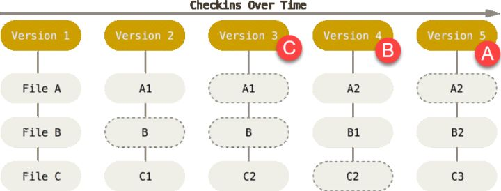
上图文件的初始状态是：A B C，

随着时间的变化，他们可能变化成A2 B2 C3不等。

注意上图虚线框部分，在当前版本下并没有保存文件的实体，实体存在之前的版本中，因为文件没有发生改变，如果改变则如实保存下来（无虚线框部分），没有发生改变得文件只需保存之前文件的引用即可。

这样可以节省下一定的存储空间（占用的空间为上图无虚线框部分的文件总和），同时你可以快速的取出备份文件而无需过多的计算（差异备份取出时则需要一定计算）。

直观上，如果你从上图 A B C处（红色标记部分）向前拍照的话，你会看到该时间点文件的全貌，这就是**文件快照**。

Git 用以计算校验和的机制叫做 SHA-1 散列（hash，哈希）。 

这是一个由 40 个十六进制字符（0-9 和 a-f）组成字符串，基于 Git 中文件的内容或目录结构计算出来。 SHA-1 哈希看起来是这样：24b9da6552252987aa493b52f8696cd6d3b00373

Git 中使用这种哈希值的情况很多，你将经常看到这种哈希值。 实际上，**Git 数据库中保存的信息都是以文件内容的哈希值来索引**，而不是文件名。


### SVN实现文件备份的方式是通过差异比较
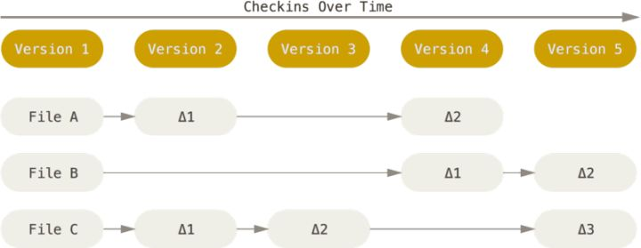

每个版本只保存文件的变化，这种方式比快照方式要节省存储空间，但恢复备份的时候会花费额外的计算


# Git仓库
## Git 有三种状态，你的文件可能处于其中之一

* 已提交（committed）：表示数据已经安全的保存在本地数据库中。

* 已修改（modified）：表示修改了文件，但还没保存到数据库中。

* 已暂存（staged）：表示对一个已修改文件的当前版本做了标记，使之包含在下次提交的快照中。

## Git 仓库目录
即 .git 目录。 这个目录包含了几乎所有 Git 存储和操作的对象，

是 Git 用来保存项目的元数据和对象数据库的地方。 这是 Git 中最重要的部分，从其它计算机克隆仓库时，拷贝的就是这里的数据。

工作目录是对项目的某个版本独立提取出来的内容。 这些从 Git 仓库的压缩数据库中提取出来的文件，放在磁盘上供你使用或修改。

## 暂存区域
即.git目录下的index 文件，是一个文件，保存了下次将提交的文件列表信息，一般在 Git 仓库目录中。

有时候也被称作`索引`，不过一般说法还是叫暂存区域。


## 远程仓库
1. 查看你已经配置的远程仓库服务器，可以运行 git remote 命令，

git remote -v ，会显示需要读写远程仓库使用的 Git 保存的简写与其对应的 URL。

或  git remote show [remote-name] 命令

```shell
$ git remote -v
origin https://github.com/schacon/ticgit (fetch)
origin https://github.com/schacon/ticgit (push)
```
2. 添加远程仓库
```shell
git remote add <shortname> <url>
$ git remote
origin
$ git remote add pb https://github.com/paulboone/ticgit
$ git remote -v
origin https://github.com/schacon/ticgit (fetch)
origin https://github.com/schacon/ticgit (push)
pb https://github.com/paulboone/ticgit (fetch)
pb https://github.com/paulboone/ticgit (push)
```
3. 重命名或移除远程仓库 
   
   将pb重命名为paul：`git remote rename pb paul`
   
   移除远程仓库paul：`git remote rm paul`
# Git分支
## 1. 分支简介
### 1. 数据对象（blob object）
git 中的 blob object 就是文件系统中的文件，包含 键：一个 hash 值和校验值的组合，值：文件内容。


git通过` git hash-object -w`命令输出一个长度为 40 个字符的校验和。 这是一个 SHA-1 哈希值——一个将待存储的数据外加一个头部信息（header）一起做 SHA-1 校验运算而得的校验和。
往 Git 数据库存入一些文本：
```shell
$ echo 'test content' | git hash-object -w --stdin
d670460b4b4aece5915caf5c68d12f560a9fe3e4
```

通过`git cat-file`命令可以从SHA-1校验和中取出数据内容。
为 cat-file 指定 -p 选项可指示该命令自动判断内容的类型，并为我们显示格式友好的内容：
```shell
$ git cat-file -p d670460b4b4aece5915caf5c68d12f560a9fe3e4
test content
```

比较特殊的是：blob object 只存内容，不存文件名，文件名在 tree object 中保存。

### 2. 树对象（tree object）

相当于文件系统中的文件夹。

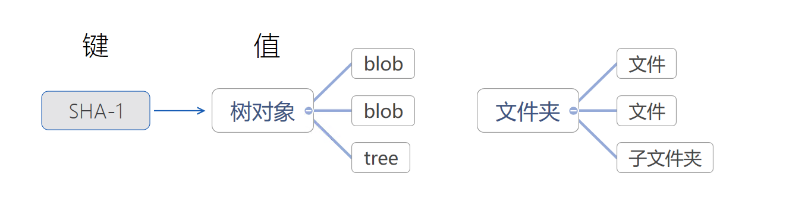

它能解决文件名保存的问题，也允许我们将多个文件组织到一起。

一个树对象包含了一条或多条树对象记录（tree entry），

每条记录含有一个指向数据对象或者子树对象的 SHA-1 指针，以及相应的模式、类型、文件名信息。 

例如，某项目当前对应的最新树对象可能是这样的：
```shell
$ git cat-file -p master^{tree}
100644 blob a906cb2a4a904a152e80877d4088654daad0c859      README
100644 blob 8f94139338f9404f26296befa88755fc2598c289      Rakefile
040000 tree 99f1a6d12cb4b6f19c8655fca46c3ecf317074e0      lib
```
`master^{tree} ` 语法表示 master 分支上最新的提交所指向的树对象。 请注意，lib 子目录（所对应的那条树对象记录）并不是一个数据对象，而是一个指针，其指向的是另一个树对象：
```shell
$ git cat-file -p 99f1a6d12cb4b6f19c8655fca46c3ecf317074e0
100644 blob 47c6340d6459e05787f644c2447d2595f5d3a54b      simplegit.rb
```
从概念上讲，Git 内部存储的数据有点像这样：


### 3. 提交对象（commit object）

提交对象可以理解为对树对象的一层封装，里面包含了提交时间，提交作者等信息，更重要的，里面包含了父提交的ID，由此就可以形成 git 提交的有向无环图。

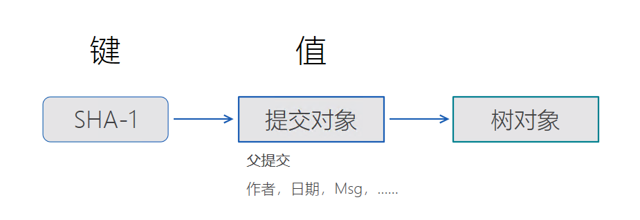


git的分支，**其实本质上仅仅是包含所指对象校验和（长度为40的SHA-1值字符串）的文件，所以说创建一个新分支就是往一个文件中写入41个字节（40个字符和1个换行符）即为指向提交对象的指针和所有提交信息。通过HEAD指针指向当前所在的分支。**

分支不过是某个 commit 的引用。
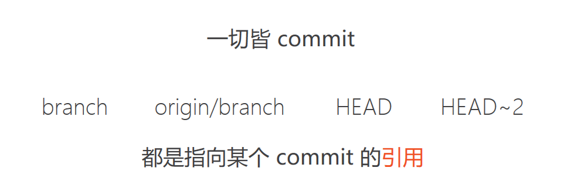


对于某一个文件，在不同的分支，如果文件没有变化，则只保存指向文件的指针，如果发生变化，则把保存下来，（这样可以节省空间，并且能快速的取出备份文件，如果是差异备份则取出时需要一定计算）

查看各个分支当前所指的对象，当前 master'' 和 testing'' 分支均指向校验和以 f30ab 开头的提交对象
```shell
$ git log --oneline --decorate
f30ab (HEAD, master, testing) add feature #32 - ability to add new
34ac2 fixed bug #1328 - stack overflow under certain conditions
98ca9 initial commit of my project
```

## 2. 分支管理
### 0. 提交分支
每次提交分支代码时候，需要先同步项目主分支代码。提交分支步骤如下：
```shell
git status是哪些文件有所修改
git add . 增加自己所做的修改
git commit -m "注释" 提交所有修改的代码
git push origin develop 提交代码
```

### 1. 创建dev分支，然后切换到dev分支：
```shell
$ git checkout -b dev
Switched to a new branch 'dev'
```
git checkout命令加上-b参数表示创建并切换，相当于以下两条命令：
```shell
$ git branch dev

$ git checkout dev

Switched to branch 'dev'
```
### 2. 查看当前本地分支
```shell
$ git branch
* dev

master
```
git branch命令会列出所有分支，当前分支前面会标一个\*号。
### 3. 查看所有分支
首先执行`git fetch --all` 抓取所有远程分支到本地。

-r参数，可以用来查看远程分支，
-a选项查看所有分支。

```shell
$ git branch -a
master
remote
tungway
v1.52
* zrong
remotes/origin/master
remotes/origin/tungway
remotes/origin/v1.52
remotes/origin/zrong
```
### 4. 查看每一个分支的最后一次提交
```shell
$ git branch -v
iss53 93b412c fix javascript issue
* master 7a98805 Merge branch 'iss53'
testing 782fd34 add scott to the author list in the readmes
```

#### 4.1 查看分支跟踪详情
```shell
$ git branch -vv 
iss53 7e424c3 [origin/iss53: ahead 2] forgot the brackets
master 1ae2a45 [origin/master] deploying index fix
* serverfix f8674d9 [teamone/server-fix-good: ahead 3, behind 1] this should do it
testing 5ea463a trying something new
```
这些数字的值来自于你从每个服务器上最后一次抓取的数据。 这个命令并没有连接服务器，它只会告诉你关于本地缓存的服务器数据。
如果想要统计最新的领先与落后数字，需要在运行此命令前抓取所有的远程仓库。 
```shell
$ git fetch --all;
git branch -vv
```
### 5. 查看哪些分支已经合并到当前分支
```shell
$ git branch --merged
iss53
* master
```
### 6. 查看所有包含未合并工作的分支
```shell
$ git branch --no-merged
testing
```
这里显示了其他分支。 因为它包含了还未合并的工作，尝试使用 git branch -d 命令删除它时会失败：
```shell
$ git branch -d testing     -- 删除本地分支
error: The branch 'testing' is not fully merged.
If you are sure you want to delete it, run 'git branch -D testing'.
```
可以使用 -D 选项强制删除它。


### 7. 在分支做出修改后，提交分支
```shell
git status --查看文件当前状态
git add . --增加自己所做的修改
git commit -m "注释"  --提交所有修改的代码
git push origin develop --提交代码
```
### 8. 合并分支
```shell
$ git checkout master --切换到master分支

Switched to branch 'master'

Your branch is up-to-date with 'origin/master'.
```

```shell
$ git merge dev --合并指定分支（dev）到当前分支（master）

Updating 90bc1f7..45ae9a9

Fast-forward

readme.txt | 1 +
 1 file changed, 1 insertion(+)
```
Fast-forward信息，Git告诉我们，这次合并是“快进模式”，也就是直接把master指向dev的当前提交，所以合并速度非常快。
当然，也不是每次合并都能Fast-forward，我们后面会讲其他方式的合并。
#### 8.1. 合并分支上的指定commit
假设分支结构如下：

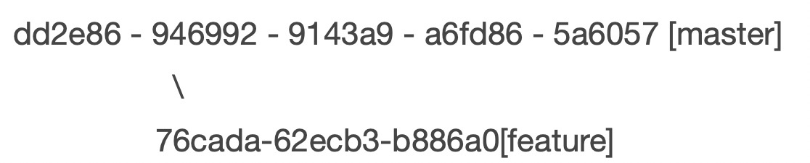

再假设 62ecb3 的提交修复了bug，这时候可以用
* cherry pick 合并单个 commit
具体操作：
```shell
git checkout master
git cherry-pick 62ecb3
```
就这么简单。62ecb3 已经应用在 master 上了（作为一个新的commit）。
* cherry pick 合并连续多个commit
cherry pick 虽好，但一次只能合并一个commit。合并多个就要用到 rebase 了。再次假设想要把 76cada  和 62ecb3 合并到 master 上。
操作：
```shell
git checkout -b newbranch 62ecb3
git rebase —onto master 76cada^
```
76cada^ 表示从 76cada  的 commit 开始合并（作为新的commit）。这样就完成了 76cada 到 62ecb3  合并到 master。

### 9. 删除分支
* 删除本地分支
```shell
$ git branch -d dev

Deleted branch dev (was 45ae9a9).
```
* 删除远程分支
```shell
$ git push origin --delete serverfix
To https://github.com/schacon/simplegit
- [deleted] serverfix
```
### 10. 解决冲突

1. 创建新的分支feature1，修改readme.txt文件并提交。

2. 切换到master分支：
```shell
$ git checkout master

Switched to branch 'master'

Your branch is ahead of 'origin/master' by 1 commit.

(use "git push" to publish your local commits)
```
3. Git还会自动提示我们当前master分支比远程的master分支要超前1个提交。

4. 在master分支上同样修改readme.txt文件，并提交。master分支和feature1分支各自都分别有新的提交，变成了这样：
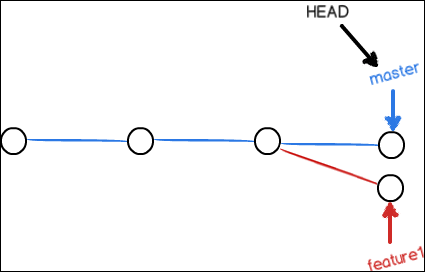
这种情况下，Git无法执行“快速合并”，只能试图把各自的修改合并起来，但这种合并就可能会有冲突，我们试试看：
```shell
$ git merge feature1

Auto-merging readme.txt

CONFLICT (content): Merge conflict in readme.txt

Automatic merge failed; fix conflicts and then commit the result.
```
5. 直接查看readme.txt的内容:
```
test git modify second

study git

three add

four add modify

five add modify

six add modify

seven add modify

eight add modify ...

create new branch dev..
<<<<<<< HEAD

goback master....
=======

create new branch feature1..
>>>>>>> feature1
```
<<<<<<< HEAD 和=====之间的内容就是master分支的内容
====和>>>>>>> feature1之间的内容就是feature1的内容
Git用<<<<<<<，=======，>>>>>>>标记出不同分支的内容,
修改后再提交：
```shell
$ git add readme.txt

$ git commit -m "fixed conflicts"

[master 0f3d64a] fixed conflicts
```
6. 用`git log --graph`命令可以看到分支合并图。
```shell
$ git log --graph --pretty=oneline --abbrev-commit
* 0f3d64a fixed conflicts
|\
| * b4309b0 create new branch feature1 first modify
* | 0b56936 goback master first modify
|/

* 45ae9a9 create new branch....
* 90bc1f7 test name
* c1bdf43 test commit
* dd34c9a no add but commit,because use other parameter
* 4ed30d1 eight modify dify
* b45ca96 eight modify
* 9332d40 seven modify
* 72c6f9b six modify
* f64b5a0 five modify
* de8fd65 four modify
* 83a4b1e three modify
* 01c05cf two modify
* 1acafa7 first modify
* 09c1bba first git
```
### 11. git切换分支保存修改的代码的方法
> 使用git stash

有时候写了一半的JAVA代码，都还不能编译通过的，就被叫去改另一个分支的bug了。
在new分支上的时候在命令行输入：
```shell
git stash --返回一个hash值作为版本的说明，
或者
git stash save “修改的信息" --将“修改的信息”作为版本的说明。
```

接下来你回到old分支修改代码完成，你又再回到new分支，输入：
```shell
git stash pop --将git stash栈中最后一个版本取出来
或者
git stash list --可以看到所有的版本信息
git stash apply stash@{0} --取出所需要的版本
```

就可以回到保存的版本了。

git stash是针对整个git工程来进行保存的,也就是说区分不了branch.

比如我在a分支git stash save "sss"暂存了一个修改,那么我切换到b分支,我使用git stash pop 就能把在a分支保存的"sss"这个修改同步到了b分支上.

所以当我们需要在不同的分支上取出不同的分支上保存的修改,那么就用到了git stash list,这个命令可以把在所有分支上暂存的信息显示出来,

然后我们通过 git stash apply stash@{0} 来选择恢复哪个暂存,stash@{0}这个会在list中列出来.

### 12. git本地分支改名: 
```shell
git branch -m 原分支名 新分支名
```
### 13. git推送本地分支到远程
```shell
$ git checkout -b feature-branch //创建并切换到分支feature-branch
$ git push origin feature-branch:feature-branch //推送本地的feature-branch(冒号前面的)分支到远程origin的feature-branch(冒号后面的)分支(没有会自动创建)
```
将本地的 serverfix 分支推送到远程仓库上的awesomebranch 分支，如果没写awesomebranch，则默认推送到远程仓库的serverfix分支。
```shell
$ git push origin serverfix:awesomebranch
```
### 14. 检出远程的feature-branch分支到本地
```shell
$ git checkout -b feature-branch origin/feature-branch 
```
### 15. 本地创建一个serverfix分支，用于跟踪远程serverfix分支，并切换到本地serverfix分支
```shell
$ git checkout --track origin/serverfix
Branch serverfix set up to track remote branch serverfix from origin.
Switched to a new branch 'serverfix'
```
等同于 `git checkout -b serverfix origin/serverfix`
### 16. 为本地分支设置和远程分支不同的名字
```shell
$ git checkout -b sf origin/serverfix
Branch sf set up to track remote branch serverfix from origin.
Switched to a new branch 'sf'
```
本地分支 sf 会自动从 origin/serverfix 拉取。
### 17. 设置已有的本地分支跟踪其他远程分支，
可以使用 -u 或 --set-upstream-to 选项运行 git branch 来显式地设置。
```shell
$ git branch -u origin/serverfix
Branch serverfix set up to track remote branch serverfix from origin.
```


# Git版本回退
Git的另外一个强大之处在于可以回退到之前的任意一个版本：
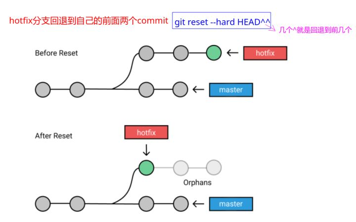
主要看下面的命令:

1. git reset --hard HEAD^， 往后回退1个版本；

2. git reset --hard HEAD~3，往后回退3个版本；

3. git reset --hard commit-id，直接回退到某个commit-id；
    
    * 如果当前在靠前面，就可以通过git log查看
    
    * 如果在后面，不能查看到前面的git log 得到 commit-id怎么办呢？可以用git reflog查看自己的操作日志；

演示：
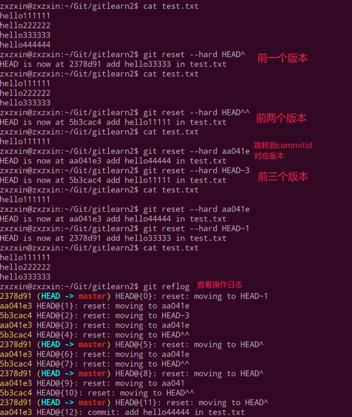

# Git 打标签

标签可以针对某一时间点的版本做标记，常用于版本发布。
## 列出标签
```shell
$ git tag # 在控制台打印出当前仓库的所有标签
$ git tag -l ‘v0.1.*’ # 搜索符合模式的标签
```
## 查看标签信息
用git show命令可以查看标签的版本信息：
```shell
$ git show v0.1.2
```
## 打标签

git标签分为两种类型：轻量标签和附注标签。

轻量标签是指向提交对象的引用，

附注标签则是仓库中的一个独立对象。建议使用附注标签。
```shell
# 创建轻量标签,不需要传递参数，直接指定标签名称即可。
$ git tag v0.1.2-light
# 创建附注标签,参数a即annotated的缩写，指定标签类型，后附标签名。参数m指定标签说明，说明信息会保存在标签对象中。
$ git tag -a v0.1.2 -m “0.1.2版本”
```
## 切换到标签
与切换分支命令相同，用`git checkout [tagname]`

## 删除标签
误打或需要修改标签时，需要先将标签删除，再打新标签。
```shell
$ git tag -d v0.1.2 # 删除标签
```
参数d即delete的缩写，意为删除其后指定的标签。

## 给指定的commit打标签
打标签不必要在head之上，也可在之前的版本上打，这需要你知道某个提交对象的校验和（通过git log获取）。
```shell
# 补打标签
$ git tag -a v0.1.1 9fbc3d0
```
## 标签发布
通常的git push不会将标签对象提交到git服务器，我们需要进行显式的操作：
```shell
$ git push origin v0.1.2 # 将v0.1.2标签提交到git服务器
$ git push origin –tags # 将本地所有标签一次性提交到git服务器
```

## 查看之前某个标签状态下的文件，可以这样操作
1. `git tag` 查看当前分支下的标签

2. `git  checkout v0.21`   此时会指向打v0.21标签时的代码状态，（但现在处于一个空的分支上）

3. `cat  test.txt`   查看某个文件

# Git diff
## 用于比较两次修改的差异
1. 比较工作区与暂存区
```shell
git diff 不加参数即默认比较工作区与暂存区
```
2. 比较暂存区与最新本地版本库（本地库中最近一次commit的内容）
```shell
git diff --cached 
```
3. 比较工作区与最新本地版本库
```shell
git diff HEAD 如果HEAD指向的是master分支，那么HEAD还可以换成master
```
4. 比较工作区与指定commit-id的差异
```shell
git diff commit-id
```
5. 比较暂存区与指定commit-id的差异 
```shell
git diff --cached [<commit-id>]
```
6. 比较两个commit-id之间的差异
```shell
git diff [<commit-id>] [<commit-id>]
```
## 使用git diff命令输出信息那些符号是什么意思？
```shell
$ git diff
 
## 显示结果如下：

diff --git a/f1 b/f1 
## 表示结果为git格式的diff，进行比较的是a版本的f1（即变动前）和b版本的f1（即变动后）

index 6f8a38c..449b072 100644
## 表示两个版本的git哈希值（index区域的6f8a38c对象，与工作目录区域的449b072对象进行比较），最后的六位数字是对象的模式（普通文件，644权限）。
--- a/f1
+++ b/f1
## 表示进行比较的两个文件。"---"表示变动前的版本，"+++"表示变动后的版本。
@@ -1,7 +1,7 @@
## @@ -1,7 +1,7 @@是差异小结,代表的意思是源文件的1-7行与目标文件的1-7行有差异,下面才是具体的差异信息;
 a
 a
 a
-a
+b
 a
 a
 a
## 以空格开头的行代表源文件与目标文件没有差异,以-开头 的行代表在源文件的基础上删除,以+开头代表在源文件基础上添加;
 ```

# Git log
* 查看某个指定文件的提交记录
```shell
git log --pretty=oneline 文件名
```
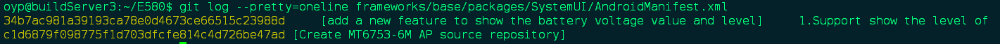
接下来使用git show即可显示具体的某次的改动的修改
```shell
git show <git提交版本号> <文件名>
```
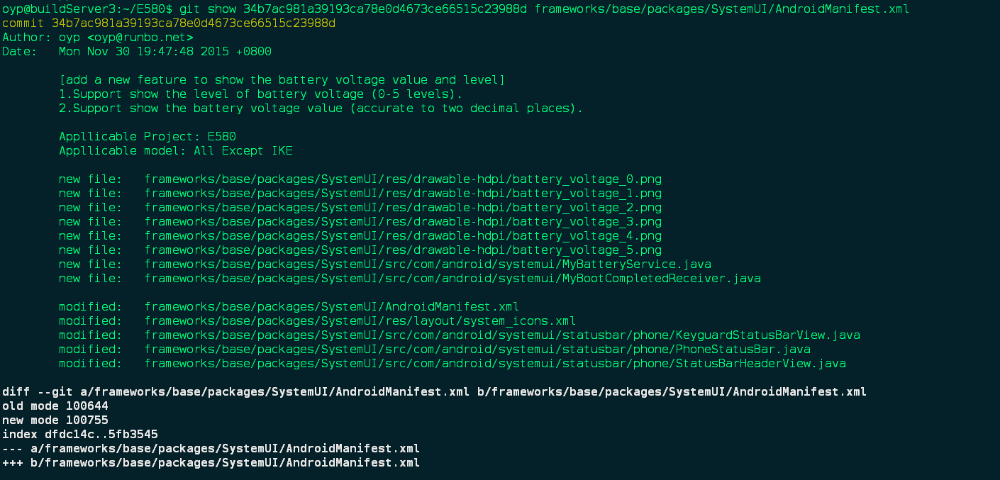


# Git rebase变基
## 1. 合并多次提交纪录
当我们在本地仓库中提交了多次，在我们把本地提交push到公共仓库中之前，为了让提交记录更简洁明了，我们希望把如下分支B、C、D三个提交记录合并为一个完整的提交，然后再push到公共仓库。

这里我们使用命令:
`git rebase -i  [startpoint]  [endpoint]`
其中-i的意思是--interactive，即弹出交互式的界面让用户编辑完成合并操作，
[startpoint] [endpoint]则指定了一个编辑区间，
如果不指定[endpoint]，则该区间的终点**默认是当前分支HEAD所指向的commit**(注：该区间指定的是一个前开后闭的区间)。
运行以下命令：
```shell
git rebase -i 36224db --表示从该commit（不包含该commit）到当前HEAD所指向的commit
## 或者
git rebase -i HEAD~3 --表示最近三次的提交记录
```


git 为我们提供了以下几个命令:
>pick：保留该commit（缩写:p）
reword：保留该commit，但我需要修改该commit的注释（缩写:r）
edit：保留该commit, 但我要停下来修改该提交(不仅仅修改注释)（缩写:e）
squash：将该commit和前一个commit合并（缩写:s），两个注释分成两行。
fixup：将该commit和前一个commit合并，但我不要保留该提交的注释信息（缩写:f），只保留前一个commit信息。
exec：执行shell命令（缩写:x）
drop：我要丢弃该commit（缩写:d）

根据我们的需求，我们将commit内容编辑如下:

>pick d2cf1f9 fix: 第一次提交
s 47971f6 fix: 第二次提交
s fb28c8d fix: 第三次提交

上面的意思就是把第二次、第三次提交都合并到第一次提交上

然后wq保存退出后是注释修改界面:


修改完注释，保存，即可完成多个commit的合并了。

* 如果保存的时候，你碰到了这个错误：

`error: cannot 'squash' without a previous commit`

注意不要合并先前提交的东西，也就是已经提交远程分支的纪录。

* 如果你异常退出了 vi 窗口，不要紧张：

`git rebase --edit-todo`

这时候会一直处在这个编辑的模式里，我们可以回去继续编辑，修改完保存一下：

`git rebase --continue`

## 2. 分支合并

1. 从master分支切出一个feature分支，修改某一文件后commit。

2. 此时，其他人修改了master分支的相同文件并提交完毕。

3. 此时切换到master分支，使用`git merge feature`合并feature分支，由于都是修改的同一个文件，所以会产生冲突，修复冲突后，合并完成。现在看一下分支合并历史：
```shell
HowiedeiMac:hello howie$ git log --oneline --graph
*   562ec58 (HEAD -> master) merge master and feature
|\  
| * 4f58ab8 (feature) add new func
* | 0e80f97 do something
|/  
* 94c134b init base
```
虽然合并成功，但是Master已经保存了合并历史，出现开叉了！对于强迫症患者来说肯定是不能接受的。

4. 回到合并前的状态。在feature分支上执行: `git rebase master`.这句命令的意思是：

* 首先， git 会把 feature1 分支里面的每个 commit 取消掉；

* 其次，把上面的操作临时保存成 patch 文件，存在 .git/rebase 目录下；

* 然后，把 feature1 分支更新到最新的 master 分支；

* 最后，把上面保存的 patch 文件应用到 feature1 分支上；
```shell
HowiedeiMac:hello howie$ git rebase master
First, rewinding head to replay your work on top of it...
Applying: add new func
Using index info to reconstruct a base tree...
M       newFunc.go
Falling back to patching base and 3-way merge...
Auto-merging newFunc.go
CONFLICT (content): Merge conflict in newFunc.go
error: Failed to merge in the changes.
Patch failed at 0001 add new func
hint: Use 'git am --show-current-patch' to see the failed patch

Resolve all conflicts manually, mark them as resolved with
"git add/rm <conflicted_files>", then run "git rebase --continue".
You can instead skip this commit: run "git rebase --skip".
To abort and get back to the state before "git rebase", run "git rebase --abort".
```
失败了，有冲突，解决冲突后，执行 `git add newFunc.go`。

5. 通过`git rebase —continue`继续完成之前的rebase操作。rebase完成，再查看一下提交历史：
```shell
HowiedeiMac:hello howie$ git log --oneline --graph
* b2593e6 (HEAD -> feature) add new func
* 0e80f97 (master) do something
* 94c134b init base
```
此时在feature分支，是最领先的分支，而且没有merge的commit记录。干净清爽。

6. 然后切换到master分支，执行merge，既不会有冲突，也不会有分支。


# 其他Git命令
> 1. git配置查看与修改

* `git config --list`命令来列出所有 Git 当时能找到的配置

* 你可能会看到重复的变量名，因为 Git 会从不同的文件中读取同一个配置（例如： /etc/gitconfig 与 ~/.gitconfig ）。 这种情况下，Git 会使用它找到的每一个变量的最后一个配置。

* 可以通过输入`git config <key> `, 来检查 Git 的某一项配置

* 查看用户名和邮箱地址：
    ```shell
    $ git config user.name
    $ git config user.email
    ```
 * 修改用户名和邮箱地址：
    ```shell
    $ git config --global user.name "username"
    $ git config --global user.email "email"
    ```
> 2. 将文件移除git版本管理

* 从磁盘删除文件，并从git上删除文件
    ```shell
    $ rm PROJECTS.md
    $ git rm PROJECTS.md 将文件在本地删除，下次再提交时，会在远程库也删除文件
    ```
    下一次提交时，该文件就不再纳入版本管理了。如果删除之前修改过并且已经放到暂存区域的话，则必须要用强制删除选项 -f
* 从git上删除文件，但保留在磁盘
    ```shell
    $ git rm --cached README
    ```
    
>3. 使用Git克隆已有项目

1. 在github上新建项目。

2. 编辑gitignore文件。

3. 将本地SSH key设置到目标git网站
4. 到指定目录执行git clone git@....；
5. git checkout [branchName]；  

>4. git通过pem或ppk认证，并clone项目

1. 使用ssh-add 添加key文件
```shell
ssh-add -k key.pem
```
2. 若执行ssh-add时出现`Could not open a connection to your authentication agent`则先执行如下命令即可：
```shell
ssh-agent bash
```
3. 执行 git clone。
### 问题：
1. `ssh -i key` 执行时 `Permissions 0644 for '你的.pem' are too open 问题`
解决方案：
```shell
chmod 600 你的密钥文件  
比如：  chmod 600 xiaowugui.pem  
```
2. 本地git安装完成之后，从远程git服务器上面下载代码。报错`SSL certificate problem:self signed certificate in certificate chain。`

解决方案：

打开git的控制端黑窗口，输入：
```shell
git config --global http.sslVerify false
```
点击Entry之后，就会去掉git的ssl验证。然后就可以正常的下载代码。

> 5. GIT生成 SSH Key步骤 
```shell
//设置user.name和email 提交到git之后会显示用户名(在随意一个目录打开git-bash执行就行)
Administrator@DESKTOP-BP3H0HS MINGW64 /d/midou (master)
$ git config --global user.name "liuchao"

Administrator@DESKTOP-BP3H0HS MINGW64 /d/midou (master)
$ git config --global user.email "liuchao102@163.com"

//生成秘钥
Administrator@DESKTOP-BP3H0HS MINGW64 /d/midou (master)
$ ssh-keygen -t rsa -C "liuchao102@163.com"

Generating public/private rsa key pair.
Enter file in which to save the key (/c/Users/Administrator/.ssh/id_rsa):
/c/Users/Administrator/.ssh/id_rsa already exists.
Overwrite (y/n)? y
Enter passphrase (empty for no passphrase):
Enter same passphrase again:
Your identification has been saved in /c/Users/Administrator/.ssh/id_rsa.
Your public key has been saved in /c/Users/Administrator/.ssh/id_rsa.pub.
The key fingerprint is:
SHA256:N20m0PnwfNSZZaCOvp8gW8Fac49kIQo1fUMz+490AO8 “liuchao102@163.com
The key's randomart image is:
+---[RSA 2048]----+
|        o. .= ..o|
|       . o..oB o+|
|      . . =.+.+o.|
|       . + X = . |
|        S X % E .|
|         = @ = + |
|        o + . o .|
|         + o .   |
|        . ..o    |
+----[SHA256]-----+
```
生成完秘钥之后会在 C:\Users\Administrator\.ssh 目录下 id_rsa和id_rsa.pub 两个文件
拷贝id_rsa.pub文件内容到 git 服务器上就可以了。

> 6. git pull 与fetch的区别(由于pull的魔法经常令人困惑，所以单独显式地使用 fetch 与 merge 命令会更好一些)

* `git fetch origin ` 会抓取克隆（或上一次抓取）后新推送的所有工作。 必须注意 git fetch 命令会将数据拉取到你的本地仓库 - 它并不会自动合并或修改你当前的工作。然后可以使用`git merge`命令或者`git rebase`命令，在本地分支上合并远程分支。

* git pull命令会自动设置本地 master分支跟踪克隆的远程仓库的 master 分支（或不管是什么名字的默认分支）。 
运行` git pull`通常会从最初克隆的服务器上抓取数据并自动尝试合并到当前所在的分支。


>7. Fast Forward 和 no fast foward
## Fast-Forward
 当前分支合并到另一分支时，如果没有分歧解决，就会直接移动文件指针。这个过程叫做fastforward。

举例来说，开发一直在master分支进行，但忽然有一个新的想法，于是新建了一个develop的分支，并在其上进行一系列提交，完成时，回到 master分支，此时，master分支在创建develop分支之后并未产生任何新的commit。此时的合并就叫fast forward。合并完之后的视图为扁平状，看不出develop分支开发的任何信息.
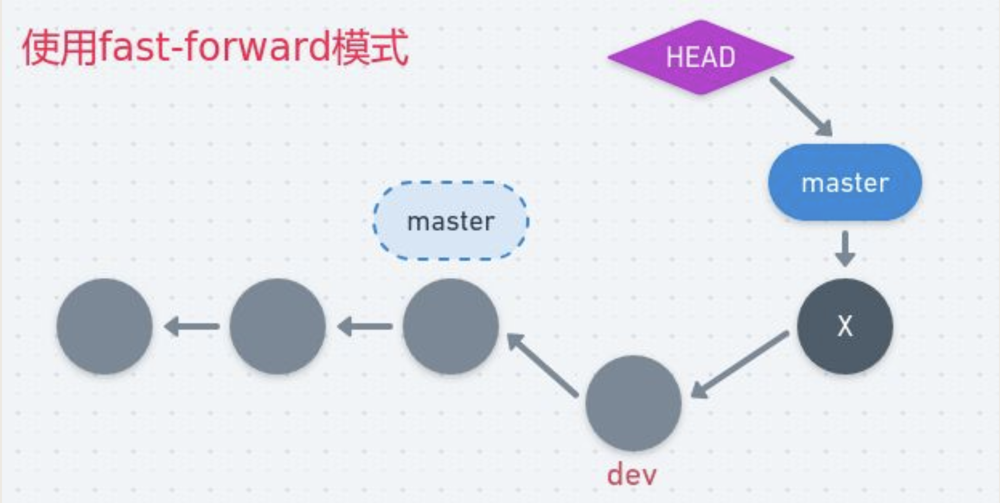


## No fast foward 
—no-ff (no fast foward)，使得每一次的合并都创建一个新的commit记录。即使这个commit只是fast-foward，用来避免丢失信息。

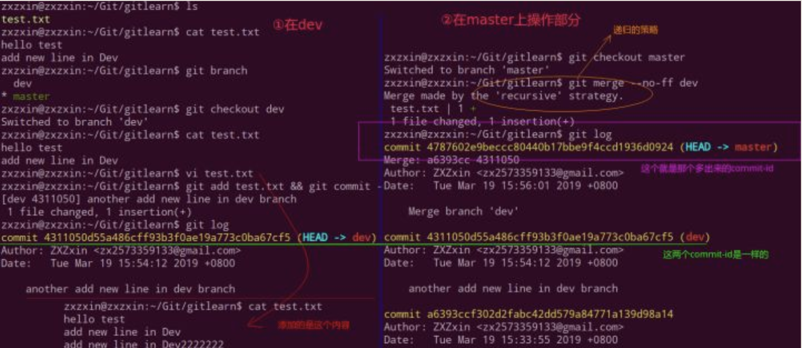
可以看出，使用no-ff后，会多生成一个commit 记录，并强制保留develop分支的开发记录（而fast-forward的话则是直接合并，看不出之前Branch的任何记录）。这对于以后代码进行分析特别有用，故有以下最佳实践。


#### 好的实践
–no-ff，其作用是：要求git merge即使在fast forward条件下也要产生一个新的merge commit。此处，要求采用–no-ff的方式进行分支合并，其目的在于，希望保持原有“develop branches”整个提交链的完整性。