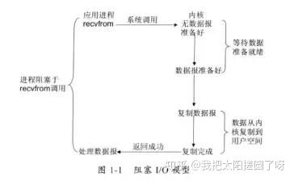
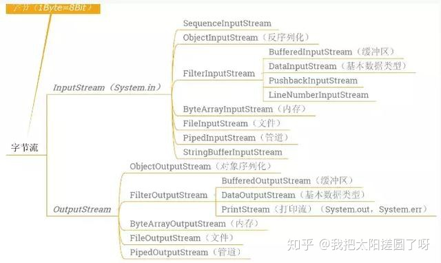
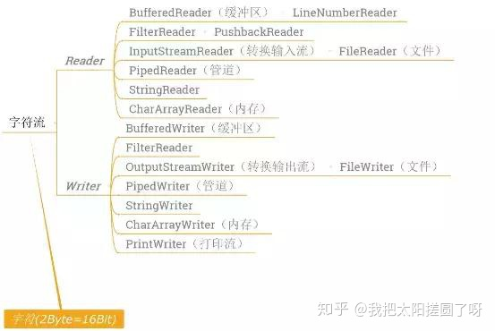

[TOC]

# 一、IO流简介
BIO是同步阻塞IO，JDK1.4之前只有这一个IO模型，BIO操作的对象是流，一个线程只能处理一个流的IO请求，如果想要同时处理多个流就需要使用多线程。

流包括字符流和字节流，流从概念上来说是一个连续的数据流。当程序需要读数据的时候就需要使用输入流读取数据，当需要往外写数据的时候就需要输出流。

## 阻塞IO模型



在Linux中，当应用进程调用recvfrom方法调用数据的时候，

如果内核没有把数据准备好不会立刻返回，而是会经历等待数据准备就绪，数据从内核复制到用户空间之后再返回，

这期间应用进程一直阻塞直到返回，**所以被称为阻塞IO模型**

# 二、IO流的分类

BIO中操作的流主要有两大类，字节流和字符流，两类根据流的方向都可以分为输入流和输出流

按照类型和输入输出方向可分为：

1. 字节流主要用来处理字节或二进制对象，以 8 位（即 1 byte，8 bit）作为一个数据单元，数据流中最小的数据单元是字节。

* 输入字节流：InputStream

* 输出字节流：OutputStream




2. 字符流用来处理字符文本或字符串，以 16 位（即 1 char，2 byte，16 bit）作为一个数据单元，数据流中最小的数据单元是字符， Java 中的字符是 Unicode 编码，一个字符占用两个字节。

* 输入字符流：Reader

* 输出字符流：Writer



> Filter 流: FilterStream 是一种 IO 流，主要作用是用来对存在的流增加一些额外的功能，像给目标文件增加源文件中不存在的行数，或者增加拷贝的性能等。在 java.io 包中分别是：FilterInputStream，FilterOutputStream，FilterReader and FilterWriter. 这些类是抽象类，不能被实例化的。
> FilterInputStream 流的子类：
> * DataInputStream 可以把包括基本类型在内的数据和字符串按顺序从数据源读入，它有一些特殊的方法如 readInt()，readDouble() 和 readLine() 等可以读取一个 int，double 和一个 string。
> * BufferedInputStream 增加性能。
> * PushbackInputStream 推送要求的字节到系统中。
> * 注：其它子类见 Java io 分类图。

# 三、字节流

## 字节流基类

### 1. InputStream

字节输入流基类，抽象类是表示字节输入流的所有类的超类。

#### 常用方法
```java
// 从输入流中读取数据的下一个字节
abstract int read()
// 从输入流中读取一定数量的字节，并将其存储在缓冲区数组 b中
int read(byte[] b)
// 将输入流中最多 len 个数据字节读入 byte 数组
int read(byte[] b, int off, int len)
// 跳过和丢弃此输入流中数据的 n个字节
long skip(long n)
// 关闭此输入流并释放与该流关联的所有系统资源
void close()
```

### 2.OutputStream
字节输出流基类，抽象类是表示输出字节流的所有类的超类。

#### 常用方法

```java
// 将 b.length 个字节从指定的 byte 数组写入此输出流
void write(byte[] b)
// 将指定 byte 数组中从偏移量 off 开始的 len 个字节写入此输出流
void write(byte[] b, int off, int len)
// 将指定的字节写入此输出流
abstract void write(int b)
// 关闭此输出流并释放与此流有关的所有系统资源
void close()
// 刷新此输出流并强制写出所有缓冲的输出字节
void flush()
```

## 字节文件操作流

### 1. FileInputStream
字节文件输入流，从文件系统中的某个文件中获得输入字节，用于读取诸如图像数据之类的原始字节流。

#### 构造方法
```java
// 通过打开一个到实际文件的连接来创建一个FileInputStream，该文件通过文件系统中的File对象file指定
FileInputStream(File file)
// 通过打开一个到实际文件的连接来创建一个FileInputStream，该文件通过文件系统中的路径name指定
FileInputStream(String name)
```

#### 常用方法

覆盖和重写了父类的的常用方法。

#### 示例：读取f盘下该文件f://hell/test.txt

1. 构造方法1

```java   
InputStream inputStream = new FileInputStream(new File("f://hello//test.txt"));
int i = 0;
//一次读取一个字节
while ((i = inputStream.read()) != -1) {
    // System.out.print(i + " ");// 65 66 67 68
    //为什么会输出65 66 67 68？因为字符在底层存储的时候就是存储的数值。即字符对应的ASCII码。
    System.out.print((char) i + " ");// A B C D
}
//关闭IO流
inputStream.close();
```

2. 构造方法2

```java
InputStream inputStream2 = new FileInputStream("f://hello/test.txt");
// 字节数组
byte[] b = new byte[2];
int i2 = 0;
//  一次读取一个字节数组
while ((i2 = inputStream2.read(b)) != -1) {
    System.out.print(new String(b, 0, i2) + " ");// AB CD
}
//关闭IO流
inputStream2.close();
```
注意： 一次读取一个字节数组，提高了操作效率,IO流使用完毕一定要关闭。

### 2. FileOutputStream
字节文件输出流是用于将数据写入到File，从程序中写入到其他位置。

#### 构造方法

```java
// 创建一个向指定File对象表示的文件中写入数据的文件输出流
FileOutputStream(File file)
// 创建一个向指定File对象表示的文件中写入数据的文件输出流
FileOutputStream(File file, boolean append)
// 创建一个向具有指定名称的文件中写入数据的输出文件流
FileOutputStream(String name)
// 创建一个向具有指定name的文件中写入数据的输出文件流
FileOutputStream(String name, boolean append)
```
#### 常用方法

覆盖和重写了父类的的常用方法。

#### 示例：将数据写入文件

```java
OutputStream outputStream = new FileOutputStream(new File("test.txt"));
// 写出数据
outputStream.write("ABCD".getBytes());
// 关闭IO流
outputStream.close();
// 内容追加写入
OutputStream outputStream2 = new FileOutputStream("test.txt", true);
// 输出换行符
outputStream2.write("\r\n".getBytes());
// 输出追加内容
outputStream2.write("hello".getBytes());
// 关闭IO流
outputStream2.close();
```
**注意：**

* 输出的目的地文件不存在，则会自动创建，不指定盘符的话，默认创建在项目目录下;

* 输出换行符时一定要写\r\n不能只写\n,因为不同文本编辑器对换行符的识别存在差异性。


## 字节缓冲流
**缓冲流的作用**

* 不带缓冲的操作，每读一个字节就要写入一个字节，由于涉及磁盘的IO操作相比内存的操作要慢很多，所以不带缓冲的流效率很低。

* 带缓冲的流，可以一次读很多字节，但不向磁盘中写入，只是先放到内存里。等凑够了缓冲区大小的时候一次性写入磁盘，这种方式可以减少磁盘操作次数，速度就会提高很多！

### 1. BufferedInputStream
字节缓冲输入流，提高了读取效率

* BufferedInputStream 的作用是为另一个输入流添加一些功能，即缓冲输入、支持mark和reset方法的功能。

* 当创建BufferedInputStream时，将创建一个内部缓冲区数组。 当从流中读取或跳过字节时，内部缓冲区将根据需要从所包含的输入流中重新填充，一次填充多个字节。

* mark操作会记住输入流中的一点。

* reset操作会导致从最近的mark操作之后读取的所有字节在从包含的输入流中取出新的字节之前重新读取。

#### 构造方法
```java
 // 创建一个 BufferedInputStream并保存其参数，即输入流in，以便将来使用。
 BufferedInputStream(InputStream in)
 // 创建具有指定缓冲区大小的 BufferedInputStream并保存其参数，即输入流in以便将来使用
 BufferedInputStream(InputStream in, int size)
```

#### 常用方法

* int available(); 返回从该输入流中可以读取（或跳过）的字节数的估计值，而不会被下一次调用此输入流的方法阻塞。

* int read(); 读取buf中下一个字节

* int read(byte[] b, int off, int len); 从给定的偏移开始，将字节输入流中的字节读入指定的字节数组。

* void close(); 关闭此输入流并释放与流相关联的任何系统资源

* boolean markSupport(); 测试此输入流是否支持mark和reset方法

* void mark(int readLimit); 标记此输入流中的当前位置。 对reset方法的后续调用会将该流重新定位在最后一个标记的位置，以便后续重新读取相同的字节。

* void reset(); 将此流重新定位到上次在此输入流上调用mark方法时的位置。

* long skip(long n); 跳过n个字节，不仅仅是buf中的有效字节、也包括in的源中的字节

#### 示例
```java
InputStream in = new FileInputStream("test.txt");
// 字节缓存流
BufferedInputStream bis = new BufferedInputStream(in);
byte[] bs = new byte[20];
int len = 0;
while ((len = bis.read(bs)) != -1) {
    System.out.print(new String(bs, 0, len));
    // ABCD
    // hello
}
// 关闭流
bis.close();
```

### 2. BufferedOutputStream
字节缓冲输出流，通过设置这样的输出流，应用程序可以向底层输出流写入字节，而不必为写入的每个字节导致底层系统的调用。

####  构造方法
```java
// 创建一个新的缓冲输出流，以将数据写入指定的底层输出流
BufferedOutputStream(OutputStream out)
// 创建一个新的缓冲输出流，以将具有指定缓冲区大小的数据写入指定的底层输出流
BufferedOutputStream(OutputStream out, int size)
```
#### 常用方法

```java
// 将指定 byte 数组中从偏移量 off 开始的 len 个字节写入此缓冲的输出流
 void write(byte[] b, int off, int len)
 // 将指定的字节写入此缓冲的输出流
 void write(int b)
 // 刷新此缓冲的输出流
 void flush()
```

#### 示例

```java
BufferedOutputStream bos = new BufferedOutputStream(new FileOutputStream("test.txt", true));
// 输出换行符
bos.write("\r\n".getBytes());
// 输出内容
bos.write("Hello Android".getBytes());
// 刷新此缓冲的输出流
bos.flush();
// 关闭流
bos.close();
```

# 四、字符流

## 字符流基类

### 1. Reader
读取字符流的抽象类.

#### 常用方法

```java
// 读取单个字符
int read()
// 将字符读入数组
int read(char[] cbuf)
// 将字符读入数组的某一部分
abstract int read(char[] cbuf, int off, int len)
// 跳过字符
long skip(long n)
// 关闭该流并释放与之关联的所有资源
abstract void close()
```

### 2. Writer
写入字符流的抽象类.

#### 常用方法
```java
// 写入字符数组
 void write(char[] cbuf)
// 写入字符数组的某一部分
abstract void write(char[] cbuf, int off, int len)
// 写入单个字符
void write(int c)
// 写入字符串
void write(String str)
// 写入字符串的某一部分
void write(String str, int off, int len)
// 将指定字符添加到此 writer
Writer append(char c)
// 将指定字符序列添加到此 writer
Writer append(CharSequence csq)
// 将指定字符序列的子序列添加到此 writer.Appendable
Writer append(CharSequence csq, int start, int end)
// 关闭此流，但要先刷新它
abstract void close()
// 刷新该流的缓冲
abstract void flush()
```


## 字符转换流

### 1. InputStreamReader
字节流转字符流，它使用的字符集可以由名称指定或显式给定，否则将接受平台默认的字符集。

#### 构造方法
```java
// 创建一个使用默认字符集的 InputStreamReader
InputStreamReader(InputStream in)
// 创建使用给定字符集的 InputStreamReader
InputStreamReader(InputStream in, Charset cs)
// 创建使用给定字符集解码器的 InputStreamReader
InputStreamReader(InputStream in, CharsetDecoder dec)
// 创建使用指定字符集的 InputStreamReader
InputStreamReader(InputStream in, String charsetName)
```

#### 特有方法
```java
//返回此流使用的字符编码的名称 
 String getEncoding() 
```

#### 示例
```java
//使用默认编码        
InputStreamReader reader = new InputStreamReader(new FileInputStream("test.txt"));
int len;
while ((len = reader.read()) != -1) {
    System.out.print((char) len);//爱生活，爱Android
}
reader.close();
 //指定编码 
InputStreamReader reader = new InputStreamReader(new FileInputStream("test.txt"),"utf-8");
int len;
while ((len = reader.read()) != -1) {
    System.out.print((char) len);//????????Android
}
reader.close();
```

### 2. OutputStreamWriter
字节流转字符流。
#### 构造方法
```java
 // 创建使用默认字符编码的 OutputStreamWriter
OutputStreamWriter(OutputStream out)
// 创建使用给定字符集的 OutputStreamWriter
OutputStreamWriter(OutputStream out, Charset cs)
// 创建使用给定字符集编码器的 OutputStreamWriter
OutputStreamWriter(OutputStream out, CharsetEncoder enc)
// 创建使用指定字符集的 OutputStreamWriter
OutputStreamWriter(OutputStream out, String charsetName)
```

#### 特有方法
```java
//返回此流使用的字符编码的名称 
String getEncoding() 
```

## 字符缓冲流（高效流）

### 1. BufferedReader
字符缓冲流，BufferedReader是Reader的子类，从字符输入流中读取文本，缓冲字符，以便有效读取字符，数组和行。 可以指定缓冲区大小，也可以使用默认大小。
#### 构造方法
```java
// 创建一个使用默认大小输入缓冲区的缓冲字符输入流
BufferedReader(Reader in)
// 创建一个使用指定大小输入缓冲区的缓冲字符输入流
BufferedReader(Reader in, int sz)
```
#### 重要方法
* public int read() 读一个字符

* public int read(char[] cbuf,int off,int len) 将字符读入数组的一部分

* **public String readLine() 读一行文字。 一行被认为由换行符（’\ n’），回车符（’\ r’）或回车后立即换行符中的任何一个终止。。（此方法最常用）**

* public Stream lines() 回一个Stream ，其元素是从这个BufferedReader读取的行。

* public void close() 关闭流并释放与之相关联的任何系统资源

* public void mark(int readAheadLimit) 标记流中的当前位置

* public void reset() 将流重置为最近的标记。

* public boolean markSupported() 告诉这个流是否支持mark（）操作。

* public boolean ready() 告诉这个流是否准备好被读取。 如果缓冲区不为空，或者底层字符流准备就绪，则缓冲字符流就绪。

* public long skip(long n) 跳过字符

#### 示例
```java
//生成字符缓冲流对象
BufferedReader reader = new BufferedReader(new InputStreamReader(new FileInputStream("test.txt")));
String str;
//一次性读取一行
while ((str = reader.readLine()) != null) {
    System.out.println(str);// 爱生活，爱Android
}
//关闭流
reader.close();
```

### 2. BufferedWriter
字符缓冲流，BufferedWriter是Writer的子类，将文本写入字符输出流，缓冲字符，以提供单个字符，数组和字符串的高效写入。可以指定缓冲区大小，或者可以接受默认大小。默认值足够大，可用于大多数用途。

#### 构造方法
```java
// 创建一个使用默认大小输出缓冲区的缓冲字符输出流
BufferedWriter(Writer out)
// 创建一个使用给定大小输出缓冲区的新缓冲字符输出流
BufferedWriter(Writer out, int sz)
```
#### 重要方法
* public void write(int c) 写一个字符

* public void write(char[] cbuf,int off,int len) 写入字符数组的一部分。

* public void write(String s,int off,int len) 写一个字符串的一部分。

* public void newLine() 写入一个行分隔符

* public void flush() 刷新流

* public void close() 关闭流，先刷新。

#### 示例
```java
File file = new File("E:\\demo\\buffer.txt");
try {
    BufferedWriter out = new BufferedWriter(new FileWriter(file));
    String str = "好好学习，天天向上！！！";
    out.write(str);
    out.close();
} catch (IOException e) {
    e.printStackTrace();
}

```

### 3. FileReader、FileWriter
在只针对将字符写入文件的时候，因为 每次使用 转换流，对字节流进行包装，写法太麻烦，所以jdk 提供了 字节转换流子类FileReader & FileWriter，方便的进行字符文件的IO操作

* FileReader：InputStreamReader类的直接子类，用来读取字符文件的便捷类，使用默认字符编码。

* FileWriter：OutputStreamWriter类的直接子类，用来写入字符文件的便捷类，使用默认字符编码

```java
// 使用 字符转换流， 实现文本文件的 拷贝
// 一次拷贝一个 字符
private static void copyFile1(String src, String dest) throws IOException {
    //1. 创建转换流
    Reader reader = new FileReader(src);
    Writer writer = new FileWriter(dest);

    //2. 拷贝数据
    int data = reader.read();
    while (data != -1) {
        writer.write(data);
        data = reader.read();
    }
    //3.关闭流
    reader.close();
    writer.close();
}

// 一次拷贝一个 字符数组
private static void copyFile2(String src, String dest) throws IOException {
    //1. 创建转换流
    Reader reader = new FileReader(src);
    Writer writer = new FileWriter(dest);

    //2. 拷贝数据
    char[] buffer = new char[2048];
    int len = reader.read(buffer);
    while (len != -1) {
        writer.write(buffer, 0 , len);
        len = reader.read(buffer);
    }
    //3.关闭流
    reader.close();
    writer.close();
}
```

# 四、BIO模型 网络编程
当使用BIO模型进行Socket编程的时候，服务端通常使用while循环中调用accept方法，在没有客户端请求时，accept方法会一直阻塞，直到接收到请求并返回处理的相应，这个过程都是线性的。

只有处理完当前的请求之后才会接受处理后面的请求，这样通常会导致通信线程被**长时间阻塞**。

BIO模型处理多个连接：


在这种模式中我们通常用一个线程去接受请求，然后用一个线程池去处理请求，用这种方式并发管理多个Socket客户端连接，像这样：


使用BIO模型进行网络编程的问题在于缺乏弹性伸缩能力，客户端并发访问数量和服务器线程数量是1:1的关系，而且平时由于阻塞会有大量的线程处于等待状态，等待输入或者输出数据就绪，造成资源浪费。

在面对大量并发的情况下，如果不使用线程池，而直接new线程的话，就会导致致线程膨胀，系统性能下降，有可能导致堆栈的内存溢出，而且频繁的创建销毁线程，更浪费资源。

使用线程池可能是更优一点的方案，但是无法解决阻塞IO的阻塞问题，而且还需要考虑如果线程池的数量设置较小就会拒绝大量的Socket客户端的连接，如果线程池数量设置较大的时候，会导致大量的上下文切换，而且程序要为每个线程的调用栈都分配内存，其默认值大小区间为 64 KB 到 1 MB，浪费虚拟机内存。

**BIO模型适用于链接数目固定而且比较少的架构，但是使用这种模型写的代码更直观简单易于理解**

