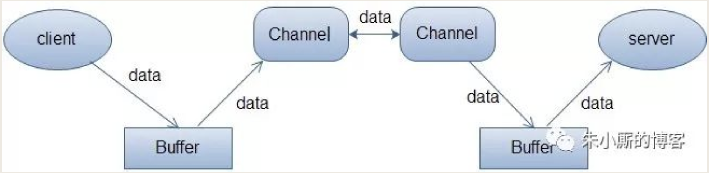
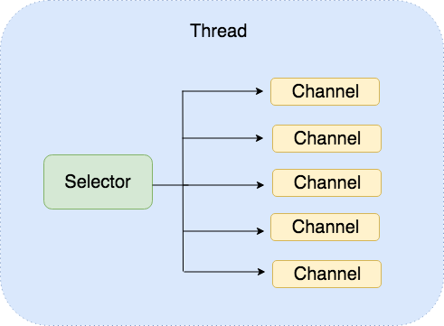

[TOC]

# 一、概述
NIO主要有三大核心部分：Channel(通道)，Buffer(缓冲区), Selector。
* 传统IO基于字节流和字符流进行操作，

* NIO基于Channel和Buffer(缓冲区)进行操作，数据总是从通道读取到缓冲区中，或者从缓冲区写入到通道中。Selector(选择区)用于监听多个通道的事件（比如：连接打开，数据到达）。因此，单个线程可以监听多个数据通道。

NIO和传统IO（一下简称IO）之间第一个最大的区别是：

* IO是面向流的。
    1. 意味着每次从流中读一个或多个字节，直至读取所有字节，它们没有被缓存在任何地方。此外，它不能前后移动流中的数据。如果需要前后移动从流中读取的数据，需要先将它缓存到一个缓冲区。
    2. IO的各种流是阻塞的。这意味着，当一个线程调用read() 或 write()时，该线程被阻塞，直到有一些数据被读取，或数据完全写入。该线程在此期间不能再干任何事情了。 

* NIO是面向缓冲区的。 
    1. 数据读取到一个它稍后处理的缓冲区，需要时可在缓冲区中前后移动。这就增加了处理过程中的灵活性。但是，还需要检查是否该缓冲区中包含所有您需要处理的数据。而且，需确保当更多的数据读入缓冲区时，不要覆盖缓冲区里尚未处理的数据。
    2. NIO的非阻塞模式，使一个线程从某通道发送请求读取数据，但是它仅能得到目前可用的数据，如果目前没有数据可用时，就什么都不会获取。而不是保持线程阻塞，所以直至数据变得可以读取之前，该线程可以继续做其他的事情。 非阻塞写也是如此。一个线程请求写入一些数据到某通道，但不需要等待它完全写入，这个线程同时可以去做别的事情。 线程通常将非阻塞IO的空闲时间用于在其它通道上执行IO操作，所以一个单独的线程现在可以管理多个输入和输出通道（channel）。

# 二、Buffer
Buffer顾名思义：缓冲区，实际上是一个容器，一个连续数组。Channel提供从文件、网络读取数据的渠道，但是读写的数据都必须经过Buffer。如下图：

## 1. Buffer的基本用法
使用Buffer读写数据一般遵循以下四个步骤：

1. 写入数据到Buffer

2.调用flip()方法

3. 从Buffer中读取数据

4. 调用clear()方法或者compact()方法

当向buffer写入数据时，buffer会记录下写了多少数据。**一旦要读取数据，需要通过flip()方法将Buffer从写模式切换到读模式。在读模式下，可以读取之前写入到buffer的所有数据。**

一旦读完了所有的数据，就需要**清空缓冲区**，让它可以再次被写入。有两种方式能清空缓冲区：

* 调用clear()方法，clear()方法会清空整个缓冲区。

* 调用compact()方法。compact()方法只会清除已经读过的数据，任何未读的数据都被移到缓冲区的起始处，新写入的数据将放到缓冲区未读数据的后面。

下面是一个使用Buffer的例子：

```java
RandomAccessFile aFile = new RandomAccessFile("data/nio-data.txt", "rw");
FileChannel inChannel = aFile.getChannel();

//create buffer with capacity of 48 bytes
ByteBuffer buf = ByteBuffer.allocate(48);

int bytesRead = inChannel.read(buf); //read into buffer.
while (bytesRead != -1) {

  buf.flip();  //make buffer ready for read

  while(buf.hasRemaining()){
      System.out.print((char) buf.get()); // read 1 byte at a time
  }

  buf.clear(); //make buffer ready for writing
  bytesRead = inChannel.read(buf);
}
aFile.close();
```
## 2. Buffer的capacity,position和limit
缓冲区buffer本质上是一块可以写入数据，然后可以从中读取数据的**内存**。这块内存被包装成NIO Buffer对象，并提供了一组方法，用来方便的访问该块内存。


### capacity
作为一个内存块，Buffer有一个固定的大小值，也叫“capacity”.你只能往里写capacity个byte、long，char等类型。一旦Buffer满了，需要将其清空（通过读数据或者清除数据）才能继续写数据往里写数据。

### position
* 当写数据到Buffer中时，position表示当前的位置。初始的position值为0.当一个byte、long等数据写到Buffer后， position会向前移动到下一个可插入数据的Buffer单元。position最大可为capacity – 1.

* 当读取数据时，也是从某个特定位置读。当将Buffer从写模式切换到读模式，position会被重置为0. 当从Buffer的position处读取数据时，position向前移动到下一个可读的位置。


### limit

* 在写模式下，Buffer的limit表示你最多能往Buffer里写多少数据。 写模式下，limit等于Buffer的capacity。

* 当切换Buffer到读模式时， limit表示你最多能读到多少数据。因此，当切换Buffer到读模式时，limit会被设置成写模式下的position值(此时position值被重置为0)。换句话说，你能读到之前写入的所有数据（limit被设置成已写数据的数量，这个值在写模式下就是position）。

## 3. Buffer的类型

Java NIO 有以下Buffer类型
* ByteBuffer

* MappedByteBuffer

* CharBuffer

* DoubleBuffer

* FloatBuffer

* IntBuffer

* LongBuffer

* ShortBuffer

这些Buffer类型代表了不同的数据类型。换句话说，就是可以通过char，short，int，long，float 或 double类型来操作缓冲区中的字节。
## 4. Buffer的分配

要想获得一个Buffer对象首先要进行分配。 每一个Buffer类都有一个allocate方法。

下面是一个分配48字节capacity的ByteBuffer的例子。
```java
ByteBuffer buf = ByteBuffer.allocate(48);
```
这是分配一个可存储1024个字符的CharBuffer：
```java
CharBuffer buf = CharBuffer.allocate(1024);
```
## 5. 向Buffer中写数据
写数据到Buffer有两种方式：

* 从Channel写到Buffer。

```java
int bytesRead = inChannel.read(buf); //read into buffer.
```

* 通过Buffer的put()方法写到Buffer里。put方法有很多版本，允许你以不同的方式把数据写入到Buffer中。例如， 写到一个指定的位置，或者把一个字节数组写入到Buffer。 
```java
buf.put(127);
```
### flip()方法
将Buffer从写模式切换到读模式。调用flip()方法会将position设回0，并将limit设置成之前position的值。

## 6. 从Buffer中读取数据
从Buffer中读取数据有两种方式：

* 从Buffer读取数据到Channel。
```java
//read from buffer into channel.
int bytesWritten = inChannel.write(buf);
```
* 使用get()方法从Buffer中读取数据。get方法有很多版本，允许你以不同的方式从Buffer中读取数据。例如，从指定position读取，或者从Buffer中读取数据到字节数组。
```java
byte aByte = buf.get();
```
### rewind()方法
Buffer.rewind()将position设回0，所以你可以重读Buffer中的所有数据。limit保持不变，仍然表示能从Buffer中读取多少个元素（byte、char等）。
### clear()与compact()方法
一旦读完Buffer中的数据，需要让Buffer准备好再次被写入。可以通过`clear()或compact()`方法来完成。

**clear()方法**
如果调用的是clear()方法，position将被设回0，limit被设置成 capacity的值。换句话说，Buffer 被清空了。Buffer中的数据并未清除，只是这些标记告诉我们可以从哪里开始往Buffer里写数据。

如果Buffer中有一些未读的数据，调用clear()方法，数据将“被遗忘”，意味着不再有任何标记会告诉你哪些数据被读过，哪些还没有。

**compact()方法**
如果Buffer中仍有未读的数据，且后续还需要这些数据，但是此时想要先写些数据，那么使用compact()方法。

compact()方法将所有未读的数据拷贝到Buffer起始处。然后将position设到最后一个未读元素正后面。limit属性依然像clear()方法一样，设置成capacity。现在Buffer准备好写数据了，但是不会覆盖未读的数据。

### mark()与reset()方法
通过调用`Buffer.mark()`方法，可以标记Buffer中的一个特定position。之后可以通过调用`Buffer.reset()`方法恢复到这个position。例如：
```java
buffer.mark();

//call buffer.get() a couple of times, e.g. during parsing.

buffer.reset();  //set position back to mark.
```
### equals()与compareTo()方法
可以使用equals()和compareTo()方法比较两个Buffer。
**equals()**
当满足下列条件时，表示两个Buffer相等：

1. 有相同的类型（byte、char、int等）。

2. Buffer中剩余的byte、char等的个数相等。

3. Buffer中所有剩余的byte、char等都相同。

**compareTo()方法**
compareTo()方法比较两个Buffer的剩余元素(byte、char等)， 如果满足下列条件，则认为一个Buffer“小于”另一个Buffer：

* 第一个不相等的元素小于另一个Buffer中对应的元素 。

* 所有元素都相等，但第一个Buffer比另一个先耗尽(第一个Buffer的元素个数比另一个少)。


## 7. 内存映射文件-MappedByteBuffer

MappedByteBuffer是ByteBuffer的子类，用于处理大文件。

ByteBuffer有两种模式:

* 间接模式，最典型(也只有这么一种)的就是HeapByteBuffer,即操作堆内存 (byte[]).

* 直接模式,即 MappedByteBuffer,文件映射.堆内存有限，如果我要发送一个1G的文件怎么办?不可能真的去分配1G的内存.这时就要使用MappedByteBuffer

> 谈谈操作系统的内存管理.一般操作系统的内存分两部分:
> * 物理内存
> * 虚拟内存.虚拟内存一般使用的是页面映像文件,即硬盘中的某个(某些)特殊的文件.操作系统负责页面文件内容的读写,这个过程叫"页面中断/切换". MappedByteBuffer也是类似的,你可以把整个文件(不管文件有多大)看成是一个ByteBuffer.MappedByteBuffer 只是一种特殊的ByteBuffer，即是ByteBuffer的子类。 
> 
> MappedByteBuffer 将文件直接映射到内存（这里的内存指的是虚拟内存，并不是物理内存）。通常，可以映射整个文件，如果文件比较大的话可以分段进行映射，只要指定文件的那个部分就可以。

FileChannel提供了map方法来把文件影射为内存映像文件：`MappedByteBuffer map(int mode,long position,long size); `可以把文件的从position开始的size大小的区域映射为内存映像文件。

其中mode指出了可访问该内存映像文件的方式：

* READ_ONLY,（只读）： 试图修改得到的缓冲区将导致抛出 ReadOnlyBufferException.(MapMode.READ_ONLY)

* READ_WRITE（读/写）： 对得到的缓冲区的更改最终将传播到文件；该更改对映射到同一文件的其他程序不一定是可见的。 (MapMode.READ_WRITE)

* PRIVATE（专用）： 对得到的缓冲区的更改不会传播到文件，并且该更改对映射到同一文件的其他程序也不是可见的；相反，会创建缓冲区已修改部分的专用副本。 (MapMode.PRIVATE)

MappedByteBuffer是ByteBuffer的子类，其扩充了三个方法：

* force()：缓冲区是READ_WRITE模式下，此方法对缓冲区内容的修改强行写入文件；

* load()：将缓冲区的内容载入内存，并返回该缓冲区的引用；

* isLoaded()：如果缓冲区的内容在物理内存中，则返回真，否则返回假；

### 示例
```java
public static void method3(){
    RandomAccessFile aFile = null;
    FileChannel fc = null;
    try{
        aFile = new RandomAccessFile("src/1.ppt","rw");
        fc = aFile.getChannel();
        long timeBegin = System.currentTimeMillis();
        MappedByteBuffer mbb = fc.map(FileChannel.MapMode.READ_ONLY, 0, aFile.length());
        long timeEnd = System.currentTimeMillis();
        System.out.println("Read time: "+(timeEnd-timeBegin)+"ms");
    }catch(IOException e){
        e.printStackTrace();
    }finally{
        try{
            if(aFile!=null){
                aFile.close();
            }
            if(fc!=null){
                fc.close();
            }
        }catch(IOException e){
            e.printStackTrace();
        }
    }
}
```


# 三、 Channel
Java NIO的通道类似流，但又有些不同：

* 既可以从通道中读取数据，又可以写数据到通道。但流的读写通常是单向的。

* 通道可以异步地读写。

* 通道中的数据总是要先读到一个Buffer，或者总是要从一个Buffer中写入。
  


NIO中的Channel的主要实现有：

* FileChannel，从文件中读写数据。

* DatagramChannel，能通过UDP读写网络中的数据。

* SocketChannel，能通过TCP读写网络中的数据。

* ServerSocketChannel，可以监听新进来的TCP连接，像Web服务器那样。对每一个新进来的连接都会创建一个SocketChannel。


## 1. FileChannel
Java NIO中的FileChannel是一个连接到文件的通道。可以通过文件通道读写文件。

FileChannel无法设置为非阻塞模式，它总是运行在阻塞模式下。

### 打开FileChannel
在使用FileChannel之前，必须先打开它。但是，我们无法直接打开一个FileChannel，需要通过使用一个InputStream、OutputStream或RandomAccessFile来获取一个FileChannel实例。下面是通过RandomAccessFile打开FileChannel的示例：
```java
RandomAccessFile aFile = new RandomAccessFile("data/nio-data.txt", "rw");
FileChannel inChannel = aFile.getChannel();
```
### 从FileChannel读取数据
调用多个read()方法之一从FileChannel中读取数据。如：
```java
ByteBuffer buf = ByteBuffer.allocate(48);
int bytesRead = inChannel.read(buf);
```
首先，分配一个Buffer。从FileChannel中读取的数据将被读到Buffer中。

然后，调用FileChannel.read()方法。该方法将数据从FileChannel读取到Buffer中。read()方法返回的int值表示了有多少字节被读到了Buffer中。**如果返回-1，表示到了文件末尾**。

### 向FileChannel写数据
使用FileChannel.write()方法向FileChannel写数据，该方法的参数是一个Buffer。如：

```java
String newData = "New String to write to file..." + System.currentTimeMillis();

ByteBuffer buf = ByteBuffer.allocate(48);
buf.clear();
buf.put(newData.getBytes());

buf.flip();

while(buf.hasRemaining()) {
	channel.write(buf);
}
```
注意FileChannel.write()是在while循环中调用的。因为无法保证write()方法一次能向FileChannel写入多少字节，因此需要重复调用write()方法，直到Buffer中已经没有尚未写入通道的字节。

### 关闭FileChannel
用完FileChannel后必须将其关闭。如：
```java
channel.close();
```

### FileChannel的position方法
有时可能需要在FileChannel的某个特定位置进行数据的读/写操作。可以通过调用position()方法获取FileChannel的当前位置。

也可以通过调用position(long pos)方法设置FileChannel的当前位置。
```java
long pos = channel.position();
channel.position(pos +123);
```
* 如果将位置设置在文件结束符之后，然后试图从文件通道中读取数据，读方法将返回-1（文件结束标志）。

* 如果将位置设置在文件结束符之后，然后向通道中写数据，文件将撑大到当前位置并写入数据。这可能导致“文件空洞”，磁盘上物理文件中写入的数据间有空隙。

### FileChannel的size方法
FileChannel实例的size()方法将返回该实例所关联文件的大小。如:
```java
long fileSize = channel.size();
```

### FileChannel的truncate方法
可以使用FileChannel.truncate()方法截取一个文件。截取文件时，文件中指定长度后面的部分将被删除。如：
```java
channel.truncate(1024);
```
这个例子截取文件的前1024个字节。

### FileChannel的force方法
FileChannel.force()方法将通道里尚未写入磁盘的数据强制写到磁盘上。出于性能方面的考虑，操作系统会将数据缓存在内存中，所以无法保证写入到FileChannel里的数据一定会即时写到磁盘上。要保证这一点，需要调用force()方法。

force()方法有一个boolean类型的参数，指明是否同时将文件元数据（权限信息等）写到磁盘上。

下面的例子同时将文件数据和元数据强制写到磁盘上：
```java
channel.force(true);
```

### 示例
```java
public static void method1(){
    RandomAccessFile aFile = null;
    try{
        aFile = new RandomAccessFile("src/nio.txt","rw");
        FileChannel fileChannel = aFile.getChannel();
        ByteBuffer buf = ByteBuffer.allocate(1024);
        int bytesRead = fileChannel.read(buf);
        System.out.println(bytesRead);
        while(bytesRead != -1)
        {
            buf.flip();
            while(buf.hasRemaining())
            {
                System.out.print((char)buf.get());
            }
            buf.compact();
            bytesRead = fileChannel.read(buf);
        }
    }catch (IOException e){
        e.printStackTrace();
    }finally{
        try{
            if(aFile != null){
                aFile.close();
            }
        }catch (IOException e){
            e.printStackTrace();
        }
    }
}
```

## 2. 客户端---SocketChannel
Java NIO中的SocketChannel是一个连接到TCP网络套接字的通道。可以通过以下2种方式创建SocketChannel：

1. 打开一个SocketChannel并连接到互联网上的某台服务器。

2. 一个新连接到达ServerSocketChannel时，会创建一个SocketChannel。
### 非阻塞模式
可以设置 SocketChannel 为非阻塞模式（non-blocking mode）.设置之后，就可以在异步模式下调用connect(), read() 和write()了。

#### connect()
如果SocketChannel在非阻塞模式下，此时调用connect()，该方法可能在连接建立之前就返回了。为了确定连接是否建立，可以调用finishConnect()的方法。像这样：
```java
socketChannel.configureBlocking(false);
socketChannel.connect(new InetSocketAddress("http://jenkov.com", 80));

while(! socketChannel.finishConnect() ){
    //wait, or do something else...
}
```
#### write()
非阻塞模式下，write()方法在尚未写出任何内容时可能就返回了。所以需要在循环中调用write()。
####  read()

非阻塞模式下,read()方法在尚未读取到任何数据时可能就返回了。所以需要关注它的int返回值，它会告诉你读取了多少字节。


### 写入 SocketChannel
客户端将数据写入SocketChannel，从而将数据发送到服务端。
```java
public static void client(){
    ByteBuffer buffer = ByteBuffer.allocate(1024);
    SocketChannel socketChannel = null;
    try
    {
        socketChannel = SocketChannel.open();
        socketChannel.configureBlocking(false);
        socketChannel.connect(new InetSocketAddress("10.10.195.115",8080));
        if(socketChannel.finishConnect())
        {
            int i=0;
            while(true)
            {
                TimeUnit.SECONDS.sleep(1);
                String info = "I'm "+i+++"-th information from client";
                buffer.clear();
                buffer.put(info.getBytes());
                buffer.flip();
                while(buffer.hasRemaining()){
                    System.out.println(buffer);
                    socketChannel.write(buffer);
                }
            }
        }
    }
    catch (IOException | InterruptedException e)
    {
        e.printStackTrace();
    }
    finally{
        try{
            if(socketChannel!=null){
                socketChannel.close();
            }
        }catch(IOException e){
            e.printStackTrace();
        }
    }
}
```
注意SocketChannel.write()方法的调用是在一个while循环中的。Write()方法无法保证能写多少字节到SocketChannel。所以，我们重复调用write()直到Buffer没有要写的字节为止。

### 从 SocketChannel 读取数据
```java
//打开 SocketChannel
SocketChannel socketChannel = SocketChannel.open();
socketChannel.connect(new InetSocketAddress("http://jenkov.com", 80));
//从 SocketChannel 读取数据
// 分配一个Buffer。从SocketChannel读取到的数据将会放到这个Buffer中。
ByteBuffer buf = ByteBuffer.allocate(48);
//read()方法将数据从SocketChannel读到Buffer中。read()方法返回的int值表示读了多少字节进Buffer里。如果返回的是-1，表示已经读到了流的末尾（连接关闭了）。
int bytesRead = socketChannel.read(buf);
//关闭 SocketChannel
socketChannel.close();
```

## 3. 服务端---ServerSocketChannel
Java NIO中的 ServerSocketChannel 是一个可以监听新进来的TCP连接的通道, 就像标准IO中的ServerSocket一样。ServerSocketChannel类在 java.nio.channels包中。

示例：
```java
//打开 ServerSocketChannel
ServerSocketChannel serverSocketChannel = ServerSocketChannel.open();

serverSocketChannel.socket().bind(new InetSocketAddress(9999));

while(true){
// 监听新进来的连接,当 accept()方法返回的时候,它返回一个包含新进来的连接的 SocketChannel。因此, accept()方法会一直阻塞到有新连接到达。
    SocketChannel socketChannel =
            serverSocketChannel.accept();

    //do something with socketChannel...例如读取数据
}
//关闭 ServerSocketChannel
serverSocketChannel.close();
```

### 非阻塞模式
ServerSocketChannel可以设置成非阻塞模式。在非阻塞模式下，accept() 方法会立刻返回，如果还没有新进来的连接,返回的将是null。 因此，需要检查返回的SocketChannel是否是null.如：
```java
ServerSocketChannel serverSocketChannel = ServerSocketChannel.open();

serverSocketChannel.socket().bind(new InetSocketAddress(9999));
serverSocketChannel.configureBlocking(false);

while(true){
    SocketChannel socketChannel =
            serverSocketChannel.accept();

    if(socketChannel != null){
        //do something with socketChannel...
    }
}
```

## 4. DatagramChannel
Java NIO中的DatagramChannel是一个能收发UDP包的通道。因为UDP是无连接的网络协议，所以不能像其它通道那样读取和写入。它发送和接收的是数据包。

### 从DatagramChannel中接收数据

```java
//打开DatagramChannel
DatagramChannel channel = DatagramChannel.open();
//打开的 DatagramChannel可以在UDP端口9999上接收数据包。
channel.socket().bind(new InetSocketAddress(9999));
//通过receive()方法从DatagramChannel接收数据
//receive()方法会将接收到的数据包内容复制到指定的Buffer. 如果Buffer容不下收到的数据，多出的数据将被丢弃。
ByteBuffer buf = ByteBuffer.allocate(48);
buf.clear();
channel.receive(buf);
```

### 从DatagramChannel发送数据
通过send()方法从DatagramChannel发送数据，如:
```java
String newData = "New String to write to file..." + System.currentTimeMillis();

ByteBuffer buf = ByteBuffer.allocate(48);
buf.clear();
buf.put(newData.getBytes());
buf.flip();

int bytesSent = channel.send(buf, new InetSocketAddress("jenkov.com", 80));
```
这个例子发送一串字符到”jenkov.com”服务器的UDP端口80。 因为服务端并没有监控这个端口，所以什么也不会发生。也不会通知你发出的数据包是否已收到，因为UDP在数据传送方面没有任何保证。

### 连接到特定的地址
可以将DatagramChannel“连接”到网络中的特定地址的。由于UDP是无连接的，在数据传送方面没有任何保证,连接到特定地址并不会像TCP通道那样创建一个真正的连接。而是锁住DatagramChannel ，让其只能从特定地址收发数据。
```java
channel.connect(new InetSocketAddress("jenkov.com", 80));
int bytesRead = channel.read(buf);
int bytesWritten = channel.write(but);
```

# 四、Selector
Selector（选择器）是Java NIO中能够检测一到多个NIO通道，并能够知晓通道是否为诸如读写事件做好准备的组件。这样，一个单独的线程可以管理多个channel，从而管理多个网络连接。



## 向Selector注册通道
为了将Channel和Selector配合使用，必须将channel注册到selector上。通过SelectableChannel.register()方法来实现，如下：
```java
channel.configureBlocking(false);
SelectionKey selectionKey = channel.register(selector,Selectionkey.OP_READ);
```
与Selector一起使用时，Channel必须处于非阻塞模式下。这意味着不能将FileChannel与Selector一起使用，因为FileChannel不能切换到非阻塞模式。而套接字通道都可以。

注意register()方法的第二个参数。这是一个“interest集合”，意思是在通过Selector监听Channel时对什么事件感兴趣。可以监听四种不同类型的事件：

1. Connect,某个channel成功连接到另一个服务器称为“连接就绪”，用SelectionKey.OP_CONNECT表示

2. Accept：一个server socket channel准备好接收新进入的连接称为“接收就绪”。用SelectionKey.OP_ACCEPT表示

3. Read：  一个有数据可读的通道可以说是“读就绪”。用SelectionKey.OP_READ表示

4. Write： 等待写数据的通道可以说是“写就绪”。用SelectionKey.OP_WRITE表示。


如果你对不止一种事件感兴趣，那么可以用“位或”操作符将常量连接起来，如下：
```java
int interestSet = SelectionKey.OP_READ | SelectionKey.OP_WRITE;
```
**在监听到一个事件后，如果要处理后续事件，则必须重新在通道注册后续事件。**
## SelectionKey
当向Selector注册Channel时，register()方法会返回一个SelectionKey对象。这个对象包含了一些你感兴趣的属性：
### interest集合

interest集合是你所选择的感兴趣的事件集合。可以通过SelectionKey读写interest集合，像这样：
```java
int interestSet = selectionKey.interestOps();

boolean isInterestedInAccept  = (interestSet & SelectionKey.OP_ACCEPT) == SelectionKey.OP_ACCEPT；
boolean isInterestedInConnect = interestSet & SelectionKey.OP_CONNECT;
boolean isInterestedInRead    = interestSet & SelectionKey.OP_READ;
boolean isInterestedInWrite   = interestSet & SelectionKey.OP_WRITE;
```
用“位与”操作interest 集合和给定的SelectionKey常量，可以确定某个确定的事件是否在interest 集合中。

### ready集合
ready 集合是通道已经准备就绪的操作的集合。在一次选择(Selection)之后，你会首先访问这个ready set。
可以这样访问ready集合：
```java
int readySet = selectionKey.readyOps();
```

### Channel + Selector
从SelectionKey访问Channel和Selector很简单。如下：
```java
Channel  channel  = selectionKey.channel();
Selector selector = selectionKey.selector();
```
### 附加的对象
可以将一个对象或者更多信息附着到SelectionKey上，这样就能方便的识别某个给定的通道。例如，可以附加 与通道一起使用的Buffer，或是包含聚集数据的某个对象。使用方法如下：
```java
selectionKey.attach(theObject);
Object attachedObj = selectionKey.attachment();
```
还可以在用register()方法向Selector注册Channel的时候附加对象。如：
```java
SelectionKey key = channel.register(selector, SelectionKey.OP_READ, theObject);
```
## 通过Selector选择通道---select()方法
一旦向Selector注册了一或多个通道，就可以调用几个重载的select()方法。这些方法返回你所感兴趣的事件（如连接、接受、读或写）已经准备就绪的那些通道。
下面是select()方法：

* int select(): 阻塞到至少有一个通道在你注册的事件上就绪了。

* int select(long timeout): 最长会阻塞timeout毫秒

* int selectNow():不会阻塞，不管什么通道就绪都立刻返回,如果自从前一次选择操作后，没有通道变成可选择的，则此方法直接返回零。

select()方法返回的int值表示有多少通道已经就绪。亦即，自上次调用select()方法后有多少通道变成就绪状态。

### selectedKeys()
一旦调用了select()方法，并且返回值表明有一个或更多个通道就绪了，然后可以通过调用selector的selectedKeys()方法，访问“已选择键集（selected key set）”中的就绪通道。如下所示：
```java
Set selectedKeys = selector.selectedKeys();
```
当像Selector注册Channel时，Channel.register()方法会返回一个SelectionKey 对象。这个对象代表了注册到该Selector的通道。可以通过SelectionKey的selectedKeySet()方法访问这些对象。

可以遍历这个已选择的键集合来访问就绪的通道。如下：

```java
Set selectedKeys = selector.selectedKeys();
Iterator keyIterator = selectedKeys.iterator();
while(keyIterator.hasNext()) {
    SelectionKey key = keyIterator.next();
    if(key.isAcceptable()) {
        // a connection was accepted by a ServerSocketChannel.
    } else if (key.isConnectable()) {
        // a connection was established with a remote server.
    } else if (key.isReadable()) {
        // a channel is ready for reading
    } else if (key.isWritable()) {
        // a channel is ready for writing
    }
    keyIterator.remove();
}
```

这个循环遍历已选择键集中的每个键，并检测各个键所对应的通道的就绪事件。

**注意每次迭代末尾的`keyIterator.remove()`调用。Selector不会自己从已选择键集中移除SelectionKey实例。必须在处理完通道时自己移除。下次该通道变成就绪时，Selector会再次将其放入已选择键集中。**

`SelectionKey.channel()`方法返回的通道需要转型成你要处理的类型，如ServerSocketChannel或SocketChannel等。

### wakeUp()

某个线程调用select()方法后阻塞了，即使没有通道已经就绪，也有办法让其从select()方法返回。只要让其它线程在第一个线程调用select()方法的那个对象上调用Selector.wakeup()方法即可。阻塞在select()方法上的线程会立马返回。

如果有其它线程调用了wakeup()方法，但当前没有线程阻塞在select()方法上，下个调用select()方法的线程会立即“醒来（wake up）”。


### close()
用完Selector后调用其close()方法会关闭该Selector，且使注册到该Selector上的所有SelectionKey实例无效。通道本身并不会关闭。
## 示例：
打开一个Selector，注册一个通道注册到这个Selector上(通道的初始化过程略去),然后持续监控这个Selector的四种事件（接受，连接，读，写）是否就绪。
```java
//Selector的创建
Selector selector = Selector.open();
//向Selector注册通道
channel.configureBlocking(false);
SelectionKey key = channel.register(selector, SelectionKey.OP_ACCEPT);//在监听到ACCEPT前，已经发生了CONNECT
while(true) {
  int readyChannels = selector.select();
  if(readyChannels == 0) continue;
  Set selectedKeys = selector.selectedKeys();
  Iterator keyIterator = selectedKeys.iterator();
  while(keyIterator.hasNext()) {
    SelectionKey key = keyIterator.next();
    if(key.isAcceptable()) {
        // 在这里要注册下一步的感兴趣时间，SelectionKey.OP_READ，否则会监听不到READ事件，其他事件的处理也类似。
    } else if (key.isConnectable()) {
        // a connection was established with a remote server.
    } else if (key.isReadable()) {
        // a channel is ready for reading
    } else if (key.isWritable()) {
        // a channel is ready for writing
    }
    keyIterator.remove();
  }
}
```

# 五、完整示例
## 服务端，结合Selector和ServerSocketChannel

```java
import java.io.IOException;
import java.net.InetSocketAddress;
import java.net.ServerSocket;
import java.nio.ByteBuffer;
import java.nio.channels.SelectionKey;
import java.nio.channels.Selector;
import java.nio.channels.ServerSocketChannel;
import java.nio.channels.SocketChannel;
import java.util.Iterator;
import java.util.Set;

/**
 * Created by zhangc on 2020/4/26.
 */
public class NIOServer {
	// 通道管理器(Selector)
	private static Selector selector;

	public static void main(String[] args) throws IOException {
		// 创建通道管理器(Selector)
		selector = Selector.open();

		// 创建通道ServerSocketChannel
		ServerSocketChannel serverSocketChannel = ServerSocketChannel.open();
		// 将通道设置为非阻塞
		serverSocketChannel.configureBlocking(false);

		// 将ServerSocketChannel对应的ServerSocket绑定到指定端口(port)
		ServerSocket serverSocket = serverSocketChannel.socket();
		serverSocket.bind(new InetSocketAddress(8989));

		/**
		 * 将通道(Channel)注册到通道管理器(Selector)，并为该通道注册selectionKey.OP_ACCEPT事件
		 * 注册该事件后，当事件到达的时候，selector.select()会返回，
		 * 如果事件没有到达selector.select()会一直阻塞。
		 */
		serverSocketChannel.register(selector, SelectionKey.OP_ACCEPT);

		// 循环处理
		while (true) {
			// 当注册事件到达时，方法返回，否则该方法会一直阻塞
			selector.select();

			// 获取监听事件
			Set<SelectionKey> selectionKeys = selector.selectedKeys();
			Iterator<SelectionKey> iterator = selectionKeys.iterator();

			// 迭代处理
			while (iterator.hasNext()) {
				// 获取事件
				SelectionKey key = iterator.next();

				// 移除事件，避免重复处理
				iterator.remove();

				// 处理客户端连接成功事件
				if (key.isAcceptable()) {
					System.err.println("Acceptable");
					// 获取客户端连接通道
					ServerSocketChannel server = (ServerSocketChannel) key.channel();
					SocketChannel socketChannel = server.accept();
					socketChannel.configureBlocking(false);
					//用于下一步读取从客户端发送来的数据
					socketChannel.register(selector, SelectionKey.OP_READ);
				} else if (key.isReadable()) {// 监听到读事件，读取客户端发送过来的消息
					System.err.println("Readable");
					SocketChannel socketChannel = (SocketChannel) key.channel();
					// 从通道读取数据到缓冲区
					ByteBuffer buffer = ByteBuffer.allocate(128);
					socketChannel.read(buffer);
					// 输出客户端发送过来的消息
					byte[] data = buffer.array();
					String msg = new String(data).trim();
					System.out.println("接收来自客户端的数据：" + msg);
					//将通道设置为可写，用于下一步服务端向通道写入数据，发送给客户端
					socketChannel.register(selector, SelectionKey.OP_WRITE);
				} else if (key.isWritable()) {//监听到通道的写事件，将数据写入通道，向客户端发送
					System.err.println("Writable");
					SocketChannel socketChannel = (SocketChannel) key.channel();
					String content = "Hello client: " + System.currentTimeMillis();
					ByteBuffer buffer = ByteBuffer.wrap(content.getBytes());
					socketChannel.write(buffer);
					//将通道设置为可读，用于下一步服务端继续读取来自客户端的数据。
					socketChannel.register(selector, SelectionKey.OP_READ);
				}
			}
		}
	}
}

```

ServerSocketChannel的Operation Set只能是OP_ACCEPT，如果在注册的时候添加了OP_CONNECT、OP_WRITE或OP_READ会报异常。
ServerSocketChannel的validOps可以看到只有OP_ACCEPT是合法的
```java
public final int validOps() {
    return SelectionKey.OP_ACCEPT;
}
```
## 客户端WithSelector
```java
package com.zhangC.nio;

import java.io.IOException;
import java.net.InetSocketAddress;
import java.nio.ByteBuffer;
import java.nio.channels.SelectionKey;
import java.nio.channels.Selector;
import java.nio.channels.SocketChannel;
import java.util.Iterator;

/**
 * Created by zhangc on 2020/4/26.
 */
public class NIOClientWithSelector {
	// 通道管理器(Selector)
	private static Selector selector;

	public static void main(String[] args) throws IOException {
		// 创建通道管理器(Selector)
		selector = Selector.open();

		// 创建通道SocketChannel
		SocketChannel channel = SocketChannel.open();
		// 将通道设置为非阻塞
		channel.configureBlocking(false);

		// 客户端连接服务器，其实方法执行并没有实现连接，需要在handleConnect方法中调channel.finishConnect()才能完成连接
		channel.connect(new InetSocketAddress("127.0.0.1", 8989));

		/**
		 * 将通道(Channel)注册到通道管理器(Selector)，并为该通道注册selectionKey.OP_CONNECT
		 * 注册该事件后，当事件到达的时候，selector.select()会返回，
		 * 如果事件没有到达selector.select()会一直阻塞。
		 */
		channel.register(selector, SelectionKey.OP_CONNECT);

		// 循环处理
		while (true) {
			/*
			 * 选择一组可以进行I/O操作的事件，放在selector中，客户端的该方法不会阻塞，
			 * selector的wakeup方法被调用，方法返回，而对于客户端来说，通道一直是被选中的
			 * 这里和服务端的方法不一样，查看api注释可以知道，当至少一个通道被选中时。
			 */
			int select = selector.select();
			if (select > 0) {
				// 获取监听事件
				Iterator<SelectionKey> iterator = selector.selectedKeys().iterator();

				// 迭代处理
				while (iterator.hasNext()) {
					// 获取事件
					SelectionKey key = iterator.next();
					// 移除事件，避免重复处理
					iterator.remove();
					// 检查是否是一个就绪的已经连接服务端成功事件
					if (key.isConnectable()) {
						System.err.println("Connectable");
						// 获取与服务端建立连接的通道
						SocketChannel connectChannel = (SocketChannel) key.channel();
						if (connectChannel.isConnectionPending()) {
							// channel.finishConnect()才能完成连接
							connectChannel.finishConnect();
						}
						// 将通道设置为可读，用于下一步向服务端发送数据
						connectChannel.register(selector, SelectionKey.OP_WRITE);
					} else if (key.isReadable()) {// 监听到通道的读事件，读取从服务端发送过来的消息
						SocketChannel readChannel = (SocketChannel) key.channel();

						// 从通道读取数据到缓冲区
						ByteBuffer buffer = ByteBuffer.allocate(128);
						readChannel.read(buffer);

						// 输出服务端响应发送过来的消息
						byte[] data = buffer.array();
						String msg = new String(data).trim();
						System.out.println("接收来自服务端的数据：" + msg);
						//将通道的监听事件设置为写，用于向服务端发送数据。
						readChannel.register(selector, SelectionKey.OP_WRITE);
					} else if (key.isWritable()) {
						SocketChannel writeChannel = (SocketChannel) key.channel();
						// 数据写入通道
						String msg = "Hello Server：" + System.currentTimeMillis();
						writeChannel.write(ByteBuffer.wrap(msg.getBytes()));
						System.out.println("向服务端发送数据：" + msg);
						writeChannel.register(selector, SelectionKey.OP_READ);
					}


				}

			}
		}
	}

}


```
SocketChannel的Operation Set只能是OP_CONNECT、OP_WRITE和OP_READ，如果在注册的时候添加了OP_ACCEPT同样会报异常。

SocketChannel的validOps可以看到只有OP_READ、OP_WRITE、OP_CONNECT是合法的

```java
public final int validOps() {
    return (SelectionKey.OP_READ
            | SelectionKey.OP_WRITE
            | SelectionKey.OP_CONNECT);
}
```

## 客户端WithOutSelector
```java
package com.zhangC.nio;

import java.io.IOException;
import java.net.InetSocketAddress;
import java.nio.ByteBuffer;
import java.nio.channels.SocketChannel;
import java.util.concurrent.TimeUnit;

/**
 * Created by zhangc on 2020/4/26.
 */
public class NIOClientWithOutSelector {

	public static void main(String[] args) {
		ByteBuffer buffer = ByteBuffer.allocate(1024);
		SocketChannel socketChannel = null;
		try
		{
			socketChannel = SocketChannel.open();
			socketChannel.configureBlocking(false);
			socketChannel.connect(new InetSocketAddress("localhost",8989));
			if(socketChannel.finishConnect())
			{
				int i=0;
				while(true)
				{
					TimeUnit.SECONDS.sleep(1);
					String info = "I'm "+i+++"-th information from client";
					buffer.clear();
					buffer.put(info.getBytes());
					buffer.flip();
					while(buffer.hasRemaining()){
						System.out.println(buffer);
						socketChannel.write(buffer);
					}
				}
			}
		}
		catch (IOException | InterruptedException e)
		{
			e.printStackTrace();
		}
		finally{
			try{
				if(socketChannel!=null){
					socketChannel.close();
				}
			}catch(IOException e){
				e.printStackTrace();
			}
		}
	}
}

```

# 六、其余功能介绍

## Scatter/Gatter

* 分散（scatter）从Channel中读取 是指在读操作时将读取的数据写入多个buffer中。

* 聚集（gather）写入Channel是指在写操作时将多个buffer的数据写入同一个Channel。

`scatter / gather`经常用于需要将传输的数据分开处理的场合，例如传输一个由消息头和消息体组成的消息，你可能会将消息体和消息头分散到不同的buffer中，这样你可以方便的处理消息头和消息体。

案例：
```java
public class ScattingAndGather
{
    public static void main(String args[]){
        gather();
    }
    public static void gather()
    {
        ByteBuffer header = ByteBuffer.allocate(10);
        ByteBuffer body = ByteBuffer.allocate(10);
        byte [] b1 = {'0', '1'};
        byte [] b2 = {'2', '3'};
        header.put(b1);
        body.put(b2);
        ByteBuffer [] buffs = {header, body};
        try
        {
            FileOutputStream os = new FileOutputStream("src/scattingAndGather.txt");
            FileChannel channel = os.getChannel();
            channel.write(buffs);
        }
        catch (IOException e)
        {
            e.printStackTrace();
        }
    }
}
```

## transferFrom()
FileChannel的transferFrom()方法可以将数据从某一个通道传输到FileChannel中。
```java
    public static void method1(){
        RandomAccessFile fromFile = null;
        RandomAccessFile toFile = null;
        try
        {
            fromFile = new RandomAccessFile("src/fromFile.xml","rw");
            FileChannel fromChannel = fromFile.getChannel();
            toFile = new RandomAccessFile("src/toFile.txt","rw");
            FileChannel toChannel = toFile.getChannel();
            long position = 0;
            long count = fromChannel.size();
            System.out.println(count);
            toChannel.transferFrom(fromChannel, position, count);
        }
        catch (IOException e)
        {
            e.printStackTrace();
        }
        finally{
            try{
                if(fromFile != null){
                    fromFile.close();
                }
                if(toFile != null){
                    toFile.close();
                }
            }
            catch(IOException e){
                e.printStackTrace();
            }
        }
    }
```

方法的输入参数position表示从position处开始向目标文件写入数据，count表示最多传输的字节数。如果源通道的剩余空间小于 count 个字节，则所传输的字节数要小于请求的字节数。此外要注意，在SoketChannel的实现中，SocketChannel只会传输此刻准备好的数据（可能不足count字节）。因此，SocketChannel可能不会将请求的所有数据(count个字节)全部传输到FileChannel中。

## transferTo()
transferTo()方法将数据从FileChannel传输到其他的channel中。
```java
    public static void method2()
    {
        RandomAccessFile fromFile = null;
        RandomAccessFile toFile = null;
        try
        {
            fromFile = new RandomAccessFile("src/fromFile.txt","rw");
            FileChannel fromChannel = fromFile.getChannel();
            toFile = new RandomAccessFile("src/toFile.txt","rw");
            FileChannel toChannel = toFile.getChannel();
            long position = 0;
            long count = fromChannel.size();
            System.out.println(count);
            fromChannel.transferTo(position, count,toChannel);
        }
        catch (IOException e)
        {
            e.printStackTrace();
        }
        finally{
            try{
                if(fromFile != null){
                    fromFile.close();
                }
                if(toFile != null){
                    toFile.close();
                }
            }
            catch(IOException e){
                e.printStackTrace();
            }
        }
    }
```
上面所说的关于SocketChannel的问题在transferTo()方法中同样存在。SocketChannel会一直传输数据直到目标buffer被填满。

## Pipe
Java NIO 管道是2个线程之间的单向数据连接。Pipe有一个source通道和一个sink通道。数据会被写到sink通道，从source通道读取。
```java
    public static void method1(){
        Pipe pipe = null;
        ExecutorService exec = Executors.newFixedThreadPool(2);
        try{
            pipe = Pipe.open();
            final Pipe pipeTemp = pipe;
            exec.submit(new Callable<Object>(){
                @Override
                public Object call() throws Exception
                {
                    Pipe.SinkChannel sinkChannel = pipeTemp.sink();//向通道中写数据
                    while(true){
                        TimeUnit.SECONDS.sleep(1);
                        String newData = "Pipe Test At Time "+System.currentTimeMillis();
                        ByteBuffer buf = ByteBuffer.allocate(1024);
                        buf.clear();
                        buf.put(newData.getBytes());
                        buf.flip();
                        while(buf.hasRemaining()){
                            System.out.println(buf);
                            sinkChannel.write(buf);
                        }
                    }
                }
            });
            exec.submit(new Callable<Object>(){
                @Override
                public Object call() throws Exception
                {
                    Pipe.SourceChannel sourceChannel = pipeTemp.source();//向通道中读数据
                    while(true){
                        TimeUnit.SECONDS.sleep(1);
                        ByteBuffer buf = ByteBuffer.allocate(1024);
                        buf.clear();
                        int bytesRead = sourceChannel.read(buf);
                        System.out.println("bytesRead="+bytesRead);
                        while(bytesRead >0 ){
                            buf.flip();
                            byte b[] = new byte[bytesRead];
                            int i=0;
                            while(buf.hasRemaining()){
                                b[i]=buf.get();
                                System.out.printf("%X",b[i]);
                                i++;
                            }
                            String s = new String(b);
                            System.out.println("=================||"+s);
                            bytesRead = sourceChannel.read(buf);
                        }
                    }
                }
            });
        }catch(IOException e){
            e.printStackTrace();
        }finally{
            exec.shutdown();
        }
    }
```