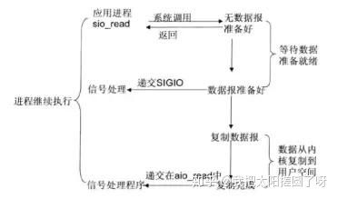
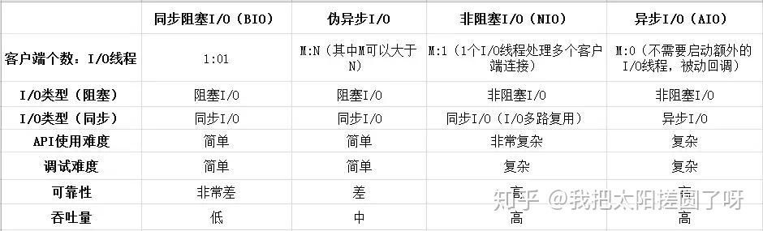

[TOC]
# AIO简介
Java AIO即Async非阻塞，是异步非阻塞的IO。AIO提供了从建立连接到读、写的全异步操作。AIO可用于异步的文件读写和网络通信。

异步IO模型



在Linux系统中，应用进程发起read操作，立刻可以去做其他的事，内核会将数据准备好并且复制到用空间后告诉应用进程，数据已经复制完成read操作

# BIO、NIO、AIO的区别与联系
* BIO （Blocking I/O）：同步阻塞I/O模式，数据的读取写入必须阻塞在一个线程内等待其完成。这里假设一个烧开水的场景，有一排水壶在烧开水，BIO的工作模式就是， 叫一个线程停留在一个水壶那，直到这个水壶烧开，才去处理下一个水壶。但是实际上线程在等待水壶烧开的时间段什么都没有做。

* NIO （New I/O）：同时支持阻塞与非阻塞模式，但这里我们以其同步非阻塞I/O模式来说明，那么什么叫做同步非阻塞？如果还拿烧开水来说，NIO的做法是叫一个线程不断的轮询每个水壶的状态，看看是否有水壶的状态发生了改变，从而进行下一步的操作。

* AIO （ Asynchronous I/O）：异步非阻塞I/O模型。异步非阻塞与同步非阻塞的区别在哪里？异步非阻塞无需一个线程去轮询所有IO操作的状态改变，在相应的状态改变后，系统会通知对应的线程来处理。对应到烧开水中就是，为每个水壶上面装了一个开关，水烧开之后，水壶会自动通知我水烧开了。


# 异步操作
aio不需要通过多路复用器对注册的通道进行轮询操作就可以实现异步读写，从而简化了NIO的编程模型

aio通过异步通道实现异步操作，异步通道提供了两种方式获取操作结果：

1. 通过Future类来获取异步操作的结果，不过要注意的是`future.get()`是阻塞方法，会阻塞线程

2. 通过回调的方式进行异步，通过传入一个CompletionHandler的实现类进行回调，CompletionHandler定义了两个方法，completed和failed两方法分别对应成功和失败.

Aio中的Channel都支持以上两种方式。

AIO提供了对应的异步套接字通道实现网络编程，
* 服务端：AsynchronousServerSocketChannel

* 客户端AsynchronousSocketChannel

## 服务端
服务端向客户端发送消息，并接受客户端发送的消息
```java
public class AioServer {
	public static void main(String[] args)  throws  Exception{
		AsynchronousServerSocketChannel server = AsynchronousServerSocketChannel.open().bind(new InetSocketAddress("127.0.0.1", 9001));
//异步接受请求
		server.accept(null, new CompletionHandler<AsynchronousSocketChannel, Void>() {
			//成功时
			@Override
			public void completed(AsynchronousSocketChannel result, Void attachment) {
				try {
					ByteBuffer buffer = ByteBuffer.allocate(1024);
					buffer.put("我是服务端，客户端你好".getBytes());
					buffer.flip();
					result.write(buffer, null, new CompletionHandler<Integer, Void>() {
						@Override
						public void completed(Integer result, Void attachment) {
							System.out.println("服务端发送消息成功");
						}

						@Override
						public void failed(Throwable exc, Void attachment) {
							System.out.println("发送失败");
						}
					});
					ByteBuffer readBuffer = ByteBuffer.allocate(1024);
					result.read(readBuffer, null, new CompletionHandler<Integer, Void>() {
						//成功时调用
						@Override
						public void completed(Integer result, Void attachment) {
							System.out.println(new String(readBuffer.array()));
						}

						//失败时调用
						@Override
						public void failed(Throwable exc, Void attachment) {
							System.out.println("读取失败");
						}
					});
				} catch (Exception e) {
					e.printStackTrace();
				}
			}

			//失败时
			@Override
			public void failed(Throwable exc, Void attachment) {
				exc.printStackTrace();
			}
		});
		//防止线程执行完
		TimeUnit.SECONDS.sleep(1000L);
	}
}
```

## 客户端
```java
public class AioClient {
	public static void main(String[] args) throws Exception {
		AsynchronousSocketChannel client = AsynchronousSocketChannel.open();
		Future<Void> future = client.connect(new InetSocketAddress("127.0.0.1", 9001));
		//阻塞，获取连接
		future.get();
		ByteBuffer buffer = ByteBuffer.allocate(1024);
		//读数据
		client.read(buffer, null, new CompletionHandler<Integer, Void>() {
			//成功时调用
			@Override
			public void completed(Integer result, Void attachment) {
				System.out.println(new String(buffer.array()));
			}

			//失败时调用
			@Override
			public void failed(Throwable exc, Void attachment) {
				System.out.println("客户端接收消息失败");
			}
		});
		ByteBuffer writeBuffer = ByteBuffer.allocate(1024);
		writeBuffer.put("我是客户端，服务端你好".getBytes());
		writeBuffer.flip();
//阻塞方法
		Future<Integer> write = client.write(writeBuffer);
		Integer r = write.get();
		if (r > 0) {
			System.out.println("客户端消息发送成功");
		}
//休眠线程
		TimeUnit.SECONDS.sleep(1000L);
	}
}
```


# 各IO模型对比


伪异步IO是指使用线程池处理请求的Bio模型