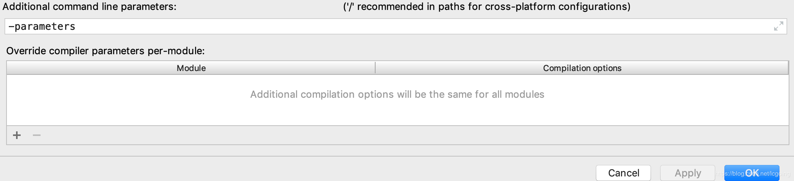

保留参数名这一选项由编译开关javac -parameters打开，则：参数名称被编译进了class文件。

保留参数名这一选项由编译开关javac -parameters关闭，则：参数名称是无意义的org0、org1...

但是，javac -parameters默认是关闭的

在IDEA中可以这样打开：

```
Preferences -> "Build, Execution, Deployment" -> Compiler -> "Java Compiler"

"Project bytecode version"设置为1.8

"Additional command line parameters"添加"-parameters"
```




如果是maven项目，可以配置maven编译插件:

```xml
<plugin>
	<groupId>org.apache.maven.plugins</groupId>
	<artifactId>maven-compiler-plugin</artifactId>
	<version>3.1</version>
	<configuration>
		<compilerArgument>-parameters</compilerArgument>
		<encoding>UTF-8</encoding>
		<source>1.8</source>
		<target>1.8</target>
	</configuration>
</plugin>
```