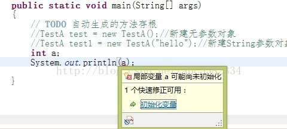
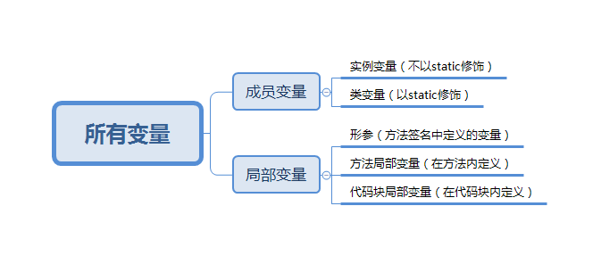

[TOC]
> 访问修饰符 

Java中，可以使用访问控制符来保护对类、变量、方法和构造方法的访问。Java 支持 4 种不同的访问权限。

* default (即默认，什么也不写）: 在同一包内可见，不使用任何修饰符。使用对象：类、接口、变量、方法。

* private : 在同一类内可见。使用对象：变量、方法。 注意：**不能修饰类（外部类）**

* public : 对所有类可见。使用对象：类、接口、变量、方法

* protected : 对同一包内的类和所有子类可见。使用对象：变量、方法。 注意：**不能修饰类（外部类）**。

我们可以通过以下表来说明访问权限：

|修饰符	|当前类	|同一包内	|子孙类(同一包)	|子孙类(不同包)	|其他包|
| --- | --- | --- | --- | --- | --- |
|public	|Y	|Y	|Y	|Y	|Y|
|protected	|Y	|Y	|Y	|子类实例可以访问其从基类继承而来的 protected 方法，而不能访问基类实例的protected方法。	|N|
|default	|Y	|Y	|Y	|N	|N|
|private	|Y	|N	|N	|N	|N|

# 变量声明
在Java语言中，所有的变量在使用前必须声明。

以下列出了一些变量的声明实例。注意有些包含了初始化过程：
```java
int a, b, c;         // 声明三个int型整数：a、 b、c 
int d = 3, e = 4, f = 5; // 声明三个整数并赋予初值 
byte z = 22;         // 声明并初始化 z 
String s = "runoob"; // 声明并初始化字符串 s 
double pi = 3.14159; // 声明了双精度浮点型变量 pi 
char x = 'x';        // 声明变量 x 的值是字符 'x'。
```
# 变量的初始化
## 1. 对于对于类的成员变量
不管程序有没有显示的初始化，Java  虚拟机都会先自动给它初始化为默认值。
1. 整数类型（byte、short、int、long）的基本类型变量的默认值为0。

2. 单精度浮点型（float）的基本类型变量的默认值为0.0f。

3. 双精度浮点型（double）的基本类型变量的默认值为0.0d。

4. 字符型（char）的基本类型变量的默认为 “/u0000”。


5. 布尔性的基本类型变量的默认值为 false。


6. 引用类型的变量是默认值为 null。

7. 数组引用类型的变量的默认值为 null。当数组变量的实例后，如果没有没有显式的为每个元素赋值，Java 就会把该数组的所有元素初始化为其相应类型的默认值。

数组例子：
* int[] a;   //声明,没有初始化默认值是null

*  int[] a=new int[5];   //初始化为默认值,int型为0
## 2. 局部变量初始化
局部变量声明以后，Java 虚拟机不会自动的为它初始化为默认值。

因此对于局部变量，必须先经过显式的初始化，才能使用它。

如果编译器确认一个局部变量在使用之前可能没有被初始化，编译器将报错。

例如：


# 变量类型

在Java语言里，根据定义变量位置的不同，可以将变量分成两大类：
* 成员变量(存在于堆内存中，和类一起创建)
* 局部变量(存在于栈内存中，当方法执行完成，让出内存，让其他方法来使用内存)。




实例：
```java
public class Variable{
    static int allClicks=0;    // 类变量
 
    String str="hello world";  // 实例变量
 
    public void method(){
 
        int i =0;  // 局部变量
 
    }
}
```
## Java 局部变量

* 局部变量声明在方法、构造方法或者语句块中；

* 局部变量在方法、构造方法、或者语句块被执行的时候创建，当它们执行完成后，变量将会被销毁；
* 访问修饰符(`default,private,public,protected`)不能用于局部变量；
* 局部变量只在声明它的方法、构造方法或者语句块中可见；
* 局部变量是在栈上分配的。局部变量没有默认值，所以局部变量被声明后，必须经过初始化，才可以使用。

### 实例 1:

在以下实例中age是一个局部变量。定义在pupAge()方法中，它的作用域就限制在这个方法中。
```java
package com.runoob.test;
 
public class Test{ 
   public void pupAge(){
      int age = 0;
      age = age + 7;
      System.out.println("小狗的年龄是: " + age);
   }
   
   public static void main(String[] args){
      Test test = new Test();
      test.pupAge();
   }
}
```

### 实例 2:
在下面的例子中 age 变量没有初始化，所以在编译时会出错：
```java
package com.runoob.test;
 
public class Test{ 
   public void pupAge(){
      int age;
      age = age + 7;
      System.out.println("小狗的年龄是 : " + age);
   }
   
   public static void main(String[] args){
      Test test = new Test();
      test.pupAge();
   }
}
```

以上实例编译运行结果如下:
```log

Test.java:4:variable number might not have been initialized
age = age + 7;
         ^
 1 error
```
## Java实例变量
* 实例变量声明在一个类中，但在方法、构造方法和语句块之外；
* 当一个对象被实例化之后，每个实例变量的值就跟着确定；
* 实例变量在对象创建的时候创建，在对象被销毁的时候销毁；
* 实例变量的值应该至少被一个方法、构造方法或者语句块引用，使得外部能够通过这些方式获取实例变量信息；
* 实例变量可以声明在使用前或者使用后；
* 访问修饰符可以修饰实例变量；
* 实例变量对于类中的方法、构造方法或者语句块是可见的。一般情况下应该把实例变量设为私有。通过使用访问修饰符可以使实例变量对子类可见；
* 实例变量具有默认值。数值型变量的默认值是0，布尔型变量的默认值是false，引用类型变量的默认值是null。变量的值可以在声明时指定，也可以在构造方法中指定；
* 实例变量可以直接通过变量名访问。但在静态方法以及其他类中，就应该使用完全限定名：ObejectReference.VariableName。


### 实例:
```java
import java.io.*;
public class Employee{
   // 这个实例变量对子类可见
   public String name;
   // 私有变量，仅在该类可见
   private double salary;
   //在构造器中对name赋值
   public Employee (String empName){
      name = empName;
   }
   //设定salary的值
   public void setSalary(double empSal){
      salary = empSal;
   }  
   // 打印信息
   public void printEmp(){
      System.out.println("名字 : " + name );
      System.out.println("薪水 : " + salary);
   }
 
   public static void main(String[] args){
      Employee empOne = new Employee("RUNOOB");
      empOne.setSalary(1000.0);
      empOne.printEmp();
   }
}
```

## 类变量（静态变量）
* 类变量也称为静态变量，在类中以 static 关键字声明，但必须在方法之外。

* 无论一个类创建了多少个对象，类只拥有类变量的一份拷贝。

* 静态变量除了被声明为常量外很少使用。常量是指声明为public/private，final和static类型的变量。常量初始化后不可改变。

* 静态变量储存在静态存储区。经常被声明为常量，很少单独使用static声明变量。

* 静态变量在第一次被访问时创建，在程序结束时销毁。

* 与实例变量具有相似的可见性。但为了对类的使用者可见，大多数静态变量声明为public类型。

* 默认值和实例变量相似。数值型变量默认值是0，布尔型默认值是false，引用类型默认值是null。变量的值可以在声明的时候指定，也可以在构造方法中指定。此外，静态变量还可以在静态语句块中初始化。

* 静态变量可以通过：ClassName.VariableName的方式访问。类变量被声明为public static final类型时，类变量名称一般建议使用大写字母。如果静态变量不是public和final类型，其命名方式与实例变量以及局部变量的命名方式一致。

### 实例：
```java
import java.io.*;
 
public class Employee {
    //salary是静态的私有变量
    private static double salary;
    // DEPARTMENT是一个常量
    public static final String DEPARTMENT = "开发人员";
    public static void main(String[] args){
    salary = 10000;
        System.out.println(DEPARTMENT+"平均工资:"+salary);
    }
}
```

# 构造代码块
直接在类中定义且没有加static关键字的代码块称为{}构造代码;

作用：给对象统一初始化数据

```java
public class Demo1 {
    public static void main(String[] args) {
        Test test = new Test(3); //构造代码块会在构造函数被调用时执行， 且在这个例子中比"this.id=id;"语句先执行，作用是给对象统一初始化数据;
        System.out.println(test);
    }
}


class Test {
    int id;
    String name;

    {
        this.id = 5;
        this.name = "测试";
        System.out.println("这是构造代码块");
    }

    Test(int id) {
        this.id = id;
    }

    public String toString() {
        return "name: " + this.name + " , " + "id: " + this.id;
    }
}
```
以下例子统计了所有构造函数一共被调用了多少次（构造代码块的使用）
```java
public class Demo1 {
    public static void main(String[] args) {
        
        new Test();
        new Test();
        new Test(3);
        new Test();
        new Test(5);
        Test.count();
        
    }
}

class Test{
    int id;
    String name;
    static int sum = 0;
    {
        sum += 1;
    }
    
    Test(){
        
    }
    
    Test(int id){
        
    }
    
    static void count(){
        System.out.println(sum);
    }
    
}
```

构造代码块注意点：

1. java编译器编译java类时，会先将成员属性的声明放到类的前端。

2. 成员变量的初始化工作放到构造函数中。

3. **如果类中有构造代码块，java编译器在编译时会先将构造代码块中的代码移到构造函数中执行，构造函数中原有的代码最后执行**

4. 成员属性的初始化和构造代码块的执行顺序是根据原码中的位置执行 

# 局部代码块
在函数中的代码块。

作用：
* 在方法中，如果要缩短变量的寿命，可以使用。
* 方法中，某段代码之后，都不再使用某个变量（这个变量有可能是一个很大的Map集合，很占内存），则可以将其定义到局部代码块中，及时结束其生命周期，释放空间！
```java
public class Demo1 {
    public static void main(String[] args) {
        Test test = new Test();
        test.run();
    }
}

class Test{
    int id;
    String name;
    
    void run(){
        
        {
            
            for(int i = 0;i < 3; i++){
                System.out.println(i);
            }
            
            System.out.println("我是局部代码块,变量i出了局部代码块就没有任何作用");
        }
        
        System.out.println("我是普通函数");
    }
    
}
```
# 静态代码块

* 在java中使用static关键字声明的代码块。
* 静态块用于初始化类，为类的属性初始化。
* 每个静态代码块只会执行一次。
* 由于JVM在加载类时会执行静态代码块，所以静态代码块先于主方法执行。  

注意：
1. 静态代码块不能存在于任何方法体内。

2. 静态代码块不能直接访问静态实例变量和实例方法，需要通过类的实例对象来访问。  

```java
public class Demo1 {
    public static void main(String[] args) { 
        new Test(); 
    }
}

class Test{
    int id;
    String name;
    
    static{
        System.out.println("我是静态代码块");
    }
    
}
```