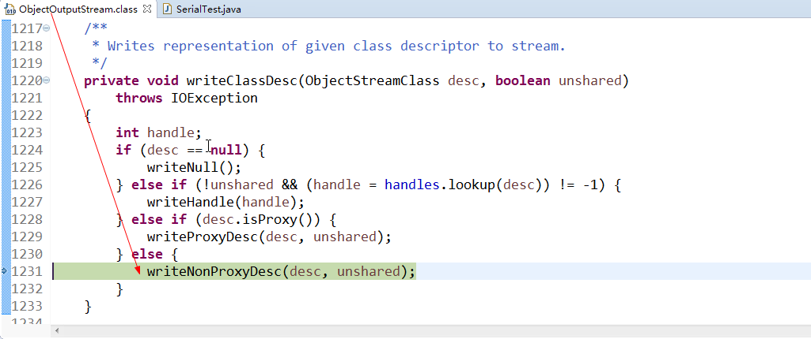

[TOC]
#  1.Java序列化与反序列化
 Java序列化是指把Java对象转换为字节序列的过程；
 而Java反序列化是指把字节序列恢复为Java对象的过程。
#  2.为什么需要序列化与反序列化
 我们知道，当两个进程进行远程通信时，可以相互发送各种类型的数据，包括文本、图片、音频、视频等， 而这些数据都会以二进制序列的形式在网络上传送。
 
 那么当两个Java进程进行通信时，能否实现进程间的对象传送呢？答案是可以的。
 
 如何做到呢？这就需要Java序列化与反序列化了。
 
* 一方面，发送方需要把这个Java对象转换为字节序列，然后在网络上传送；
 
*  另一方面，接收方需要从字节序列中恢复出Java对象。

当我们明晰了为什么需要Java序列化和反序列化后，我们很自然地会想Java序列化的好处。

* 好处一是实现了数据的持久化，通过序列化可以把数据永久地保存到硬盘上（通常存放在文件里），

* 二是，利用序列化实现远程通信，即在网络上传送对象的字节序列。

# 3. 序列化的版本一致性
serialVersionUID适用于Java的序列化机制。

Java的序列化机制是通过判断类的serialVersionUID来验证版本一致性的。

在进行反序列化时，JVM会把传来的字节流中的serialVersionUID与本地相应实体类的serialVersionUID进行比较，

如果相同就认为是一致的，可以进行反序列化，否则就会出现序列化版本不一致的异常，即是InvalidCastException。

**具体的序列化过程是这样的；**

* 序列化操作的时候系统会把当前类的serialVersionUID写入到序列化文件中。

* 当反序列化时系统会去检测文件中的serialVersionUID，判断它是否与当前类的serialVersionUID一致，

* 如果一致就说明序列化类的版本与当前类版本是一样的，可以反序列化成功，否则失败。

**serialVersionUID有两种显示的生成方式：**        

* 一是默认的1L，比如：private static final long serialVersionUID = 1L;        

* 二是根据类名、接口名、成员方法及属性等来生成一个64位的哈希字段，比如：        
`private static final  long   serialVersionUID = xxxxL;`


当实现java.io.Serializable接口的类没有显式地定义一个serialVersionUID变量时候，

Java序列化机制会根据编译的Class自动生成一个serialVersionUID作序列化版本比较用，

这种情况下，如果Class文件(类名，方法明等)没有发生变化(增加空格，换行，增加注释等等)，就算再编译多次，serialVersionUID也不会变化的。

# 4. 如何实现Java序列化与反序列化
## 1. JDK类库中序列化API
* ` java.io.ObjectOutputStream：` 表示对象输出流
它的`writeObject(Object obj)`方法可以对参数指定的obj对象进行序列化，把得到的字节序列写到一个目标输出流中。
* `java.io.ObjectInputStream：` 表示对象输入流
它的`readObject()`方法源输入流中读取字节序列，再把它们反序列化成为一个对象，并将其返回。

## 2. 实现Java对象序列化与反序列化的方法
### 示例一：
1. 需要序列化的实体类：
```java
package com.sf.code.serial;

import java.io.Serializable;


public class Person implements Serializable {
    private static final long serialVersionUID = 123456789L;
    public int id;
    public String name;

    public Person(int id, String name) {
        this.id = id;
        this.name = name;
    }

    public String toString() {
        return "Person: " + id + " " + name;
    }
}
```
2. 序列化
```java
package com.sf.code.serial;

import java.io.FileOutputStream;
import java.io.IOException;
import java.io.ObjectOutputStream;


public class SerialTest {
    public static void main(String[] args) throws IOException {
        Person person = new Person(1234, "wang");
        System.out.println("Person Serial" + person);

        FileOutputStream fos = new FileOutputStream("Person.txt");
        ObjectOutputStream oos = new ObjectOutputStream(fos);
        oos.writeObject(person);
        oos.flush();
        oos.close();
    }
}
```
3. 反序列化
**反序列化时，项目中也存在Person类，并且定义了serialVersionUID，会使用改ID和序列化后的Person.txt对比，如果不一致，会报异常。**
```java
package com.sf.code.serial;

import java.io.FileInputStream;
import java.io.IOException;
import java.io.ObjectInputStream;


public class DeserialTest {
    public static void main(String[] args)
        throws IOException, ClassNotFoundException {
        Person person;

        FileInputStream fis = new FileInputStream("Person.txt");
        ObjectInputStream ois = new ObjectInputStream(fis);
        person = (Person) ois.readObject();
        ois.close();
        System.out.println("Person Deserial" + person);
    }
}
```
* 情况一：假设Person类序列化之后，从A端传输到B端，然后在B端进行反序列化。在序列化Person和反序列化Person的时候，**A端和B端都需要存在一个相同的类**。如果两处的serialVersionUID**不一致**，会产生什么错误呢?
```log
Exception in thread "main" java.io.InvalidClassException: com.sf.code.serial.Person; local class incompatible: stream classdesc serialVersionUID = 1234567890, local class serialVersionUID = 123456789
at java.io.ObjectStreamClass.initNonProxy(ObjectStreamClass.java:621)
at java.io.ObjectInputStream.readNonProxyDesc(ObjectInputStream.java:1623)
at java.io.ObjectInputStream.readClassDesc(ObjectInputStream.java:1518)
at java.io.ObjectInputStream.readOrdinaryObject(ObjectInputStream.java:1774)
at java.io.ObjectInputStream.readObject0(ObjectInputStream.java:1351)
at java.io.ObjectInputStream.readObject(ObjectInputStream.java:371)
at com.sf.code.serial.DeserialTest.main(DeserialTest.java:13)
```
* 情况二：假设两处serialVersionUID一致，如果A端增加一个字段，然后序列化，而B端不变，然后反序列化，会是什么情况呢?
结果：A端增加的字段丢失(被B端忽略)。
* 情况三：假设两处serialVersionUID一致，如果B端减少一个字段，A端不变，会是什么情况呢?
 结果： B端字段少于A端，A端多的字段值丢失(被B端忽略)。
 * 情况四：假设两处serialVersionUID一致，如果B端增加一个字段，A端不变，会是什么情况呢?
 结果：B端新增加的int字段被赋予了默认值0。
### 示例二：
1. Gender类，是一个枚举类型，表示性别
```java
public enum Gender {  
    MALE, FEMALE  
} 
```
每个枚举类型都会默认继承类java.lang.Enum，而该类实现了Serializable接口，所以枚举类型对象都是默认可以被序列化的。
2. Person类，实现了Serializable接口
```java
public class Person implements Serializable {  
 
    private String name = null;  
 
    private Integer age = null;  
 
    private Gender gender = null;  
 
    public Person() {  
        System.out.println("none-arg constructor");  
    }  
 
    public Person(String name, Integer age, Gender gender) {  
        System.out.println("arg constructor");  
        this.name = name;  
        this.age = age;  
        this.gender = gender;  
    }  
 
    public String getName() {  
        return name;  
    }  
 
    public void setName(String name) {  
        this.name = name;  
    }  
 
    public Integer getAge() {  
        return age;  
    }  
 
    public void setAge(Integer age) {  
        this.age = age;  
    }  
 
    public Gender getGender() {  
        return gender;  
    }  
 
    public void setGender(Gender gender) {  
        this.gender = gender;  
    }  
 
    @Override 
    public String toString() {  
        return "[" + name + ", " + age + ", " + gender + "]";  
    }  
} 
```
3. SimpleSerial，是一个简单的序列化程序，它先将一个Person对象保存到文件person.out中，然后再从该文件中读出被存储的Person对象，并打印该对象。
```java
public class SimpleSerial {  
 
    public static void main(String[] args) throws Exception {  
        File file = new File("person.out");  
 
        ObjectOutputStream oout = new ObjectOutputStream(new FileOutputStream(file));  
        Person person = new Person("John", 101, Gender.MALE);  
        oout.writeObject(person);  
        oout.close();  
 
        ObjectInputStream oin = new ObjectInputStream(new FileInputStream(file));  
        Object newPerson = oin.readObject(); // 没有强制转换到Person类型  
        oin.close();  
        System.out.println(newPerson);  
    }  
} 
```
上述程序的输出的结果为：
```log
arg constructor  
[John, 31, MALE] 
```
此时必须注意的是，当重新读取被保存的Person对象时，并没有调用Person的任何构造器，看起来就像是直接使用字节将Person对象还原出来的。
当Person对象被保存到person.out文件中之后，我们可以在其它地方去读取该文件以还原对象，但必须确保该读取程序的**CLASSPATH中包含有Person.class**(哪怕在读取Person对象时并没有显示地使用Person类，如上例所示)，否则会抛出ClassNotFoundException。

## 3. 其他序列化问题
### 3.1 静态变量序列化
静态变量序列化问题代码
```java
public class Test implements Serializable {

    private static final long serialVersionUID = 1L;

    public static int staticVar = 5;

    public static void main(String[] args) {
        try {
            //初始时staticVar为5
            ObjectOutputStream out = new ObjectOutputStream(
                    new FileOutputStream("result.obj"));
            out.writeObject(new Test());
            out.close();

            //序列化后修改为10
            Test.staticVar = 10;

            ObjectInputStream oin = new ObjectInputStream(new FileInputStream(
                    "result.obj"));
            Test t = (Test) oin.readObject();
            oin.close();
            
            //再读取，通过t.staticVar打印新的值
            System.out.println(t.staticVar);
            
        } catch (FileNotFoundException e) {
            e.printStackTrace();
        } catch (IOException e) {
            e.printStackTrace();
        } catch (ClassNotFoundException e) {
            e.printStackTrace();
        }
    }
}
```
main 方法，将对象序列化后，修改静态变量的数值，再将序列化对象读取出来，然后通过读取出来的对象获得静态变量的数值并打印出来。依照清单 2，这个 System.out.println(t.staticVar) 语句输出的是 10 还是 5 呢？

最后的输出是 10，对于无法理解的读者认为，打印的 staticVar 是从读取的对象里获得的，应该是保存时的状态才对。

之所以打印 10 的原因在于**序列化时，并不保存静态变量**，这其实比较容易理解，**序列化保存的是对象的状态，静态变量属于类的状态**, 因此 序列化并不保存静态变量。

### 3.2 有些时候，通过改变序列化 ID 可以用来限制某些用户的使用
Façade 模式，它是为应用程序提供统一的访问接口，案例程序中的 Client 客户端使用了该模式，案例程序结构图如图 1 所示。

Client 端通过 Facade Object 才可以与业务逻辑对象进行交互。

而客户端的 Facade Object 不能直接由 Client 生成，而是需要 Server 端生成，然后序列化后通过网络将二进制对象数据传给 Client，

Client 负责反序列化得到 Facade 对象。该模式可以使得 Client 端程序的使用需要服务器端的许可，同时 Client 端和服务器端的 Facade Object 类需要保持一致。

当服务器端想要进行版本更新时，只要将服务器端的 Facade Object 类的序列化 ID 再次生成，当 Client 端反序列化 Facade Object 就会失败，也就是强制 Client 端从服务器端获取最新程序。

### 3.3 父类的序列化与 Transient 关键字
>情境：一个子类实现了 Serializable 接口，它的父类都没有实现 Serializable 接口，序列化该子类对象，然后反序列化后输出父类定义的某变量的数值，该变量数值与序列化时的数值不同。

解决：
要想将父类对象也序列化，就需要让父类也实现Serializable 接口。

如果父类不实现的话的，就 需要有默认的无参的构造函数。在父类没有实现 Serializable 接口时，虚拟机是不会序列化父对象的，

而一个 Java 对象的构造必须先有父对象，才有子对象，反序列化也不例外。所以反序列化时，为了构造父对象，只能调用父类的无参构造函数作为默认的父对象。

因此当我们取父对象的变量值时，它的值是调用父类无参构造函数后的值。

如果你考虑到这种序列化的情况，在父类无参构造函数中对变量进行初始化，否则的话，父类变量值都是默认声明的值，如 int 型的默认是 0，string 型的默认是 null。

**我们熟悉使用 Transient 关键字可以使得字段不被序列化，那么还有别的方法吗？**

根据父类对象序列化的规则，我们可以将不需要被序列化的字段抽取出来放到父类中，子类实现 Serializable 接口，父类不实现，根据父类序列化规则，父类的字段数据将不被序列化，形成类图如图 2 所示。

上图中可以看出，attr1、attr2、attr3、attr5 都不会被序列化，放在父类中的好处在于当有另外一个 Child 类时，attr1、attr2、attr3 依然不会被序列化，不用重复抒写 transient，代码简洁。

### 3.4 static final 修饰的serialVersionUID如何被写入到序列化文件中的

序列化时写入ObjectStreamClass.java中，



## 4. 实现序列化的原理
### 4.1 实现序列化的要求
只有实现了`Serializable`或`Externalizable`接口的类的对象才能被序列化，否则抛出异常。
### 4.2 为什么一个类实现了Serializable接口，它就可以被序列化呢？
使用ObjectOutputStream来持久化对象，在该类中有如下代码：
```java
private void writeObject0(Object obj, boolean unshared) throws IOException {  
      ...
    if (obj instanceof String) {  
        writeString((String) obj, unshared);  
    } else if (cl.isArray()) {  
        writeArray(obj, desc, unshared);  
    } else if (obj instanceof Enum) {  
        writeEnum((Enum) obj, desc, unshared);  
    } else if (obj instanceof Serializable) {  
        writeOrdinaryObject(obj, desc, unshared);  
    } else {  
        if (extendedDebugInfo) {  
            throw new NotSerializableException(cl.getName() + "\n" 
                    + debugInfoStack.toString());  
        } else {  
            throw new NotSerializableException(cl.getName());  
        }  
    }  
    ...  
} 
```
从上述代码可知，如果被写对象的类型是String，或数组，或Enum，或Serializable，那么就可以对该对象进行序列化，否则将抛出NotSerializableException。
### 4.3 默认序列化机制
如果仅仅只是让某个类实现Serializable接口，而没有其它任何处理的话，则就是使用默认序列化机制。

使用默认机制，在序列化对象时，不仅会序列化当前对象本身，还会对该对象引用的其它对象也进行序列化，同样地，这些其它对象引用的另外对象也将被序列化，以此类推。

所以，如果一个对象包含的成员变量是容器类对象，而这些容器所含有的元素也是容器类对象，那么这个序列化的过程就会较复杂，开销也较大。

### 4.4 影响序列化的方法
在现实应用中，有些时候不能使用默认序列化机制。比如，希望在序列化过程中忽略掉敏感数据，或者简化序列化过程。下面将介绍若干影响序列化的方法。
#### 1. transient关键字
```java
public class Person implements Serializable {  
    ...  
    transient private Integer age = null;  
    ...  
} 
```
则age字段不会被序列化。
#### 2. writeObject()方法与readObject()方法
对于上述已被声明为transitive的字段age，除了将transitive关键字去掉之外，是否还有其它方法能使它再次可被序列化？方法之一就是在Person类中添加两个方法：writeObject()与readObject()，如下所示：
```java
public class Person implements Serializable {  
    ...  
    transient private Integer age = null;  
    ...  
 
    private void writeObject(ObjectOutputStream out) throws IOException {  
        out.defaultWriteObject();  
        out.writeInt(age);  
    }  
 
    private void readObject(ObjectInputStream in) throws IOException, ClassNotFoundException {  
        in.defaultReadObject();  
        age = in.readInt();  
    }  
} 
```
在writeObject()方法中会先调用ObjectOutputStream中的defaultWriteObject()方法，

该方法会执行默认的序列化机制，此时会忽略掉age字段。然后再调用writeInt()方法显示地将age字段写入到ObjectOutputStream中。

readObject()的作用则是针对对象的读取，其原理与writeObject()方法相同。此时age会被再次序列化。

必须注意地是，writeObject()与readObject()都是private方法，那么它们是如何被调用的呢？**毫无疑问，是使用反射。**

#### 3. Externalizable接口
无论是使用transient关键字，还是使用writeObject()和readObject()方法，其实都是基于Serializable接口的序列化。JDK中提供了另一个序列化接口--Externalizable，

使用该接口之后，之前基于Serializable接口的序列化机制就将失效。此时将Person类作如下修改：
```java
public class Person implements Externalizable {  
 
    private String name = null;  
 
    transient private Integer age = null;  
 
    private Gender gender = null;  
 
    public Person() {  
        System.out.println("none-arg constructor");  
    }  
 
    public Person(String name, Integer age, Gender gender) {  
        System.out.println("arg constructor");  
        this.name = name;  
        this.age = age;  
        this.gender = gender;  
    }  
 
    private void writeObject(ObjectOutputStream out) throws IOException {  
        out.defaultWriteObject();  
        out.writeInt(age);  
    }  
 
    private void readObject(ObjectInputStream in) throws IOException, ClassNotFoundException {  
        in.defaultReadObject();  
        age = in.readInt();  
    }  
 
    @Override 
    public void writeExternal(ObjectOutput out) throws IOException {  
 
    }  
 
    @Override 
    public void readExternal(ObjectInput in) throws IOException, ClassNotFoundException {  
 
    }  
    ...  
} 


```
此时再执行SerialTest程序之后会得到如下结果:
```log
arg constructor  
none-arg constructor  
[null, null, null] 
```
从该结果，一方面，可以看出Person对象中任何一个字段都没有被序列化。另一方面，如果细心的话，还可以发现这此次序列化过程调用了Person类的无参构造器。

`Externalizable`继承于`Serializable`，当使用该接口时，序列化的细节需要由程序员去完成。如上所示的代码，由于writeExternal()与readExternal()方法未作任何处理，那么该序列化行为将不会保存/读取任何一个字段。这也就是为什么输出结果中所有字段的值均为空。


另外，使用Externalizable进行序列化时，当读取对象时，会调用**被序列化类的无参构造器**去创建一个新的对象，然后再将被保存对象的字段的值分别填充到新对象中。这就是为什么在此次序列化过程中Person类的无参构造器会被调用。

由于这个原因，实现Externalizable接口的类必须要提供一个无参的构造器，且它的**访问权限为public**。

对上述Person类进行进一步的修改，使其能够对name与age字段进行序列化，但忽略掉gender字段，如下代码所示：
```java
public class Person implements Externalizable {  
 
    private String name = null;  
 
    transient private Integer age = null;  
 
    private Gender gender = null;  
 
    public Person() {  
        System.out.println("none-arg constructor");  
    }  
 
    public Person(String name, Integer age, Gender gender) {  
        System.out.println("arg constructor");  
        this.name = name;  
        this.age = age;  
        this.gender = gender;  
    }  
 
    private void writeObject(ObjectOutputStream out) throws IOException {  
        out.defaultWriteObject();  
        out.writeInt(age);  
    }  
 
    private void readObject(ObjectInputStream in) throws IOException, ClassNotFoundException {  
        in.defaultReadObject();  
        age = in.readInt();  
    }  
 
    @Override 
    public void writeExternal(ObjectOutput out) throws IOException {  
        out.writeObject(name);  
        out.writeInt(age);  
    }  
 
    @Override 
    public void readExternal(ObjectInput in) throws IOException, ClassNotFoundException {  
        name = (String) in.readObject();  
        age = in.readInt();  
    }  
    ...  
} 

```

执行SimpleSerial之后会有如下结果：
```log
arg constructor  
none-arg constructor  
[John, 31, null] 
```
#### 4. readResolve()方法

当我们使用Singleton模式时，应该是期望某个类的实例应该是唯一的，但如果该类是可序列化的，那么情况可能略有不同。此时对第2节使用的Person类进行修改，使其实现Singleton模式，如下所示：
```java
public class Person implements Serializable {  
 
    private static class InstanceHolder {  
        private static final Person instatnce = new Person("John", 31, Gender.MALE);  
    }  
 
    public static Person getInstance() {  
        return InstanceHolder.instatnce;  
    }  
 
    private String name = null;  
 
    private Integer age = null;  
 
    private Gender gender = null;  
 
    private Person() {  
        System.out.println("none-arg constructor");  
    }  
 
    private Person(String name, Integer age, Gender gender) {  
        System.out.println("arg constructor");  
        this.name = name;  
        this.age = age;  
        this.gender = gender;  
    }  
    ...  
} 
```
同时要修改SimpleSerial应用，使得能够保存/获取上述单例对象，并进行对象相等性比较，如下代码所示：
```java
public class SimpleSerial {  
 
    public static void main(String[] args) throws Exception {  
        File file = new File("person.out");  
        ObjectOutputStream oout = new ObjectOutputStream(new FileOutputStream(file));  
        oout.writeObject(Person.getInstance()); // 保存单例对象  
        oout.close();  
 
        ObjectInputStream oin = new ObjectInputStream(new FileInputStream(file));  
        Object newPerson = oin.readObject();  
        oin.close();  
        System.out.println(newPerson);  
 
        System.out.println(Person.getInstance() == newPerson); // 将获取的对象与Person类中的单例对象进行相等性比较  
    }  
} 
```
执行上述应用程序后会得到如下结果：
```log
arg constructor  
[John, 31, MALE]  
false 
```
值得注意的是，从文件person.out中获取的Person对象与Person类中的单例对象并不相等。为了能在序列化过程仍能保持单例的特性，可以在Person类中添加一个`readResolve()`方法，在该方法中直接返回Person的单例对象，如下所示：

```java
public class Person implements Serializable {  
 
    private static class InstanceHolder {  
        private static final Person instatnce = new Person("John", 31, Gender.MALE);  
    }  
 
    public static Person getInstance() {  
        return InstanceHolder.instatnce;  
    }  
 
    private String name = null;  
 
    private Integer age = null;  
 
    private Gender gender = null;  
 
    private Person() {  
        System.out.println("none-arg constructor");  
    }  
 
    private Person(String name, Integer age, Gender gender) {  
        System.out.println("arg constructor");  
        this.name = name;  
        this.age = age;  
        this.gender = gender;  
    }  
 
    private Object readResolve() throws ObjectStreamException {  
        return InstanceHolder.instatnce;  
    }  
    ...  
} 
```
再次执行本节的SimpleSerial应用后将如下输出：
```log
arg constructor  
[John, 31, MALE]  
true 
```
无论是实现Serializable接口，或是Externalizable接口，当从I/O流中读取对象时，readResolve()方法都会被调用到。**实际上就是用readResolve()中返回的对象直接替换在反序列化过程中创建的对象。**


