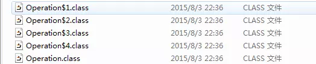

[TOC]
### 一、什么情况下使用枚举类？

有的时候一个类的对象是有限且固定的，这种情况下我们使用枚举类就比较方便


### 二、为什么不用静态常量来替代枚举类呢？
```java
    public static final int SEASON_SPRING = 1;
    public static final int SEASON_SUMMER = 2;
    public static final int SEASON_FALL = 3;
    public static final int SEASON_WINTER = 4;
```

枚举类更加直观，类型安全。使用常量会有以下几个缺陷：　　
1. 类型不安全。若一个方法中要求传入季节这个参数，用常量的话，形参就是int类型，开发者传入任意类型的int类型值就行，但是如果是枚举类型的话，就只能传入枚举类中包含的对象。　　
2. 没有命名空间。开发者要在命名的时候以SEASON_开头，这样另外一个开发者再看这段代码的时候，才知道这四个常量分别代表季节。


### 三、枚举类入门


#### 用法一:常量

在JDK1.5 之前，我们定义常量都是： public static fianl....(这种方式在现在项目中也很常见) 。现在好了，有了枚举，可以把相关的常量分组到一个枚举类型里，而且枚举提供了比常量更多的方法。而且枚举类型可以帮助我们检测许多的编译失误。

```java

package enumTest;

public enum Color {
    RED,BLANK,YELLOW
}
```

测试代码:
```java

package enumTest;

public class Test {
    public static void main(String[] args) {
        String string = Color.BLANK.toString();
        System.out.println(string);
        System.out.println(Color.BLANK);
    }
}
```
#### 用法二：switch

JDK1.6之前的switch语句只支持int,char,enum类型，使用枚举，能让我们的代码可读性更强。 

```java

public static void main(String[] args) {
        Color color = Color.RED;
        switch (color) {
        case BLANK:
            System.out.println("黑色");
            break;
        case RED:
            System.out.println("红色");
            break;
        default:
            break;
        }
    }
```

### 用法三：向枚举中添加新方法

如果打算自定义自己的方法，那么**必须在enum实例序列的最后添加一个分号。而且 Java 要求必须先定义 enum 实例。 且枚举类型的构造方法必须为私有方法。**
**注意:枚举类型中可以有静态方法，也可以有其他方法。可以有属性与get，set方法。**
```java

package enumTest;

public enum MyDay {
    
    MONDAY(1,"星期一"),THUSDAY(2,"星期二");//这个后面必须有分号
    
    private int code;
    private String name;
    private MyDay(int code,String name) {
        this.code = code;
        this.name = name();
    }
    
    public int getCode() {
        return code;
    }
    public String getName() {
        return name;
    }
    public void setCode(int code) {
        this.code = code;
    }
    public void setName(String name) {
        this.name = name;
    }
    
}
```

测试方法：
```java

public static void main(String[] args) {
        System.out.println(MyDay.MONDAY.getCode());
        System.out.println(MyDay.MONDAY.getName());
        System.out.println(MyDay.THUSDAY.getCode());
        System.out.println(MyDay.THUSDAY.getName());
        System.out.println(MyDay.THUSDAY);
    }
```


#### 用法四：覆盖枚举的方法

例如:覆盖toString()方法

```java

package enumTest;

public enum MyDay {
    
    MONDAY(1,"星期一"),THUSDAY(2,"星期二");//这个后面必须有分号
    
    private int code;
    private String name;
    private MyDay(int code,String name) {
        this.code = code;
        this.name = name();
    }
    
    public int getCode() {
        return code;
    }
    public String getName() {
        return name;
    }
    public void setCode(int code) {
        this.code = code;
    }
    public void setName(String name) {
        this.name = name;
    }
    @Override
    public String toString() {
        // TODO Auto-generated method stub
        return this.getName()+"---"+this.getCode();
    }
}
```


测试:

```java

package enumTest;

public class Test {
    public static void main(String[] args) {
        System.out.println(MyDay.MONDAY.getCode());
        System.out.println(MyDay.MONDAY.getName());
        System.out.println(MyDay.THUSDAY.getCode());
        System.out.println(MyDay.THUSDAY.getName());
        System.out.println(MyDay.THUSDAY);
    }
}
```
#### 用法五：实现接口


所有的**枚举都继承自java.lang.Enum类**。由于Java 不支持多继承，所以枚举对象不能再继承其他类。

```java

package enumTest;

public interface DayInterface {

    public String getDay();
}
```

```java

package enumTest;

public enum MyDay implements DayInterface{
    
    MONDAY(1,"星期一"),THUSDAY(2,"星期二");//这个后面必须有分号
    
    private int code;
    private String name;
    private MyDay(int code,String name) {
        this.code = code;
        this.name = name();
    }
    
    public int getCode() {
        return code;
    }
    public String getName() {
        return name;
    }
    public void setCode(int code) {
        this.code = code;
    }
    public void setName(String name) {
        this.name = name;
    }
    @Override
    public String toString() {
        // TODO Auto-generated method stub
        return this.getName()+"---"+this.getCode();
    }

    @Override
    public String getDay() {
        return this.getName();
    }
}
```
测试：

```java

package enumTest;

public class Test {
    public static void main(String[] args) {
        System.out.println(MyDay.THUSDAY.getDay());
    }
}
```

#### 用法六：使用接口组织枚举

```java

package enumTest;

public interface Food {  
    enum Coffee implements Food{  
        BLACK_COFFEE,DECAF_COFFEE,LATTE,CAPPUCCINO  
    }  
    enum Dessert implements Food{  
        FRUIT, CAKE, GELATO  
    }  
}  
```
测试类：

```java

package enumTest;

import enumTest.Food.Coffee;
import enumTest.Food.Dessert;

public class Test {
        
    public  static void main(String[] args) {  
        for (Dessert dessertEnum : Food.Dessert.values()) {  
            System.out.print(dessertEnum + "  ");  
        }  
        System.out.println();  
        //我这地方这么写，是因为我在自己测试的时候，把这个coffee单独到一个文件去实现那个food接口，而不是在那个接口的内部。  
        for (Coffee coffee : Food.Coffee.values()) {  
            System.out.print(coffee + "  ");  
        }  
        System.out.println();  
        //搞个实现接口，来组织枚举，简单讲，就是分类吧。如果大量使用枚举的话，这么干，在写代码的时候，就很方便调用啦。  
        //还有就是个“多态”的功能吧，  
        Food food = Food.Dessert.CAKE;  
        System.out.println(food);  
        food = Coffee.BLACK_COFFEE;  
        System.out.println(food);  
    } 
}
```


结果:
FRUIT CAKE GELATO 
BLACK_COFFEE DECAF_COFFEE LATTE CAPPUCCINO 
CAKE
BLACK_COFFEE


#### 用法七：关于枚举集合的使用

java.util.EnumSet和java.util.EnumMap是两个枚举集合。EnumSet保证集合中的元素不重复；EnumMap中的 key是enum类型，而value则可以是任意类型。

##### 1. EnumSet的简单用法　　
 enumSet继承AbstractSet，AbstractSet实现了set接口。
 ```java

public abstract class EnumSet<E extends Enum<E>> extends AbstractSet<E>
    implements Cloneable, java.io.Serializable
{
。。。
}

public abstract class AbstractSet<E> extends AbstractCollection<E> implements Set<E> {
。。。
}
```


测试代码:
```java

package enumTest;

import java.util.EnumSet;
import java.util.Iterator;

public class Test {
    public static void main(String[] args) {
        // 创建一个EnumSet集合，其内部的值就是MyDay枚举类的实例
        EnumSet<MyDay> enumSet = EnumSet.allOf(MyDay.class);
        System.out.println(enumSet);
        Iterator<MyDay> iterator = enumSet.iterator();
        while (iterator.hasNext()) {
            System.out.println(iterator.next());
        }

        // 创建一个空的EnumSet集合
        System.out.println("====================");
        EnumSet<MyDay> enumSet2 = EnumSet.noneOf(MyDay.class);
        System.out.println(enumSet2);
        enumSet2.add(MyDay.MONDAY);
        System.out.println(enumSet2);

        // 创建一个带有指定值的EnumSet
        System.out.println("====================");
        EnumSet<MyDay> enumSet3 = EnumSet.of(MyDay.MONDAY);
        enumSet2.add(MyDay.MONDAY);// 由于不可重复所以不会重复两个元素                      
        System.out.println(enumSet3);
    }
}
```


结果:

[MONDAY---1, THUSDAY---2]
MONDAY---1
THUSDAY---2

* * *
[]
[MONDAY---1]

* * *

[MONDAY---1]


##### 2. EnumMap的简单用法


EnumMap继承AbstractMap，AbstractMap继承实现map接口。而且EnumMap中的中key必须为枚举类型，而且不能为null
```java

public class EnumMap<K extends Enum<K>, V> extends AbstractMap<K, V>
    implements java.io.Serializable, Cloneable
。。。
}

public abstract class AbstractMap<K,V> implements Map<K,V> {
  。。。  
}
```

测试代码：
```java

package enumTest;

import java.util.EnumSet;
import java.util.Iterator;

public class Test {
    public static void main(String[] args) {
        // 创建一个EnumSet集合，其内部的值就是MyDay枚举类的实例
        EnumSet<MyDay> enumSet = EnumSet.allOf(MyDay.class);
        System.out.println(enumSet);
        Iterator<MyDay> iterator = enumSet.iterator();
        while (iterator.hasNext()) {
            System.out.println(iterator.next());
        }

        // 创建一个空的EnumSet集合
        System.out.println("====================");
        EnumSet<MyDay> enumSet2 = EnumSet.noneOf(MyDay.class);
        System.out.println(enumSet2);
        enumSet2.add(MyDay.MONDAY);
        System.out.println(enumSet2);

        // 创建一个带有指定值的EnumSet
        System.out.println("====================");
        EnumSet<MyDay> enumSet3 = EnumSet.of(MyDay.MONDAY);
        enumSet2.add(MyDay.MONDAY);// 由于不可重复所以不会重复两个元素        
        System.out.println(enumSet3);
    }
}
```

结果:
[MONDAY---1, THUSDAY---2]
MONDAY---1
THUSDAY---2
* * *
[]
[MONDAY---1]
***
[MONDAY---1]
#### 用法七：枚举与抽象方法

```java

public enum Operation {

    PLUS {
        @Override
        double operate(double num1, double num2) {
            return num1 + num2;
        }
    },
    MINUS {
        @Override
        double operate(double num1, double num2) {
            return num1 - num2;
        }
    },
    TIMES {
        @Override
        double operate(double num1, double num2) {
            return num1 * num2;
        }
    },
    DIVIDE {
        @Override
        double operate(double num1, double num2) {
            return num1 / num2;
        }
    };

    
/**
 * 抽象方法，由不同的枚举值提供不同的实现。
 * @param x
 * @param y
 * @return
 */
 public abstract double eval(double x, double y);

public static void main(String[] args) {
    System.out.println(Operation.PLUS.eval(10, 2));
    System.out.println(Operation.MINUS.eval(10, 2));
    System.out.println(Operation.TIMES.eval(10, 2));
    System.out.println(Operation.DIVIDE.eval(10, 2));
}

}
```

Operatio类实际上是抽象的，不可以创建枚举值，所以此处在申明枚举值的时候，都实现了抽象方法，这其实是匿名内部类的实现，花括号部分是一个类体。我们可以看下编译以后的文件。




共生成了五个class文件，这样就证明了PLUS,MINUS,TIMES,DIVIDE是Operation的匿名内部类的实例。

原理：
```java
RED(30) {
    @Override
    public TrafficLamp getNextLamp() {
        return GREEN;
    }
}
```
为什么会有这么神奇的代码？现在你差不多懂了。因为RED本身就是一个TrafficLamp对象的引用。实际上，在初始化这个枚举类的时候，你可以理解为执行的是TrafficLamp RED = new TrafficLamp（30） ，但是因为TrafficLamp里面有抽象方法，还记得匿名内部类么？

我们可以这样来创建一个TrafficLamp引用：
```java
TrafficLamp RED = new TrafficLamp（30）{
    @Override
    public TrafficLamp getNextLamp() {
        return GREEN;
    }
};
```

而在枚举类中，我们只需要像上面那样写【RED(30){}】就可以了，因为java会自动的去帮我们完成这一系列操作。

#### 补充:

##### 1.枚举类型对象之间的值比较，是可以使用==，直接来比较值，是否相等的，不是必须使用equals方法的哟。
```java

public  static void main(String[] args) {  
        System.out.println(MyDay.MONDAY == MyDay.MONDAY);
        System.out.println(MyDay.MONDAY == MyDay.MONDAY);
    }
```

结果:
true
true


##### 2.我们大概了解了枚举类型的定义与简单使用后，现在有必要来了解一下枚举类型的基本实现原理。


实际上在使用关键字enum创建枚举类型并编译后，编译器会为我们生成一个相关的类，这个类继承了Java API中的java.lang.Enum类，也就是说通过关键字enum创建枚举类型在编译后事实上也是一个类类型而且该类继承自java.lang.Enum类。

```java

//反编译Day.class
final class Day extends Enum
{
    //编译器为我们添加的静态的values()方法
    public static Day[] values()
    {
        return (Day[])$VALUES.clone();
    }
    //编译器为我们添加的静态的valueOf()方法，注意间接调用了Enum类的valueOf方法
    public static Day valueOf(String s)
    {
        return (Day)Enum.valueOf(com/zejian/enumdemo/Day, s);
    }
    //私有构造函数
    private Day(String s, int i)
    {
        super(s, i);
    }
     //前面定义的7种枚举实例
    public static final Day MONDAY;
    public static final Day TUESDAY;
    public static final Day WEDNESDAY;
    public static final Day THURSDAY;
    public static final Day FRIDAY;
    public static final Day SATURDAY;
    public static final Day SUNDAY;
    private static final Day $VALUES[];

    static 
    {    
        //实例化枚举实例
        MONDAY = new Day("MONDAY", 0);
        TUESDAY = new Day("TUESDAY", 1);
        WEDNESDAY = new Day("WEDNESDAY", 2);
        THURSDAY = new Day("THURSDAY", 3);
        FRIDAY = new Day("FRIDAY", 4);
        SATURDAY = new Day("SATURDAY", 5);
        SUNDAY = new Day("SUNDAY", 6);
        $VALUES = (new Day[] {
            MONDAY, TUESDAY, WEDNESDAY, THURSDAY, FRIDAY, SATURDAY, SUNDAY
        });
    }
}
```

从反编译的代码可以看出编译器确实帮助我们生成了一个Day类(注意该类是final类型的，将无法被继承)而且该类继承自java.lang.Enum类，该类是一个抽象类(稍后我们会分析该类中的主要方法)，除此之外，编译器还帮助我们生成了7个Day类型的实例对象分别对应枚举中定义的7个日期，这也充分说明了我们前面使用关键字enum定义的Day类型中的每种日期枚举常量也是实实在在的Day实例对象，只不过代表的内容不一样而已。注意编译器还为我们生成了两个静态方法，分别是values()和 valueOf()，稍后会分析它们的用法，到此我们也就明白了，使用关键字enum定义的枚举类型，在编译期后，也将转换成为一个实实在在的类，而在该类中，会存在每个在枚举类型中定义好变量的对应实例对象，如上述的MONDAY枚举类型对应public static final Day MONDAY;，同时编译器会为该类创建两个方法，分别是values()和valueOf()。ok~，到此相信我们对枚举的实现原理也比较清晰，下面我们深入了解一下java.lang.Enum类以及values()和valueOf()的用途。

##### 3.Enum抽象类常见方法

| 返回类型 |方法名称  | 方法说明 |
| --- | --- | --- |
|int |compareTo(E o)	|比较此枚举与指定对象的顺序|
|boolean	|equals(Object other)	|当指定对象等于此枚举常量时，返回 true。|
|Class<?>	|getDeclaringClass()	|返回与此枚举常量的枚举类型相对应的 Class 对象|
|String	|name()	|返回此枚举常量的名称，在其枚举声明中对其进行声明|
|int	|ordinal()	|返回枚举常量的序数（它在枚举声明中的位置，其中初始常量序数为零）|
|String	|toString()	|返回枚举常量的名称，它包含在声明中|
|static<T extends Enum<T>> T	|static valueOf(Class<T> enumType, String name)	|返回带指定名称的指定枚举类型的枚举常量。|


这里主要说明一下ordinal()方法，该方法获取的是枚举变量在枚举类中声明的顺序，下标从0开始，如日期中的MONDAY在第一个位置，那么MONDAY的ordinal值就是0，如果MONDAY的声明位置发生变化，那么ordinal方法获取到的值也随之变化，注意在大多数情况下我们都不应该首先使用该方法，毕竟它总是变幻莫测的。compareTo(E o)方法则是比较枚举的大小，注意其内部实现是根据每个枚举的ordinal值大小进行比较的。name()方法与toString()几乎是等同的，都是输出变量的字符串形式。至于valueOf(Class<T> enumType, String name)方法则是根据枚举类的Class对象和枚举名称获取枚举常量，注意该方法是静态的，后面在枚举单例时，我们还会详细分析该方法，下面的代码演示了上述方法：
```java
package com.zejian.enumdemo;

/**
 * Created by zejian on 2017/5/7.
 * Blog : http://blog.csdn.net/javazejian [原文地址,请尊重原创]
 */
public class EnumDemo {

    public static void main(String[] args){

        //创建枚举数组
        Day[] days=new Day[]{Day.MONDAY, Day.TUESDAY, Day.WEDNESDAY,
                Day.THURSDAY, Day.FRIDAY, Day.SATURDAY, Day.SUNDAY};

        for (int i = 0; i <days.length ; i++) {
            System.out.println("day["+i+"].ordinal():"+days[i].ordinal());
        }

        System.out.println("-------------------------------------");
        //通过compareTo方法比较,实际上其内部是通过ordinal()值比较的
        System.out.println("days[0].compareTo(days[1]):"+days[0].compareTo(days[1]));
        System.out.println("days[0].compareTo(days[1]):"+days[0].compareTo(days[2]));

        //获取该枚举对象的Class对象引用,当然也可以通过getClass方法
        Class<?> clazz = days[0].getDeclaringClass();
        System.out.println("clazz:"+clazz);

        System.out.println("-------------------------------------");

        //name()
        System.out.println("days[0].name():"+days[0].name());
        System.out.println("days[1].name():"+days[1].name());
        System.out.println("days[2].name():"+days[2].name());
        System.out.println("days[3].name():"+days[3].name());

        System.out.println("-------------------------------------");

        System.out.println("days[0].toString():"+days[0].toString());
        System.out.println("days[1].toString():"+days[1].toString());
        System.out.println("days[2].toString():"+days[2].toString());
        System.out.println("days[3].toString():"+days[3].toString());

        System.out.println("-------------------------------------");

        Day d=Enum.valueOf(Day.class,days[0].name());
        Day d2=Day.valueOf(Day.class,days[0].name());
        System.out.println("d:"+d);
        System.out.println("d2:"+d2);
    }
 /**
 执行结果:
   day[0].ordinal():0
   day[1].ordinal():1
   day[2].ordinal():2
   day[3].ordinal():3
   day[4].ordinal():4
   day[5].ordinal():5
   day[6].ordinal():6
   -------------------------------------
   days[0].compareTo(days[1]):-1
   days[0].compareTo(days[1]):-2
   clazz:class com.zejian.enumdemo.Day
   -------------------------------------
   days[0].name():MONDAY
   days[1].name():TUESDAY
   days[2].name():WEDNESDAY
   days[3].name():THURSDAY
   -------------------------------------
   days[0].toString():MONDAY
   days[1].toString():TUESDAY
   days[2].toString():WEDNESDAY
   days[3].toString():THURSDAY
   -------------------------------------
   d:MONDAY
   d2:MONDAY
   */

}
enum Day {
    MONDAY, TUESDAY, WEDNESDAY,
    THURSDAY, FRIDAY, SATURDAY, SUNDAY
}
```


到此对于抽象类Enum类的基本内容就介绍完了，这里提醒大家一点，Enum类内部会有一个构造函数，该构造函数只能有编译器调用，我们是无法手动操作的，不妨看看Enum类的主要源码：
```java
//实现了Comparable
public abstract class Enum<E extends Enum<E>>
        implements Comparable<E>, Serializable {

    private final String name; //枚举字符串名称

    public final String name() {
        return name;
    }

    private final int ordinal;//枚举顺序值

    public final int ordinal() {
        return ordinal;
    }

    //枚举的构造方法，只能由编译器调用
    protected Enum(String name, int ordinal) {
        this.name = name;
        this.ordinal = ordinal;
    }

    public String toString() {
        return name;
    }

    public final boolean equals(Object other) {
        return this==other;
    }

    //比较的是ordinal值
    public final int compareTo(E o) {
        Enum<?> other = (Enum<?>)o;
        Enum<E> self = this;
        if (self.getClass() != other.getClass() && // optimization
            self.getDeclaringClass() != other.getDeclaringClass())
            throw new ClassCastException();
        return self.ordinal - other.ordinal;//根据ordinal值比较大小
    }

    @SuppressWarnings("unchecked")
    public final Class<E> getDeclaringClass() {
        //获取class对象引用，getClass()是Object的方法
        Class<?> clazz = getClass();
        //获取父类Class对象引用
        Class<?> zuper = clazz.getSuperclass();
        return (zuper == Enum.class) ? (Class<E>)clazz : (Class<E>)zuper;
    }


    public static <T extends Enum<T>> T valueOf(Class<T> enumType,
                                                String name) {
        //enumType.enumConstantDirectory()获取到的是一个map集合，key值就是name值，value则是枚举变量值   
        //enumConstantDirectory是class对象内部的方法，根据class对象获取一个map集合的值       
        T result = enumType.enumConstantDirectory().get(name);
        if (result != null)
            return result;
        if (name == null)
            throw new NullPointerException("Name is null");
        throw new IllegalArgumentException(
            "No enum constant " + enumType.getCanonicalName() + "." + name);
    }

    //.....省略其他没用的方法
}
```

通过Enum源码，可以知道，Enum实现了Comparable接口，这也是可以使用compareTo比较的原因，当然Enum构造函数也是存在的，该函数只能由编译器调用，毕竟我们只能使用enum关键字定义枚举，其他事情就放心交给编译器吧。

```java
//由编译器调用
protected Enum(String name, int ordinal) {
        this.name = name;
        this.ordinal = ordinal;
    }
```


#### 4.编译器生成的Values方法与ValueOf方法

values()方法和valueOf(String name)方法是编译器生成的static方法，因此从前面的分析中，在Enum类中并没出现values()方法，但valueOf()方法还是有出现的，只不过编译器生成的valueOf()方法需传递一个name参数，而Enum自带的静态方法valueOf(Class<T> enumType,String name)则需要传递两个参数，从前面反编译后的代码可以看出，编译器生成的valueOf方法最终还是调用了Enum类的valueOf方法，下面通过代码来演示这两个方法的作用：
```java
 //编译器为我们添加的静态的values()方法
    public static Day[] values()
    {
        return (Day[])$VALUES.clone();
    }
    //编译器为我们添加的静态的valueOf()方法，注意间接调用了Enum类的valueOf方法
    public static Day valueOf(String s)
    {
        return (Day)Enum.valueOf(com/zejian/enumdemo/Day, s);
    }
```
```java
Day[] days2 = Day.values();
System.out.println("day2:"+Arrays.toString(days2));
Day day = Day.valueOf("MONDAY");
System.out.println("day:"+day);

/**
 输出结果:
 day2:[MONDAY, TUESDAY, WEDNESDAY, THURSDAY, FRIDAY, SATURDAY, SUNDAY]
 day:MONDAY
 */
```

从结果可知道，values()方法的作用就是获取枚举类中的所有变量，并作为数组返回，而valueOf(String name)方法与Enum类中的valueOf方法的作用类似,根据名称获取枚举变量，只不过编译器生成的valueOf方法更简洁些只需传递一个参数。这里我们还必须注意到，由于values()方法是由编译器插入到枚举类中的static方法，所以如果我们将枚举实例向上转型为Enum，那么values()方法将无法被调用，因为Enum类中并没有values()方法，valueOf()方法也是同样的道理，注意是一个参数的。
```java
 //正常使用 
 Day[] ds=Day.values(); 
 //向上转型
 Enum Enum e = Day.MONDAY;
 //无法调用,没有此方法 
 //e.values();
```

#### 5 枚举与Class对象
上述我们提到当枚举实例向上转型为Enum类型后，values()方法将会失效，也就无法一次性获取所有枚举实例变量，但是由于Class对象的存在，即使不使用values()方法，还是有可能一次获取到所有枚举实例变量的，在Class对象中存在如下方法：

| 返回类型 |方法名称  | 方法说明 |
| --- | --- | --- |
| T[] |getEnumConstants()  |返回该枚举类型的所有元素，如果Class对象不是枚举类型，则返回null。  |
|boolean|isEnum()|当且仅当该类声明为源代码中的枚举时返回 true|


因此通过getEnumConstants()方法，同样可以轻而易举地获取所有枚举实例变量下面通过代码来演示这个功能：
```java
//正常使用
Day[] ds=Day.values();
//向上转型Enum
Enum e = Day.MONDAY;
//无法调用,没有此方法
//e.values();
//获取class对象引用
Class<?> clasz = e.getDeclaringClass();
if(clasz.isEnum()) {
    Day[] dsz = (Day[]) clasz.getEnumConstants();
    System.out.println("dsz:"+Arrays.toString(dsz));
}

/**
   输出结果:
   dsz:[MONDAY, TUESDAY, WEDNESDAY, THURSDAY, FRIDAY, SATURDAY, SUNDAY]
 */
```

正如上述代码所展示，通过Enum的class对象的getEnumConstants方法，我们仍能一次性获取所有的枚举实例常量。