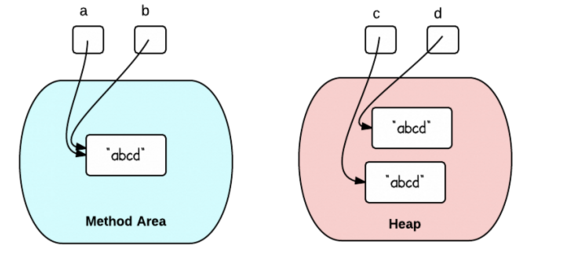
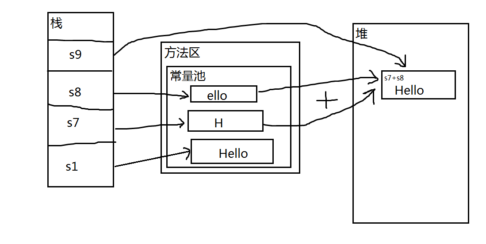
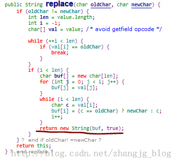

[TOC]
# 一. 字符串的创建
在Java中，有两种方式可以创建字符串：
```java
String x = "abc";
String y = new String("abc");
```
使用双引号和构造函数之间到底有什么区别呢？
## 1. 双引号
实例一：
```java
String a = "abcd";
String b = "abcd";
System.out.println("a == b : "+(a == b)); // true
System.out.println("a.equals(b) : "+(a.equals(b))); // true
```
`a== b等于true` 是因为x和y指向方法区中同一个字符串常量，他们的引用是相同的（==比较的是引用）。
因为**字符串常量此时保存在常量池**中。

### 这种创建方式到底有没有在堆中创建对象（JDK7即以上）？
当主线程开始创建a时，虚拟机会先去字符串池中找是否有equals(“abcd”)的String，

* 如果相等就把在字符串常量池中“abcd”的引用复制给a；

* 如果找不到相等的字符串，就会在堆中新建一个对象，同时**把引用驻留在字符串常量池，再把引用赋给a**。

这种方式，创建了一个对象，但无论创建多少次，只要字符串的值相同，它们所指向的都是堆中的同一个对象。

## 2. 构造函数

实例二：
```java
String c = new String("abcd");
String d = new String("abcd");
System.out.println("c == d : "+(c == d)); // false
System.out.println("c.equals(d) : "+(c.equals(d))); // true
```
c== d等于false 是因为c和d指向**堆中**不同的对象。不同的对象拥有不同的内存引用。


这种情况一共创建了三个对象，
* 第一个new String("abcd"):创建了两个对象，"abcd"创建于常量池中，String对象创建于堆内存中。

* 第二个new String("abcd"):由于常量池中有"abcd"对象，所以只需创建一个对象，String对象创建于堆内存中。

与intern()函数的区别是：

* 使用new创建时，返回的是堆中的对象。

* 使用intern()创建时，返回的是常量池中的对象。

**因此，如果你只需要创建一个字符串，你可以使用双引号的方式，如果你需要在堆中创建一个新的对象，你可以选择构造函数的方式。**

## 3. 延伸：
### 使用valueOf创建字符串时，创建了几个对象
它的源码是：
```java
public static String valueOf(Object obj) {
    return (obj == null) ? "null" : obj.toString();
}
```
也即是调用对象的toString方法，这个针对不同对象有不同的实现．并不一致．
#### 1. Object的toString方法
```java
public String toString() {
    return getClass().getName() + "@" + Integer.toHexString(hashCode());
}
```
而Integer.toHexString(hashCode());最终会调用
```java
private static String toUnsignedString0(int val, int shift) {
    // assert shift > 0 && shift <=5 : "Illegal shift value";
    int mag = Integer.SIZE - Integer.numberOfLeadingZeros(val);
    int chars = Math.max(((mag + (shift - 1)) / shift), 1);
    char[] buf = new char[chars];

    formatUnsignedInt(val, shift, buf, 0, chars);

    // Use special constructor which takes over "buf".
    return new String(buf, true);
}
```
所以还是调用了new方法创建对象.

### 使用+号创建字符串时，创建了几个对象
1. 
```java
String a = "9"+"8"+"3"+"7";
```
只创建了一个对象，在常量池中也只保存一个引用。
实际上在编译期间，已经将这三个字面量合成了一个。避免了创建多余的字符串对象，也没有发生字符串拼接问题。
2. 
 ```java
String a = "9"+"8"+"3"+new String("7")+4;
```
有一个new生成的子串，所以无法在编译器确定，那么jvm是如何做的呢，创建一个StringBuilder对象，然后挨个append每个子串，最后返回StringBuilder的toString方法，这其中生成的对象要看有几个子串，因为每次append的时候都是使用new String()生成的子串然后拼接的，当然了如果前面有字面量会提前编译．
上面的代码就相当于:
```java
StringBuilder sb = new StringBuilder("983");//两个对象
sb.append(new String("7"));//两个对象
sb.append(new String(String.valueOf(4)));//两个对象
return sb.toString();//一个对象
```
共七个对象。
# 二. intern()函数
String.intern()是一个Native方法，底层调用C++的 StringTable::intern方法实现。

当通过语句str.intern()调用intern()方法后，JVM 就会在当前类的常量池中查找是否存在与str等值的String，

* 若存在则直接返回常量池中相应Strnig的引用；

* 若不存在，则会在常量池中创建一个等值的String，然后返回这个String在常量池中的引用。

因此，只要是等值的String对象，使用intern()方法返回的都是常量池中同一个String引用，

所以，这些等值的String对象通过intern()后使用==是可以匹配的。


## 1. String.intern() in JDK7

 jdk7 版本对 intern 操作和常量池都做了一定的修改。主要包括2点：

* 将String常量池 从 Perm 区移动到了 Java Heap区

* String#intern 方法时，如果存在堆中的对象，会直接保存对象的引用，而不会重新创建对象

 
 堆区的大小一般不受限，所以将常量池从PremGen区移到堆区使得常量池的使用不再受限于固定大小。
 
 除此之外，位于堆区的常量池中的对象可以被垃圾回收。当常量池中的字符串不再存在指向它的引用时，JVM就会回收该字符串。可以使用 `-XX:StringTableSize `虚拟机参数设置字符串池的map大小。
 
**字符串池内部实现为一个HashMap**，所以当能够确定程序中需要intern的字符串数目时，可以将该map的size设置为所需数目\*2（减少hash冲突），这样就可以使得`String.intern()`每次都只需要常量时间和相当小的内存就能够将一个String存入字符串池中。

## 2. intern()适用场景
```java
public class Test2 {
    public static void main(String[] args) {
        /**
         * 首先设置 持久代最大和最小内存占用(限定为10M)
         * VM args: -XX:PermSize=10M -XX:MaxPremSize=10M
         */

        List<String> list  = new ArrayList<String>();

        // 无限循环 使用 list 对其引用保证 不被GC  intern 方法保证其加入到常量池中
        int i = 0;
        while (true) {
            // 此处永久执行，最多就是将整个 int 范围转化成字符串并放入常量池
            list.add(String.valueOf(i++).intern());
        }
    }
}
```
以上代码在 JDK6 下会出现 Perm 内存溢出，JDK7 or high 则没问题。


* Jdk6中常量池位于PermGen区，大小受限，设置了永久代的大小后，不管while循环必将撑满Perm导致内存溢出，所以不建议使用intern()方法，当需要字符串池时，需要自己使用HashMap实现。
  
* Jdk7、8中，常量池由PermGen区移到了堆区，还可以通过`-XX:StringTableSize`参数设置StringTable的大小，常量池的使用不再受限，即使设置了永久代大小，也不会对常量池产生影响；不断while循环在当前的代码中，所有int的字符串相加还不至于撑满 Heap 区，所以不会出现异常。由此可以重新考虑使用intern()方法。


intern(）方法优点：
* 执行速度非常快，直接使用==进行比较要比使用equals(）方法快很多；
* 内存占用少。
**故适用于字符串被大量复用的情况。**

虽然intern()方法的优点看上去很诱人，但若不是在恰当的场合中使用该方法的话，便非但不能获得如此好处，反而还可能会有性能损失。下面程序对比了使用intern()方法和未使用intern()方法存储100万个String时的性能，从输出结果可以看出，若是单纯使用intern()方法进行数据存储的话，程序运行时间要远高于未使用intern()方法时：
```java
public class InternTest {
    public static void main(String[] args) {
        print("noIntern: " + noIntern());
        print("intern: " + intern());
    }
 
    private static long noIntern(){
        long start = System.currentTimeMillis();
        for (int i = 0; i < 1000000; i++) {
            int j = i % 100;
            String str = String.valueOf(j);
        }
        return System.currentTimeMillis() - start;
    }
 
    private static long intern(){
        long start = System.currentTimeMillis();
        for (int i = 0; i < 1000000; i++) {
            int j = i % 100;
            String str = String.valueOf(j).intern();
        }
        return System.currentTimeMillis() - start;
    }
}
```

程序运行结果：
```log
noIntern: 48 // 未使用intern方法时，存储100万个String所需时间 
intern: 99 // 使用intern方法时，存储100万个String所需时间
```
由于intern()操作每次都需要与常量池中的数据进行比较以查看常量池中是否存在等值数据，同时JVM需要确保常量池中的数据的唯一性，这就涉及到加锁机制，这些操作都是有需要占用CPU时间的，

所以如果进行intern操作的是大量不会被重复利用的String的话，则有点得不偿失。

由此可见，String.intern()主要 适用于只有有限值，并且这些有限值会被重复利用的场景，如数据库表中的列名、人的姓氏、编码类型等。

# 三. 字符串比较实例（JDK7）：
## 实例一
```java
String s1 = "Hello";
String s2 = "Hello";
String s3 = "Hel" + "lo";
String s4 = "Hel" + new String("lo");
String s5 = new String("Hello");
String s6 = s5.intern();
String s7 = "H";
String s8 = "ello";
String s9 = s7 + s8;

System.out.println(s1 == s2);  // true,s1 首先在堆中创建一个对象‘Hello’，在常量池放入堆对象的引用，创建S2时，发现常量池中有指向‘Hello’的引用，则，直接将引用赋给S2，这时S1和S2均指向同一个堆中的对象。在JDK6中是都指向常量池中的“Hello”对象。
System.out.println(s1 == s3);  // true,做+号的时候，会进行优化，自动生成Hello赋值给s3，所以也是true
System.out.println(s1 == s4);  // false，s4是分别用了常量池中的字符串和存放对象的堆中的字符串，做+的时候会进行动态调用，最后生成的仍然是一个String对象存放在堆中。
System.out.println(s1 == s9);  // false
System.out.println(s4 == s5);  // false，两者都是在堆中的新对象
System.out.println(s1 == s6);  // true，使用了intern方法，这个方法首先在常量池中查找是否存在一份equal相等的字符串如果有的话就返回该字符串的引用，没有的话就将它加入到字符串常量池中
```
对于`s1 == s9`，虽然s7、s8在赋值的时候使用的字符串字面量，但是拼接成s9的时候，s7、s8作为两个变量，都是不可预料的，编译器毕竟是编译器，不可能当解释器用，不能在编译期被确定，所以不做优化，只能等到运行时，在堆中创建s7、s8拼接成的新字符串，在堆中地址不确定，不可能与方法区常量池中的s1地址相同。

## 实例二
```java
public static void main(String[] args) {
    String s = new String("1");
    s.intern();
    String s2 = "1";
    System.out.println(s == s2);
 
    String s3 = new String("1") + new String("1");
    s3.intern();
    String s4 = "11";
    System.out.println(s3 == s4);
}
```
结果：
```shell
jdk6 下false false
jdk7 下false true
```
### jdk6中的解释

**注：图中绿色线条代表 string 对象的内容指向。 黑色线条代表地址指向。**
在 jdk6中上述的所有打印都是 false 的，
因为 jdk6中的常量池是放在 Perm 区中的，Perm 区和正常的 JAVA Heap 区域是完全分开的。是一个类静态的区域，主要存储一些加载类的信息，常量池，方法片段等内容，默认大小只有4m，一旦常量池中大量使用 intern 是会直接产生java.lang.OutOfMemoryError: PermGen space错误的。 

上面说过如果是使用引号声明的字符串都是会直接在字符串常量池中生成，而 new 出来的 String 对象是放在 JAVA Heap 区域。

所以拿一个 JAVA Heap 区域的对象地址和字符串常量池的对象地址进行比较肯定是不相同的，即使调用String.intern方法也是没有任何关系的。
### JDK7以及JDK8中的解释（在JDK13中当字符串是1时，不成立，原因未知）


在 jdk7 的版本中，字符串常量池已经从 Perm 区移到正常的 Java Heap 区域了。

* 在第一段代码中，先看 s3和s4字符串。String s3 = new String("1") + new String("1");，这句代码中生成了2个对象，是字符串常量池中的“1” 和 JAVA Heap 中的 s3引用指向的对象。中间还有2个匿名的new String("1")我们不去讨论它们。此时s3引用对象内容是”11”，但此时常量池中是没有 “11”对象的。

* 接下来s3.intern();这一句代码，是将 s3中的“11”字符串放入 String 常量池中，因为此时常量池中不存在“11”字符串，因此常规做法是跟 jdk6 图中表示的那样，在常量池中生成一个 “11” 的对象，关键点是 jdk7 中常量池不在 Perm 区域了，这块做了调整。常量池中不需要再存储一份对象了，可以直接存储堆中的引用。这份引用指向 s3 引用的对象。 **也就是说引用地址是相同的。**

* 最后String s4 = "11"; 这句代码中”11”是显式声明的，因此会直接去常量池中看有没有指向'11'的引用，**创建的时候发现已经有这个对象了**，此时也就是指向 s3 引用对象的一个引用。将改引用赋给s4，所以 s4 引用就指向和 s3 一样了。因此最后的比较 s3 == s4 是 true。

* 再看 s 和 s2 对象。 String s = new String("1"); 第一句代码，生成了2个对象。首先在堆中生成对象'1'，然后将1的引用放入常量池中，在JAVA Heap 中的字符串对象。s.intern(); 这一句是 s 对象去常量池中寻找后发现 “1” 已经在常量池里了。

* 接下来String s2 = "1"; 这句代码是s2先去常量池去找有没有指向‘1’的引用，找到了，然后将引用赋给s2，但比较的是指向‘1’的引用和JAVA Heap 中的字符串对象地址。结果就是 s 和 s2 的引用地址明显不同。图中画的很清晰。

**总结：**
区别在于常量池中是否已经有了对象的引用，如果已经有了，就不变，则常量池的引用归于常量池，堆中的引用归于堆，两者没联系
如果没有，则会将堆中的引用复制一份，放入常量池，这时常量池和堆中指向的对象就一致了。

## 实例三
```java
public static void main(String[] args) {
    String s = new String("1");
    String s2 = "1";
    s.intern();
    System.out.println(s == s2);
 
    String s3 = new String("1") + new String("1");
    String s4 = "11";
    s3.intern();
    System.out.println(s3 == s4);
}
```
结果：
```shell
jdk6 下false false
jdk7 下false false
```

* 来看第二段代码，从上边第二幅图中观察。第一段代码和第二段代码的改变就是 s3.intern(); 的顺序是放在String s4 = "11";后了。这样，首先执行String s4 = "11";声明 s4 的时候常量池中是不存在“11”对象的，执行完毕后，“11“对象是 s4 声明产生的新对象。然后再执行s3.intern();时，常量池中“11”对象已经存在了，因此 s3 和 s4 的引用是不同的。

* 第二段代码中的 s 和 s2 代码中，s.intern();，这一句往后放也不会有什么影响了，因为对象池中在执行第一句代码String s = new String("1");的时候已经生成“1”对象了。下边的s2声明都是直接从常量池中取地址引用的。 s 和 s2 的引用地址是不会相等的。


## 实例四. 对于final型修饰的常量，在编译时已经被确定下来，执行了‘+’操作，所以两者是相等的。
```java
String s1 = "Hello";
final String s7 = "H";
final String s8 = "ello";
String s9 = s7 + s8;
System.out.println(s1 == s9);  // true
```

## 实例五. static 静态代码块
```java
public static final String a;
public static final String b;

static {
    a = "123";
    b = "456";
}

public static void main(String[] args)
{
    String c = "123456";
    String d = a + b;
    System.out.println(c == d);
}

------反编译结果-------
         3: getstatic     #3                  // Field a:Ljava/lang/String;
         6: getstatic     #4                  // Field b:Ljava/lang/String;
         9: invokedynamic #5,  0              // InvokeDynamic #0:makeConcatWithConstants:(Ljava/lang/String;Ljava/lang/String;)Ljava/lang/String;

```
上个例子是在编译期间，就已经确定了a和b，但是在这段代码中，**编译期static不执行的**，a和b的值是未知的，**static代码块，在初始化的时候被执行，初始化属于类加载的一部分，属于运行期**。看看反编译的结果,很明显使用的是indy指令，动态调用返回String类型对象。一个在堆中一个在方法区常量池中，自然是不一样的。

## 实例六. Java中的字符串连接符（+）原理
```java
String str0 = "a";
String str1 = str0 + "b";
```
让我们看看编译器是怎么处理 + 操作符的。下面是上一个程序片段编译后的字节码指令：
```shell
  public static void main(java.lang.String[]);
    Code:
       0: ldc           #2                  // String a
       2: astore_1
       3: new           #3                  // class java/lang/StringBuilder
       6: dup
       7: invokespecial #4                  // Method java/lang/StringBuilder."<init>":()V
      10: aload_1
      11: invokevirtual #5                  // Method java/lang/StringBuilder.append:(Ljava/lang/String;)Ljava/lang/StringBuilder;
      14: ldc           #6                  // String b
      16: invokevirtual #5                  // Method java/lang/StringBuilder.append:(Ljava/lang/String;)Ljava/lang/StringBuilder;
      19: invokevirtual #7                  // Method java/lang/StringBuilder.toString:()Ljava/lang/String;
      22: astore_2
      23: return
}
```
通过阅读这段字节码，可以发现，我们的+拼接操作实际上被编译器理解成了这个样子：

```java
String str0 = "a";
StringBuilder sb = new StringBuilder();
sb.append(str0).append("b");
String str1 = sb.toString();
```
中间多出来了一个StringBuilder对象，这是一个临时对象。所以，在需要拼接大量字符串时，还是直接使用StringBuilder对象为好。这样只需要使用一个StringBuilder对象了，而不是每次执行‘+’都会生成一个Stringbuilder对象。

# 四. String,StringBuffer与StringBuilder的区别??

* String 字符串常量

* StringBuffer 字符串变量（线程安全）

* StringBuilder 字符串变量（非线程安全）

## 1. 性能对比
1. String 类型和 StringBuffer 类型的主要性能区别其实在于**String 是不可变的对象**, 

因此在每次对 String 类型进行改变的时候其实都等同于生成了一个新的 String 对象，然后将指针指向新的 String 对象，所以经常改变内容的字符串最好不要用 String ，
因为每次生成对象都会对系统性能产生影响，特别当内存中无引用对象多了以后， JVM 的 GC 就会开始工作，那速度是一定会相当慢的。

2. 如果是使用 StringBuffer 类则结果就不一样了，每次结果都会对 **StringBuffer 对象本身进行操作，而不是生成新的对象，再改变对象引用。**

所以在一般情况下我们推荐使用 StringBuffer ，特别是字符串对象经常改变的情况下。

而在某些特别情况下， **String 对象的字符串拼接其实是被 JVM 解释成了 StringBuffer 对象的拼接**，所以这些时候 String 对象的速度并不会比 StringBuffer 对象慢，而特别是以下的字符串对象生成中， String 效率是远要比 StringBuffer 快的：
```java
String S1 = “This is only a” + “ simple” + “ test”;

 StringBuffer Sb = new StringBuilder(“This is only a”).append(“ simple”).append(“ test”);

 //你会很惊讶的发现，生成 String S1 对象的速度简直太快了，而这个时候 StringBuffer 居然速度上根本一点都不占优势。其实这是 JVM 的一个把戏，在 JVM 眼里，这个

 String S1 = “This is only a” + “ simple” + “test”; 其实就是：

 String S1 = “This is only a simple test”; 
 
 //所以当然不需要太多的时间了。但大家这里要注意的是，如果你的字符串是来自另外的 String 对象的话，速度就没那么快了，譬如：

String S2 = “This is only a”;

String S3 = “ simple”;

String S4 = “ test”;

String S1 = S2 +S3 + S4;

//这时候 JVM 会规规矩矩的按照原来的方式去做
```

**在大部分情况下 效率上 StringBuffer > String**

## 2. StringBuffer与StringBuilder

### `Java.lang.StringBuffer`线程安全的可变字符序列。
一个类似于 String 的字符串缓冲区，但不能修改。虽然在任意时间点上它都包含某种特定的字符序列，但通过某些方法调用可以改变该序列的长度和内容。

可将字符串缓冲区安全地用于多个线程。可以在必要时对这些方法进行同步，因此任意特定实例上的所有操作就好像是以串行顺序发生的，该顺序与所涉及的每个线程进行的方法调用顺序一致。

StringBuffer 上的主要操作是 append 和 insert 方法，可重载这些方法，以接受任意类型的数据。每个方法都能有效地将给定的数据转换成字符串，然后将该字符串的字符追加或插入到字符串缓冲区中。append 方法始终将这些字符添加到缓冲区的末端；而 insert 方法则在指定的点添加字符。

例如，如果 z 引用一个当前内容是“start”的字符串缓冲区对象，则此方法调用 z.append("le") 会使字符串缓冲区包含“startle”，而 z.insert(4, "le") 将更改字符串缓冲区，使之包含“starlet”。


### java.lang.StringBuilder一个可变的字符序列
是5.0新增的。此类提供一个与 StringBuffer 兼容的 API，但不保证同步。

该类被设计用作 StringBuffer 的一个简易替换，用在字符串缓冲区被单个线程使用的时候（这种情况很普遍）。如果可能，建议优先采用该类，因为在大多数实现中，它比 StringBuffer 要快。两者的方法基本相同。

**在大部分情况下 效率上 StringBuilder > StringBuffer**

# 五. Java String 对 null 对象的容错处理
> Primitives that are fields in a class are automatically initialized to zero, as noted in the Everything Is an Object chapter. But the object references are initialized to null, and if you try to call methods for any of them, you’ll get an exception-a runtime error. Conveniently, you can still print a null reference without throwing an exception.
大意是：原生类型会被自动初始化为 0，但是对象引用会被初始化为 null，如果你尝试调用该对象的方法，就会抛出空指针异常。通常，你可以打印一个 null 对象而不会抛出异常。

**为什么打印一个 null 对象不会抛出异常？**

## 1. 打印一个null的String对象
```java
String s = null;
System.out.print(s);
```
运行的结果是:
`null`
问题的线索在于print函数的源码中。我们找到print的源码：
```java
	public void print(String s) {
		if (s == null) {
			s = "null";
		}
		write(s);
	}
```
## 2. 打印一个 null 的非 String 对象，例如说 Integer：
```java
Integer i = null;
System.out.print(i);
```
运行的结果是:
`null`
我们再去看看print的源码：
```java
public void print(Object obj) {
		write(String.valueOf(obj));
	}
```
看valueOf源码：
```java
public static String valueOf(Object obj) {
		return (obj == null) ? "null" : obj.toString();
	}
```
`print`方法对 String 对象和非 String 对象分开进行处理。

* String 对象：直接判断是否为 null，如果为 null 给 null 对象赋值为"null"。

* 非 String 对象：通过调用`String.valueOf`方法，如果是 null 对象，就返回"null"，否则调用对象的toString方法。

通过上面的处理，可以保证打印 null 对象不会出错。

## 3. null 对象与字符串拼接会得到什么结果？
```java
String s = null;
s = s + "!";
System.out.print(s);
```
结果：
`null!`

为什么呢？跟踪代码运行可以发现，这回跟print没有什么关系。但是上面的代码就调用了print函数，不是它会是谁呢？+的嫌疑最大，但是+又不是函数，我们怎么看到它的源代码？这种情况，唯一的解释就是编译器动了手脚，天网恢恢，疏而不漏，找不到源代码，我们可以去看看编译器生成的字节码。
```java
L0
LINENUMBER 27 L0
ACONST_NULL
ASTORE 1
L1
LINENUMBER 28 L1
NEW java/lang/StringBuilder
DUP
INVOKESPECIAL java/lang/StringBuilder.<init> ()V
ALOAD 1
INVOKEVIRTUAL java/lang/StringBuilder.append (Ljava/lang/String;)Ljava/lang/StringBuilder;
LDC "!"
INVOKEVIRTUAL java/lang/StringBuilder.append (Ljava/lang/String;)Ljava/lang/StringBuilder;
INVOKEVIRTUAL java/lang/StringBuilder.toString ()Ljava/lang/String;
ASTORE 1
L2
LINENUMBER 29 L2
GETSTATIC java/lang/System.out : Ljava/io/PrintStream;
ALOAD 1
INVOKEVIRTUAL java/io/PrintStream.print (Ljava/lang/String;)V
```
编译器对字符串相加会进行优化，首先实例化一个`StringBuilder`，然后把相加的字符串按顺序`append`，最后调用`toString`返回一个String对象。不信你们看看上面的字节码是不是出现了`StringBuilder`。
```java
String s = "a" + "b";
//等价于
StringBuilder sb = new StringBuilder();
sb.append("a");
sb.append("b");
String s = sb.toString();
```
原因就在StringBuilder.append函数的源码中:
```java
	//针对 String 对象
	public AbstractStringBuilder append(String str) {
		if (str == null)
			return appendNull();
		int len = str.length();
		ensureCapacityInternal(count + len);
		str.getChars(0, len, value, count);
		count += len;
		return this;
	}
	//针对非 String 对象
	public AbstractStringBuilder append(Object obj) {
		return append(String.valueOf(obj));
	}

	private AbstractStringBuilder appendNull() {
		int c = count;
		ensureCapacityInternal(c + 4);
		final char[] value = this.value;
		value[c++] = 'n';
		value[c++] = 'u';
		value[c++] = 'l';
		value[c++] = 'l';
		count = c;
		return this;
	}
```
append函数如果判断对象为 null，就会调用appendNull，填充"null"。


# 六. Java 中的 String 为什么是不可变的？
## 1. 什么是不可变类
如果一个对象，在它创建完成之后，不能再改变它的状态，那么这个对象就是不可变的。

不能改变状态的意思是：
* 不能改变对象内的成员变量，
* 基本数据类型的值不能改变，
* 引用类型的变量不能指向其他的对象，
* 引用类型指向的对象的状态也不能改变。
## 2. 区分对象和对象的引用

首先创建一个String对象s，然后让s的值为“ABCabc”， 然后又让s的值为“123456”。 
从打印结果可以看出，s的值确实改变了。

那么怎么还说String对象是不可变的呢？ 

其实这里存在一个误区： 
* s只是一个String对象的引用，并不是对象本身。
* 对象在内存中是一块内存区，成员变量越多，这块内存区占的空间越大。
* 引用只是一个4字节的数据，里面存放了它所指向的对象的地址，通过这个地址可以访问对象。

也就是说，s只是一个引用，它指向了一个具体的对象，当s=“123456”; 这句代码执行过之后，又创建了一个新的对象“123456”， 而引用s重新指向了这个新的对象，原来的对象“ABCabc”还在内存中存在，并没有改变。

## 3. 为什么String对象是不可变的？
在JDK1.6中，String的成员变量有以下几个：
```java
public final class String
implements java.io.Serializable, Comparable<String>, CharSequence
{
/** The value is used for character storage. */
private final char value[];

/** The offset is the first index of the storage that is used. */
private final int offset;

/** The count is the number of characters in the String. */
private final int count;

/** Cache the hash code for the string */
private int hash; // Default to 0
```
JDK1.7中String类的主要成员变量就剩下了两个：

```java
public final class String
implements java.io.Serializable, Comparable<String>, CharSequence {
/** The value is used for character storage. */
private final char value[];

/** Cache the hash code for the string */
private int hash; // Default to 0
```
由以上的代码可以看出， 在Java中String类其实就是对字符数组的封装。

* JDK6中， value是String封装的数组，offset是String在这个value数组中的起始位置，count是String所占的字符的个数。

* 在JDK7中，只有一个value变量，也就是value中的所有字符都是属于String这个对象的。除此之外还有一个hash成员变量，是该String对象的哈希值的缓存，在Java中，数组也是对象（可以参考我之前的文章java中数组的特性）。 所以value也只是一个引用，它指向一个真正的数组对象。

其实执行了String s = “ABCabc”; 这句代码之后，真正的内存布局应该是这样的：


* value，offset和count这三个变量都是private的，并且没有提供setValue， setOffset和setCount等公共方法来修改这些值，所以在String类的外部无法修改String。也就是说一旦初始化就不能修改，在String类的外部不能访问这三个成员。

* value，offset和count这三个变量都是final的， 也就是说在String类内部，一旦这三个值初始化了， 也不能被改变。所以可以认为String对象是不可变的了。


那么在String中，明明存在一些方法，调用他们可以得到改变后的值。这些方法包括substring， replace， replaceAll， toLowerCase等
```java
String a = "ABCabc";
System.out.println("a = " + a);
a = a.replace('A', 'a');
System.out.println("a = " + a);
```
a只是一个引用， 不是真正的字符串对象，在调用a.replace(‘A’, ‘a’)时， 方法内部创建了一个新的String对象，并把这个新的对象重新赋给了引用a。String中replace方法的源码可以说明问题：


包括其他方法，都是在方法内部重新创建新的String对象，并且返回这个新的对象，原来的对象是不会被改变的。这也是为什么像replace， substring，toLowerCase等方法都存在返回值的原因。

## 4. String对象真的不可变吗？
从上文可知String的成员变量是`private final `的，也就是初始化之后不可改变。

那么在这几个成员中， value比较特殊，因为他是一个引用变量，而不是真正的对象。value是final修饰的，也就是说final不能再指向其他数组对象，那么我能改变value指向的数组吗？

比如将数组中的某个位置上的字符变为下划线“_”。 至少在我们自己写的普通代码中不能够做到，因为我们根本不能够访问到这个value引用，更不能通过这个引用去修改数组。

那么用什么方式可以访问私有成员呢？ **没错，用反射，** 可以反射出String对象中的value属性， 进而改变通过获得的value引用改变数组的结构。下面是实例代码：

```Java
public static void testReflection() throws Exception {

        //创建字符串"Hello World"， 并赋给引用s
        String s = "Hello World";

        System.out.println("s = " + s);    //Hello World

        //获取String类中的value字段
        Field valueFieldOfString = String.class.getDeclaredField("value");

        //改变value属性的访问权限
        valueFieldOfString.setAccessible(true);

        //获取s对象上的value属性的值
        char[] value = (char[]) valueFieldOfString.get(s);

        //改变value所引用的数组中的第5个字符
        value[5] = '_';

        System.out.println("s = " + s); //Hello_World
    }
```
打印结果为：
```log
s = Hello World
s = Hello_World
```

在这个过程中，s始终引用的同一个String对象，但是再反射前后，这个String对象发生了变化， 也就是说，通过反射是可以修改所谓的“不可变”对象的。但是一般我们不这么做。

这个反射的实例还可以说明一个问题：如果一个对象，他组合的其他对象的状态是可以改变的，那么这个对象很可能不是不可变对象。

例如一个Car对象，它组合了一个Wheel对象，虽然这个Wheel对象声明成了private final 的，但是这个Wheel对象内部的状态可以改变， 那么就不能很好的保证Car对象不可变。
