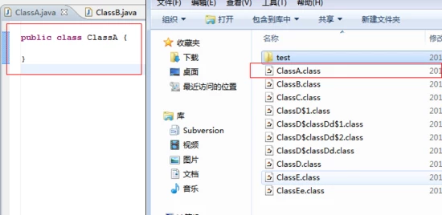
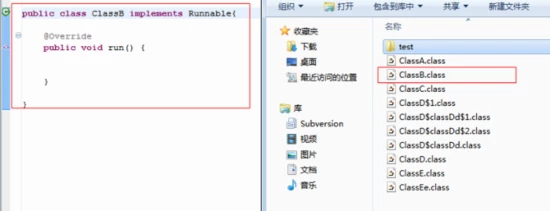
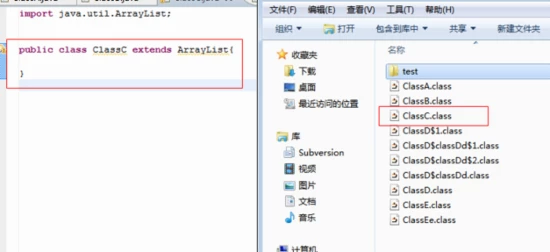
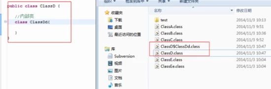
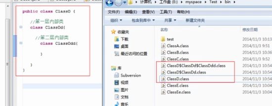
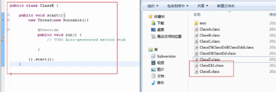
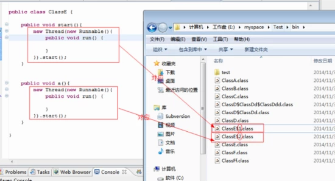

[TOC]
### 1. 创建类ClassA，观察产生的.class文件。
目的是测试没有任何继承、实现类以及内部类等情况下产生的.class文件 以及命名规则

实验结果：

从下图可以看出，只产生了一个.class文件，文件名为 类名.class

### 2. 创建类ClassB， 观察产生的.class文件。

目的是测试有实现接口类情况下产生的.class文件 以及命名规则.

实验结果：从下图可以看出，只产生了一个.class文件 ，文件名为 类名.class

### 3. 创建类ClassC， 观察产生的.class文件。
目的是测试有继承父类情况下产生的.class文件 以及命名规则.
实验结果：从下图可以看出，只产生了一个.class文件 ，文件名为 类名.class

**对以上3点做个小结：**
从以上3个实验来看，编译后产生的.class文件跟它所实现的接口、继承的父类都没有关系，在这些情况下，它都只产生一个.class文件，而且文件名就是类名.class

### 4. 创建类ClassD，定义了一个普通内部类ClassDd， 观察产生的.class文件。
目的是测试有内部类情况下产生的.class文件以及命名规则。

实验结果：从下图可以看出，产生了2个.class文件，ClassD.class 和 ClassD$ClassDd.class。

这说明产生的.class文件与内部类有关系。
外部类产生的文件跟上面的3个实验结果一样，都是类名.class，而内部类，则采用了 外部类名$内部类名.class，外部类和内部类名使用符号$隔开。

注意：这里的外部类都是相对而言

### 5. 创建类ClassD， 定义了一个普通内部类ClassDd，再在 ClassDd定义它的内部类 ClassDdd， 观察产生的.class文件。

目的是测试有内部类情况下产生的.class文件以及命名规则

实验结果：从下图可以看出，产生了3个.class文件，`ClassD.class 、 ClassD$ClassDd.class 、 ClassD$ClassDd$ClassDdd.class `。

这个实验结果跟上面的第四个实验是一样的，只是这次的第2层内部类文件是在第1层内部类的基础上增加自己的类名。

注意：这里的外部类都是相对而言

**对第4和第5个实验做下小结。**
以上这两点都是验证有普通内部类情况下产生哪些.class文件以及命名规则如何。

最后得出结论如下：
* 类个数：看定义类的个数，包括外部类和普通的内部类
* .class文件名的命名规则：外部类名 + $ + 内部类名 + .class，即等于当层内部类以及每一层外部类的名字叠加，但是每个类之间使用符号$隔开。

### 6. 创建类ClassE，定义了一个匿名内部类， 观察产生的.class文件。

目的是测试有匿名内部类情况下产生的.class文件以及命名规则。

实验结果：

从下图可以看出，产生了2个.class文件，`ClassE.class` 和 `ClassE$1.class`。

其实这个实验结果跟第4个实验的结果相似，不同的是，内部类由于没有名字，因此采用数字来表示。这数字按照定义的匿名内部类的顺序来一次增加的。

### 7. 创建类ClassF，并在同一个.java文件中定义另外一个类ClassFf ， 观察产生的.class文件。
目的是同一个.java文件定义的类所产生的.class文件情况。

实验结果：同一个.java文件定义的类所产生的.class文件情况，符合上面上面验证的规范。

### 最后总结：
1. 编译后产生的.class文件个数：有多少个类，产生多少个.class文件
2.  .class文件命名规则：
    * 普通内部类 
        外部类名 + $ + 内部类名  [ +  $ + 内部类 名  + ...]+  .class，类名之间使用符号$隔开

        例如： `ClassD $ ClassDd $ ClassDdd.class`，这里 ClassDdd是对底层的普通内部类，它的父类 ClassDd，而 ClassDd的父类也是最外层的外部类 ClassD
   
    * 匿名内部类  
        外部类名 + $ + 数字  [ +  $ +  数字  + ...]+  .class，类名之间使用符号$隔开，数字根据在外部类中定义的顺序决定

        例如：ClassE$1$1.class
 3. 同一个.java文件中定义的其他非public声明的类，都遵循以上2点规范
    
 4. 继承、或者接口实现，不影响编译产生的.class文件个数和命名规则