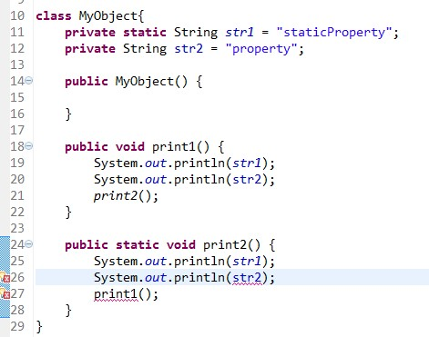

[TOC]
# 1. 什么是static
> “static方法就是没有this的方法。在static方法内部不能调用非静态方法，反过来是可以的。而且可以在没有创建任何对象的前提下，仅仅通过类本身来调用static方法。这实际上正是static方法的主要用途。”

这段话虽然只是说明了static方法的特殊之处，但是可以看出static关键字的基本作用：
* 方便在没有创建对象的情况下来进行调用（方法/变量）。

很显然，被static关键字修饰的方法或者变量**不需要依赖于对象来进行访问**，只要类被加载了，就可以通过类名去进行访问。　　

> Java把内存分为栈内存和堆内存，其中栈内存用来存放一些基本类型的变量、数组和对象的引用，堆内存主要存放一些对象。
 
 在JVM加载一个类的时候，若该类存在static修饰的成员变量和成员方法，则会为这些成员变量和成员方法在固定的位置开辟一个固定大小的内存区域，有了这些“固定”的特性，那么JVM就可以非常方便地访问他们。
 
 同时如果静态的成员变量和成员方法不出作用域的话，它们的句柄都会保持不变。同时static所蕴含“静态”的概念表示着它是不可恢复的，即在那个地方，你修改了，他是不会变回原样的，你清理了，他就不会回来了。     
 
 同时被static修饰的**成员变量和成员方法是独立于该类的**，它不依赖于某个特定的实例变量，也就是说它被该类的所有实例共享。**所有实例的引用都指向同一个地方，任何一个实例对其的修改都会导致其他实例的变化。**
 
static可以用来修饰类的成员方法、类的成员变量，另外可以编写static代码块来优化程序性能。

# 2. static 的用法
## 2.1 static方法

static方法一般称作静态方法，由于静态方法不依赖于任何对象就可以进行访问，因此对于静态方法来说，是没有this的，因为它不依附于任何对象，既然都没有对象，就谈不上this了。并且由于这个特性，**在静态方法中不能访问类的非静态成员变量和非静态成员方法，因为非静态成员方法/变量都是必须依赖具体的对象才能够被调用。**

但是要注意的是，虽然在静态方法中不能访问非静态成员方法和非静态成员变量，但是**在非静态成员方法中是可以访问静态成员方法/变量的。** 举个简单的例子：


在上面的代码中，由于print2方法是独立于对象存在的，可以直接用过类名调用。

假如说在静态方法中可以访问非静态方法/变量的话，

那么如果在static main方法中有下面一条语句：　

`MyObject.print2();`

此时对象都没有，str2根本就不存在，所以就会产生矛盾了。

同样对于方法也是一样，由于你无法预知在print1方法中是否访问了非静态成员变量，所以也禁止在静态成员方法中访问非静态成员方法。　

而对于非静态成员方法，它访问静态成员方法/变量显然是毫无限制的。　　

因此，如果说想在不创建对象的情况下调用某个方法，就可以将这个方法设置为static。

我们最常见的static方法就是main方法，至于为什么main方法必须是static的，现在就很清楚了。因为程序在执行main方法的时候没有创建任何对象，因此只有通过类名来访问。　　

### 构造器是静态方法吗？
严格意义上不是。原因如下：

1. Java的实例构造器只负责初始化，不负责创建对象；Java虚拟机的字节码指令的设计也反映了这一点，有一个new指令专门用于创建对象实例，而调用实例构造器则使用invokespecial指令。 

2. `this` 是作为实例构造器的第一个实际参数传入的。 静态方法中不能使用this，而构造器中可以使用this关键字。this是指调用当前方法的对象，而静态方法不属于任何对象。

## 2.2 static变量

static变量也称作静态变量。

静态变量和非静态变量的区别是：

* 静态变量被所有的对象实例所共享，在内存中只有一个副本，它当且仅当在类初次加载时会被初始化。所有对象实例的引用都指向同一个地方，任何一个对象实例对其的修改都会导致其他实例的变化。

* 非静态变量是对象所拥有的，在创建对象的时候被初始化，存在多个副本，各个对象拥有的副本互不影响。　　

static成员变量的初始化顺序按照定义的顺序进行初始化。

```java
public class User {
    private static int userNumber  = 0 ;
    
    public User(){
        userNumber ++;
    }
    
    public static void main(String[] args) {
        User user1 = new User();
        User user2 = new User();
        
        System.out.println("user1 userNumber：" + User.userNumber);
        System.out.println("user2 userNumber：" + User.userNumber);
    }
}    

```
输出：
```log
user1 userNumber：2
user2 userNumber：2
```
## 2.3 static代码块

static关键字还有一个比较关键的作用就是 **用来形成静态代码块以优化程序性能**。

static块可以置于类中的任何地方，类中可以有多个static块。在类初次被加载的时候，会按照static块的顺序来执行每个static块，并且只会执行一次。　　

为什么说static块可以用来优化程序性能，是因为它的特性:**只会在类加载的时候执行一次**。下面看个例子:
```java

class Person{
    private Date birthDate;
     
    public Person(Date birthDate) {
        this.birthDate = birthDate;
    }
     
    boolean isBornBoomer() {
        Date startDate = Date.valueOf("1946");
        Date endDate = Date.valueOf("1964");
        return birthDate.compareTo(startDate)>=0 && birthDate.compareTo(endDate) < 0;
    }
}
```

`isBornBoomer`是用来这个人是否是1946-1964年出生的，而每次`isBornBoomer`被调用的时候，都会生成`startDate`和`birthDate`两个对象，造成了空间浪费，如果改成这样效率会更好：
```java

class Person{
    private Date birthDate;
    private static Date startDate,endDate;
    static{
        startDate = Date.valueOf("1946");
        endDate = Date.valueOf("1964");
    }
     
    public Person(Date birthDate) {
        this.birthDate = birthDate;
    }
     
    boolean isBornBoomer() {
        return birthDate.compareTo(startDate)>=0 && birthDate.compareTo(endDate) < 0;
    }
}
```

因此，很多时候会将一些只需要进行一次的初始化操作都放在static代码块中进行。

# 3. static关键字的误区
1. static关键字不会改变类中成员的访问权限。
2. 能通过this访问静态成员变量。静态成员变量虽然独立于对象，但是不代表不可以通过对象去访问，所有的静态方法和静态变量都可以通过对象访问（只要访问权限足够）。

    this代表当前对象，所以可以访问

3. static是不允许用来修饰局部变量，因为static用于修饰全局变量，没必要用static来修饰局部变量
    
    局变变量是有生命周期的，用完后JAVA很快就回收资源了。如果设成静态变量，那JAVA怎么回收被其占用的内存。
    
    
 # 4. 常见的面试题
 ## 代码输出结果一
 ```java

public class Test extends Base{
 
    static{
        System.out.println("test static");
    }
     
    public Test(){
        System.out.println("test constructor");
    }
     
    public static void main(String[] args) {
        new Test();
    }
}
 
class Base{
     
    static{
        System.out.println("base static");
    }
     
    public Base(){
        System.out.println("base constructor");
    }
}
```
输出：
```java
base static
test static
base constructor
test constructor
```

1. 在执行开始，先要寻找到main方法，因为main方法是程序的入口，但是在执行main方法之前，必须先加载Test类，

2. 而在加载Test类的时候发现Test类继承自Base类，因此会转去先加载Base类，在加载Base类的时候，发现有static块，便执行了static块。
3. 在Base类加载完成之后，便继续加载Test类，然后发现Test类中也有static块，便执行static块。
4. 在加载完所需的类之后，便开始执行main方法。在main方法中执行new Test()的时候会先调用父类的构造器，然后再调用自身的构造器。
5. 因此，便出现了上面的输出结果。

 ## 代码输出结果二
 ```java

public class Test {
    Person person = new Person("Test");
    static{
        System.out.println("test static");
    }
     
    public Test() {
        System.out.println("test constructor");
    }
     
    public static void main(String[] args) {
        new MyClass();
    }
}
 
class Person{
    static{
        System.out.println("person static");
    }
    public Person(String str) {
        System.out.println("person "+str);
    }
}
 
 
class MyClass extends Test {
    Person person = new Person("MyClass");
    static{
        System.out.println("myclass static");
    }
     
    public MyClass() {
        System.out.println("myclass constructor");
    }
}
```
输出：
```log
test static
myclass static
person static
person Test
test constructor
person MyClass
myclass constructor
```

1. 首先加载Test类，因此会执行Test类中的static块。
2. 接着执行new MyClass()，而MyClass类还没有被加载，因此需要加载MyClass类。
3. 在加载MyClass类的时候，发现MyClass类继承自Test类，但是**由于Test类已经被加载了，所以只需要加载MyClass类**，那么就会执行MyClass类的中的static块。
4. 在加载完之后，就通过构造器来生成对象。而在生成对象的时候，必须**先初始化父类的成员变量**，因此会执行Test中的`Person person = new Person()`，
5. 而Person类还没有被加载过，因此会先加载Person类并执行Person类中的static块，接着执行父类的构造器，完成了父类的初始化.
6. 然后就来初始化自身了，因此会接着执行MyClass中的`Person person = new Person()`，最后执行MyClass的构造器。

 ## 代码输出结果三
 ```java

public class Test {
     
    static{
        System.out.println("test static 1");
    }
    public static void main(String[] args) {
         
    }
     
    static{
        System.out.println("test static 2");
    }
}
```
输出：
```log
test static 1
test static 2
```

　虽然在main方法中没有任何语句，但是还是会输出，因为static块可以出现类中的任何地方（只要不是方法内部，记住，任何方法内部都不行），并且执行是按照static块的顺序执行的。