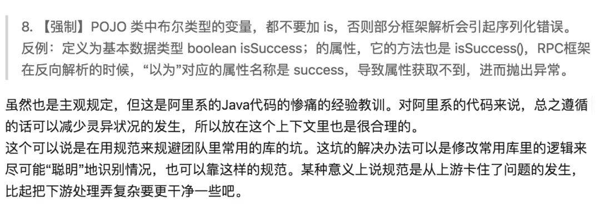
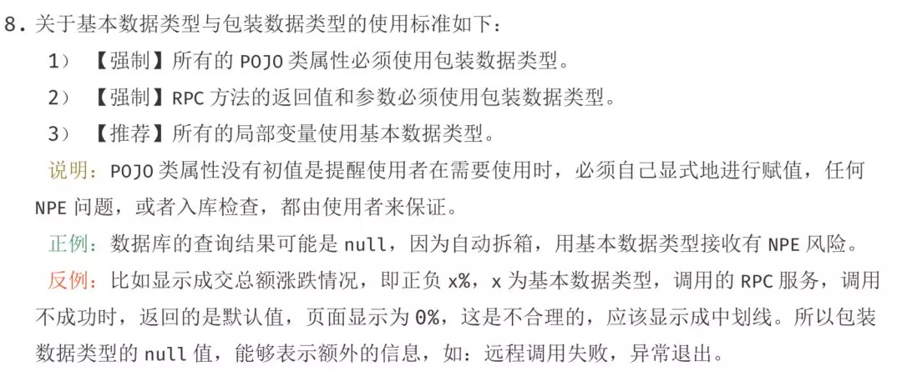

**在定义POJO中的布尔类型的变量时，不要使用isSuccess这种形式，而要直接使用success！**


到底应该是用Boolean还是boolean来给定一个布尔类型的变量呢？

我们知道，boolean是基本数据类型，而Boolean是包装类型。那么，在定义一个成员变量的时候到底是使用包装类型更好还是使用基本数据类型呢？
```java
/*** @author Hollis*/ 
public class BooleanMainTest {
    public static void main(String[] args) {
        Model model1 = new Model();
        System.out.println("default model : " + model1);
    }
}


class Model {
    /**    
      * 定一个Boolean类型的success成员变量    
      */ 
    private Boolean success;

    /**    
      * 定一个boolean类型的failure成员变量    
      */ 
    private boolean failure;

    /**    
      * 覆盖toString方法，使用Java 8 的StringJoiner    
      */ 
    
    @Override
    public String toString() {
        return new StringJoiner(", ", Model.class.getSimpleName() + "[", "]").add(
            "success=" + success).add("failure=" + failure).toString();
    }
}

```
输出结果：
```log

default model : Model[success=null, failure=false]
```

可以看到，当我们没有设置Model对象的字段的值的时候，

* Boolean类型的变量会设置默认值为null，

* boolean类型的变量会设置默认值为 false。


在阿里巴巴Java开发手册中，对于POJO中如何选择变量的类型也有着一些规定：


这种使用包装类型定义变量的方式，通过异常来阻断程序，进而可以被识别到这种线上问题。如果使用基本数据类型的话，系统可能不会报错，进而认为无异常。

**以上，就是建议在POJO和RPC的返回值中使用包装类型的原因。**