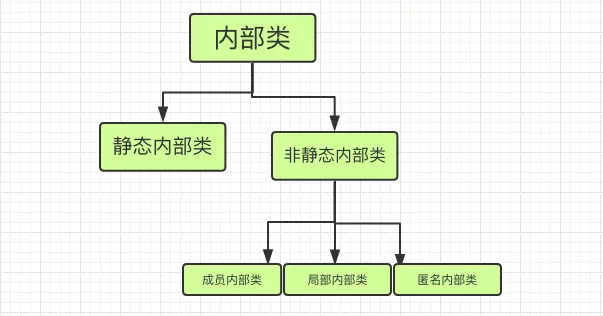

[TOC]
>众所周知，外部顶级类的类名需和类文件名相同，只能使用public和default。而内部类是指在外部类的内部再定义一个类，类名不需要和文件名相同。内部类可以是静态static的，也可用public，default（包限定），protected和private修饰。

# 内部类

## 概念

我们所说的内部类，官方的叫法是嵌套类(Nested Classes)。嵌套类包括静态内部类(Static Nested Classes)和内部类(Inner Classes)。而内部类分为成员内部类，局部内部类(Local Classes)和匿名内部类(Anonymous Classes)。




在类里面重新定义一个类,如下：
```java
public class OuterClass {

    private String name ;
    
    class InnerClass{
        public InnerClass(){
            name = "chenssy";
        }
    }
}
```

内部类是一个编译是的概念，一旦编译成功，就会成为完全不同的两个类，分别为outer.class和outer$inner.class类。所以内部类的成员变量/方法名可以和外部类的相同。

## 内部类的作用

1. 内部类可以很好的实现隐藏，一般的非内部类，是不允许有 private 与protected权限的，但内部类可以
2. 内部类拥有外围类的所有元素的访问权限
3. 可是实现多重继承
4. 可以避免修改接口而实现同一个类中两种同名方法的调用。

## 内部类举例说明


### 1.实现隐藏
平时我们对类的访问权限，都是通过类前面的访问修饰符来限制的。
一般的非内部类，是不允许有 private 与protected权限的，但内部类可以，所以我们能通过内部类来把我们的信息对同一包中的其他类隐藏起来。可以看下面的例子：

接口：
```java
public interface InnerInterface {

    void innerMethod();

}
```

具体类:
```java
/**
 * 实现信息隐藏
 */
public class OuterClass {

    /**
     * private修饰内部类，实现信息隐藏
     */
    private class InnerClass implements InnerInterface {

        @Override
        public void innerMethod() {
            System.out.println("实现内部类隐藏");
        }

    }

    public InnerInterface getInner() {

        return new InnerClass();

    }

}

```
调用程序：

```java
public class Test {

    public static void main(String[] args) {

        OuterClass outerClass = new OuterClass();

        InnerInterface inner = outerClass.getInner();

        inner.innerMethod();

    }

}

```
结果：
> 实现内部类隐藏


从这段代码里面我只知道OuterClass的getInner()方法能返回一个InnerInterface接口实例但我并不知道这个实例是这么实现的。而且由于InnerClass是private的，所以我们如果不看代码的话根本看不到这个具体类的名字，所以说它可以很好的实现隐藏。

### 2.可以无条件地引用外部类的所有元素

**内部类与外部类的关系：**

1. 内部类对象的创建依赖于外部类对象；

2. 内部类对象持有指向外部类对象的引用:

**第二条可以解释为什么在内部类中可以访问外部类的成员，就是因为内部类对象持有外部类对象的引用。但是我们不禁要问， 为什么会持有这个引用？**

内部类虽然和外部类写在同一个文件中， 但是编译完成后， 还是生成各自的class文件，内部类通过this访问外部类的成员。
1. 编译器自动为内部类添加一个成员变量， 这个成员变量的类型和外部类的类型相同， 这个成员变量就是指向外部类对象(this)的引用；
2. 编译器自动为内部类的构造方法添加一个参数， 参数的类型是外部类的类型， 在构造方法内部使用这个参数为内部类中添加的成员变量赋值；
3. 在调用内部类的构造函数初始化内部类对象时，会默认传入外部类的引用。

[详情参考](https://blog.csdn.net/zhangjg_blog/article/details/20000769)

```java
/**
 * 内部类无条件访问外部类元素
 */
public class DataOuterClass {

    private String data = "外部类数据";

    private class InnerClass {

        public InnerClass() {

            System.out.println(data);

        }

    }

    public void getInner() {

        new InnerClass();

    }

    public static void main(String[] args) {

        DataOuterClass outerClass = new DataOuterClass();

        outerClass.getInner();

    }

}

```

data这是在DataOuterClass定义的私有变量。这个变量在内部类中可以无条件地访问。

### 3.可以实现多重继承

类一：
```java
public class ExampleOne {

    public String name() {

        return "inner";

    }

}
```
类二：
```java
public class ExampleTwo {

    public int age() {

        return 25;

    }

}
```

类三:
```java
public class MainExample {

   /**
    * 内部类1继承ExampleOne
    */
   private class InnerOne extends ExampleOne {

       public String name() {

           return super.name();

       }

   }

   /**
    * 内部类2继承ExampleTwo
    */
   private class InnerTwo extends ExampleTwo {

       public int age() {

           return super.age();

       }

   }

   public String name() {

       return new InnerOne().name();

   }

   public int age() {

       return new InnerTwo().age();

   }

   public static void main(String[] args) {

       MainExample mi = new MainExample();

       System.out.println("姓名:" + mi.name());

       System.out.println("年龄:" + mi.age());

   }

}

```
大家注意看类三，里面分别实现了两个内部类 InnerOne,和InnerTwo ，InnerOne类又继承了ExampleOne，InnerTwo继承了ExampleTwo，这样我们的类三MainExample就拥有了ExampleOne和ExampleTwo的方法和属性，也就间接地实现了多继承。

###  4.避免修改接口而实现同一个类中两种同名方法的调用。

大家假想一下如果，你的类要继承一个类，还要实现一个接口，可是你发觉你继承的类和接口里面有两个同名的方法怎么办？你怎么区分它们？？这就需要我们的内部类了。看下面的代码

接口:
```java
public interface Incrementable{

 void increment();

}

```

类 Increment:
```java
public class Increment {

   public void increase() {

       System.out.println("Increment increase()");

   }

   static void f(Increment f) {

       f.increase();

   }

}

```

此时接口和类中有相同的方法increase()。当不用内部类直接实现这两个类时:
```java
public class IncreaseNoInner extends Increment implements Incrementable {

    public void increase() {

        //代码

    }

}

```

此时increase()方法存在歧义，是属于覆盖Increment这里的方法呢？还是Incrementable这里的方法。我怎么能调到Increment这里的方法？显然这是不好区分的。而我们如果用内部类就很好解决这一问题了。看下面代码:
```java
public class IncreaseWithInner extends Increment{

    private int i = 0;

    private void incr() {

        i++;

        System.out.println(i);

    }

    private class Closure implements Incrementable {
        @Override
        public void increase() {

            incr();

        }
    }

    Incrementable getCallbackReference() {

        return new Closure();

    }


    public static void main(String[] args) {

        IncreaseWithInner increase=new IncreaseWithInner();
        increase.increase();
        increase.getCallbackReference().increase();

    }


}

```

我们可以用内部类来实现接口，这样就不会与外围类的方法冲突了。


# 静态内部类

形如：
```java

public class OuterClass {
    private String name;

    static class StaticInerCls{
        private String name;
    }
}
```

1. 静态内部类除了访问权限修饰符比外围类多以外, 和外围类没有区别, 只是代码上将静态内部类组织在了外部类里面。
2. 创建静态内部类方式：以Class.Iner的形式。
`OuterClass.StaticInerCls staticInerCls = new OuterClass.StaticInerCls(); `
3. 静态内部类不依赖于外部类。
4. 静态内部类中可定义静态的成员变量和方法。
5. 静态内部类访问的外部类成员变量或方法为什么不能是非静态的，而成员内部类可以？
    成员内部类中Outer$Inner反编译代码1中有：
```java

  final jichu.Outer this$0;
  public jichu.Outer$Inner(jichu.Outer);
```

可以看出成员内部类中有外部类的引用，所以成员内部类对外部类的私有非静态变量和方法可以随意访问。从静态内部类Outer$Inner反编译代码1中可以看出它不存在对外部类的引用，所以仅能访问外部类的静态成员变量或方法。


# 非静态内部类：

非静态内部类能访问外部类的一切成员, 包括私有成员。外部类虽然不能直接访问内部类的成员, 但是可以通过内部类的实例访问内部类的私有成员。


## 成员内部类：

形如：
```java

public class OuterCls {
    private String name;
    public String getName(){
        return name;
    }

    class InerCls{
        private String name;

        public String getName(){
            return name;
        }
    }

}
```

1. 成员内部类可以直接使用外部类的所有成员和方法，即使是private修饰的。
2. 外部类要访问内部类的所有成员变量和方法，则需要通过内部类的对象来获取。 
3. 成员内部类不能含有static的变量和方法，原因如下：
>非static的内部类，在外部类加载的时候，并不会加载它，所以它里面不能有静态变量或者静态方法。
>1. static类型的属性和方法，在类加载的时候就会存在于内存中。
>2. 要使用某个类的static属性或者方法，那么这个类必须要加载到jvm中。

>基于以上两点，可以看出，如果一个非static的内部类如果具有static的属性或者方法，那么就会出现一种情况：内部类未加载，但是却试图在内存中创建static的属性和方法，这当然是错误的。原因：类还不存在，但却希望操作它的属性和方法。

new内部类对象的方法，以object.new Iner的形式：
```java

OuterCls outerCls = new OuterCls();
OuterCls.InerCls inerCls = outerCls.new InerCls();  
```

成员内部类不能有static修饰的成员，但是却允许定义静态常量。因为java常量放在内存中常量池，它的机制与变量是不同的，编译时，加载常量是不需要加载类的，所以就没有上面那种矛盾。

其实既然内部类没有被实例化，那么也就无法使用内部类的静态属性，就算内部类的静态属性被初始化了也没有任何作用。所以java不允许非静态内部类有静态变量，只能说是合理的规定。
```java

public class OuterClass {
    private String name;

    static class StaticInerCls{
        private String name;
    }

    class InerCls{
        private String name;
        private static int id;    //不允许，会报错
        private static final int TYPE = 0;   //允许
    }
}
```


## 局部内部类

指内部类定义在方法体内，只能在该方法或条件的作用域内才能使用，退出这写作用域就无法引用。
```java

public class OuterCls {
    private String name;
    public String getName(){
        return name;
    }

    public void getInerCls(){
        class InerCls{
            private String name;

            public String getName(){
                return name;
            }
        }
    }

}
```

作为非静态内部类的一种特殊形式, 非静态内部类的所有限制对局部类同样成立。局部类不仅可以访问外部类的所有成员，还可以访问方法体的局部变量，但必须是final修饰的局部变量。

### 为什么局部类访问局部变量，变量必须加上final？

场景：
```java

public static void main(String[] args){
        Outer out = new Outer();
        Object obj = out.method();
    }

    Object method(){
        int localVariable = 0;
        class Inner{
            void println(){
                System.out.println("localVariable " + localVariable);
            }
        }
        Object in = new Inner();
        return in;
    }
}
```

这里的localVariable会变红，提示需要给localVariable变量加final修饰。

* 原因：

1. 所谓“局部内部类”就是在对象的方法成员内部定义的类。而方法中的类，访问同一个方法中的局部变量，是天经地义的。那么**为什么要加上一个final**呢？ 
2. 原因是：编译程序实现上的困难，**难在何处：内部类对象的生命周期会超过局部变量的生命周期。**为什么？表现在：局部变量的生命周期：当该方法被调用时，该方法中的局部变量在栈中被创建（诞生），当方法调用结束时（执行完毕），退栈，这些局部变量全部死亡。而：内部类对象生命期，与其它类一样，当创建一个该局部类对象后，只有没有其它人再引用它时，它才能死亡。完全可能：一个方法已调用结束（局部变量已死亡），但该局部类的对象仍然活着。即：局部类的对象生命期会超过局部变量。 
3. 退一万步：局部类的对象生命期会超过局部变量又怎样？问题的真正核心是：如果：局部内部类的对象访问同一个方法中的局部变量，是天经地义的，那么：只要局部内部类对象还活着，则：栈中的那些它要访问的局部变量就不能“死亡”（否则：它都死了，还访问个什么呢？），这就是说：局部变量的生命期至少等于或大于局部内部类对象的生命期。而：正是这一点是不可能做到的 
4. 但是从理论上：局部内部类的对象访问同一个方法中的局部变量，是天经地义的。所以：经过努力，达到一个折中结果：即：局部内部类的对象可以访问同一个方法中的局部变量，只要这个变量被定义为final.那么：为什么定义为final变可以呢？定义为final后，编译程序就好实现了：具体实现方法是：将所有的局部内部类对象要访问的final型局部变量，变成该内部类对象中的一个数据成员。这样，即使栈中局部变量（含final）已死亡，但由于它是final,其值永不变，因而局部内部类对象在变量死亡后，照样可以访问final型局部变量。归纳上述回答的真正核心是：局部内部类对象中包含有要访问的final型局部变量的一个拷贝，成为它的数据成员。因此，正是在这个意义上，final型局部变量的生命期，超过其方法的一次调用。严格来说，方法调用结束，所有的局部变量（含final）全死亡了。**但：局部内部类对象中有final型局部变量的拷贝。**

## 匿名内部类：


为了免去给内部类命名，或者只想使用一次，就可以选择使用匿名内部类。

**匿名内部类必须继承一个父类或实现一个接口**


#### 实例1:不使用匿名内部类来实现抽象方法
```java

abstract class Person {
    public abstract void eat();
}
 
class Child extends Person {
    public void eat() {
        System.out.println("eat something");
    }
}
 
public class Demo {
    public static void main(String[] args) {
        Person p = new Child();
        p.eat();
    }
}
```

> 运行结果：eat something

可以看到，我们用Child继承了Person类，然后实现了Child的一个实例，将其向上转型为Person类的引用但是，如果此处的Child类只使用一次，那么将其编写为独立的一个类岂不是很麻烦？**这个时候就引入了匿名内部类**

#### 实例2：匿名内部类的基本实现
```java

abstract class Person {
    public abstract void eat();
}
 
public class Demo {
    public static void main(String[] args) {
        Person p = new Person() {
            public void eat() {
                System.out.println("eat something");
            }
        };
        p.eat();
    }
}
```

> 运行结果：eat something


可以看到，我们直接将抽象类Person中的方法在大括号中实现了
这样便可以省略一个类的书写
并且，匿名内部类还能用于接口上

#### 实例3：在接口上使用匿名内部类
```java

interface Person {
    public void eat();
}
 
public class Demo {
    public static void main(String[] args) {
        Person p = new Person() {
            public void eat() {
                System.out.println("eat something");
            }
        };
        p.eat();
    }
}
```
> 运行结果：eat something


由上面的例子可以看出，只要一个类是抽象的或是一个接口，那么其子类中的方法都可以使用匿名内部类来实现
最常用的情况就是在多线程的实现上，因为要实现多线程必须继承Thread类或是继承Runnable接口


#### 实例4：Thread类的匿名内部类实现
```java

public class Demo {
    public static void main(String[] args) {
        Thread t = new Thread() {
            public void run() {
                for (int i = 1; i <= 5; i++) {
                    System.out.print(i + " ");
                }
            }
        };
        t.start();
    }
}
```
> 运行结果：1 2 3 4 5


#### 实例5：Runnable接口的匿名内部类实现

```java

public class Demo {
    public static void main(String[] args) {
        Runnable r = new Runnable() {
            public void run() {
                for (int i = 1; i <= 5; i++) {
                    System.out.print(i + " ");
                }
            }
        };
        Thread t = new Thread(r);
        t.start();
    }
}
```
> 运行结果：1 2 3 4 5

#### 实例6：匿名内部类初始化

我们一般都是利用构造器来完成某个实例的初始化工作的，但是匿名内部类是没有构造器的！那怎么来初始化匿名内部类呢？使用构造代码块！利用构造代码块能够达到为匿名内部类创建一个构造器的效果。

```java
public class OutClass {
    public InnerClass getInnerClass(final int age,final String name){
        return new InnerClass() {
            int age_ ;
            String name_;
            //构造代码块完成初始化工作
            {
                if(0 < age && age < 200){
                    age_ = age;
                    name_ = name;
                }
            }
            public String getName() {
                return name_;
            }
            
            public int getAge() {
                return age_;
            }
        };
    }
    
    public static void main(String[] args) {
        OutClass out = new OutClass();
        
        InnerClass inner_1 = out.getInnerClass(201, "chenssy");
        System.out.println(inner_1.getName());
        
        InnerClass inner_2 = out.getInnerClass(23, "chenssy");
        System.out.println(inner_2.getName());
    }
}
```