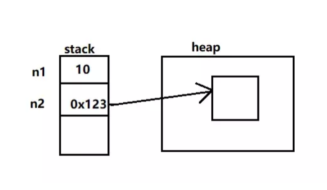

[TOC]
Java 的每个基本类型都对应了一个包装类型，比如说 int 的包装类型为 Integer，double 的包装类型为 
Double。基本类型和包装类型的区别主要有以下 4 点。

# 1.包装类型可以为 null，而基本类型不可以

它使得包装类型可以应用于 POJO 中，而基本类型则不行。

POJO 的英文全称是 Plain Ordinary Java Object，翻译一下就是，简单无规则的 Java 对象，只有属性字段以及 setter 和 getter 方法，示例如下。
```java
class Writer {
    private Integer age;
    private String name;

    public Integer getAge() {
        return age;
    }

    public void setAge(Integer age) {
        this.age = age;
    }

    public String getName() {
        return name;
    }

    public void setName(String name) {
        this.name = name;
    }
}
```
那为什么 POJO 的属性必须要用包装类型呢？
> 数据库的查询结果可能是 null，返回的查询结果为包装类型，如果使用基本类型的话，因为要自动拆箱（将包装类型转为基本类型，比如说把 Integer 对象转换成 int 值），就会抛出 NullPointerException 的异常。

# 2. 包装类型可用于泛型，而基本类型不可以
泛型不能使用基本类型，因为使用基本类型时会编译出错。
```java
List<int> list = new ArrayList<>(); // 提示 Syntax error, insert "Dimensions" to complete ReferenceType
List<Integer> list = new ArrayList<>();
```
为什么呢？因为泛型在编译时会进行类型擦除，最后只保留原始类型，而原始类型只能是 Object 类及其子类——基本类型是个特例。

# 3. 基本类型比包装类型更高效

基本类型在栈中直接存储的具体数值，而包装类型则存储的是堆中的引用。



很显然，相比较于基本类型而言，包装类型需要占用更多的内存空间。

假如没有基本类型的话，对于数值这类经常使用到的数据来说，每次都要通过 new 一个包装类型就显得非常笨重。

# 4. 两个包装类型的值可以相同，但却不相等
```java
Integer chenmo = new Integer(10);
Integer wanger = new Integer(10);

System.out.println(chenmo == wanger); // false
System.out.println(chenmo.equals(wanger )); // true
```
两个包装类型在使用“==”进行判断的时候，判断的是其指向的内存地址是否相等。

而 chenmo.equals(wanger) 的输出结果为 true，是因为 equals 方法内部比较的是两个 int 值是否相等。

