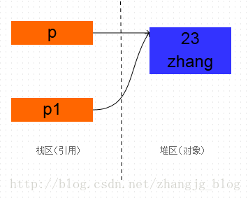
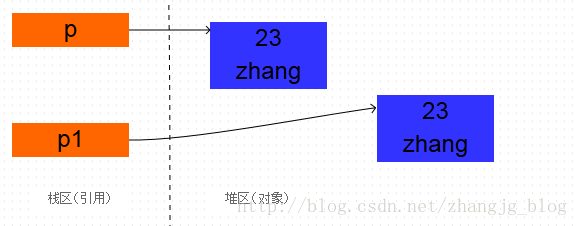
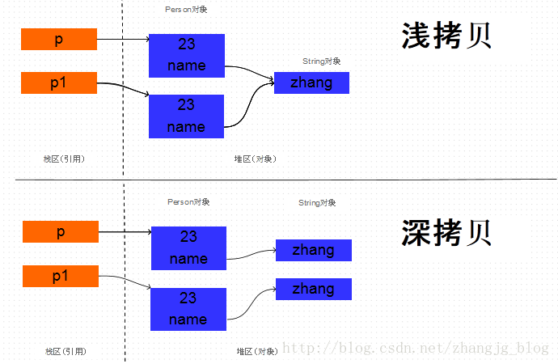
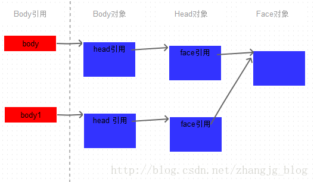
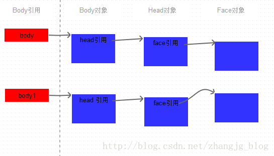
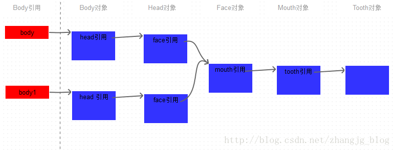

[TOC]
# 一. Java中对象的创建
clone顾名思义就是复制， 在Java语言中， clone方法被对象调用，所以会复制对象。所谓的复制对象，首先要分配一个和源对象同样大小的空间，在这个空间中创建一个新的对象。那么在java语言中，有几种方式可以创建对象呢？

1. 使用new操作符创建一个对象
    new操作符的本意是分配内存。程序执行到new操作符时， 首先去看new操作符后面的类型，因为知道了类型，才能知道要分配多大的内存空间。分配完内存之后，再调用构造函数，填充对象的各个域，这一步叫做对象的初始化，构造方法返回后，一个对象创建完毕，可以把他的引用（地址）发布到外部，在外部就可以使用这个引用操纵这个对象。

2. 使用clone方法复制一个对象
    clone在第一步是和new相似的， 都是分配内存，调用clone方法时，分配的内存和源对象（即调用clone方法的对象）相同，然后再使用原对象中对应的各个域，填充新对象的域， 填充完成之后，clone方法返回，一个新的相同的对象被创建，同样可以把这个新对象的引用发布到外部
    
Object类的clone方法只会拷贝对象中的基本的数据类型（8种基本数据类型`byte,char,short,int,long,float,double，boolean`），对于数组、容器对象、引用对象等都不会拷贝，这就是浅拷贝。如果要实现深拷贝，必须将其中的数组、容器对象、引用对象等另行拷贝。


# 二. 复制对象 or 复制引用

## 1. 复制引用
在Java中，以下类似的代码非常常见：
```java
		
Person p = new Person(23, "zhang");
Person p1 = p;

System.out.println(p);
System.out.println(p1);
```
当Person p1 = p;执行之后， 是创建了一个新的对象吗？ 首先看打印结果：
`com.pansoft.zhangjg.testclone.Person@2f9ee1ac
 com.pansoft.zhangjg.testclone.Person@2f9ee1ac`

可已看出，打印的地址值是相同的，既然地址都是相同的，那么肯定是同一个对象。p和p1只是引用而已，他们都指向了一个相同的对象Person(23, "zhang") 。 可以把这种现象叫做**引用的复制**。
上面代码执行完成之后， 内存中的情景如下图所示：

## 2. 复制对象
而下面的代码是真真正正的克隆了一个对象。
```java
Person p = new Person(23, "zhang");
Person p1 = (Person) p.clone();

System.out.println(p);
System.out.println(p1);
```
从打印结果可以看出，两个对象的地址是不同的，也就是说创建了新的对象， 而不是把原对象的地址赋给了一个新的引用变量：
`com.pansoft.zhangjg.testclone.Person@2f9ee1ac
com.pansoft.zhangjg.testclone.Person@67f1fba0`

以上代码执行完成后， 内存中的情景如下图所示：


# 三. 深拷贝 or 浅拷贝

Person中有两个成员变量，分别是name和age， name是String类型， age是int类型。代码非常简单，如下所示：
```java
public class Person implements Cloneable{
	
	private int age ;
	private String name;
	
	public Person(int age, String name) {
		this.age = age;
		this.name = name;
	}
	
	public Person() {}
 
	public int getAge() {
		return age;
	}
 
	public String getName() {
		return name;
	}
	
	@Override
	protected Object clone() throws CloneNotSupportedException {
		return (Person)super.clone();
	}
}
```


由于age是基本数据类型， 那么对它的拷贝没有什么疑议，直接将一个4字节的整数值拷贝过来就行。

但是name是String类型的， 它只是一个引用， 指向一个真正的String对象，那么对它的拷贝有两种方式：
* 浅拷贝：直接将源对象中的name的**引用值**拷贝给新对象的name字段，

* 深拷贝： 根据原Person对象中的name指向的字符串对象**创建一个新的相同的字符串对象**，将这个新字符串对象的引用赋给新拷贝的Person对象的name字段。

深拷贝和浅拷贝的原理如下图所示：



下面通过代码进行验证。

* 如果两个Person对象的name的地址值相同， 说明两个对象的name都指向同一个String对象， 也就是浅拷贝， 

* 而如果两个对象的name的地址值不同， 那么就说明指向不同的String对象， 也就是在拷贝Person对象的时候， 同时拷贝了name引用的String对象， 也就是深拷贝。

验证代码如下：
```java
Person p = new Person(23, "zhang");
Person p1 = (Person) p.clone();

String result = p.getName() == p1.getName() ? "clone是浅拷贝的" : "clone是深拷贝的";

System.out.println(result);
```
打印结果为：
```log
clone是浅拷贝的
```
所以，clone方法执行的是浅拷贝， 在编写程序时要注意这个细节。


# 四. 覆盖Object中的clone方法， 实现深拷贝

现在为了要在clone对象时进行深拷贝， 那么就要实现Clonable接口，覆盖并实现clone方法。

除了调用父类中的clone方法得到新的对象， 还要**将该类中的引用变量也clone出来**。

如果只是用Object中默认的clone方法，是浅拷贝的，再次以下面的代码验证：

```java
static class Body implements Cloneable{
    public Head head;

    public Body() {}

    public Body(Head head) {this.head = head;}

    @Override
    protected Object clone() throws CloneNotSupportedException {
        return super.clone();
    }

}
static class Head /*implements Cloneable*/{
    public  Face face;

    public Head() {}
    public Head(Face face){this.face = face;}

} 
public static void main(String[] args) throws CloneNotSupportedException {

    Body body = new Body(new Head());

    Body body1 = (Body) body.clone();

    System.out.println("body == body1 : " + (body == body1) );

    System.out.println("body.head == body1.head : " +  (body.head == body1.head));


}
```

在以上代码中， 有两个主要的类， 分别为Body和Face， 
在Body类中， 组合了一个Face对象。当对Body对象进行clone时， 它组合的Face对象只进行浅拷贝。打印结果可以验证该结论：
```log
body == body1 : false
body.head == body1.head : true
```

如果要使Body对象在clone时进行深拷贝， 那么就要在Body的clone方法中，将源对象引用的Head对象也clone一份。
```java
static class Body implements Cloneable{
    public Head head;
    public Body() {}
    public Body(Head head) {this.head = head;}

    @Override
    protected Object clone() throws CloneNotSupportedException {
        Body newBody =  (Body) super.clone();
        newBody.head = (Head) head.clone();
        return newBody;
    }

}
static class Head implements Cloneable{
    public  Face face;

    public Head() {}
    public Head(Face face){this.face = face;}
    @Override
    protected Object clone() throws CloneNotSupportedException {
        return super.clone();
    }
} 
public static void main(String[] args) throws CloneNotSupportedException {

    Body body = new Body(new Head());

    Body body1 = (Body) body.clone();

    System.out.println("body == body1 : " + (body == body1) );

    System.out.println("body.head == body1.head : " +  (body.head == body1.head));


}
```
打印结果为：
```log
body == body1 : false
body.head == body1.head : false
```


由此可见， body和body1内的head引用指向了不同的Head对象， 也就是说在clone Body对象的同时， 也拷贝了它所引用的Head对象， 进行了深拷贝。

但是在拷贝Head类时，默认执行的是浅拷贝，也就是说Head中组合的Face对象并不会被拷贝。内存结构图如下图所示：


那么，对Body对象来说，算是这算是深拷贝吗？其实应该算是深拷贝，因为对Body对象内所引用的其他对象（目前只有Head）都进行了拷贝，也就是说两个独立的Body对象内的head引用已经指向了独立的两个Head对象。

但是，这对于两个Head对象来说，他们指向了同一个Face对象，这就说明，两个Body对象还是有一定的联系，并没有完全的独立。这应该说是一种不彻底的深拷贝。

# 五. 如何进行彻底的深拷贝
对于上面的例子来说，怎样才能保证两个Body对象完全独立呢？只要在拷贝Head对象的时候，也将Face对象拷贝一份就可以了。这需要让Face类也实现Cloneable接口，实现clone方法，并且在在Head对象的clone方法中，拷贝它所引用的Face对象。修改的部分代码如下：
```java
static class Head implements Cloneable{
    public  Face face;

    public Head() {}
    public Head(Face face){this.face = face;}
    @Override
    protected Object clone() throws CloneNotSupportedException {
        //return super.clone();
        Head newHead = (Head) super.clone();
        newHead.face = (Face) this.face.clone();
        return newHead;
    }
} 

static class Face implements Cloneable{
    @Override
    protected Object clone() throws CloneNotSupportedException {
        return super.clone();
    }
}
```
再次运行上面的示例，得到的运行结果如下：
```log
body == body1 : false
body.head == body1.head : false
body.head.face == body1.head.face : false
```
这说明两个Body已经完全独立了，他们间接引用的face对象已经被拷贝，也就是引用了独立的Face对象。内存结构图如下：


依此类推，如果Face对象还引用了其他的对象， 比如说Mouth，如果不经过处理，Body对象拷贝之后还是会通过一级一级的引用，引用到同一个Mouth对象。同理， 如果要让Body在引用链上完全独立， 只能显式的让Mouth对象也被拷贝。


到此，可以得到如下结论：**如果在拷贝一个对象时，要想让这个拷贝的对象和源对象完全彼此独立，那么在引用链上的每一级对象都要被显式的拷贝。**

所以创建彻底的深拷贝是非常麻烦的，尤其是在引用关系非常复杂的情况下，或者在引用链的某一级上引用了一个第三方的对象， 而这个对象没有实现clone方法， 那么在它之后的所有引用的对象都是被共享的。

举例来说，如果被Head引用的Face类是第三方库中的类，并且没有实现Cloneable接口，那么在Face之后的所有对象都会被拷贝前后的两个Body对象共同引用。假设Face对象内部组合了Mouth对象，并且Mouth对象内部组合了Tooth对象， 内存结构如下图：




# 六 clone在不可变类中的实践

有时候你要实现的immutable类中可能包含mutable的类，比如java.util.Date,尽管你将其设置成了final的，但是它的值还是可以被修改的，为了避免这个问题，我们建议返回给用户该对象的一个拷贝，这也是Java的最佳实践之一。下面是一个创建包含mutable类对象的immutable类的例子：
```java
public final class ImmutableReminder{
    private final Date remindingDate;
   
    public ImmutableReminder (Date remindingDate) {
        
        if(remindingDate.getTime() < System.currentTimeMillis()){
            throw new IllegalArgumentException("Can not set reminder for past time: " + remindingDate);
        }
        this.remindingDate = new Date(remindingDate.getTime());
    }
   
    public Date getRemindingDate() {
        return (Date) remindingDate.clone();
    }
}
```
上面的`getRemindingDate()`方法可以看到，返回给用户的是类中的remindingDate属性的一个拷贝。

这样的话如果别人通过`getRemindingDate()`方法获得了一个Date对象，然后修改了这个Date对象的值，那么这个值的修改将不会导致`ImmutableReminder`类对象中`remindingDate`值的修改。