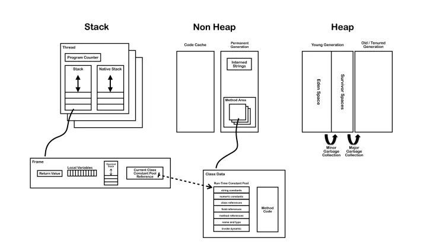
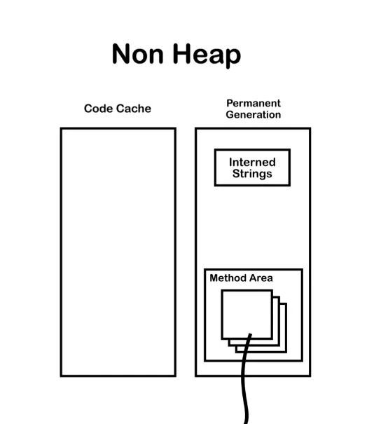

[TOC]
JVM常量池主要分为四类：

* Class文件常量池

* 运行时常量池

* 全局字符串常量池

* 基本类型包装类对象常量池。

# 一. Class文件常量池
class文件是一组以字节为单位的二进制数据流，在java代码的编译期间，我们编写的java文件就被编译为.class文件格式的二进制数据存放在磁盘中，**其中就包括class文件常量池**。 **class文件中存在常量池**（非运行时常量池），其在编译阶段就已经确定，jvm规范对class文件结构有着严格的规范，必须符合此规范的class文件才能被jvm认可和装载。为了方便说明，我们写个简单的类
```java
class JavaBean{
    private int value = 1;
    public String s = "abc";
    public final static int f = 0x101;

    public void setValue(int v){
        final int temp = 3;
        this.value = temp + v;
    }

    public int getValue(){
        return value;
    }
}
```
通过javac命令编译之后，用javap -v 命令查看编译后的文件:
```shell
class JavaBasicKnowledge.JavaBean
  minor version: 0
  major version: 52
  flags: ACC_SUPER
Constant pool:
   #1 = Methodref          #6.#29         // java/lang/Object."<init>":()V
   #2 = Fieldref           #5.#30         // JavaBasicKnowledge/JavaBean.value:I
   #3 = String             #31            // abc
   #4 = Fieldref           #5.#32         // JavaBasicKnowledge/JavaBean.s:Ljava/lang/String;
   #5 = Class              #33            // JavaBasicKnowledge/JavaBean
   #6 = Class              #34            // java/lang/Object
   #7 = Utf8               value
   #8 = Utf8               I
   #9 = Utf8               s
  #10 = Utf8               Ljava/lang/String;
  #11 = Utf8               f
  #12 = Utf8               ConstantValue
  #13 = Integer            257
  #14 = Utf8               <init>
  #15 = Utf8               ()V
  #16 = Utf8               Code
  #17 = Utf8               LineNumberTable
  #18 = Utf8               LocalVariableTable
  #19 = Utf8               this
  #20 = Utf8               LJavaBasicKnowledge/JavaBean;
  #21 = Utf8               setValue
  #22 = Utf8               (I)V
  #23 = Utf8               v
  #24 = Utf8               temp
  #25 = Utf8               getValue
  #26 = Utf8               ()I
  #27 = Utf8               SourceFile
  #28 = Utf8               StringConstantPool.java
  #29 = NameAndType        #14:#15        // "<init>":()V
  #30 = NameAndType        #7:#8          // value:I
  #31 = Utf8               abc
  #32 = NameAndType        #9:#10         // s:Ljava/lang/String;
  #33 = Utf8               JavaBasicKnowledge/JavaBean
  #34 = Utf8               java/lang/Object
```
可以看到这个命令之后我们得到了该class文件的版本号、常量池、已经编译后的字节码（这里未列出）。既然是常量池，那么其中存放的肯定是常量，那么什么是“常量”呢？ **class文件常量池主要存放两大常量：字面量和符号引用**。
## 1. 字面量
字面量接近java语言层面的常量概念，主要包括：
* 文本字符串，也就是我们经常申明的： public String s = "abc";中的"abc"
```shell
 #9 = Utf8               s
 #3 = String             #31            // abc
 #31 = Utf8              abc
```
* 用final修饰的成员变量，包括静态变量、实例变量和局部变量
```shell
#11 = Utf8               f
#12 = Utf8               ConstantValue
#13 = Integer            257
```
这里需要说明的一点，上面说的存在于常量池的字面量，指的是数据的值，也就是abc和0x101(257)

而对于基本类型数据(甚至是方法中的局部变量)，也就是上面的private int value = 1;常量池中只保留了他的的字段描述符`I`和字段的名称`value`，他们的字面量不会存在于常量池。

## 2. 符号引用
符号引用主要设涉及编译原理方面的概念，包括下面三类常量:
* 类和接口的全限定名，也就是`java/lang/String;`这样，将类名中原来的"."替换为"/"得到的，主要用于在运行时解析得到类的直接引用，像上面
```shell
#5 = Class              #33        // JavaBasicKnowledge/JavaBean
#33 = Utf8               JavaBasicKnowledge/JavaBean
```
* 字段的名称和描述符，字段也就是类或者接口中声明的变量，包括类级别变量和实例级的变量
```java
#4 = Fieldref           #5.#32         // JavaBasicKnowledge/JavaBean.value:I
#5 = Class              #33            // JavaBasicKnowledge/JavaBean
#32 = NameAndType       #7:#8          // value:I

#7 = Utf8               value
#8 = Utf8               I

//这两个是局部变量，只保留字段名称
#23 = Utf8               v
#24 = Utf8               temp
```
可以看到，对于方法中的局部变量名，class文件的常量池仅仅保存字段名。

* 方法中的名称和描述符，也即参数类型+返回值
```java
#21 = Utf8               setValue
#22 = Utf8               (I)V

#25 = Utf8               getValue
#26 = Utf8               ()I
```

# 二. 运行时常量池


我们知道，jvm在执行某个类的时候，必须经过**加载、链接（验证、准备、解析）、初始化，** 在第一步加载的时候需要完成：

* 通过一个类的全限定名来获取此类的二进制字节流

* 将这个字节流所代表的静态存储结构转化为方法区的运行时数据结构,其中就包含了**class文件常量池进入运行时常量池**的过程，这里需要强调一下不同的类共用一个运行时常量池，同时在进入运行时常量池的过程中，多个class文件常量池中相同的字符串，只会存在一份在运行时常量池，这也是一种优化。

* 在内存中生成一个类对象，代表加载的这个类，这个对象是`java.lang.Class`，它作为方法区这个类的各种数据访问的入口。

类对象和普通对象是不同的:

* 类对象是在类加载的时候完成的，是jvm创建的并且是单例的，作为这个类和外界交互的入口， 

* 普通的对象一般是在调用new之后创建。

运行时常量池存储的是：

* 运行时常量池（Runtime Constant Pool)是方法区的一部分。
> Class文件中除了有类的版本、字段、方法、接口等描述信息外，还有一项信息是**常量池（Constant Pool Table)，用于存放编译期生成的各种字面量和符号引用，常量池这部分内容将在类加载后进入方法区的运行时常量池中存放**。
> 这里所说的常量包括：基本类型包装类（包装类不管理浮点型，整形只会管理-128到127）和String（也可以通过String.intern()方法可以强制将String放入常量池）

* 除了保存Class文件中描述的符号引用外，还会把翻译出来的直接引用也存储在运行时常量池中。

* 并非预置入Class文件中常量池的内容才能进人方法区运行时常量池，**运行期间也可能将新的常量放入池中**，这种特性被开发人员利用得比较多的便是String类的intern()方法。

* 既然运行时常量池是方法区的一部分，当然受到方法区内存的限制，当常量池无法再申请到内存时会抛出OutOfMemoryError异常。

> String.intern()是一个Native方法，底层调用C++的` StringTable::intern` 方法实现。
> 当通过语句str.intern()调用intern()方法后，JVM 就会在当前类的常量池中查找是否存在与str等值的String，
> * 若存在则直接返回常量池中相应Strnig的引用；
> * 若不存在，则会在常量池中创建一个等值的String，然后返回这个String在常量池中的引用。

> 因此，只要是等值的String对象，使用intern()方法返回的都是常量池中同一个String引用，这些等值的String对象通过intern()后使用==是可以匹配的。

# 三. 字符串常量池

字符串常量池是JVM所维护的一个**字符串实例的引用**表，

在HotSpot VM中，它是一个叫做StringTable的全局表。

在字符串常量池中维护的是**字符串实例的引用**，底层C++实现就是一个Hashtable。

这些被维护的引用所指的字符串实例，被称作”被驻留的字符串”或”interned string”或通常所说的”进入了字符串常量池的字符串”。 

也就是说在堆中的某些字符串实例被这个StringTable引用之后就等同被赋予了”驻留字符串”的身份。这个StringTable在每个HotSpot VM的实例只有一份，被所有的类共享。


# 四.运行时常量池和字符串常量池的在内存中的位置
```java
1 //保持引用，防止自动垃圾回收
List<String> list = new ArrayList<String>();
        
int i = 0;
       
while(true){
  //通过intern方法向常量池中手动添加常量
  list.add(String.valueOf(i++).intern());
}
```
* 在jdk6及以前，字符串常量池和运行时常量池放在堆的 Perm 区（永久代包含方法区和字符串常量池）的，运行时常量池是方法区的一部分，一旦常量池中大量使用 intern 会直接产生`java.lang.OutOfMemoryError: PermGen space`错误的,PermGen space正是方法区，足以说明常量池在方法区中。





* 在jdk7中，字符串常量池和运行时常量池已经从 Perm 区（方法区）移到正常的 Java Heap 区域了

* **在jdk8中，移除了方法区，转而用Metaspace区域替代。** 所以我们需要使用新的jvm参数：-XX:MaxMetaspaceSize=2M，依然大量使用 intern 代码，抛出：java.lang.OutOfMemoryError: Metaspace异常。同理说明运行时常量池是划分在Metaspace区域中。

# 五. JAVA 基本类型的封装类及对应常量池
* java中基本类型的包装类的大部分都实现了常量池技术，这些类是`Byte,Short,Integer,Long,Character,Boolean`

* 另外**两种浮点数类型的包装类则没有实现**。

上面这5种整型的包装类也只是在对应值小于等于127时才可使用常量池。

```java
public class StringConstantPool{

    public static void main(String[] args){
        //5种整形的包装类Byte,Short,Integer,Long,Character的对象，
        //在值小于127时可以使用常量池
        Integer i1=127;
        Integer i2=127;
        System.out.println(i1==i2);//输出true

        //值大于127时，不会从常量池中取对象
        Integer i3=128;
        Integer i4=128;
        System.out.println(i3==i4);//输出false
        //Boolean类也实现了常量池技术

        Boolean bool1=true;
        Boolean bool2=true;
        System.out.println(bool1==bool2);//输出true

        //浮点类型的包装类没有实现常量池技术
        Double d1=1.0;
        Double d2=1.0;
        System.out.println(d1==d2); //输出false

    }
}
```
在JDK5.0之前是不允许直接将基本数据类型的数据直接赋值给其对应地包装类的，如：Integer i = 5; 
但是在JDK5.0中支持这种写法，因为编译器会自动将上面的代码转换成如下代码：Integer i=Integer.valueOf(5);
这就是Java的**自动装箱**.

JDK5.0也提供了**自动拆箱**：Integer i =5; int j = i;