[TOC]
# 一. 简介
Java编译器编译好Java文件之后，产生.class 文件在磁盘中。

这种class文件是二进制文件，内容是只有JVM虚拟机能够识别的字节码。

class字节码文件是根据JVM虚拟机规范中规定的字节码组织规则生成的

JVM虚拟机读取字节码文件，取出二进制数据，加载到内存中，解析.class 文件内的信息，生成对应的 Class对象。

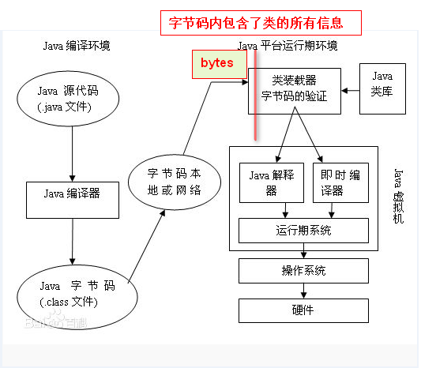

# 二. 字节码中的部分属性
java使用者都知道，`.java`文件属于源码文件，它需要经过了javac编译器编译为`.class`字节码文件才能被JVM执行的。

Java在编译的时候对于方法，默认是不会保留方法参数名，因此如果我们在运行期想从`.class`字节码里直接拿到方法的参数名是做不到的。
示例：
```java
public static void main(String[] args) throws NoSuchMethodException {
    Method method = Main.class.getMethod("test1", String.class, Integer.class);
    int parameterCount = method.getParameterCount();
    Parameter[] parameters = method.getParameters();

    // 打印输出：
    System.out.println("方法参数总数：" + parameterCount);
    Arrays.stream(parameters).forEach(p -> System.out.println(p.getType() + "----" + p.getName()));
}
```

打印内容：
```java
方法参数总数：2
class java.lang.String----arg0
class java.lang.Integer----arg1
```
从结果中可以看到我们并不能获取到真实方法参数名（获取到的是无意义的`arg0、arg1`等）

## LineNumberTable属性
LineNumberTable属性存在于代码（字节码）属性中， 它建立了字节码偏移量到源代码行号之间的联系.
## LocalVariableTable属性
LocalVariableTable属性建立了方法中的局部变量与源代码中的局部变量之间的对应关系。这个属性也是存在于字节码中。

它是局部变量的一个集合。描述了局部变量和描述符以及和源代码的对应关系。
下面我使用javac和javap命令来演示一下这个情况：
`.java`源码如下：
```java
package com.fsx.maintest;
public class MainTest2 {
    public String testArgName(String name,Integer age){
        return null;
    }
}
```
1. 使用`javac MainTest2.java`编译成`.class`字节码，然后使用`javap -verbose MainTest2.class`查看该字节码信息如下：
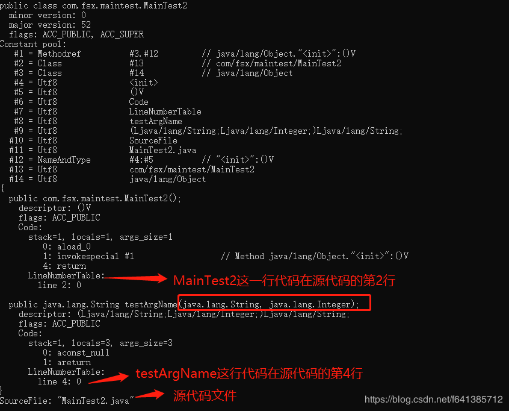
    LineNumberTable记录着在源代码处的行号。抛出异常时显示的行号只能指定到方法体内的语句，方法名和参数是不会报错的。所以testArgName是在第四行，而不是第三行。

    此处并没有LocalVariableTable。
    
2. 源码不变，我使用`javac -g MainTest2.java`来编译，再看看对应的字节码信息如下（注意和上面的区别）：
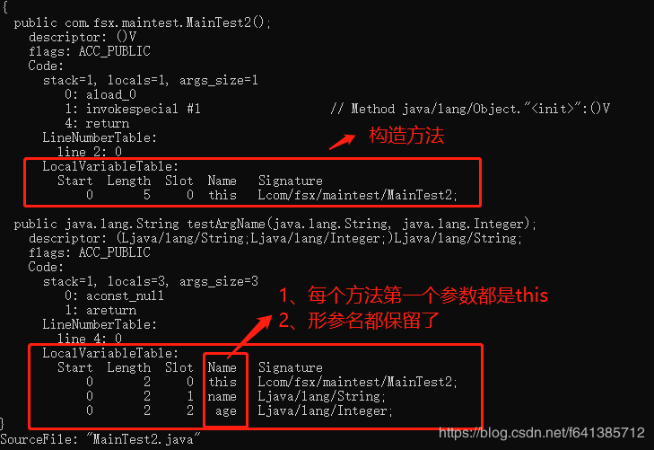
这里多了一个LocalVariableTable，即局部变量表，就记录着我们方法入参的形参名字。既然记录着了，这样我们就可以通过分析字节码信息来得到这个名称了。
> 说明：javac的调试选项主要包含了三个子选项：`lines，source，vars`,如果不使用-g来编译,只保留源文件和行号信息；如果使用-g来编译那就都有了

## -g和-parameters有什么区别？
示例：
`.java`源代码如下：
```java
import java.lang.reflect.Method;
import java.lang.reflect.Parameter;

public class MainTest2 {

    public static void main(String[] args) throws NoSuchMethodException {
        Method method = MainTest2.class.getMethod("testArgName", String.class, Integer.class);
        System.out.println("paramCount:" + method.getParameterCount());
        for (Parameter parameter : method.getParameters()) {
            System.out.println(parameter.getType().getName() + "-->" + parameter.getName());
        }
    }

    public String testArgName(String name, Integer age) {
        return null;
    }
}
```

下面分别用`javac、javac -g、javac -parameters`来编译后再执行，结果图如下：
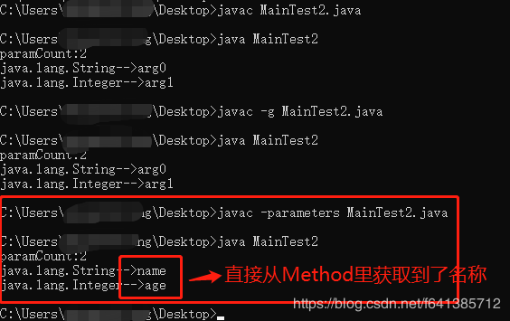
`-parameters`编译后的字节码信息:
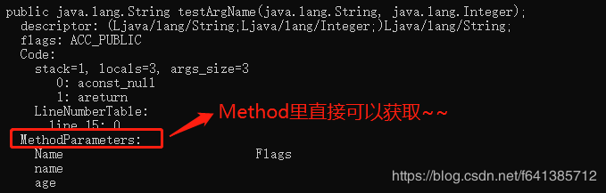


# 三. 字节码实例，手动加载字节码
下面通过一段代码演示手动加载 class文件字节码到系统内，转换成class对象，然后再实例化的过程：
## 1. 定义一个 Programmer类：
```java
package samples;
/**
 * 程序猿类
 * @author louluan
 */
public class Programmer {
 
	public void code()
	{
		System.out.println("I'm a Programmer,Just Coding.....");
	}
}
```

## 2. 自定义一个类加载器：
```java
package samples;
/**
 * 自定义一个类加载器，用于将字节码转换为class对象
 * @author louluan
 */
public class MyClassLoader extends ClassLoader {
 
	public Class<?> defineMyClass( byte[] b, int off, int len) 
	{
		return super.defineClass(b, off, len);
	}
	
}
```

## 3. 然后编译成Programmer.class文件，在程序中读取字节码，然后转换成相应的class对象，再实例化：

```java
package samples;
 
import java.io.File;
import java.io.FileInputStream;
import java.io.FileNotFoundException;
import java.io.IOException;
import java.io.InputStream;
import java.net.URL;
 
public class MyTest {
 
	public static void main(String[] args) throws IOException {
		//读取本地的class文件内的字节码，转换成字节码数组
		File file = new File(".");
		InputStream  input = new FileInputStream(file.getCanonicalPath()+"\\bin\\samples\\Programmer.class");
		byte[] result = new byte[1024];
		
		int count = input.read(result);
		// 使用自定义的类加载器将 byte字节码数组转换为对应的class对象
		MyClassLoader loader = new MyClassLoader();
		Class clazz = loader.defineMyClass( result, 0, count);
		//测试加载是否成功，打印class 对象的名称
		System.out.println(clazz.getCanonicalName());
                
               //实例化一个Programmer对象
               Object o= clazz.newInstance();
               try {
                   //调用Programmer的code方法
                    clazz.getMethod("code", null).invoke(o, null);
                   } catch (IllegalArgumentException | InvocationTargetException
                        | NoSuchMethodException | SecurityException e) {
                     e.printStackTrace();
                  }
 }
}
```
# 三. 在运行期的代码中生成二进制字节码
> 由于JVM通过字节码的二进制信息加载类的，那么，如果我们在运行期系统中，遵循Java编译系统组织.class文件的格式和结构，生成相应的二进制数据，然后再把这个二进制数据加载转换成对应的类，这样，就完成了在代码中，动态创建一个类的能力了。

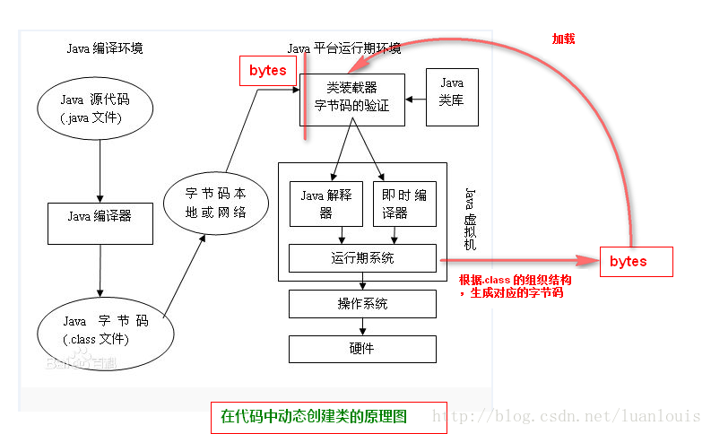
在运行时期可以按照Java虚拟机规范对class文件的组织规则生成对应的二进制字节码。当前有很多开源框架可以完成这些功能，如ASM，Javassist。

## 1. Java字节码生成开源框架介绍--ASM

ASM 是一个 Java 字节码操控框架。它能够以二进制形式修改已有类或者动态生成类。ASM 可以直接产生二进制 class 文件，也可以在类被加载入 Java 虚拟机之前动态改变类行为。ASM 从类文件中读入信息后，能够改变类行为，分析类信息，甚至能够根据用户要求生成新类。

不过ASM在创建class字节码的过程中，操纵的级别是底层JVM的汇编指令级别，这要求ASM使用者要对class组织结构和JVM汇编指令有一定的了解。

1. 下面通过ASM 生成下面Programmer类的class字节码：
```java
package com.samples;
import java.io.PrintStream;
 
public class Programmer {
 
	public void code()
	{
		System.out.println("I'm a Programmer,Just Coding.....");
	}
}
```

2. 使用ASM框架提供了ClassWriter 接口，通过访问者模式进行动态创建class字节码，看下面的例子：
```java
package samples;
 
import java.io.File;
import java.io.FileOutputStream;
import java.io.IOException;
 
import org.objectweb.asm.ClassWriter;
import org.objectweb.asm.MethodVisitor;
import org.objectweb.asm.Opcodes;
public class MyGenerator {
 
	public static void main(String[] args) throws IOException {
 
		System.out.println();
		ClassWriter classWriter = new ClassWriter(0);
		// 通过visit方法确定类的头部信息
		classWriter.visit(Opcodes.V1_7,// java版本
				Opcodes.ACC_PUBLIC,// 类修饰符
				"Programmer", // 类的全限定名
				null, "java/lang/Object", null);
		
		//创建构造函数
		MethodVisitor mv = classWriter.visitMethod(Opcodes.ACC_PUBLIC, "<init>", "()V", null, null);
		mv.visitCode();
		mv.visitVarInsn(Opcodes.ALOAD, 0);
		mv.visitMethodInsn(Opcodes.INVOKESPECIAL, "java/lang/Object", "<init>","()V");
		mv.visitInsn(Opcodes.RETURN);
		mv.visitMaxs(1, 1);
		mv.visitEnd();
		
		// 定义code方法
		MethodVisitor methodVisitor = classWriter.visitMethod(Opcodes.ACC_PUBLIC, "code", "()V",
				null, null);
		methodVisitor.visitCode();
		methodVisitor.visitFieldInsn(Opcodes.GETSTATIC, "java/lang/System", "out",
				"Ljava/io/PrintStream;");
		methodVisitor.visitLdcInsn("I'm a Programmer,Just Coding.....");
		methodVisitor.visitMethodInsn(Opcodes.INVOKEVIRTUAL, "java/io/PrintStream", "println",
				"(Ljava/lang/String;)V");
		methodVisitor.visitInsn(Opcodes.RETURN);
		methodVisitor.visitMaxs(2, 2);
		methodVisitor.visitEnd();
		classWriter.visitEnd(); 
		// classWriter类已经完成
		// 将classWriter转换成字节数组写到文件里面去
		byte[] data = classWriter.toByteArray();
		File file = new File("D://Programmer.class");
		FileOutputStream fout = new FileOutputStream(file);
		fout.write(data);
		fout.close();
	}
}
```
上述的代码执行过后，用Java反编译工具（如JD_GUI）打开D盘下生成的Programmer.class，可以看到以下信息：
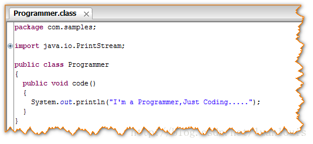
3. 再用上面我们定义的类加载器将这个class文件加载到内存中，然后 创建class对象，并且实例化一个对象，调用code方法，会看到下面的结果：
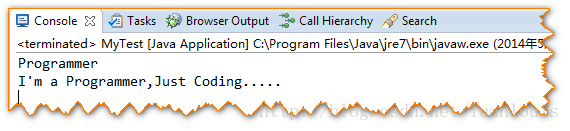

 以上表明：在代码里生成字节码，并动态地加载成class对象、创建实例是完全可以实现的。
 
### 使用ASM获得JAVA类方法参数名
#### 1. 在Java1.8之后，可以通过反射API-`java.lang.reflect.Executable.getParameters`来获取到方法参数的元信息，
> 在使用编译器时加上-parameters参数，它会在生成的.class文件中额外存储参数的元信息

##### 方式1：idea配置编译时参数：
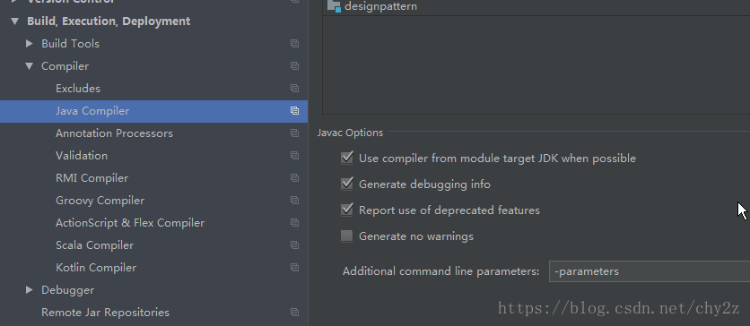
##### 方式2：maven插件配置编译时参数
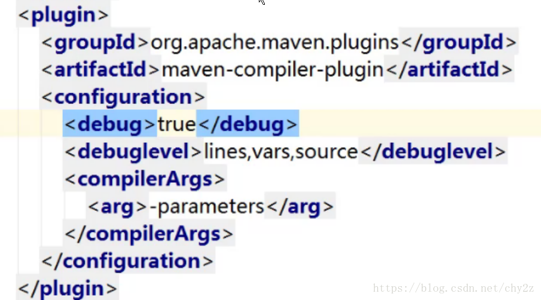
编译后查看class字节码文件
```shell
javap -v ParameterName.class >> 123.txt
```
`.class`文件中额外存储参数的元信息 MethodParameters
```java
public void fun(java.lang.String, int);
    descriptor: (Ljava/lang/String;I)V
    flags: ACC_PUBLIC
    Code:
      stack=3, locals=3, args_size=3
         0: getstatic     #2                  // Field java/lang/System.out:Ljava/io/PrintStream;
         3: new           #3                  // class java/lang/StringBuilder
         6: dup
         7: invokespecial #4                  // Method java/lang/StringBuilder."<init>":()V
        10: ldc           #5                  // String name:
        12: invokevirtual #6                  // Method java/lang/StringBuilder.append:(Ljava/lang/String;)Ljava/lang/StringBuilder;
        15: aload_1
        16: invokevirtual #6                  // Method java/lang/StringBuilder.append:(Ljava/lang/String;)Ljava/lang/StringBuilder;
        19: ldc           #7                  // String ,age:
        21: invokevirtual #6                  // Method java/lang/StringBuilder.append:(Ljava/lang/String;)Ljava/lang/StringBuilder;
        24: iload_2
        25: invokestatic  #8                  // Method java/lang/String.valueOf:(I)Ljava/lang/String;
        28: invokevirtual #6                  // Method java/lang/StringBuilder.append:(Ljava/lang/String;)Ljava/lang/StringBuilder;
        31: invokevirtual #9                  // Method java/lang/StringBuilder.toString:()Ljava/lang/String;
        34: invokevirtual #10                 // Method java/io/PrintStream.println:(Ljava/lang/String;)V
        37: return
      LineNumberTable:
        line 14: 0
        line 15: 37
      LocalVariableTable:
        Start  Length  Slot  Name   Signature
            0      38     0  this   Ljs/oop/parameter/ParameterName;
            0      38     1 name1   Ljava/lang/String;
            0      38     2  age1   I
    MethodParameters:
      Name                           Flags
      name1
      age1
  public abstract void test(java.lang.String, int);
    descriptor: (Ljava/lang/String;I)V
    flags: ACC_PUBLIC, ACC_ABSTRACT
    MethodParameters:
      Name                           Flags
      msg
      age
```
获取类和接口方法参数名称的代码如下
```java
package js.oop.parameter;
 
import java.lang.reflect.Method;
import java.lang.reflect.Parameter;
import java.util.Arrays;
 
/**
 * java 1.8
 * 编译器时加上-parameters
 */
public abstract class ParameterName {
 
    public void fun(String name1,int age1) {
        System.out.println("name:" + name1 + ",age:" + String.valueOf(age1));
    }
 
    public abstract void test(String msg,int age);
 
    /**
     * 切换编译环境 java1.8
     * @param args
     * @throws Exception
     */
    public static void main(String[] args) throws  Exception {
        Method method = ParameterName.class.getMethod("fun",String.class,int.class);
        //@since 1.8
        Parameter[] parameters= method.getParameters();
        Arrays.stream(parameters).forEach(parameter -> {
             System.out.println(parameter.getName());
        });
 
        method = ParameterName.class.getMethod("test",String.class,int.class);
        parameters= method.getParameters();
        Arrays.stream(parameters).forEach(parameter -> {
            System.out.println(parameter.getName());
        });
    }
 
}
```
#### 2. 在JDK1.7及以下版本的API并不能获取到函数的参数名称，这时候可以使用字节码工具ASM来实现这一功能.
###### 1. 首先导入asm依赖包：
```xml
<!-- https://mvnrepository.com/artifact/asm/asm -->
<dependency>
    <groupId>asm</groupId>
    <artifactId>asm</artifactId>
    <version>3.3.1</version>
</dependency>
```
##### 2. 在编译时增加-parameters参数
原理：
* 通过字节码的本地变量表可以获取类的函数参数名称，获取普通类的函数参数名称，不需要增加该参数。

* 但是**接口和抽象类的**函数没有本地变量表所以获取不到函数参数名称.
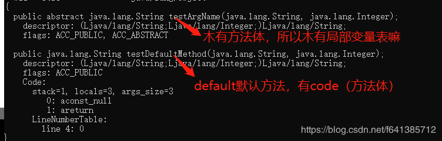

* 当编译增加`-parameters`参数时，字节码中会包含 MethodParameters 元数据，此时可以获取到接口中函数参数。
```java
 public abstract void test(java.lang.String, int);
    descriptor: (Ljava/lang/String;I)V
    flags: ACC_PUBLIC, ACC_ABSTRACT
    MethodParameters:
      Name                           Flags
      msg
      age
```

##### 3. 编写测试接口和测试方法
基于ASM提供工具方法`getMethodParamNames(Method)`，获取到任何一个Method的入参名称：
```java
package js.oop.parameter;
 
import org.objectweb.asm.*;
 
import java.io.IOException;
import java.lang.reflect.Method;
import java.lang.reflect.Modifier;
import java.util.ArrayList;
import java.util.Arrays;
import java.util.List;
 
/**
* @Title: ParameterNameASM
* @Description: 用字节码工具ASM来直接获取参数名称
* @author chy
* @date 2018/8/17 9:26
*/
public abstract class ParameterNameASM {
 
    public void fun(String name1,int age1) {
        System.out.println("name:" + name1 + ",age:" + String.valueOf(age1));
    }
 
    public abstract void test1(String msg,int age);
 
    public abstract void test2(String msg,int age,Object other);
 
    public static void main(String[] args) throws Exception {
        Method method = ParameterNameASM.class.getDeclaredMethod("fun", String.class, int.class);
        System.out.println("fun参数名称："+Arrays.toString(getClassMethodParamNames(method)));
 
        method = ParameterNameASM.class.getDeclaredMethod("test1", String.class, int.class);
        System.out.println("test1参数名称："+Arrays.toString(getInterfaceMethodParamNames(method).toArray()));
 
        method = ParameterNameASM.class.getDeclaredMethod("test2", String.class, int.class, Object.class);
        System.out.println("test2参数名称："+Arrays.toString(getInterfaceMethodParamNames(method).toArray()));
    }
 
    /**
     * 获取类方法的参数名
     * @param method
     * @return
     * @throws IOException
     */
    public static String[] getClassMethodParamNames(final Method method) throws IOException {
 
        final Class<?>[] methodParameterTypes = method.getParameterTypes();
        final String[] methodParametersNames = new String[methodParameterTypes.length];
        final String className = method.getDeclaringClass().getName();
 
 
        ClassReader cr = new ClassReader(className);
 
        ClassVisitor classVisitor=new ClassVisitor(Opcodes.ASM6) {
            @Override
            public MethodVisitor visitMethod(int access, String name, String descriptor, String signature, String[] exceptions) {
 
                final Type[] args = Type.getArgumentTypes(descriptor);
                // 方法名相同并且参数个数相同
                if (!name.equals(method.getName())|| !matchTypes(args, method.getParameterTypes())) {
                    return super.visitMethod(access, name, descriptor, signature,exceptions);
                }
                MethodVisitor v = super.visitMethod(access, name, descriptor, signature, exceptions);
 
                return new MethodVisitor(Opcodes.ASM6, v) {
                    /**
                     * 获取本地变量表
                     * LocalVariableTable
                     */
                    @Override
                    public void visitLocalVariable(String name, String desc,
                                                   String signature, Label start, Label end, int index) {
                        int i = index - 1;
                        // 如果是静态方法，则第一就是参数
                        // 如果不是静态方法，则第一个是"this"，然后才是方法的参数
                        if (Modifier.isStatic(method.getModifiers())) {
                            i = index;
                        }
                        if (i >= 0 && i < methodParametersNames.length) {
                            methodParametersNames[i] = name;
                        }
                        super.visitLocalVariable(name, desc, signature, start, end, index);
                    }
 
                };
            }
        };
 
        cr.accept(classVisitor,ClassReader.SKIP_FRAMES);
 
        return methodParametersNames;
    }
 
    /**
     * 获取接口方法的参数名（抽象方法也可以）
     * 编译时增加参数  -parameters
     * @param method
     * @return
     * @throws IOException
     */
    public static List<String> getInterfaceMethodParamNames(final Method method) throws IOException {
        final Class<?>[] methodParameterTypes = method.getParameterTypes();
        final List<String> methodParametersNames = new ArrayList<>();
        final String className = method.getDeclaringClass().getName();
        ClassReader cr = new ClassReader(className);
        ClassVisitor classVisitor=new ClassVisitor(Opcodes.ASM6) {
            @Override
            public MethodVisitor visitMethod(int access, String name, String descriptor, String signature, String[] exceptions) {
 
                final Type[] args = Type.getArgumentTypes(descriptor);
 
                // 方法名相同并且参数个数相同
                if (!name.equals(method.getName())|| !matchTypes(args, method.getParameterTypes())) {
                    return super.visitMethod(access, name, descriptor, signature,exceptions);
                }
 
                MethodVisitor v = super.visitMethod(access, name, descriptor, signature, exceptions);
 
                return new MethodVisitor(Opcodes.ASM6, v) {
                    /**
                     * 获取 MethodParameters 参数
                     */
                    @Override
                    public void visitParameter(String name, int access) {
                        methodParametersNames.add(name);
                        super.visitParameter(name, access);
                    }
                };
            }
        };
 
        cr.accept(classVisitor,ClassReader.SKIP_FRAMES);
 
        return methodParametersNames;
    }
 
 
    /**
     * 比较参数是否一致
     */
    private static boolean matchTypes(Type[] types, Class<?>[] parameterTypes) {
        if (types.length != parameterTypes.length) {
            return false;
        }
        for (int i = 0; i < types.length; i++) {
            if (!Type.getType(parameterTypes[i]).equals(types[i])) {
                return false;
            }
        }
        return true;
    }
 }
```
##### 4. 运行结果


## 2. Java字节码生成开源框架介绍--Javassist
Javassist是一个开源的分析、编辑和创建Java字节码的类库。是由东京工业大学的数学和计算机科学系的 Shigeru Chiba （千叶 滋）所创建的。它已加入了开放源代码JBoss 应用服务器项目,通过使用Javassist对字节码操作为JBoss实现动态AOP框架。javassist是jboss的一个子项目，其主要的优点，在于简单，而且快速。直接使用java编码的形式，而不需要了解虚拟机指令，就能动态改变类的结构，或者动态生成类。

1. 下面通过Javassist创建上述的Programmer类：

```java
import javassist.ClassPool;
import javassist.CtClass;
import javassist.CtMethod;
import javassist.CtNewMethod;
 
public class MyGenerator {
 
	public static void main(String[] args) throws Exception {
		ClassPool pool = ClassPool.getDefault();
        //创建Programmer类		
		CtClass cc= pool.makeClass("com.samples.Programmer");
		//定义code方法
		CtMethod method = CtNewMethod.make("public void code(){}", cc);
		//插入方法代码
		method.insertBefore("System.out.println(\"I'm a Programmer,Just Coding.....\");");
		cc.addMethod(method);
		//保存生成的字节码
		cc.writeFile("d://temp");
	}
}
```
通过JD-gui反编译工具打开Programmer.class 可以看到以下代码：

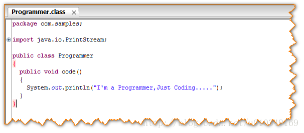
