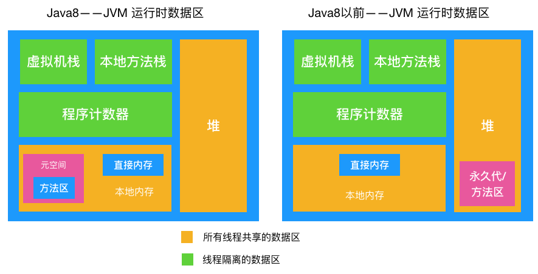
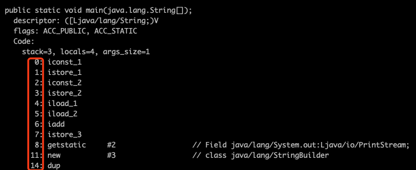

[TOC]

# 1. 虚拟机栈
* 描述的是方法执行时的内存模型,是线程私有的，生命周期与线程相同,

* 每个方法被执行的同时会创建**栈桢**，主要保存执行方法时的局部变量表、操作数栈、动态连接和方法返回地址等信息。

* 方法执行时入栈，方法执行完出栈，出栈就相当于清空了数据，

* 入栈出栈的时机很明确，所以这块区域**不需要进行 GC**。

# 2. 本地方法栈
与虚拟机栈功能非常类似，主要区别在于：
* 虚拟机栈**为虚拟机执行 Java 方法**时服务，

* 而本地方法栈**为虚拟机执行本地方法**时服务的。

这块区域也**不需要进行 GC**

# 3. 程序计数器
线程独有的， 可以把它看作是当前线程执行的字节码的行号指示器，比如如下字节码内容，在每个字节码前面都有一个数字（行号），我们可以认为它就是程序计数器存储的内容。

## 记录这些数字（指令地址）有啥用呢？
* 我们知道 Java 虚拟机的多线程是通过线程轮流切换并分配处理器的时间来完成的，在任何一个时刻，一个处理器只会执行一个线程。

* 如果这个线程被分配的时间片执行完了（线程被挂起），处理器会切换到另外一个线程执行，当下次轮到执行被挂起的线程（唤醒线程）时，怎么知道上次执行到哪了呢，通过记录在程序计数器中的行号指示器即可知道，

* 所以程序计数器的主要作用是记录线程运行时的状态，方便线程被唤醒时能从上一次被挂起时的状态继续执行，

* 需要注意的是，程序计数器是唯一一个在 Java 虚拟机规范中没有规定任何 OOM 情况的区域，所以这块区域也**不需要进行 GC**

# 4. 本地内存
线程共享区域，Java 8 中，本地内存，也是我们通常说的堆外内存，包含元空间和直接内存。

## 元空间与方法区
元空间（metaspace）是方法区的一个实现，是一块直接内存，已经不属于JVM了，由系统决定大小，当然也可调。

jdk1.8，字符串常量池StringPool移到了元空间，StringPool维护的是**字符串的引用**，不是实例（在HotSpot虚拟机找那个，实现stringpool的是StringTable类，是一个哈希表来记录引用），实例在堆中开辟了一块空间，专门储存。

**元空间存储元素：**

* 字符串常量池-字符串的引用，实例在堆中

* 运行时常量池

* 类加载后的类信息

* final定义的常量

* 静态变量

* 即时编译器编译后的代码

## Java 8 和 Java 8 之前的 JVM 内存区域的区别

* 在 Java 8 之前有个永久代的概念，实际上指的是 HotSpot 虚拟机上的永久代，

* 它用永久代实现了 JVM 规范定义的**方法区功能**，这部分由于是在堆中实现的，受 GC 的管理，不过由于永久代有` -XX:MaxPermSize` 的上限，所以如果动态生成类（将类信息放入永久代）或大量地执行 String.intern （将字段串放入永久代中的常量区），很容易造成 OOM。（有人说可以把永久代设置得足够大，但很难确定一个合适的大小，受类数量，常量数量的多少影响很大）。

* 所以在 Java 8 中就把方法区的实现移到了本地内存中的元空间中，这样方法区就不受 JVM 的控制了,也就不会进行 GC

* 也因此提升了性能（发生 GC 会发生 Stop The Word,造成性能受到一定影响，后文会提到），也就不存在由于永久代限制大小而导致的 OOM 异常了。

* 假设总内存2G，JVM 被分配内存 100M， 理论上元空间可以分配 2G-100M = 1.9G，空间大小足够，也方便在元空间中统一管理。综上所述，**在 Java 8 以后这一区域也不需要进行 GC**

* 堆外内存的释放参加其他文章

# 5. 堆
* 前面几块数据区域都不进行 GC，那只剩下堆了，是的，这里是 GC 发生的区域！

* 对象实例和数组都是在堆上分配的，GC 也主要对这两类数据进行回收，
