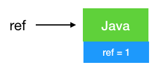
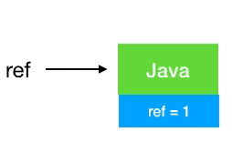
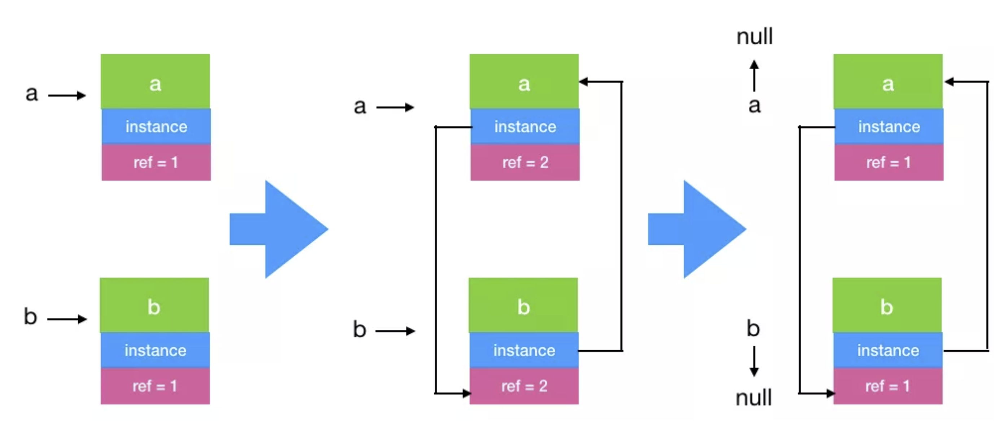
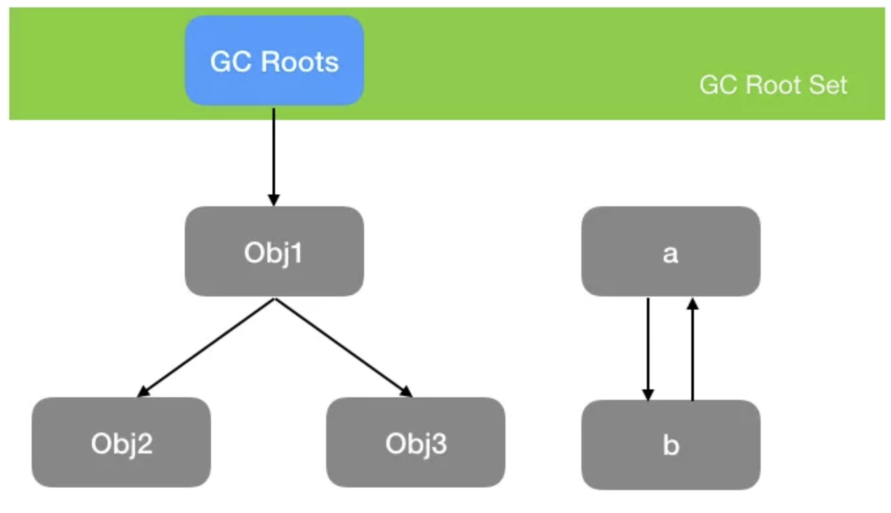
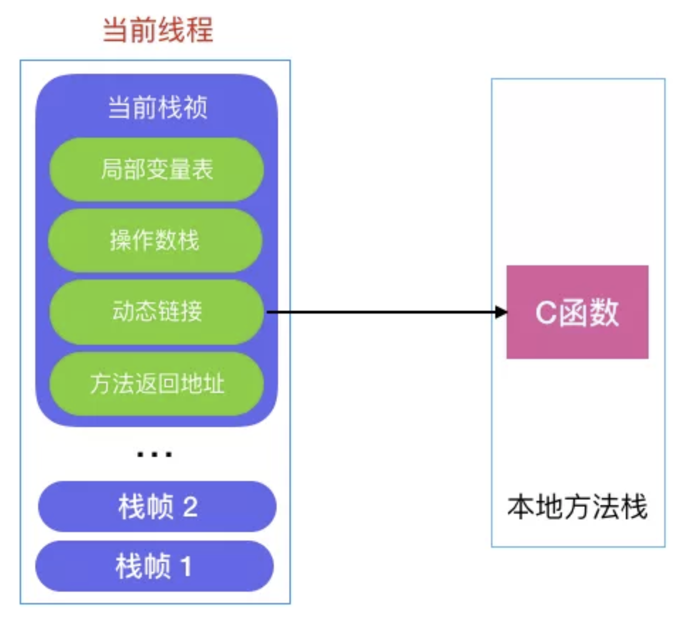

[TOC]
# 1. 引用计数法
对象被引用一次，在它的对象头上加一次引用次数，如果没有被引用（引用次数为 0），则此对象可回收.
```java
String ref = new String("Java");
```
以上代码 ref1 引用了右侧定义的对象，所以引用次数是 1

如果在上述代码后面添加一个 ref = null，则由于对象没被引用，引用次数置为 0，由于不被任何变量引用，此时即被回收，动图如下:

> JAVA中有四种引用类型：强引用，软引用，弱引用，虚引用。

看起来用引用计数确实没啥问题了，不过它无法解决一个主要的问题：**循环引用**！

啥叫循环引用?
```java
public class TestRC {

    TestRC instance;
    public TestRC(String name) {
    }

    public static  void main(String[] args) {
        // 第一步
	A a = new TestRC("a");
	B b = new TestRC("b");

        // 第二步
	a.instance = b;
	b.instance = a;

        // 第三步
	a = null;
	b = null;
    }
}
```

到了第三步，虽然 a，b 都被置为 null 了，但是由于之前它们指向的对象互相指向了对方（引用计数都为 1），所以无法回收，也正是由于无法解决循环引用的问题，所以现代虚拟机都不用引用计数法来判断对象是否应该被回收。

# 2. 可达性算法
现代虚拟机基本都是采用这种算法来判断对象是否存活，可达性算法的原理是以一系列叫做`GC Root`的对象为起点出发，引出它们指向的下一个节点，再以下个节点为起点，引出此节点指向的下一个结点。。。（这样通过`GC Root`串成的一条线就叫引用链），直到所有的结点都遍历完毕,如果相关对象不在任意一个以`GC Root`为起点的引用链中，则这些对象会被判断为「垃圾」,会被 GC 回收。

如图示，如果用可达性算法即可解决上述循环引用的问题，因为从GC Root 出发没有到达 a,b,所以 a，b 可回收.

## a, b 对象可回收，就一定会被回收吗?
并不是，对象的 finalize 方法给了对象一次垂死挣扎的机会，当对象不可达（可回收）时，当发生GC时，会先判断对象是否执行了 finalize 方法，如果未执行，则会先执行 finalize 方法，我们可以在此方法里将当前对象与 GC Roots 关联，这样执行 finalize 方法之后，GC 会再次判断对象是否可达，如果不可达，则会被回收，如果可达，则不回收！

注意： **finalize 方法只会被执行一次，如果第一次执行 finalize 方法此对象变成了可达确实不会回收，但如果对象再次被 GC，则会忽略 finalize 方法，对象会被回收！这一点切记!**

## 那么这些 GC Roots 到底是什么东西呢，哪些对象可以作为 GC Root 呢，有以下几类

### 1. 虚拟机栈（栈帧中的本地变量表）中引用的对象
如下代码所示，a 是栈帧中的本地变量，当 a = null 时，由于此时 a 充当了 GC Root 的作用，a 与原来指向的实例 new Test() 断开了连接，所以对象会被回收。
```java
public class Test {
    public static  void main(String[] args) {
	Test a = new Test();
	a = null;
    }
}
```

### 2. 方法区中 类静态属性 引用的对象
如下代码所示，当栈帧中的本地变量 a = null 时，由于 a 原来指向的对象与 GC Root (变量 a) 断开了连接，所以 a 原来指向的对象会被回收，而由于我们给 s 赋值了变量的引用，s 在此时是类静态属性引用，充当了 GC Root 的作用，它指向的对象依然存活!

```java
public class Test {
    public static Test s;
    public static  void main(String[] args) {
	Test a = new Test();
	a.s = new Test();
	a = null;
    }
}
```
### 3. 方法区中 常量 引用的对象
如下代码所示，常量 s 指向的对象并不会因为 a 指向的对象被回收而回收
```java
public class Test {
	public static final Test s = new Test();
        public static void main(String[] args) {
	    Test a = new Test();
	    a = null;
        }
}
```

### 4. 本地方法栈中 JNI（即一般说的 Native 方法）引用的对象
> 所谓**本地方法**就是一个 java 调用非 java 代码的接口，该方法并非 Java 实现的，可能由 C 或 Python等其他语言实现的， Java 通过 JNI 来调用本地方法， 而本地方法是以库文件的形式存放的（在 WINDOWS 平台上是 DLL 文件形式，在 UNIX 机器上是 SO 文件形式）。通过调用本地的库文件的内部方法，使 JAVA 可以实现和本地机器的紧密联系，调用系统级的各接口方法。

当调用 Java 方法时，虚拟机会创建一个栈桢并压入 Java 栈，而当它调用的是本地方法时，虚拟机会保持 Java 栈不变，不会在 Java 栈祯中压入新的祯，虚拟机只是简单地动态连接并直接调用指定的本地方法。


```java
JNIEXPORT void JNICALL Java_com_pecuyu_jnirefdemo_MainActivity_newStringNative(JNIEnv *env, jobject instance，jstring jmsg) {
...
   // 缓存String的class
   jclass jc = (*env)->FindClass(env, STRING_PATH);
}
```
如上代码所示，当 java 调用以上本地方法时，jc 会被**本地方法栈**压入栈中,指压入本地方法栈，不是当前线程栈。 jc 就是我们说的本地方法栈中 JNI 的对象引用，因此只会在此本地方法执行完成后才会被释放。