[TOC]
上一节我们知道了可以通过**可达性算法**来识别哪些数据是垃圾，那该怎么对这些垃圾进行回收呢。主要有以下几种方式方式

* 标记清除算法

* 复制算法

* 标记整理法

# 一、标记清除算法
1. 先根据可达性算法标记出相应的可回收对象（图中黄色部分）

2. 对可回收的对象进行回收

操作起来确实很简单，也不用做移动数据的操作
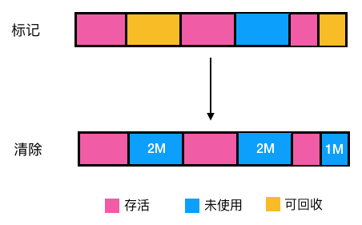

## 问题
会存在内存碎片！假如我们想在上图中的堆中分配一块需要连续内存占用 4M 或 5M 的区域，显然是会失败，怎么解决呢，如果能把上面未使用的 2M， 2M，1M 内存能连起来就能连成一片可用空间为 5M 的区域即可，怎么做呢?

# 二、复制算法
1. 把堆等分成两块区域, A 和 B；

2. 区域 A 负责分配对象，区域 B 不分配；

3. 对区域 A 使用以上所说的标记法把存活的对象标记出来；

4. 然后把区域 A 中存活的对象都复制到区域 B（存活对象都依次紧邻排列）；

5. 最后把 A 区对象全部清理掉释放出空间，这样就解决了内存碎片的问题了。

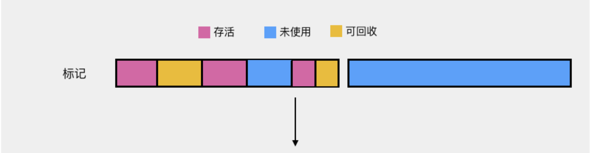
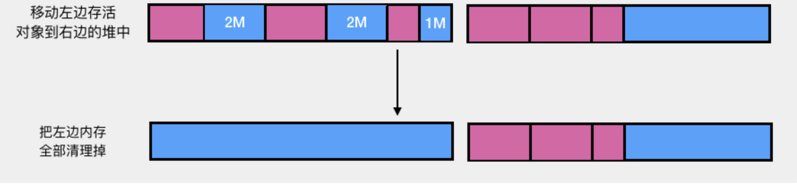

不过复制算法的缺点很明显，比如给堆分配了 500M 内存，结果只有 250M 可用，空间平白无故减少了一半！这肯定是不能接受的！另外每次回收也要把存活对象移动到另一半，效率低下（我们可以想想删除数组元素再把非删除的元素往一端移，效率显然堪忧）

# 三、标记整理法
前面两步和**标记清除法**一样，不同的是它在**标记清除法的基础上添加了一个整理**的过程 ，

即将所有的存活对象都往一端移动,紧邻排列（如图示），再清理掉另一端的所有区域，这样的话就解决了内存碎片的问题。

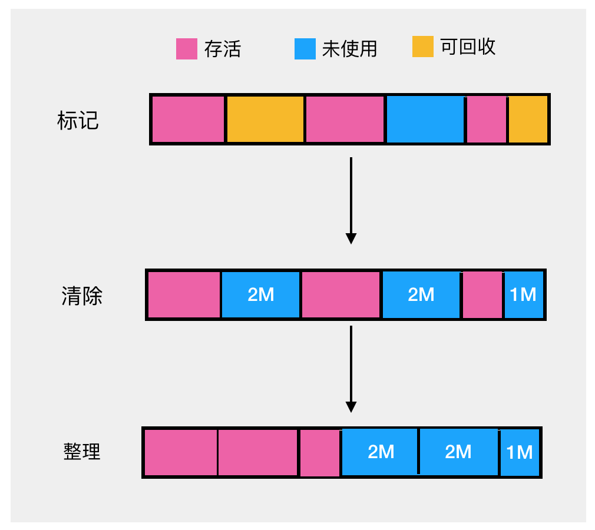

但是缺点也很明显：每进一次垃圾清除都要频繁地移动存活的对象，效率十分低下。

# 四、分代收集算法
分代收集算法整合了以上算法，综合了这些算法的优点，最大程度避免了它们的缺点，所以是现代虚拟机采用的首选算法,与其说它是算法，倒不是说它是一种策略，因为它是把上述几种算法整合在了一起，为啥需要分代收集呢，来看一下对象的分配有啥规律
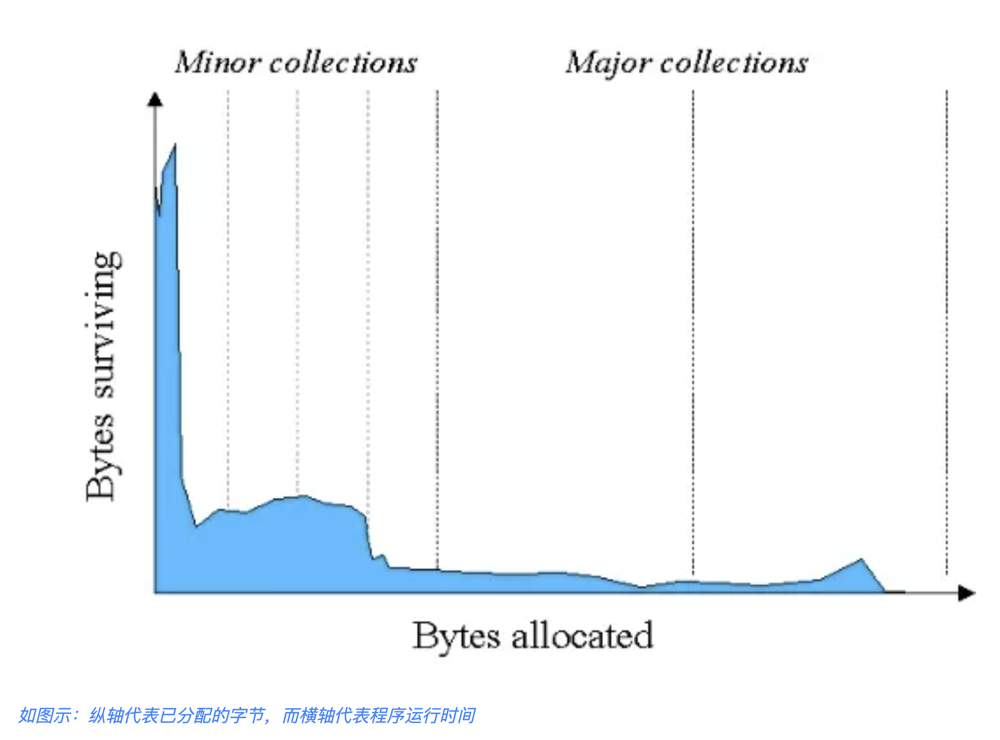

1. 由图可知，大部分的对象都很短命，都在很短的时间内都被回收了（IBM 专业研究表明，一般来说，98% 的对象都是朝生夕死的，经过一次 Minor GC 后就会被回收），

2. 所以分代收集算法根据**对象存活周期的不同**将堆分成新生代和老生代（Java8以前还有个永久代）,默认比例为 1 : 2，

3. 新生代又分为 Eden 区， from Survivor 区（简称S0），to Survivor 区(简称 S1),三者的比例为 8: 1 : 1，

4. 这样就可以根据新老生代的特点选择最合适的垃圾回收算法，我们把新生代发生的 GC 称为 Young GC（也叫 Minor GC）,老年代发生的 GC 称为 Old GC（也称为 Full GC）。

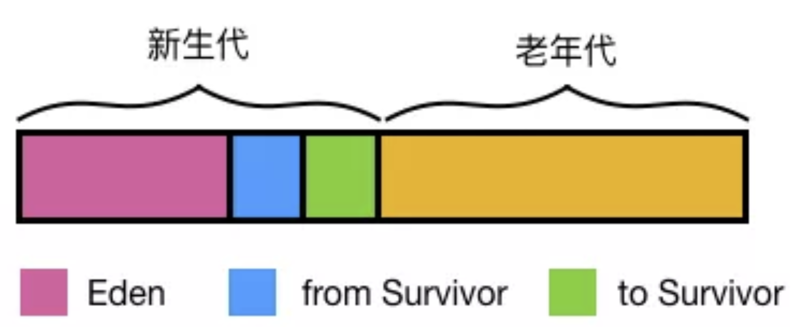

## 分代收集工作原理
### 1、对象在新生代的分配与回收

由以上的分析可知，大部分对象在很短的时间内都会被回收，对象一般分配在 Eden 区

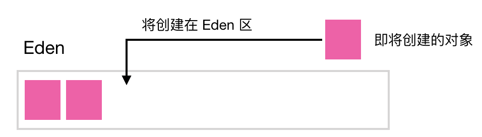

当 Eden 区将满时，触发 Minor GC

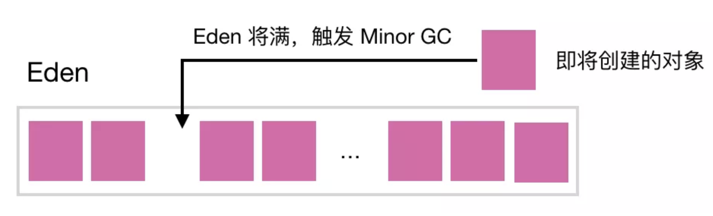

大部分对象在短时间内都会被回收, 所以经过 Minor GC 后只有少部分对象会存活，它们会被移到 S0 区（这就是为啥空间大小  Eden: S0: S1 = 8:1:1, Eden 区远大于 S0,S1 的原因，因为在 Eden 区触发的 Minor GC 把大部对象（接近98%）都回收了,只留下少量存活的对象，此时把它们移到 S0 或 S1 绰绰有余）同时对象年龄加一（对象的年龄即发生 Minor GC 的次数），最后把 Eden 区对象全部清理以释放出空间,动图如下

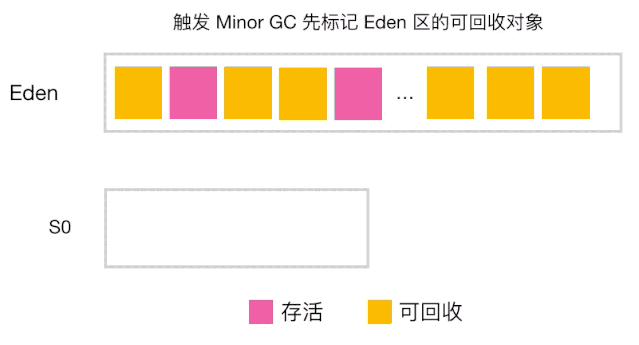

当触发下一次 Minor GC 时，会把 Eden 区的存活对象和 S0（或S1） 中的存活对象（S0 或 S1 中的存活对象经过每次 Minor GC 都可能被回收）一起移到 S1（Eden 和 S0 的存活对象年龄+1）, 同时清空 Eden 和 S0 的空间。

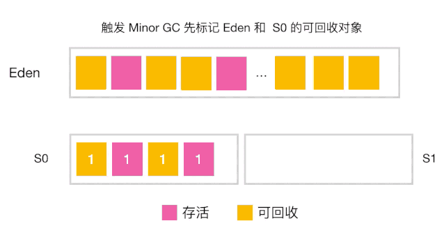

若再触发下一次 Minor GC，则重复上一步，只不过此时变成了 从 Eden，S1 区将存活对象复制到 S0 区,每次垃圾回收, S0, S1 角色互换，都是从 Eden ,S0(或S1) 将存活对象移动到 S1(或S0)。也就是说在 Eden 区的垃圾回收我们采用的是复制算法，因为在 Eden 区分配的对象大部分在 Minor GC 后都消亡了，只剩下极少部分存活对象，S0,S1 区域也比较小，所以最大限度地降低了复制算法造成的对象频繁拷贝带来的开销。

### 2、对象何时晋升老年代

* 当对象的年龄达到了我们设定的阈值，则会从S0（或S1）晋升到老年代
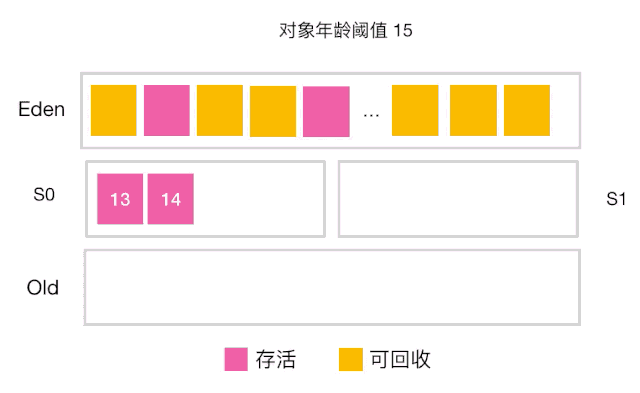
如图示：年龄阈值设置为 15， 当发生下一次 Minor GC 时，S0 中有个对象年龄达到 15，达到我们的设定阈值，晋升到老年代！

* **大对象**---当某个对象分配需要大量的连续内存时，此时对象的创建不会分配在 Eden 区，会直接分配在老年代，因为如果把大对象分配在 Eden 区, Minor GC 后再移动到 S0,S1 会有很大的开销（对象比较大，复制会比较慢，也占空间），也很快会占满 S0,S1 区，所以干脆就直接移到老年代.

* 还有一种情况也会让对象晋升到老年代，即在 S0（或S1） 区相同年龄的对象大小之和大于 S0（或S1）空间一半以上时，则年龄大于等于该年龄的对象也会晋升到老年代。

### 3、空间分配担保

在发生 MinorGC 之前，虚拟机会先检查老年代最大可用的连续空间是否大于新生代所有对象的总空间，

* 如果大于，那么Minor GC 可以确保是安全的；

* 如果不大于，那么虚拟机会查看 HandlePromotionFailure 设置值是否允许担保失败。如果允许，那么会继续检查老年代最大可用连续空间是否大于历次晋升到老年代对象的平均大小，如果大于则进行 Minor GC，否则可能进行一次 Full GC。

### 4、Stop The World
如果老年代满了，会触发 Full GC, Full GC 会同时回收新生代和老年代（即对整个堆进行GC），它会导致 Stop The World（简称 STW）,造成挺大的性能开销。
所谓的 STW, 即在 GC（minor GC 或 Full GC）期间，只有垃圾回收器线程在工作，其他工作线程则被挂起。
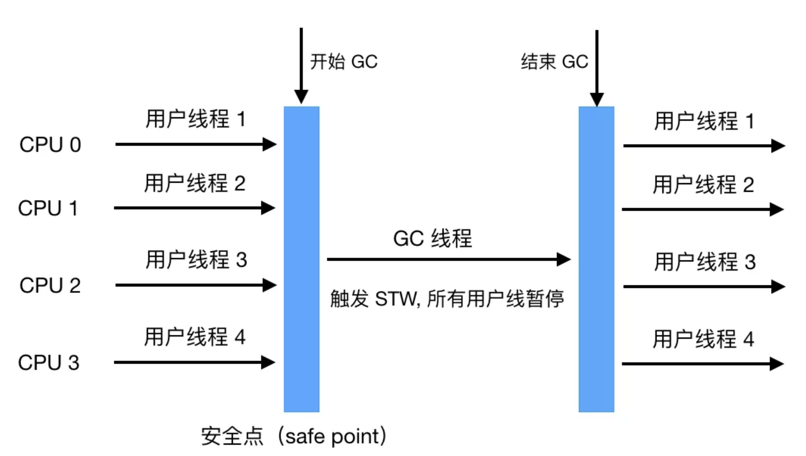

一般 Full GC 会导致工作线程停顿时间过长（因为Full GC 会清理整个堆中的不可用对象，一般要花较长的时间），如果在此 server 收到了很多请求，则会被拒绝服务！

所以我们要尽量减少 Full GC（Minor GC 也会造成 STW,但只会触发轻微的 STW,因为 Eden 区的对象大部分都被回收了，只有极少数存活对象会通过复制算法转移到 S0 或 S1 区，所以相对还好）。

现在我们应该明白把新生代设置成 Eden, S0，S1区或者给对象设置年龄阈值或者默认把新生代与老年代的空间大小设置成 1:2 都是为了**尽可能地避免对象过早地进入老年代，尽可能晚地触发 Full GC**。

想想新生代如果只设置 Eden 会发生什么，就是每经过一次 Minor GC，存活对象会过早地进入老年代，那么老年代很快就会装满，很快会触发 Full GC，而对象其实在经过两三次的 Minor GC 后大部分都会消亡，所以有了 S0,S1的缓冲，只有少数的对象会进入老年代，老年代大小也就不会这么快地增长，也就避免了过早地触发 Full GC。

由于 Full GC（或Minor GC） 会影响性能，所以我们要在一个合适的时间点发起 GC，这个时间点被称为`Safe Point`，这个时间点的选定既不能太少以让 GC 时间太长导致程序过长时间卡顿，也不能过于频繁以至于过分增大运行时的负荷。一般当线程在这个时间点上状态是可以确定的，如确定 GC Root 的信息等，可以使 JVM 开始安全地 GC。Safe Point 主要指的是以下特定位置：

* 循环的末尾

* 方法返回前

* 调用方法的 call 之后

* 抛出异常的位置 

另外需要注意的是由于新生代的特点（大部分对象经过 Minor GC后会消亡）， Minor GC 用的是复制算法，而在老生代由于对象比较多，占用的空间较大，使用复制算法会有较大开销（复制算法在对象存活率较高时要进行多次复制操作，同时浪费一半空间）所以根据老生代特点，**在老年代进行的 GC 一般采用的是标记整理法来进行回收。**