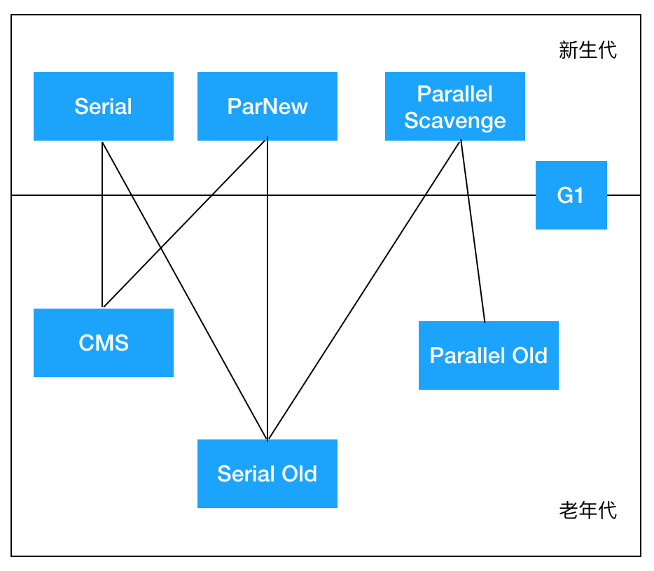
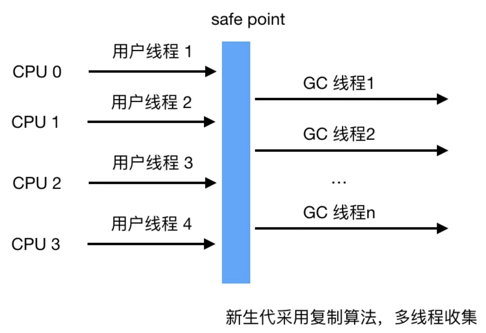
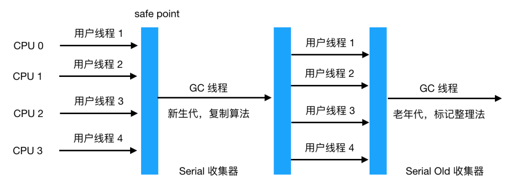
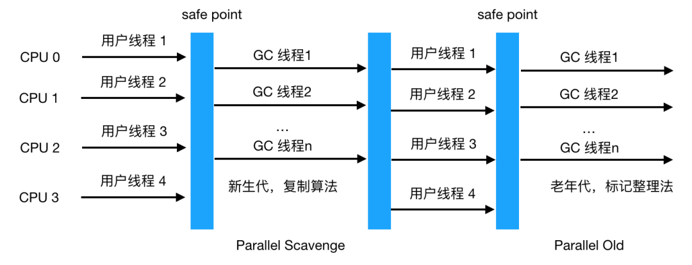
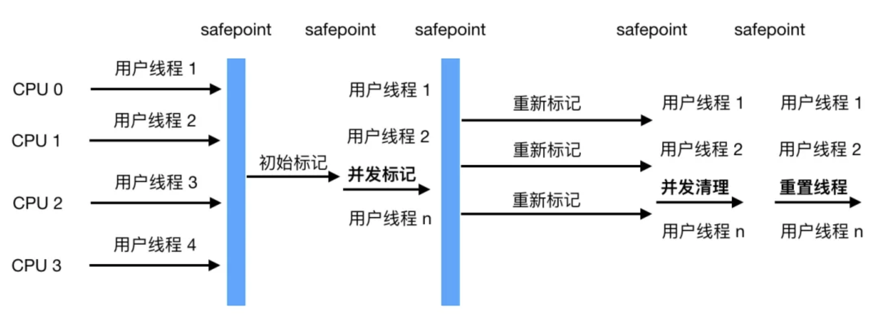
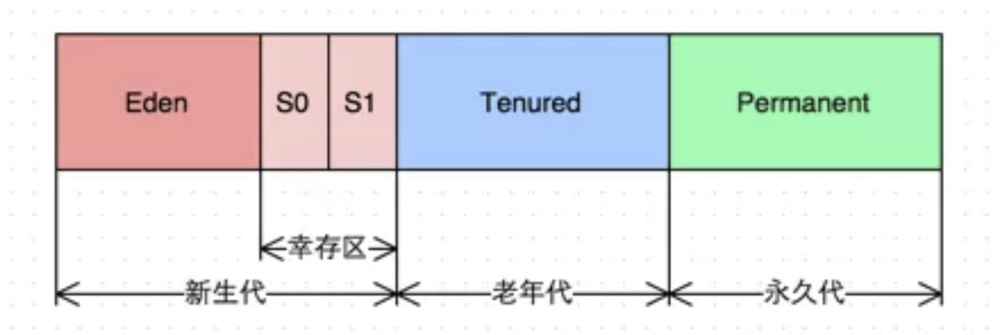
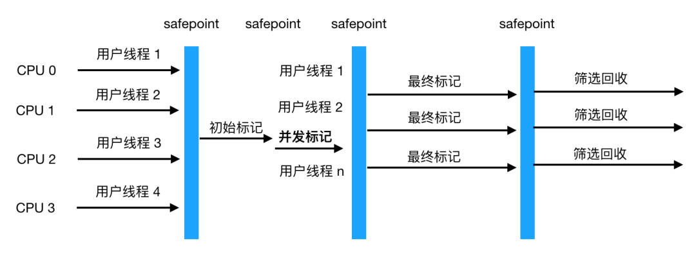
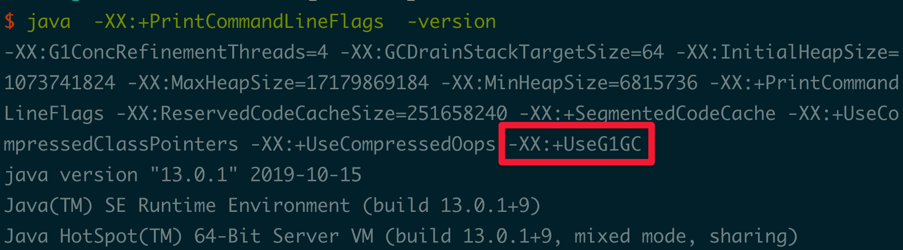

[TOC]

# 一、简介
如果说收集算法是内存回收的方法论，那么垃圾收集器就是内存回收的具体实现。Java 虚拟机规范并没有规定垃圾收集器应该如何实现，因此一般来说不同厂商，不同版本的虚拟机提供的垃圾收集器实现可能会有差别，一般会给出参数来让用户根据应用的特点来组合各个年代使用的收集器，主要有以下垃圾收集器


* 在新生代工作的垃圾回收器：Serial, ParNew, ParallelScavenge

* 在老年代工作的垃圾回收器：CMS，Serial Old, Parallel Old

* 同时在新老生代工作的垃圾回收器：G1

图片中的垃圾收集器如果存在连线，则代表它们之间可以配合使用，接下来我们来看看各个垃圾收集器的具体功能。

# 二、新生代收集器
## 1. Serial 收集器
Serial 收集器是工作在新生代的，单线程的垃圾收集器，单线程意味着它只会使用一个 CPU 或一个收集线程来完成垃圾回收，不仅如此，还记得我们上文提到的 STW 了吗，它在进行垃圾收集时，其他用户线程会暂停，直到垃圾收集结束，也就是说在 GC 期间，此时的应用不可用。

看起来单线程垃圾收集器不太实用，不过我们需要知道的任何技术的使用都不能脱离场景，在 Client 模式下，它简单有效（与其他收集器的单线程比），对于限定单个 CPU 的环境来说，Serial 单线程模式无需与其他线程交互，减少了开销，专心做 GC 能将其单线程的优势发挥到极致，另外在用户的桌面应用场景，分配给虚拟机的内存一般不会很大，收集几十甚至一两百兆（仅是新生代的内存，桌面应用基本不会再大了），STW 时间可以控制在一百多毫秒内，只要不是频繁发生，这点停顿是可以接受的，所以对于运行在 Client 模式下的虚拟机，Serial 收集器是新生代的默认收集器。

## 2. ParNew 收集器

ParNew 收集器是 Serial 收集器的多线程版本，除了使用多线程，其他像收集算法,STW,对象分配规则，回收策略与 Serial 收集器完成一样，在底层上，这两种收集器也共用了相当多的代码，它的垃圾收集过程如下：

ParNew 主要工作在 **Server 模式**，我们知道服务端如果接收的请求多了，响应时间就很重要了，多线程可以让垃圾回收得更快，也就是减少了 STW 时间，能提升响应时间，所以是许多运行在 Server 模式下的虚拟机的首选新生代收集器，另一个与性能无关的原因是**因为除了 Serial  收集器，只有它能与 CMS 收集器配合工作**，

CMS 是一个划时代的垃圾收集器，是真正意义上的并发收集器，它第一次实现了垃圾收集线程与用户线程（基本上）同时工作，它采用的是传统的 GC 收集器代码框架，与 Serial,ParNew 共用一套代码框架，所以能与这两者一起配合工作。

而后文提到的 Parallel Scavenge 与 G1 收集器没有使用传统的 GC 收集器代码框架，而是另起炉灶独立实现的，另外一些收集器则只是共用了部分的框架代码,所以无法与 CMS 收集器一起配合工作。

在多 CPU 的情况下，由于 ParNew 的多线程回收特性，毫无疑问垃圾收集会更快，也能有效地减少 STW 的时间，提升应用的响应速度。

## 3. Parallel Scavenge 收集器

Parallel Scavenge 收集器也是一个使用**复制算法，多线程**，工作于新生代的垃圾收集器，看起来功能和 ParNew 收集器一样，它有啥特别之处吗？

**关注点不同**
* CMS 等垃圾收集器关注的是尽可能缩短垃圾收集时用户线程的停顿时间，而 Parallel Scavenge 目标是达到一个可控制的吞吐量（吞吐量 = 运行用户代码时间 / （运行用户代码时间+垃圾收集时间）），也就是说 CMS 等垃圾收集器更适合用到与用户交互的程序，因为停顿时间越短，用户体验越好，

* Parallel Scavenge 收集器关注的是吞吐量，所以更适合做后台运算等不需要太多用户交互的任务。

Parallel Scavenge 收集器提供了两个参数来精确控制吞吐量，分别是：

* 控制最大垃圾收集时间的 -XX:MaxGCPauseMillis 参数

* 直接设置吞吐量大小的 -XX:GCTimeRatio（默认99%）

* 除了以上两个参数，还可以用 Parallel Scavenge 收集器提供的第三个参数 -XX:UseAdaptiveSizePolicy，开启这个参数后，就不需要手工指定新生代大小,Eden 与 Survivor 比例（SurvivorRatio）等细节，只需要设置好基本的堆大小（-Xmx 设置最大堆）,以及最大垃圾收集时间与吞吐量大小，虚拟机就会根据当前系统运行情况收集监控信息，动态调整这些参数以尽可能地达到我们设定的最大垃圾收集时间或吞吐量大小这两个指标。**自适应策略**也是 Parallel Scavenge  与 ParNew 的重要区别！

# 三、老年代收集器
## 1. Serial Old 收集器
上文我们知道， Serial 收集器是工作于**新生代**的单线程收集器，与之相对地，Serial Old 是工作于**老年代**的单线程收集器。

此收集器的主要意义在于给 Client 模式下的虚拟机使用，如果在 Server 模式下，则它还有两大用途：

* 一种是在 JDK 1.5 及之前的版本中与 Parallel Scavenge 配合使用，

* 另一种是作为 CMS 收集器的后备预案,在并发收集发生 `Concurrent Mode Failure` 时使用（后文讲述）,它与 Serial 收集器配合使用示意图如下:
 

## 2. Parallel Old 收集器
Parallel Old 是相对于 Parallel Scavenge 收集器的老年代版本，使用**多线程和标记整理法**，两者组合示意图如下,这两者的组合由于都是多线程收集器，真正实现了**「吞吐量优先」**的目标


## 3. CMS 收集器
CMS 收集器是以实现最短 STW 时间为目标的收集器，如果应用很重视服务的响应速度，希望给用户最好的体验，则 CMS 收集器是个很不错的选择！

我们之前说老年代主要用标记整理法，而 CMS 虽然工作于老年代，但采用的是标记清除法，主要有以下四个步骤

1. 初始标记

2. 并发标记

3. 重新标记

4. 并发清除


从图中可以的看到初始标记和重新标记两个阶段会发生 STW，造成用户线程挂起。
* 初始标记仅标记 GC Roots 能关联的对象，速度很快，

* 并发标记是进行 GC Roots  Tracing 的过程，

* 重新标记是为了修正并发标记期间因用户线程继续运行而导致标记产生变动的那一部分对象的标记记录，这一阶段停顿时间**一般比初始标记阶段稍长，但远比并发标记时间短。**

**整个过程中耗时最长的是并发标记和标记清理**，不过这两个阶段用户线程都可工作，所以不影响应用的正常使用，所以总体上看，可以认为 CMS 收集器的**内存回收过程是与用户线程一起并发执行的**。

但是 CMS 收集器远达不到完美的程度，主要有以下四个缺点：

### CMS 收集器对 CPU 资源非常敏感
原因也可以理解，比如本来我本来可以有 10 个用户线程处理请求，现在却要分出 3 个作为回收线程，吞吐量下降了30%，CMS 默认启动的回收线程数是 （CPU数量+3）/ 4, 如果 CPU 数量只有一两个，那吞吐量就直接下降 50%,显然是不可接受的。

### Promotion Failed ---> Concurrent Mode Failure
该问题出现的原因是无法处理浮动垃圾（Floating Garbage），
具体原因是在执行CMS GC的过程中同时业务线程将对象放入老年代，而此时老年代空间不足，
或者在做Minor GC的时候，新生代Survivor空间放不下，需要放入老年代，而老年代也放不下而产生的。
导致需要进行stop-the-world的Serial Old收集器。而我们知道 Serial Old 收集器是单线程收集器，这样就会导致 STW 更长了。
下面是一个Promotion Failed的日志：
```java
106.641: [GC 106.641: [ParNew (promotion failed): 14784K->14784K(14784K), 0.0370328 secs]106.678: [CMS106.715: [CMS-concurrent-mark: 0.065/0.103 secs] [Times: user=0.17 sys=0.00, real=0.11 secs]
(concurrent mode failure): 41568K->27787K(49152K), 0.2128504 secs] 52402K->27787K(63936K), [CMS Perm : 2086K->2086K(12288K)], 0.2499776 secs] [Times: user=0.28 sys=0.00, real=0.25 secs]
```
下面是一个Concurrent Mode Failure的日志
```java
0.195: [GC 0.195: [ParNew: 2986K->2986K(8128K), 0.0000083 secs]0.195: [CMS0.212: [CMS-concurrent-preclean: 0.011/0.031 secs] [Times: user=0.03 sys=0.02, real=0.03 secs]
(concurrent mode failure): 56046K->138K(57344K), 0.0271519 secs] 59032K->138K(65472K), [CMS Perm : 2079K->2078K(12288K)], 0.0273119 secs] [Times: user=0.03 sys=0.00, real=0.03 secs]
```
**解决方案：**
通用方法是调低触发CMS GC执行的阀值，CMS GC触发主要由CMSInitiatingOccupancyFraction值决定，默认情况是当年老代已用空间为68%（JDK1.5）时，即触发CMS GC，在出现concurrent mode failure的情况下，可考虑调小这个值，提前CMS GC的触发，以保证年老代有足够的空间。

### CMS 采用的是标记清除法
上文我们已经提到这种方法会产生大量的内存碎片。这样会给大内存分配带来很大的麻烦，如果无法找到足够大的连续空间来分配对象，将会触发 Full GC，这会影响应用的性能。
**解决方案：**
就是可以让CMS在进行一定次数的Full GC（标记清除）的时候进行一次**标记整理算法**，CMS提供了以下参数来控制：
```shell
-XX:UseCMSCompactAtFullCollection -XX:CMSFullGCBeforeCompaction=5
```
也就是CMS在进行5次Full GC（标记清除）之后进行一次标记整理算法，从而可以控制老年代的碎片在一定的数量以内，甚至可以配置CMS在每次Full GC的时候都进行内存的整理。


## 4. G1（Garbage First） 收集器
G1 收集器是面向服务端的垃圾收集器，被称为驾驭一切的垃圾回收器，主要有以下几个特点

* 像 CMS 收集器一样，能与应用程序线程并发执行。

* 整理空闲空间更快。

* 需要 GC 停顿时间更好预测。

* 不会像 CMS 那样牺牲大量的吞吐性能。

* 不需要更大的 Java Heap

### 与 CMS 相比，它在以下两个方面表现更出色

1. **运作期间不会产生内存碎片**，G1 从整体上看采用的是标记-整理法，局部（两个 Region）上看是基于复制算法实现的，两个算法都不会产生内存碎片，收集后提供规整的可用内存，这样有利于程序的长时间运行。

2. 在 STW 上建立了**可预测**的停顿时间模型，用户可以指定期望停顿时间，G1 会将停顿时间控制在用户设定的停顿时间以内。

### 为什么G1能建立可预测的停顿模型呢？
主要原因在于 G1 对堆空间的分配与传统的垃圾收集器不一样，传统的内存分配就像我们前文所述，是连续的，分成新生代，老年代，新生代又分 Eden,S0,S1,如下：

而 G1 各代的存储地址不是连续的，每一代都使用了 n 个不连续的大小相同的 Region，而新生代和老年代就是由一个个 Region 动态组成的区域，它们可以是不连续的区间。

每一个 Region 都可以根据需要，扮演新生代的 Eden 空间，Survivor 空间，或者老年代空间。每个Region占有一块连续的虚拟内存地址，如图示

除了和传统的新老生代，幸存区的空间区别，Region还多了一个H，它代表Humongous，这表示**这些Region存储的是巨大对象（humongous object，H-obj）**，即**大小大于等于region一半的对象**，这样超大对象就直接分配到了老年代，防止了反复拷贝移动。

* Region 大小的取值范围为 1MB 到 32MB ；

* 默认的Region个数为2048

### 那么 G1 分配成这样有啥好处呢？
传统的收集器如果发生 Full GC 是对整个堆进行全区域的垃圾收集，

而分配成各个 Region 的话，方便 G1 跟踪各个 Region 里垃圾堆积的价值大小（回收所获得的空间大小及回收所需经验值），

这样根据价值大小维护一个优先列表，根据允许的收集时间，优先收集回收价值最大的 Region,也就避免了整个老年代的回收，

也就减少了 STW 造成的停顿时间。同时由于只收集部分 Region,可就做到了 STW 时间的可控。

### G1 收集器的工作步骤如下

#### 1. 初始标记： 
这阶段仅仅只是标记GC Roots能直接关联到的对象并修改TAMS(Next Top at Mark Start)的值，让下一阶段用户程序并发运行时，能在正确的可用的Region中创建新对象，这阶段需要停顿线程，但是耗时很短。

而且是借用进行Minor GC的时候同步完成的，所以G1收集器在这个阶段实际并没有额外的停顿。

#### 2. 并发标记
从GC Roots开始对堆的对象进行可达性分析，递归扫描整个堆里的对象图，找出存活的对象，这阶段耗时较长，但是可以与用户程序并发执行。

当对象图扫描完成以后，还要重新处理SATB记录下的在并发时有引用变动的对象。

#### 3. 最终标记
对用户线程做另一个短暂的暂停，用于处理并发阶段结束后仍遗留下来的最后那少量的 SATB 记录。

#### 4. 筛选回收
负责更新 Region 的统计数据，对各个 Region 的回收价值和成本进行排序，根据用户所期望的停顿时间来制定回收计划。

可以自由选择任意多个 Region 构成回收集，然后把决定回收的那一部分 Region 的存活对象复制到空的 Region 中，再清理掉整个旧 Region 的全部空间。

这里的操作涉及存活对象的移动，是必须暂停用户线程，由多条收集器线程并行完成的。


可以看到整体过程与 CMS 收集器非常类似。

# 四、jdk7、8、9默认垃圾回收器
jdk1.7 默认垃圾收集器Parallel Scavenge（新生代）+Parallel Old（老年代）

jdk1.8 默认垃圾收集器Parallel Scavenge（新生代）+Parallel Old（老年代）

jdk1.9以后 默认垃圾收集器G1

1. `-XX:+PrintCommandLineFlags` 参数可查看默认设置收集器类型
在控制台输入命令
```shell
java  -XX:+PrintCommandLineFlags  -version
```
显示结果:

使用G1垃圾回收器。

2. `-XX:+PrintGCDetails`亦可通过打印的GC日志的新生代、老年代名称判断
# 五、 总结

在生产环境中我们要根据不同的场景来选择垃圾收集器组合。

* 如果是运行在桌面环境处于 Client 模式的，则用 Serial + Serial Old 收集器绰绰有余，

* 如果需要响应时间快，用户体验好的，则用 ParNew + CMS 的搭配模式，

* 即使是号称是「驾驭一切」的 G1，也需要根据吞吐量等要求适当调整相应的 JVM 参数。

没有最牛的技术，只有最合适的使用场景，切记！