[TOC]
# 一、并发标记要解决什么问题
>可达性分析算法是需要一个理论上的前提：该算法的全过程都需要基于一个能保障一致性的快照中才能够分析，这意味着必须全程冻结用户线程的运行。

为了不冻结用户线程的运行，那我们就需要让垃圾回收线程和用户线程同时运行。

## 首先假设不并发标记，只有垃圾回收线程在运行

### 1. 第一步，需要找到根节点，也就是我们常说的根节点枚举。
在这个过程中，由于GC Roots是远远少于整个java堆中的全部对象的，而且在OopMap此类优化技巧的加持下，它带来的停顿时间是非常短暂且相对固定的，**可以理解为不会随着堆里面的对象的增加而增加**
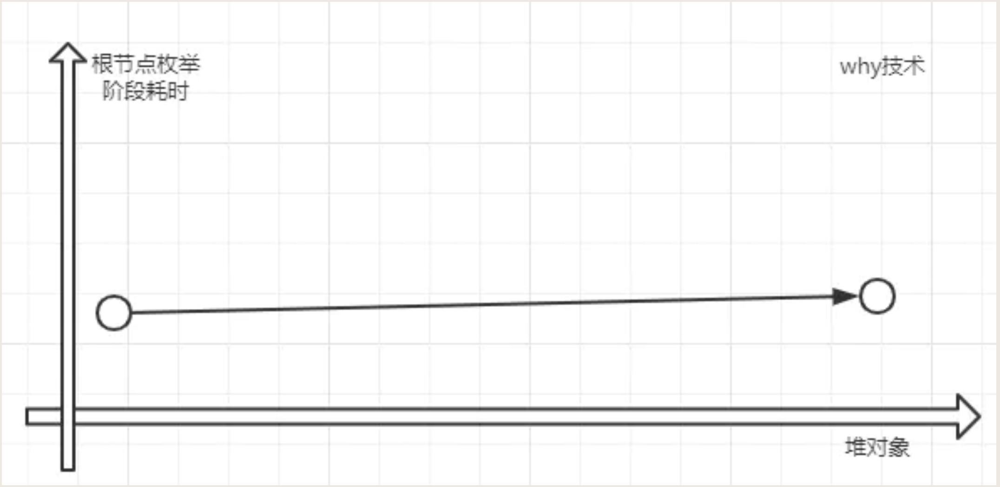

### 2. 第二步，我们需要从GC Roots往下继续遍历对象图，进行"标记"过程。而这一步的停顿时间必然是随着java堆中的对象增加而增加的。
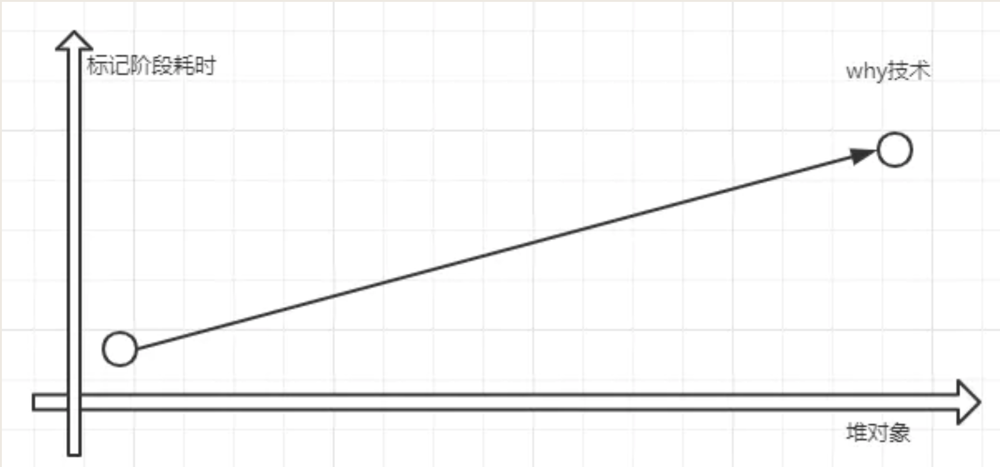

堆越大，存储的对象越多，对象图结构越复杂，要标记更多对象，所以产生的停顿时间也自然就长了。

## 所以并发标记要解决什么问题呢
根节点的枚举阶段是不太耗时的，也不会随着java堆里面存储的对象增加而增加耗时。而"标记"过程的耗时是会随着java堆里面存储的对象增加而增加的。

"标记"阶段是所有使用可达性分析算法的垃圾回收器都有的阶段。如果能够削减"标记"过程这部分的停顿时间，那么收益将是可观的。

**并发标记就是要消减这一部分的停顿时间。那就是让垃圾回收器和用户线程同时运行，并发工作。也就是我们说的并发标记的阶段。**

# 二、并发标记带来了什么问题？
遍历对象图的时候必须在一个能保障一致性的快照中

## 1. 什么是"三色标记"？
在遍历对象图的过程中，把访问都的对象**按照"是否访问过"这个条件**标记成以下三种颜色：

* **白色：表示对象尚未被垃圾回收器访问过。** 显然，在可达性分析刚刚开始的阶段，所有的对象都是白色的，若在分析结束的阶段，仍然是白色的对象，即代表不可达。

* **黑色：表示对象已经被垃圾回收器访问过，且这个对象的所有引用都已经扫描过。** 黑色的对象代表已经扫描过，它是安全存活的，如果有其它的对象引用指向了黑色对象，无须重新扫描一遍。黑色对象不可能直接（不经过灰色对象）指向某个白色对象。

* **灰色：表示对象已经被垃圾回收器访问过，但这个对象至少存在一个引用还没有被扫描过。**

可以看到，**灰色对象是黑色对象与白色对象之间的中间态。当标记过程结束后，只会有黑色和白色的对象，而白色的对象就是需要被回收的对象。**

## 2. 垃圾回收器和用户线程同时运行带来什么问题
垃圾回收器在对象图上面标记颜色，而同时用户线程在修改引用关系，引用关系修改了，那么对象图就变化了，这样就有可能出现两种后果：
* **一种是把原本消亡的对象错误的标记为存活，这不是好事，但是其实是可以容忍的，只不过产生了一点逃过本次回收的浮动垃圾而已，下次清理就可以。**

* **一种是把原本存活的对象错误的标记为已消亡，这就是非常严重的后果了，一个程序还需要使用的对象被回收了，那程序肯定会因此发生错误。**

### 2.1 浮动垃圾
当对象7变为灰色时，断开对象6-->对象7之间的连接，这样当并发标记完成后，对象图就变成了下面这个样子：
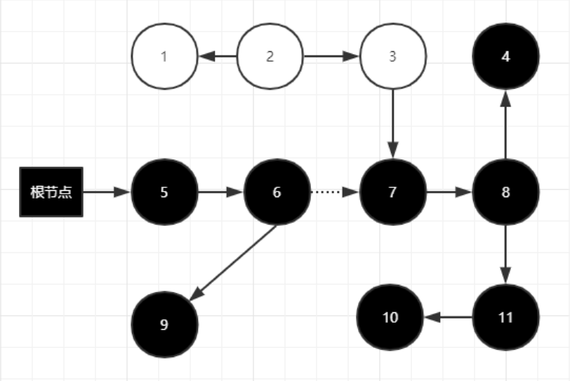
对象7，8，4，11，10都是浮动垃圾。因为他们被标记成了黑色，所以逃过了本次垃圾回收。

### 2.2 对象消失

#### 正常标记
我们先看一下一次正常的标记过程：

首先是初始状态，很简单，只有GC Roots是黑色的。同时需要注意下面的图片的箭头方向，代表的是有向的，比如其中的一条引用链是： **根节点->5->6->7->8->11->10**
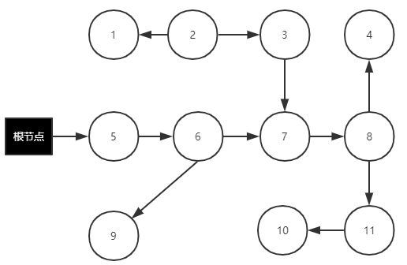
在扫描的过程中，变化是这样的：
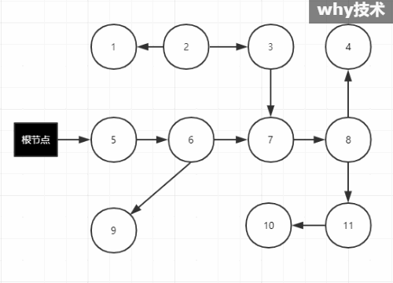
你看上面的动图，灰色对象始终是介于黑色和白色之间的。当扫描顺利完成后，对象图就变成了这个样子：
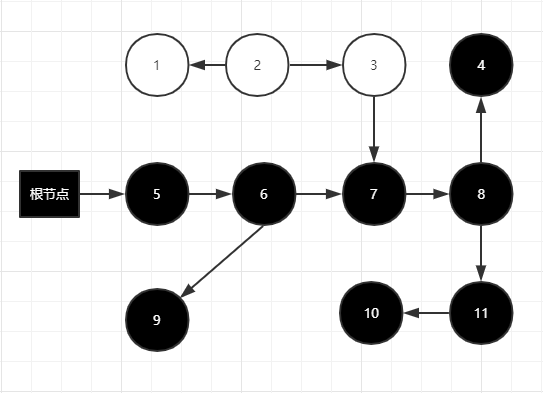
此时，黑色对象是存活的对象，白色对象是消亡了，可以回收的对象。

记住，上面演示的是一切都是那么美好的正常情况。

#### 对象消失的情况一
如果用户线程在标记的时候，修改了引用关系，就会出现下面的情况：
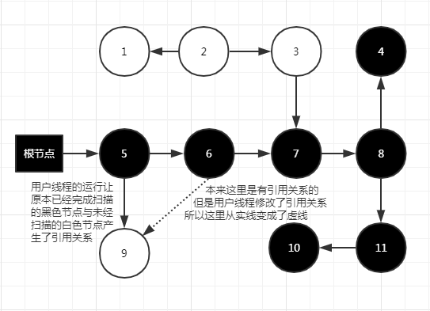

这时，我们和之前分析的正常扫描结束的对象图对比，就能清楚的看到，扫描完成后，原本还在被对象5引用的对象9，由于是白色对象，所以根据三色标记原则，对象9会被当成垃圾回收。

这样就出现了对象消失的情况。

#### 对象消失的情况二
下面再给各位看看另外一种"对象消失"的现象：
>用户线程切断引用后重新被黑色对象引用的对象就是原来引用链的一部分。

对象7和对象10本来就是原引用链（**根节点->5->6->7->8->11->10**）的一部分。修改后的引用链变成了（**根节点->5->6->7->10**）。
当扫描完成后，对象图就变成了这个样子：
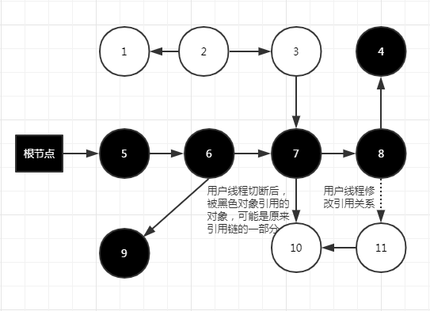
由于黑色对象不会重新扫描，这将导致扫描结束后对象10和对象11都会回收了。他们都是被修改之前的原来的引用链的一部分。

## 3. 所以并发标记带来了什么问题？
经过我们上面三种情况(一种正常情况，两种"对象丢失"的情况)的动图分析，和扫描完成后的最终对象图进行分析对比，我们知道了，**并发标记除了会产生浮动垃圾，还会出现"对象消失"的问题。**

# 三、怎么解决"对象消失"问题呢？
有一个大佬叫Wilson，他在1994年在理论上证明了，当且仅当以下两个条件**同时满足**时，会产生"对象消失"的问题：

* 条件一：赋值器插入了一条或者多条从黑色对象到白色对象的新引用。

* 条件二：赋值器删除了全部从灰色对象到该白色对象的直接或间接引用。

你在结合我们上面出现过的图捋一捋上面的这两个条件，是不是当且仅当的关系：

* 黑色对象5到白色对象9之间的引用是新建的，对应条件一。

* 黑色对象6到白色对象9之间的引用被删除了，对应条件二。

由于两个条件之间是当且仅当的关系。所以，我们要解决并发标记时对象消失的问题，只需要破坏两个条件中的任意一个就行。
于是产生了两种解决方案：

* **增量更新（Incremental Update）**

* **原始快照（Snapshot At The Beginning，SATB）**

在HotSpot虚拟机中，**CMS是基于增量更新来做并发标记的，G1则采用的是原始快照的方式。**

## 1. 什么是增量更新----用的是写后屏障(Post-Write Barrier)，记录了所有新增的引用关系。

增量更新要破坏的是第一个条件（赋值器插入了一条或者多条从黑色对象到白色对象的新引用），当黑色对象插入新的指向白色对象的引用关系时，就将这个新插入的引用记录下来，等并发扫描结束之后，再将这些记录过的引用关系中的黑色对象为根，重新扫描一次。

可以简化的理解为：**黑色对象一旦插入了指向白色对象的引用之后，它就变回了灰色对象。**

下面的图就是一次并发扫描结束之后，记录了黑色对象5新指向了白色对象9：
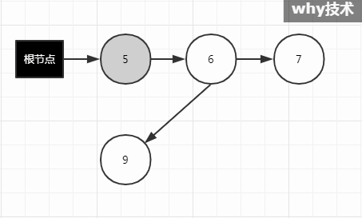

这样对象9又被扫描成为了黑色。也就不会被回收，所以不会出现对象消失的情况。

## 2. 什么是原始快照---用的是写前屏障(Pre-Write Barrier)，将所有即将被删除的引用关系的旧引用记录下来。
原始快照要破坏的是第二个条件（赋值器删除了全部从灰色对象到该白色对象的直接或间接引用），当灰色对象要删除指向白色对象的引用关系时，就将这个要删除的引用记录下来，在并发扫描结束之后，再将这些记录过的引用关系中的灰色对象为根，重新扫描一次。

这个可以简化理解为：**无论引用关系删除与否，都会按照刚刚开始扫描那一刻的对象图快照进行搜索。**

1. 首先，我们看初始标记阶段（即根节点枚举）完成后，刚刚进入并发标记阶段，GC 线程开始扫描时的对象图：
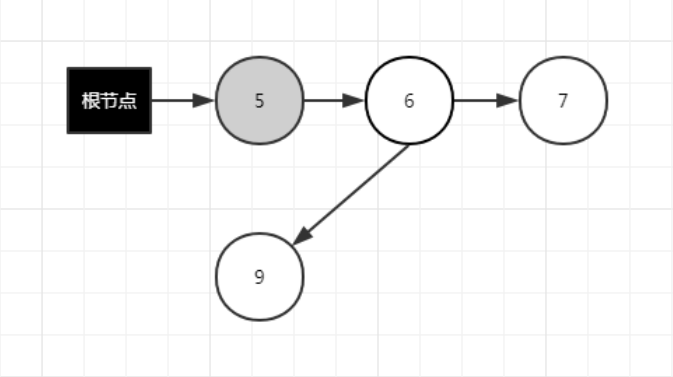
在上面这张图里，当GC Roots确定后，对象图就已经确定了。SATB扫描的时候基于已经确定的对象图（快照版的对象图）扫描，也就是说**扫描过程中上面的快照图的引用关系是不会发生变化的，但是真实的对象图是会发生变化的**。

2. 在并发标记阶段必然有一个时刻的对象图是这样的：
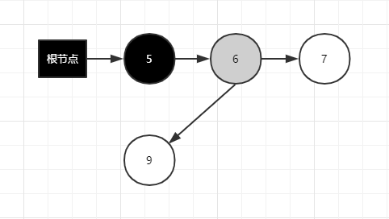
对于"对象消失"必须同时满足的两个条件，我们有理由相信：**条件一和条件二是有先后顺序的，即必须是赋值器插入了一条或者多条从黑色对象到白色对象的新引用，然后赋值器又删除了全部从灰色对象到该白色对象的直接或间接引用。在这样的情况下，才会出现“对象消失”的情况。**

>**反证法：**
我们假设灰色对象到白色对象的引用先删除了，即先触发了条件二。那么对应的这个时刻真实的对象图将变成下面的样子：
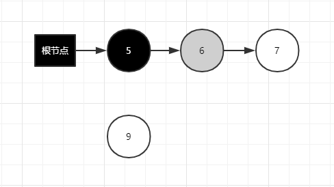
那么，白色对象9是处于游离态的，从根节点没有任何引用链相连，用图论的话来说就是从 GC Root 到对象9不可达，则证明此对象是不可能再被使用的。因此**用户线程不可能把黑色对象5指向游离态的白色对象9，你写不出这样的代码来。**

3. 根据条件一继续：

>**条件一是赋值器插入了一条或者多条从黑色对象到白色对象的新引用。**

在上面这个图的场景中，就是 GC 线程在工作的同时，**赋值器插入了一条黑色对象5到白色对象9之间的新引用。（用红色线条以示区分）**
在这个时刻，由于灰色对象6指向白色对象9，所以黑色对象5可以指向白色对象9，只要有引用链，黑色对象就可以到达白色对象。
这个时候仅仅满足了条件一，对象还没消失。

4. 接下来就是条件二的图，STAB破坏的就是条件二：
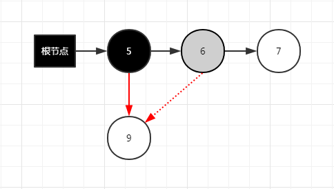
>**条件二是赋值器删除了全部从灰色对象到该白色对象的直接或间接引用。**

在上面这个图的场景中，就是**赋值器删除了灰色对象6到白色对象9的直接引用。**
这个时候白色对象9就是“消失的对象”了，因为黑色的对象5是不会被再次扫描的。

需要注意的是，赋值器可以理解为用户线程，由于在并发标记阶段，用户线程和 GC 线程在同时运行，出现上面的图还有一个前置条件就是：

* 用户线程删除对象6到对象9之间的引用，要先于 GC 线程扫描到对象6，把对象6变成灰色的操作。因为只有这样，GC 线程处理到对象6的时候，才有对应的写屏障记录。

* 如果在 GC 线程已经扫描过对象6，即对象6已经是黑色的情况下（这个时候对象9，不是黑色就是灰色，不可能是白色），用户线程再去删除对象6到对象9之间的引用，GC 线程是不需要处理的，因为对象9已经是非白了，它在本轮中必定会活下来。

5. 因为删除操作会触发 pre-write barrier，把每次引用关系变化时旧的引用值记下来，只有这样，等 GC 线程到达该对象时，这个对象的所有引用类型字段的变化全都有记录在案，就不会漏掉任何在快照图里活的对象。当然，很可能有对象在快照中是活的，但随着并发 GC 的进行它可能本来已经死了，但 SATB 还是会让它活过这次 GC，变成了浮动垃圾。

6. SATB 在写屏障里，把**旧的引用所指向的对象都变成非白**的（已经黑灰就不用管，还是白的就变成灰的）。
    * **旧的引用**指的是：灰色对象6到白色对象9之间的引用。
    * **所指向的对象**指的是：白色对象9。
    * **都变成非白的**指的是：白色对象9变成了灰色。
   
   所以，在两个条件顺序触发、对象图扫描完成后会变成下面的样子：
   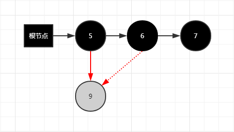
   
   **举例：** 如果一个灰对象的字段原本指向一个白对象，但在concurrent marker（并发标记）能扫描到这个灰对象的字段之前，这个灰对象的字段被赋上了别的值（例如说null），那么这个灰对象的字段跟白对象之间的关联就被切断了。SATB write barrier保证在**这种切断发生之前就把灰对象的字段原本引用的对象变灰**，从而杜绝了上述条件二的发生。
   
7. 并发扫描结束之后，再以灰色对象9为根（把它作为根，自然会变成黑色），重新扫描一次，所以最终的对象图变成了这样：
   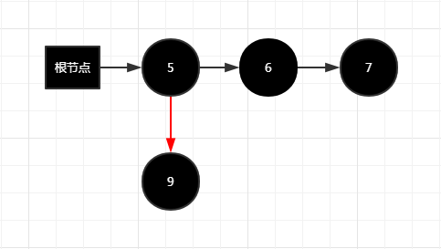

8. 如果在标记过程中，用户线程并没有把对象5指向对象9的操作，仅仅是发生了删除对象6到对象9之间引用的操作，那么这个对象图是什么样子呢？
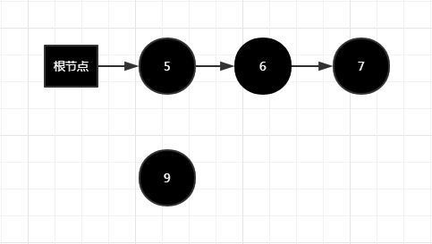
对象9还是黑色，只是它变成了浮动垃圾，逃过了本次回收而已。并不影响程序运行。

## 3. 关于写屏障
需要注意的是，上面的介绍中无论是对引用关系记录的插入还是删除，虚拟机的记录操作都是通过**写屏障**实现的。

1. 这里的写屏障和我们常说的为了解决并发乱序执行问题的"内存屏障"不是一码事，需要区分开来。

2. 写屏障可以看作虚拟机层面对"引用类型字段赋值"这个动作的AOP切面，在引用对象赋值时会产生一个**环形通知**，供程序执行额外的动作，也就是说**赋值的前后都在写屏障的覆盖范畴内**。

3. 在赋值前的部分的写屏障叫做写前屏障(Pre-Write Barrier)，在赋值后的则叫作写后屏障(Post-Write Barrier)。

