[TOC]
# 一. 回收流程划分
## 1. 初始标记(Initial Marking) 
这阶段仅仅只是标记GC Roots能直接关联到的对象并修改TAMS(Next Top at Mark Start)的值，让下一阶段用户程序并发运行时，能在正确的可用的Region中创建新对象，这阶段需要停顿线程，但是耗时很短。

而且是借用进行Minor GC的时候同步完成的，所以G1收集器在这个阶段实际并没有额外的停顿。

## 2. 并发标记(Concurrent Marking)
从GC Roots开始对堆的对象进行可达性分析，递归扫描整个堆里的对象图，找出存活的对象，这阶段耗时较长，但是可以与用户程序并发执行。

当对象图扫描完成以后，还要重新处理SATB记录下的在并发时有引用变动的对象。

## 3. 最终标记(Final Marking)
对用户线程做另一个短暂的暂停，用于处理并发阶段结束后仍遗留下来的最后那少量的 SATB 记录。

## 4. 筛选回收(Live Data Counting and Evacuation)
负责更新 Region 的统计数据，对各个 Region 的回收价值和成本进行排序，根据用户所期望的停顿时间来制定回收计划。

可以自由选择任意多个 Region 构成回收集，然后把决定回收的那一部分 Region 的存活对象复制到空的 Region 中，再清理掉整个旧 Region 的全部空间。

这里的操作涉及存活对象的移动，是必须暂停用户线程，由多条收集器线程并行完成的。

**从整个算法的角度，我们可以切分为两大部分：**

1. Global Concurrent Marking：全局并发标记。

2. Evacuation Pauses（也可以称之为筛选回收阶段）：该阶段是负责把一部分Region里的活对象拷贝到空Region里面去，然后回收原本的Region空间。

# 二. 全局并发标记（Global Concurrent Marking）

## 1. bitMap
1. 有两个 bitmap,一个叫 previous，一个叫 next。

2. previous bitmap 是 concurrent marking 阶段完成后的最后一个 bitmap。**记录的是上一轮 Concurrent Marking 后的对象标记状态，因为上一轮已经完成，所以这个bitmap的信息可以直接使用。**

3. next bitmap 是当前将要或正在进行的 concurrent marking 的结果。**记录的是当前这一轮 Concurrent Marking 的结果。这个bitmap是当前将要或正在进行的 Concurrent Marking 的结果，尚未完成，所以还不能使用。**

4. 当标记完成后，两个 bitmap 会交换角色。

我们可以假设一次并发标记完成后的 Bitmap（在并发标记时是next bitmap，当并发标记完成后交换角色，变为previous Bitmap） 大概长这样:

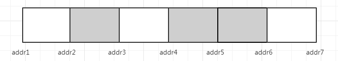

白色地址之间是可以回收的对象，灰色地址之间是不可以回收的对象。

## 2. TAMS（top at mark start）
每个 Region 都有两个 TAMS，分别是 previous TAMS 和 next TAMS。

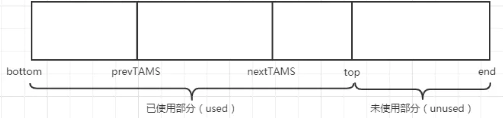
我们可以看到 bottom 和 top 之间是一个 Region 已使用的部分。Top 到 end 之前是一个 Region 未使用的部分。

## 3. 初始标记（Initial Marking）
> 初始标记（Initial Marking）：这阶段仅仅只是标记 GC Roots 能直接关联到的对象并修改 TAMS（Next Top at Mark Start）的值，让下一阶段用户程序并发运行时，能在正确的可用的 Region 中创建新对象。

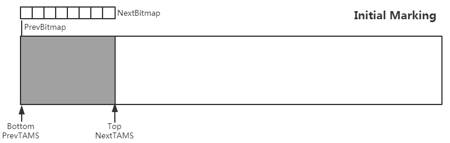
从图片可以看到初始标记阶段 nextBitmap 是清空状态，没有标记任何存活的对象。

1. **GC Roots 能直接关联到的对象**：只有 bottom 到 NextTAMS 之间的对象才是 GC Roots 能直接关联到的对象。NextTAMS 到Top是用户线程用户线程新分配的对象。
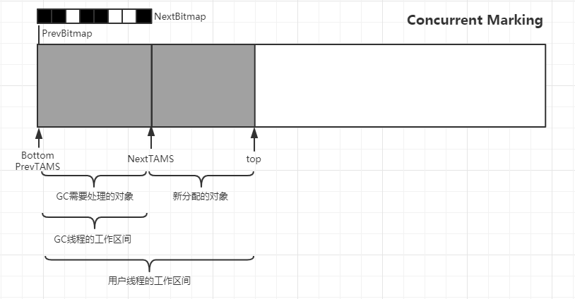

2. **修改 TAMS 的值**：就是让此时的 prevTAMS 指向 Bottom ，也就是一个 Region 内存地址起始值。让此时的 nextTAMS 指向 Top。**Top 实际上就是一个 Region 未分配区域和已分配区域的分界点**。

3. **正确的可用的 Region** ：对一个 Region 来说，当上面的 nextBitmap 为空、4个指针都准备就绪后，这个 Region 在下一阶段用户程序并发运行时，就是一个正确的 Region。

4. **下一阶段用户程序并发运行时，在正确的可用的 Region 中创建新对象是什么意思呢？**
下一阶段用户程序并发运行时指的就是并发标记阶段。

## 4. 并发标记（Concurrent Marking）
> 并发标记（Concurrent Marking）：从 GC Roots 开始对堆的对象进行可达性分析，递归扫描整个堆里的对象图，找出存活的对象，这阶段耗时较长，但是可以与用户程序并发执行。当对象图扫描完成以后，还要重新处理 SATB 记录下的在并发时有引用变动的对象。

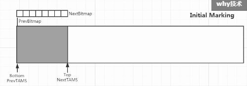
**从 GC Roots 开始对堆的对象进行可达性分析，递归扫描整个堆里的对象图，找出存活的对象：**

意思就是说在并发标记阶段， GC 线程工作在 prevTAMS 和 NextTAMS 之间，对堆里的对象进行可达性分析（回想一下“三色标记”），标记完成后， NextBitmap 就有对应有值了（里面放的是地址值），黑色对应的是存活对象，白色对应的垃圾对象。
这样就找出存活对象了。

**NextTAMS 与 Top 之间的对象，就是本次并发标记阶段用户线程新分配的对象，它们是隐式存活的。**

### 关于 NextTAMS 与 Top 为什么是重叠的

并发标记的前一个阶段是初始标记。由于初始标记是 STW 的，所以从动图中我们可以看到：并发标记开始，即初始标记结束的时候， NextTAMS 与 Top 是重叠的。

随着并发标记过程的进行， NextBitmap 被填充上了值。而 NextTAMS 与 Top 之间的区域越来越大，这就是用户线程在并发标记阶段分配的新对象。

同时通过下面的图我们可以看到， GC 线程的工作区间和用户线程的工作区间是有重叠的。

而重叠的部分，就是可能产生“对象消失”的部分。对G1来说，就是原始快照（STAB）加写前屏障（Pre-Wirte Barrier）工作的部分。

所以当 GC 线程扫描完对象图后，还需要重新处理 STAB 记录下的在并发时有引用变动的对象。

## 5. 最终标记（Remark）
>最终标记（Final Marking）：对用户线程做另一个短暂的暂停，用于处理并发阶段结束后仍遗留下来的最后那少量的 SATB 记录。

最终标记阶段，由于是 STW 的，所以该阶段对应的图是并发标记阶段完成后的图，如下：
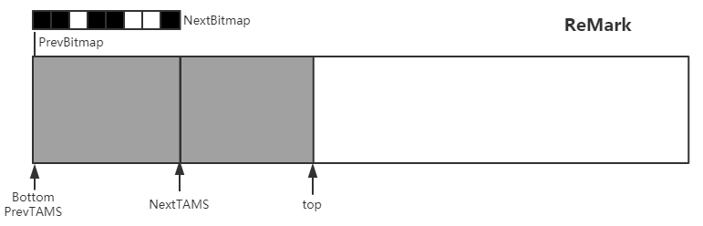

由于并发标记阶段， GC 线程完成对象图的扫描之后，还会去处理 SATB 记录下的在并发时有引用变动的对象，所以在处理 SATB 记录的数据的时候，由于用户线程可能还是在继续修改对象图，继续在产生 SATB 数据，所以还是会有一小部分的 SATB 数据，所以才需要一个短暂的暂停。

# 三. Evacuation Pauses 也即筛选回收阶段
包含了清理阶段和回收阶段
## 1. 清理阶段
在这个阶段， NextBitmap 和 PrevBitmap 会交换位置，所以，我们的图就变成了下面的样子：
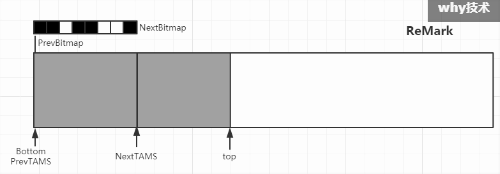
可以看到，NextBitmap 和 PrevBitmap 交换了位置，NextTAMS 和 PrevTAMS 交换了位置。
而 Region 中， Bitmap 白色部分对应的已使用内存变成了浅灰色。它仅仅是标记了出来，并没有进行清扫操作。
需要注意的是：**清理阶段不拷贝任何对象**
>清点和重置标记状态。这个阶段有点像 mark-sweep 中的 sweep 阶段，不过不是在堆上 sweep 实际对象，而是在 marking bitmap 里统计每个 Region 被标记为活的对象有多少。这个阶段如果发现完全没有活对象的 Region 就会将其整体回收到可分配 Region 列表中。

下图中展示了两个循环， A-B-C ， D-E-F 。其中 E、F 过程就是 B、C 过程的重复：
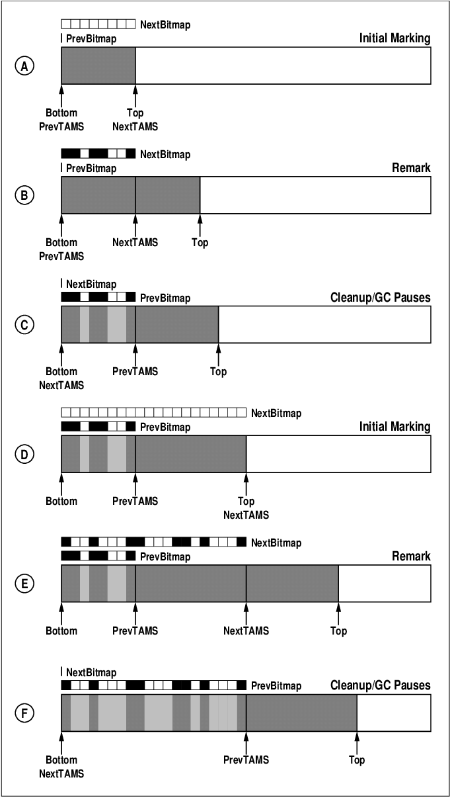
动图：

### 看了并发标记的过程，有个疑问 prevBitmap 的作用是什么？ 因为感觉每次都是从头开始扫描，没看到它的作用。

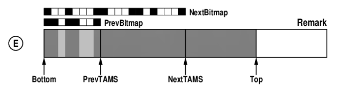
这个 E 是 Remark 阶段，可以看到，在这个阶段，其实 PrevBitmap 是派上用场了。
前面刚刚说了，这个 Region 由于“价值”不够，它逃过了上次垃圾回收，所以待到下次垃圾回收的时候，就是 prevBitmap 的用武之地了，**它里面记录的地址对应的区间就不需要再次标记了，因为这些地址对应的对象就已经是垃圾了。**
我们可以假设 E 代表的是第 n 轮回收的过程的Remark阶段。那么 PrevBitmap 就是第 n-1 轮的标记结果。

之前的文章说了：**一个 previous Bitmap 记录的是上一轮 Concurrent Marking 后的对象标记状态**，因为上一轮已经完成（上一轮就是第n-1轮），所以这个bitmap的信息可以直接使用。
可以直接使用的意思就是前面说的：它里面记录的地址对应的区间就不需要再次标记了，因为这些地址对应的对象就已经是垃圾了。
到 F 图里面，可以看到，当前的 F 图是清理阶段已经完成的状态了：

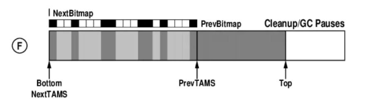
判断标准有二：

1. 和 E 图相比PrevBitmap 和 NextBitmap 已经交换了位置。

2. PrevBitmap 里面对应的地址的空间已经被标记为浅灰色了。

这个时候已经完成标记，PrevBitmap 又变成了第n-1次标记的结果。
## 2. 回收阶段
一次全局并发标记完成后，紧接着一次回收的过程。
只是G1收集器之所以能建立可预测的停顿时间模型（-XX:MaxGCPauseMillis指定，默认值为200毫秒），是因为它将 Region 作为单次回收的最小单元，即每次收集到的内存空间都是 Region 大小的整数倍，这样就可以有计划地避免在整个Java堆中进行全区域的垃圾回收。
更具体一点的做法就是每个 Region 里面堆积的垃圾都有一个“价值”（价值即回收所获得的空间大小以及回收所需要的时间的经验值）。而这些“价值”，是维护在一个优先级列表中的，G1收集器都是知道的。
**所以回收阶段会优先处理回收价值最大的那些 Region。因此，一次回收的过程并不会回收所有的 Region。**

### 如果每次标记完都会回收整理，那为什么红框所在的区间与上一次标记之后相同，好像没有被整理一样，整理之后不是应该不留下内存空隙吗？
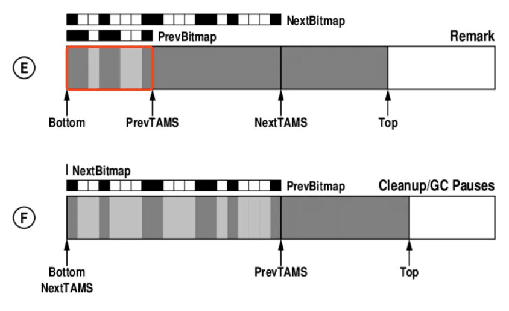
我觉得一个合理的解释，就是我上面说的：**这个 Region 的价值不够，所以它本次没有被回收。随着时间的推移，它里面堆积的垃圾越来越多，“价值”就越来越高，总是会被回收的。**