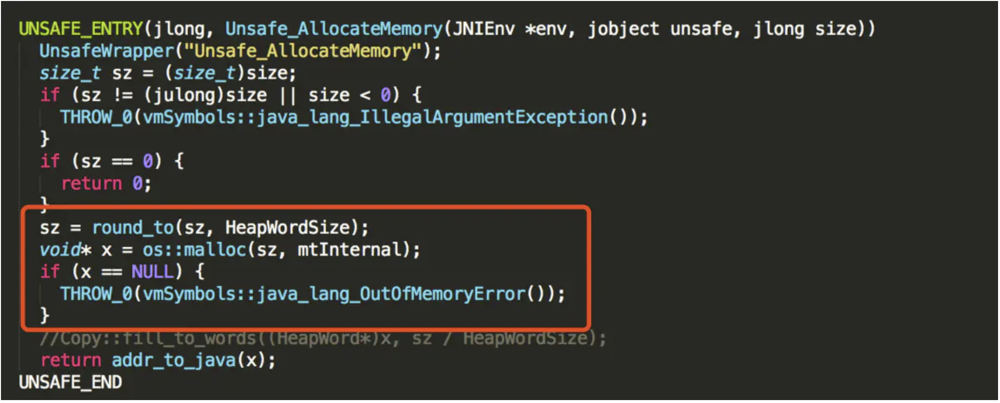
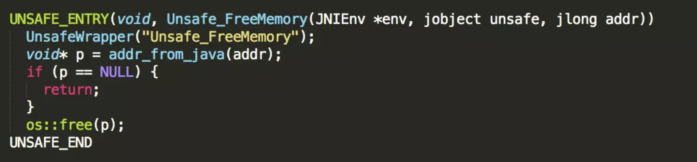
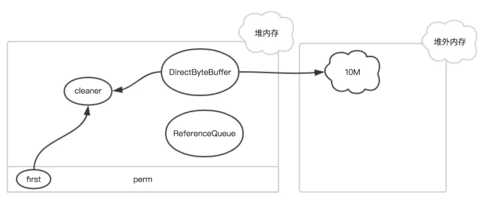
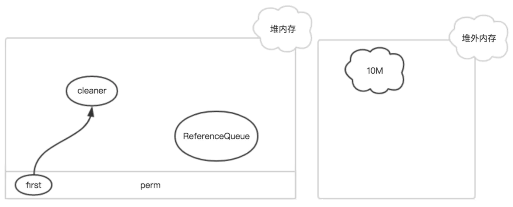
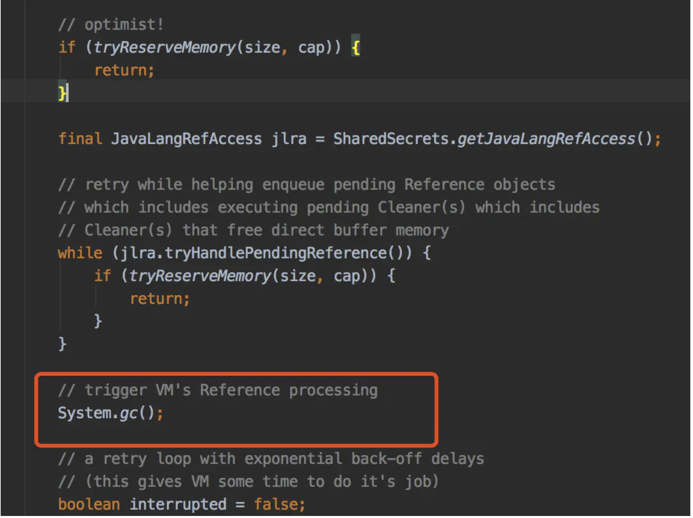

# 一、什么是堆外内存
* JVM启动时分配的内存，称为堆内存。

* 与之相对的，在代码中还可以使用堆外内存，比如Netty，广泛使用了堆外内存，但是这部分的内存并不归JVM管理，GC算法并不会对它们进行回收，所以在使用堆外内存时，要格外小心，防止内存一直得不到释放，造成线上故障。

# 二、堆外内存的申请和释放
JDK的ByteBuffer类提供了一个接口`allocateDirect(int capacity)`进行堆外内存的申请，底层通过`unsafe.allocateMemory(size)`实现，接下去看看在JVM层面是如何实现的。

可以发现，最底层是通过`malloc`方法申请的，但是这块内存需要进行手动释放，JVM并不会进行回收，幸好`Unsafe`提供了另一个接口`freeMemory`可以对申请的堆外内存进行释放。


# 三、堆外内存的回收机制
如果每次申请堆外内存，都需要在代码中显示的释放，对于Java这门语言的设计来说，显然不够合理，既然JVM不会管理这些堆外内存，它们是如何回收的呢？

## DirectByteBuffer
JDK中使用`DirectByteBuffer`对象来表示堆外内存，每个`DirectByteBuffer`对象在初始化时，都会创建一个对用的`Cleaner`对象，这个`Cleaner`对象会在合适的时候执行`unsafe.freeMemory(address)`，从而回收这块堆外内存。

当初始化一块堆外内存时，对象的引用关系如下：


其中`first`是`Cleaner`类的静态变量，`Cleaner`对象在初始化时会被添加到`Clener`链表中，和`first`形成引用关系，`ReferenceQueue`是用来保存需要回收的`Cleaner`对象。

如果该DirectByteBuffer对象在一次GC中被回收了


此时，只有`Cleaner`对象唯一保存了堆外内存的数据（开始地址、大小和容量），在下一次FGC时，把该`Cleaner`对象放入到`ReferenceQueue`中，并触发clean方法。

`Cleaner`对象的`clean`方法主要有两个作用：

1. 把自身从`Clener`链表删除，从而在下次GC时能够被回收

2. 释放堆外内存

```java
public void run() {
    if (address == 0) {
        // Paranoia
        return;
    }
    unsafe.freeMemory(address);
    address = 0;
    Bits.unreserveMemory(size, capacity);
}
```

如果JVM一直没有执行FGC的话，无效的`Cleaner`对象就无法放入到`ReferenceQueue`中，从而堆外内存也一直得不到释放，内存岂不是会爆？

其实在初始化`DirectByteBuffer`对象时，如果当前堆外内存的条件很苛刻时，会主动调用`System.gc()`强制执行FGC。


不过很多线上环境的JVM参数有`-XX:+DisableExplicitGC`，导致了`System.gc()`等于一个空函数，根本不会触发FGC，这一点在使用Netty框架时需要注意是否会出问题。