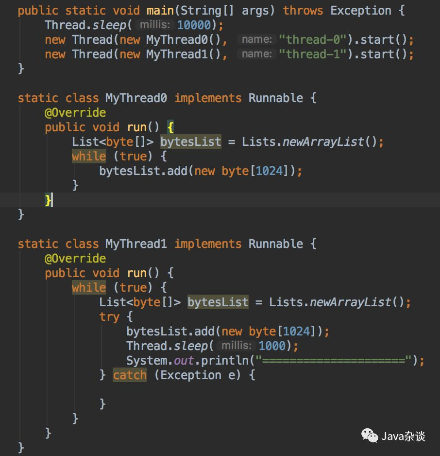
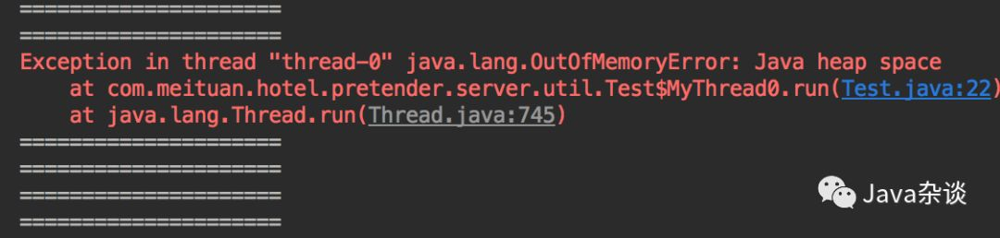
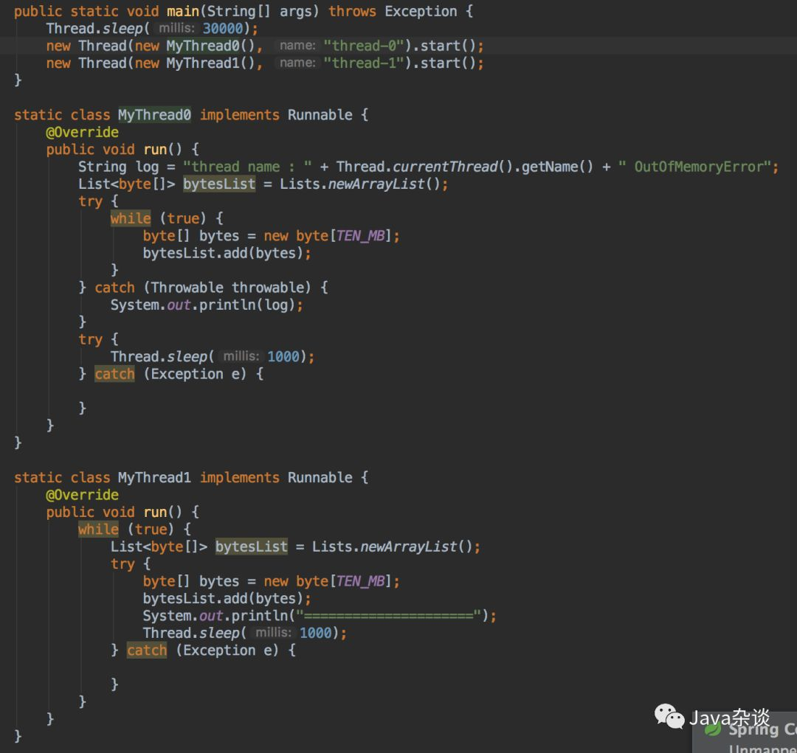
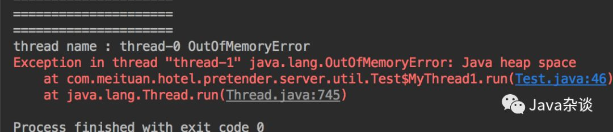
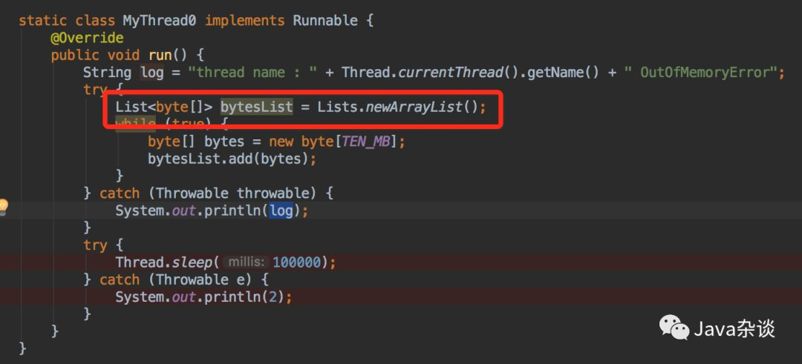
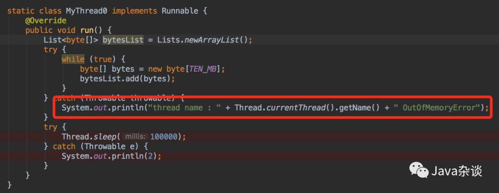

# 一、背景
一个线程OOM后，其他线程还能运行吗？
由于题目中给出的OOM，java中OOM又分很多类型；比如：
* 堆溢出（“java.lang.OutOfMemoryError: Java heap space”）、
* 永久代溢出（“java.lang.OutOfMemoryError:Permgen space”）、
* 不能创建线程（“java.lang.OutOfMemoryError:Unable to create new native thread”）

等很多种情况。

# 二、直接实验验证

日志输入：

从日志可以看出在thead-0发生OOM之后，thread-1仍旧能够继续申请内存工作。

使用jconsole监控发现，thread-0开始慢慢把heap压满，发生OOM之后神奇的事情发生了，heap基本上被清空了，

通过查看jconsole看到的线程信息，发现没有thead-0线程了。

这就很明确了，因为thead-0没有捕获该异常，跳出了while循环，导致thead-0线程运行结束，该线程持有的对象也就能被释放了。

那如果thread-0发生了OOM，但是该线程仍旧存活并且持有这些对象会怎么样呢？

在线程thread-0我们捕获了该ERROR，然后让该线程暂停（不要让他结束，不然又像上面那样了）输出日志如下：

在thread-0发生OOM之后，thread-1在申请内存也就发生了OOM，这个很容易理解的。

# 三、原理分析
我们知道java对象基本上都是在堆上分配（有特殊情况下，不在我们讨论的范围内）。小对象都是直接在Eden区域中分配。如果此时内存不够，就会发生young gc，如果释放之后还是内存不够，此时jvm会进行full gc。如果发生full gc之后内存还是不够，此时就会抛出“java.lang.OutOfMemoryError: Java heap space”。大对象jvm会直接在old 区域中申请，但是和小对象分配的原理类似。

一般情况下，java对象内存分配跟线程无关（TLAB例外），能够申请成功至于当前只和当前heap空余空间有关。

清楚了内存分配原理之后，我们就可以以此为基础来分析各种情况。比如：在MyThread0中bytesList放在try中，代码如下：

MyThread0发生OOM之后，bytesList其实就不属于存活对象，gc的时候就被释放了。

再比如发生OOM捕获该异常之后，因为日志输入的string需要占用heap空间，也可能导致MyThread0再次发生OOM，MyThread0线程终结。

再比如MyThread0中一次性申请的内存太大，比如超过heap大小；其他申请小内存的线程肯定不会受到影响。

# 四、总结
发生OOM之后会不会影响其他线程正常工作需要具体的场景分析。但是就一般情况下，发生OOM的线程都会终结（除非代码写的太烂），该线程持有的对象占用的heap都会被gc了，释放内存。

因为发生OOM之前要进行gc，就算其他线程能够正常工作，也会因为频繁gc产生较大的影响。