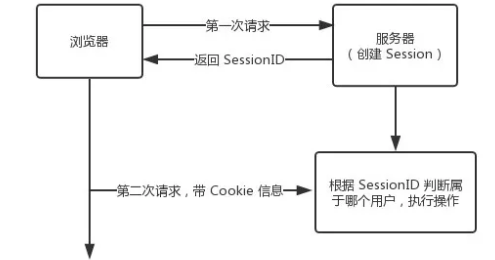

[TOC]
# 1. 什么是 Cookie
HTTP Cookie（也叫 Web Cookie或浏览器 Cookie）是服务器发送到**用户浏览器并保存在本地**的一小块数据，它会在浏览器下次向同一服务器再发起请求时被携带并发送到服务器上。通常，它用于告知服务端两个请求是否来自同一浏览器，如**保持用户的登录状态**。Cookie 使基于**无状态的 HTTP 协议记录稳定的状态**信息成为了可能。

Cookie 主要用于以下三个方面：

* 会话状态管理（如用户登录状态、购物车、游戏分数或其它需要记录的信息）

* 个性化设置（如用户自定义设置、主题等）

* 浏览器行为跟踪（如跟踪分析用户行为等）

# 2. 什么是 Session
Session 代表着服务器和客户端一次会话的过程。Session 对象存储特定用户会话所需的属性及配置信息。这样，当用户在应用程序的 Web 页之间跳转时，存储在 Session 对象中的变量将不会丢失，而是在整个用户会话中一直存在下去。当客户端关闭会话，或者 Session 超时失效时会话结束。
## 2.1 session的创建及其他
### 创建：
 sessionid第一次产生是在直到某server端程序调用 HttpServletRequest.getSession(true)这样的语句时才被创建。
 
 ManagerBase是所有session管理工具类的基类，它是一个抽象类，所有具体实现session管理功能的类都要继承这个类，该类有一个受保护的方法，该方法就是创建sessionId值的方法。

* StandardManager类是tomcat容器里默认的session管理实现类，它会将session的信息存储到web容器所在服务器的内存里。

* PersistentManagerBase也是继承ManagerBase类，它是所有持久化存储session信息的基类，PersistentManager继承了PersistentManagerBase，但是这个类只是多了一个静态变量和一个getName方法，目前看来意义不大。

* 对于持久化存储session，tomcat还提供了StoreBase的抽象类，它是所有持久化存储session的基类，另外tomcat还给出了文件存储FileStore和数据存储JDBCStore两个实现。


### 删除：
 * 超时；
 * 程序调用HttpSession.invalidate()；
 * 程序关闭；

关掉浏览器并不会关闭session。
### session存放在哪里
服务器端的内存中。不过session可以通过特殊的方式做持久化管理（memcache，redis）
### session的id是从哪里来的
当客户端第一次请求session对象时候，服务器会为客户端创建一个session，并将通过特殊算法算出一个session的ID，用来标识该session对象。

tomcat的`ManagerBase`类提供创建sessionid的方法：随机数+时间+jvmid；

客户端只保存sessionid到cookie中.
## 2.2 设置session超时（失效）的三种方式
### 1. 在web容器中设置（此处以tomcat为例）
在tomcat-5.0.28\conf\web.xml中设置，以下是tomcat 5.0中的默认配置：
```xml
<!-- ==================== Default Session Configuration ================= -->
<!-- You can set the default session timeout (in minutes) for all newly   -->
<!-- created sessions by modifying the value below.    -->

<session-config>
        <session-timeout>30</session-timeout>
</session-config>
```
Tomcat默认session超时时间为30分钟，可以根据需要修改，负数或0为不限制session失效时间。

### 2. 在工程的web.xml中设置
```xml
 <!-- 时间单位为分钟   -->
 
 <session-config>
       <session-timeout>15</session-timeout>
 </session-config>
```
### 3. 通过java代码设置
```java
session.setMaxInactiveInterval（30*60）;//以秒为单位
```

## 2.3 session是否失效，可以通过监听器监听到，
监听器类为：HttpSessionListener类，有sessionCreated和sessionDestroyed两个方法 


# 3. Cookie 和 Session 有什么不同？
* 作用范围不同，Cookie 保存在客户端（浏览器），Session 保存在服务器端。

* 存取方式的不同，Cookie 只能保存 ASCII，Session 可以存任意数据类型，一般情况下我们可以在 Session 中保持一些常用变量信息，比如说 UserId 等。

* 有效期不同，Cookie 可设置为长时间保持，比如我们经常使用的默认登录功能，Session 一般失效时间较短，客户端关闭或者 Session 超时都会失效。

* 隐私策略不同，Cookie 存储在客户端，比较容易遭到不法获取，早期有人将用户的登录名和密码存储在 Cookie 中导致信息被窃取；Session 存储在服务端，安全性相对 Cookie 要好一些。

* 存储大小不同， 单个 Cookie 保存的数据不能超过 4K，Session 可存储数据远高于 Cookie

# 4. 为什么需要 Cookie 和 Session，他们有什么关联？
这就需要从浏览器开始说起，我们都知道浏览器是没有状态的(HTTP 协议无状态)，这意味着浏览器并不知道是张三还是李四在和服务端打交道。这个时候就需要有一个机制来告诉服务端，本次操作用户是否登录，是哪个用户在执行的操作，那这套机制的实现就需要 Cookie 和 Session 的配合。



1. 用户第一次请求服务器的时候，服务器根据用户提交的相关信息，创建创建对应的 Session ，请求返回时将此 Session 的唯一标识信息 SessionID 返回给浏览器，浏览器接收到服务器返回的 SessionID 信息后，会将此信息存入到 Cookie 中，同时 Cookie 记录此 SessionID 属于哪个域名。

2. 当用户第二次访问服务器的时候，请求会自动判断此域名下是否存在 Cookie 信息，如果存在自动将 Cookie 信息也发送给服务端，服务端会从 Cookie 中获取 SessionID，再根据 SessionID 查找对应的 Session 信息，如果没有找到说明用户没有登录或者登录失效，如果找到 Session 证明用户已经登录可执行后面操作。

3. 根据以上流程可知，SessionID 是连接 Cookie 和 Session 的一道桥梁，大部分系统也是根据此原理来验证用户登录状态。

# 5.禁用Cookie，如何保障整个机制的正常运转

1. 第一种方案，每次请求中都携带一个 SessionID 的参数，也可以 Post 的方式提交，也可以在请求的地址后面拼接 xxx?SessionID=123456...。

2. 第二种方案，Token 机制。Token 机制多用于 App 客户端和服务器交互的模式，也可以用于 Web 端做用户状态管理。
Token 的意思是“令牌”，是服务端生成的一串字符串，作为客户端进行请求的一个标识。Token 机制和 Cookie 和 Session 的使用机制比较类似。
当用户第一次登录后，服务器根据提交的用户信息生成一个 Token，响应时将 Token 返回给客户端，以后客户端只需带上这个 Token 前来请求数据即可，无需再次登录验证。

# 6. 分布式 Session

在互联网公司为了可以支撑更大的流量，后端往往需要多台服务器共同来支撑前端用户请求，那如果用户在 A 服务器登录了，第二次请求跑到服务 B 就会出现登录失效问题。

分布式 Session 一般会有以下几种解决方案：

* Nginx ip_hash 策略，服务端使用 Nginx 代理，每个请求按访问 IP 的 hash 分配，这样来自同一 IP 固定访问一个后台服务器，避免了在服务器 A 创建 Session，第二次分发到服务器 B 的现象。

* Session 复制，任何一个服务器上的 Session 发生改变（增删改），该节点会把这个 Session 的所有内容序列化，然后广播给所有其它节点。

* 共享 Session，服务端无状态话，将用户的 Session 等信息使用缓存中间件来统一管理，保障分发到每一个服务器的响应结果都一致。

建议采用第三种方案。