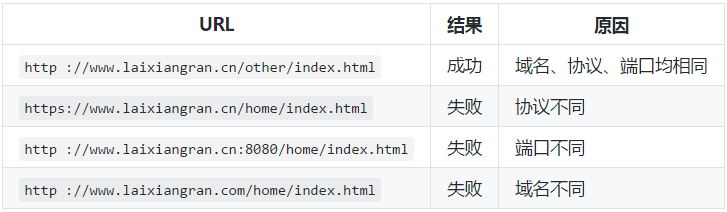

[TOC]
# 什么是浏览器同源策略

同源策略/SOP（Same origin policy）是一种约定，由 Netscape 公司 1995年引入浏览器，它是浏览器最核心也最基本的安全功能，如果缺少了同源策略，浏览器很容易受到 XSS、CSFR 等攻击。
所谓同源是指 **"协议+域名+端口"** 三者相同，即便两个不同的域名指向同一个 ip 地址，也非同源。

下表是相对于`http://www.laixiangran.cn/home/index.html` 的同源检测结果：


另外，同源策略又分为以下两种：

* DOM 同源策略：禁止对不同源页面 DOM 进行操作。这里主要场景是 iframe 跨域的情况，不同域名的 iframe 是限制互相访问的。

* XMLHttpRequest 同源策略：禁止使用 XHR 对象向不同源的服务器地址发起 HTTP 请求。


# 为什么要有跨域限制
因为存在浏览器同源策略，所以才会有跨域问题。那么浏览器是出于何种原因会有跨域的限制呢。其实不难想到，跨域限制主要的目的就是为了用户的上网安全。

如果浏览器没有同源策略，会存在什么样的安全问题呢。下面从 DOM 同源策略和 XMLHttpRequest 同源策略来举例说明：

## 1. 如果没有 DOM 同源策略，也就是说不同域的 iframe 之间可以相互访问，那么黑客可以这样进行攻击：
1. 做一个假网站，里面用 iframe 嵌套一个银行网站 `http://mybank.com`。

2. 把 iframe 宽高啥的调整到页面全部，这样用户进来除了域名，别的部分和银行的网站没有任何差别。

3. 这时如果用户输入账号密码，我们的主网站可以**跨域**访问到 `http://mybank.com` 的 dom 节点，就可以拿到用户的账户密码了。

## 2. 如果没有 XMLHttpRequest 同源策略，那么黑客可以进行 CSRF（跨站请求伪造） 攻击：
1. 用户登录了自己的银行页面 `http://mybank.com`，`http://mybank.com` 向用户的 cookie 中添加用户标识。

2. 用户浏览了恶意页面 `http://evil.com`，执行了页面中的恶意 AJAX 请求代码。

3. `http://evil.com` 向 `http://mybank.com` 发起 AJAX HTTP 请求，请求会默认把 `http://mybank.com` 对应 cookie 也同时发送过去。

4. 银行页面从发送的 cookie 中提取用户标识，验证用户无误，response 中返回请求数据。此时数据就泄露了。
而且由于 Ajax 在后台执行，用户无法感知这一过程。


# 跨域的解决方法


## 1. 通过 Jsonp 跨域
浏览器的同源策略把跨域请求都禁止了，但是页面中的 <script><iframe>标签是例外，不受同源策略限制。Jsonp 就是利用 <script> 标签跨域特性进行跨域数据访问。

JSONP 的理念就是，与服务端约定好一个回调函数名，服务端接收到请求后，将返回一段 Javascript，在这段 Javascript 代码中调用了约定好的回调函数，并且将数据作为参数进行传递。当网页接收到这段 Javascript 代码后，就会执行这个回调函数，这时数据已经成功传输到客户端了。

例子:
```JavaScript
// 1. 定义一个 回调函数 handleResponse 用来接收返回的数据
function handleResponse(data) {
    console.log(data);
};

// 2. 动态创建一个 script 标签，并且告诉后端回调函数名叫 handleResponse
var body = document.getElementsByTagName('body')[0];
var script = document.gerElement('script');
script.src = 'http://www.laixiangran.cn/json?callback=handleResponse';
body.appendChild(script);

// 3. 通过 script.src 请求 `http://www.laixiangran.cn/json?callback=handleResponse`，
// 4. 后端能够识别这样的 URL 格式并处理该请求，然后返回 handleResponse({"name": "laixiangran"}) 给浏览器
// 5. 浏览器在接收到 handleResponse({"name": "laixiangran"}) 之后立即执行 ，也就是执行 handleResponse 方法，获得后端返回的数据，这样就完成一次跨域请求了。
```

### 优点
使用简便，没有兼容性问题，目前最流行的一种跨域方法。
### 缺点

1. 只支持 GET 请求。而不支持 POST 请求等其他类型的 HTTP 请求。

2. 由于是从其它域中加载代码执行，因此如果其他域不安全，很可能会在响应中夹带一些恶意代码。

3. 要确定 JSONP 请求是否失败并不容易。虽然 HTML5 给 script 标签新增了一个 onerror 事件处理程序，但是存在兼容性问题。


## 2. 通过代理来避免，比如使用 Nginx 在后端转发请求，避免了前端出现跨域的问题。
浏览器有跨域限制，但是服务器不存在跨域问题，所以可以由服务器请求所要域的资源再返回给客户端。

服务器代理是万能的。
## 3. CORS（跨域资源共享）
CORS（Cross-origin resource sharing，跨域资源共享）是一个 W3C 标准，定义了在必须访问跨域资源时，浏览器与服务器应该如何沟通。

CORS 背后的基本思想，就是使用自定义的 **HTTP 头部**让浏览器与服务器进行沟通，从而决定请求或响应是应该成功，还是应该失败。

因此，实现 CORS 通信的关键是服务器。只要服务器实现了 CORS 接口，就可以跨源通信。

浏览器将CORS请求分成两类：**简单请求（simple request）和非简单请求（not-so-simple request）**。

只要同时满足以下两大条件，就属于**简单请求**:
 1. 请求方法是以下三种方法之一：
    * HEAD
    
    * GET
    
    * POST
 2. HTTP的头信息不超出以下几种字段：
    * Accept
    
    * Accept-Language
    
    * Content-Language
    
    * Last-Event-ID
    
    * Content-Type：只限于三个值 application/x-www-form-urlencoded、multipart/form-data、text/plain


凡是不同时满足上面两个条件，就属于非简单请求。浏览器对这两种请求的处理，是不一样的。

### 简单请求
1. 在请求中需要附加一个额外的 Origin 头部，其中包含请求页面的源信息（协议、域名和端口），以便服务器根据这个头部信息来决定是否给予响应。例如：`Origin: http://www.laixiangran.cn`

2. 如果服务器认为这个请求可以接受，就在 `Access-Control-Allow-Origin` 头部中回发相同的源信息（如果是公共资源，可以回发 * ）。例如：`Access-Control-Allow-Origin：http://www.laixiangran.cn`

3. 没有这个头部或者有这个头部但源信息不匹配，浏览器就会驳回请求。正常情况下，浏览器会处理请求。注意，请求和响应都不包含 cookie 信息。

4. 如果需要包含 cookie 信息，ajax 请求需要设置 xhr 的属性`withCredentials` 为 true，服务器需要设置响应头部 `Access-Control-Allow-Credentials: true`。

### 非简单请求

浏览器在发送真正的请求之前，会先发送一个 Preflight 请求给服务器，这种请求使用 OPTIONS 方法，发送下列头部：

* Origin：与简单的请求相同。

* Access-Control-Request-Method: 请求自身使用的方法。

* Access-Control-Request-Headers: （可选）自定义的头部信息，多个头部以逗号分隔。

例如：
```java
Origin: http://www.laixiangran.cn
Access-Control-Request-Method: POST
Access-Control-Request-Headers: NCZ
```
发送这个请求后，服务器可以决定是否允许这种类型的请求。服务器通过在响应中发送如下头部与浏览器进行沟通：

* Access-Control-Allow-Origin：与简单的请求相同。

* Access-Control-Allow-Methods: 允许的方法，多个方法以逗号分隔。

* Access-Control-Allow-Headers: 允许的头部，多个方法以逗号分隔。

* Access-Control-Max-Age: 应该将这个 Preflight 请求缓存多长时间（以秒表示）。

例如：
```java
Access-Control-Allow-Origin: http://www.laixiangran.cn
Access-Control-Allow-Methods: GET, POST
Access-Control-Allow-Headers: NCZ
Access-Control-Max-Age: 1728000
```
一旦服务器通过 Preflight 请求允许该请求之后，以后每次浏览器正常的 CORS 请求，就都跟简单请求一样了。
#### 优点
* CORS 通信与同源的 AJAX 通信没有差别，代码完全一样，容易维护。

* 支持所有类型的 HTTP 请求。
#### 缺点

* 存在兼容性问题，特别是 IE10 以下的浏览器。

* 第一次发送非简单请求时会多一次请求。