[TOC]
# 一.HTTP简介
1. HTTP协议，即超文本传输协议(Hypertext transfer protocol)。是一种详细规定了浏览器和万维网(WWW = World Wide Web)服务器之间互相通信的规则，通过因特网传送万维网文档的数据传送协议。

2. HTTP协议属于应用层，建立在传输层协议TCP之上。客户端通过与服务器建立TCP连接，之后发送HTTP请求与接收HTTP响应都是通过访问Socket接口来调用TCP协议实现。。**HTTP协议通常承载于TCP协议之上**，**HTTPS承载于TLS或SSL协议层之上**。如下图：
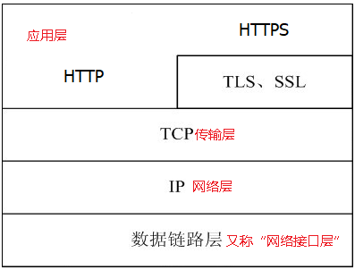

3. HTTP是一个应用层协议，由请求和响应构成，是一个标准的客户端服务器模型。客户端与服务器的角色不是固定的，一端充当客户端，也可能在某次请求中充当服务器。这取决与请求的发起端。

4. HTTP默认的端口号为80，HTTPS的端口号为443。

5. HTTP允许传输任意类型的数据对象。正在传输的类型由Content-Type加以标记。

6. HTTP 是一种**无状态** (stateless) 协议, HTTP协议本身不会对发送过的请求和相应的通信状态进行持久化处理。这样做的目的是为了保持HTTP协议的简单性，从而能够快速处理大量的事务, 提高效率。缺少状态意味着如果后续处理需要前面的信息，则它必须重传，这样可能导致每次连接传送的数据量增大。另一方面，在服务器不需要先前信息时它的应答就较快。

# 二. HTTP工作流程 

HTTP协议定义Web客户端如何从Web服务器请求Web页面，以及服务器如何把Web页面传送给客户端。

HTTP协议采用了请求/响应模型。

客户端向服务器发送一个请求报文，请求报文包含请求的方法、URL、协议版本、请求头部和请求数据。

服务器以一个状态行作为响应，响应的内容包括协议的版本、成功或者错误代码、服务器信息、响应头部和响应数据。

以下是 HTTP 请求/响应的步骤：

## 1. 客户端连接到Web服务器
一个HTTP客户端，通常是浏览器，使用URL与Web服务器的HTTP端口（默认为80）建立一个TCP套接字连接。例如，`http://www.luffycity.com`
`HTTP URL` 包含了用于查找某个资源的详细信息, 格式如下:
`scheme://host:port/path?query#hash：`
* scheme：通信协议，常用的有http、https、ftp、mailto等。

* host：主机域名或IP地址。

* port：端口号，可选。省略时使用协议的默认端口，如http默认端口为80。

* path：路径由零或多个"/"符号隔开的字符串组成，一般用来表示主机上的一个目录或文件地址。

* query：查询，可选。用于传递参数，可有多个参数，用"&"符号隔开，每个参数的名和值用"="符号隔开。

* hash：信息片断字符串，也称为锚点。用于指定网络资源中的片断。

> URIs, URLs, and URNs
 * URI，是uniform resource identifier，统一资源标识符，用来唯一的标识一个资源。
 
 * URL是uniform resource locator，统一资源定位器，它是一种具体的URI，即URL可以用来标识一个资源，而且还指明了如何locate这个资源。
 * URN，uniform resource name，统一资源命名，是通过名字来标识资源，比如mailto:java-net@java.sun.com。
 * 也就是说，URI是以一种抽象的，高层次概念定义统一资源标识，而URL和URN则是具体的资源标识的方式。URL和URN都是一种URI。

> 区别

在Java的URI中，一个URI实例可以代表绝对的，也可以是相对的，只要它符合URI的语法规则。
URL类则不仅符合URI的语法规则，还包含了定位该资源的信息，因此它不能是相对的，schema必须被指定。

* getRequestURI()方法返回的是一个字符串，内容为整个访问的url的path内容，不带query；

* getRequestURL()方法返回的是一个StringBuffer，内容为整个访问的url，不带query；
例：输入的url地址为`http://localhost:8080/testproject/test?32fr`

* getRequestURI()返回/testproject/test，为一个String

* getRequestURL()返回http://localhost:8080/testproject/test，为一个StringBuffer


## 2. 发送HTTP请求
通过TCP套接字，客户端向Web服务器发送一个文本的请求报文，一个请求报文由请求行、请求头部、空行和请求数据4部分组成。

## 3. 服务器接受请求并返回HTTP响应
Web服务器解析请求，定位请求资源。服务器将资源复本写到TCP套接字，由客户端读取。一个响应由状态行、响应头部、空行和响应数据4部分组成。

## 4. 释放连接TCP连接
若connection 模式为close，则服务器主动关闭TCP连接，客户端被动关闭连接，释放TCP连接;若connection 模式为keepalive，则该连接会保持一段时间，在该时间内可以继续接收请求;

## 5. 客户端浏览器解析HTML内容
客户端浏览器首先解析状态行，查看表明请求是否成功的状态代码。然后解析每一个响应头，响应头告知以下为若干字节的HTML文档和文档的字符集。客户端浏览器读取响应数据HTML，根据HTML的语法对其进行格式化，并在浏览器窗口中显示。


# 三. HTTP之请求消息Request 
客户端发送一个HTTP请求到服务器的请求消息包括以下格式：

**请求行，消息报头，空行和请求正文**四个部分组成。


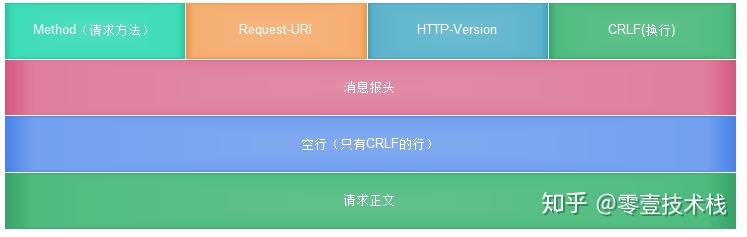

请求消息示例：
**Get**：
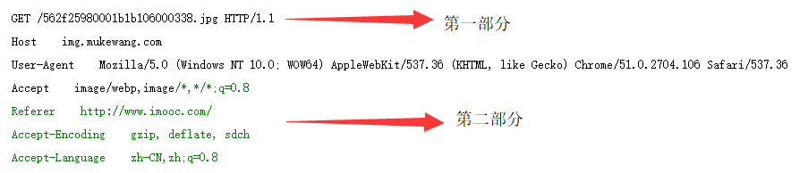
第一部分：请求行，
第二部分：消息报头
**Post**：
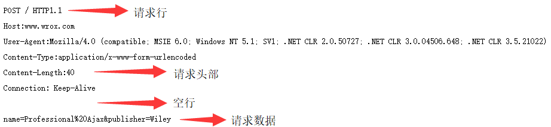


## 1. HTTP请求行
请求行由请求`Method`, `URL` 字段和`HTTP Version`三部分构成, 总的来说请求行就是定义了本次请求的请求方式, 请求的地址, 以及所遵循的HTTP协议版本例如：
`GET /example.html HTTP/1.1 (CRLF)`
HTTP协议的方法有： 

* GET： 请求指定的页面信息，并返回实体主体。

* POST： 向指定资源提交数据进行处理请求（例如提交表单或者上传文件）。数据被包含在请求体中。POST 请求可能会导致新的资源的建立和/或已有资源的修改。

* HEAD： 类似于 GET 请求，只不过返回的响应中没有具体的内容，用于获取报头

* PUT： 请求服务器存储或修改一个资源，并用Request-URI作为其标识 

* DELETE： 请求服务器删除Request-URI所标识的资源 

* TRACE： 请求服务器回送收到的请求信息，主要用于测试或诊断 

* CONNECT： 保留将来使用,HTTP/1.1 协议中预留给能够将连接改为管道方式的代理服务器。

* OPTIONS： 请求查询服务器的性能，或者查询与资源相关的选项和需求

## 2. HTTP消息报头，又称请求头，又称首部字段
消息报头由一系列的键值对组成，允许客户端向服务器端发送一些附加信息或者客户端自身的信息，主要包括：
1. 通用首部字段:请求报文和响应报文双方都会使用的首部。
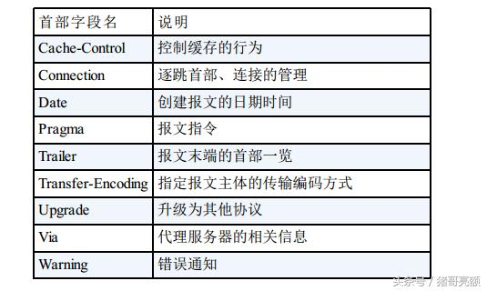
2. 请求首部字段:
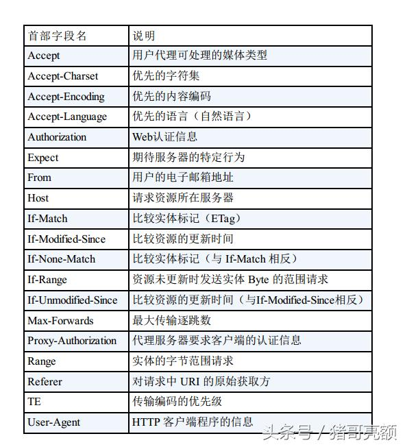
3. 实体首部字段:
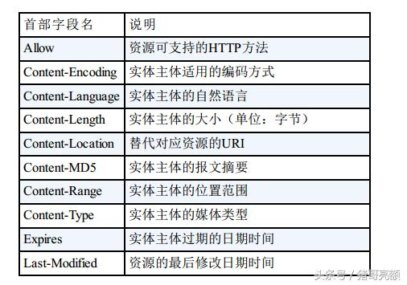


## 3. HTTP请求正文

只有在发送POST请求时才会有请求正文，GET方法并没有请求正文。

# 四. HTTP之响应消息Response
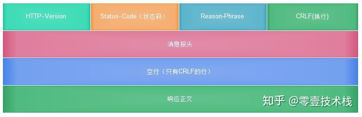
HTTP响应也由四部分组成，包括**响应行，消息报头，空行和响应正文**。
示例：


## 1. HTTP响应行
状态行由三部分组成，包括HTTP协议的版本，状态码，以及对状态码的文本描述。例如：
`HTTP/1.1 200 OK （CRLF）`
### HTTP响应状态码
状态代码有三位数字组成，第一个数字定义了响应的类别，且有五种可能取值： 

* 1xx：指示信息 - 表示请求已接收，继续处理 

* 2xx：成功 - 表示请求已被成功接收、理解、接受 

* 3xx：重定向 - 要完成请求必须进行更进一步的操作 

* 4xx：客户端错误 - 请求有语法错误或请求无法实现 

* 5xx：服务器端错误 - 服务器未能实现合法的请求

### HTTP响应状态码说明
常见状态代码、状态描述、说明：

* 200： OK - 客户端请求成功 

* 400： Bad Request - 客户端请求有语法错误，不能被服务器所理解 

* 401： Unauthorized - 请求未经授权，这个状态代码必须和WWW-Authenticate报头域一起使用 

* 403： Forbidden - 服务器收到请求，但是拒绝提供服务 

* 404： Not Found - 请求资源不存在，eg：输入了错误的URL 

* 500： Internal Server Error - 服务器发生不可预期的错误 

* 503： Server Unavailable - 服务器当前不能处理客户端的请求，一段时间后,可能恢复正常


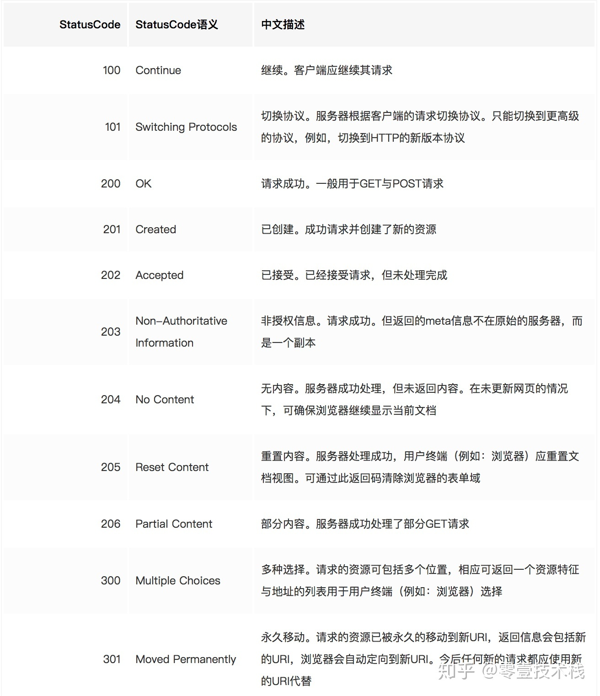
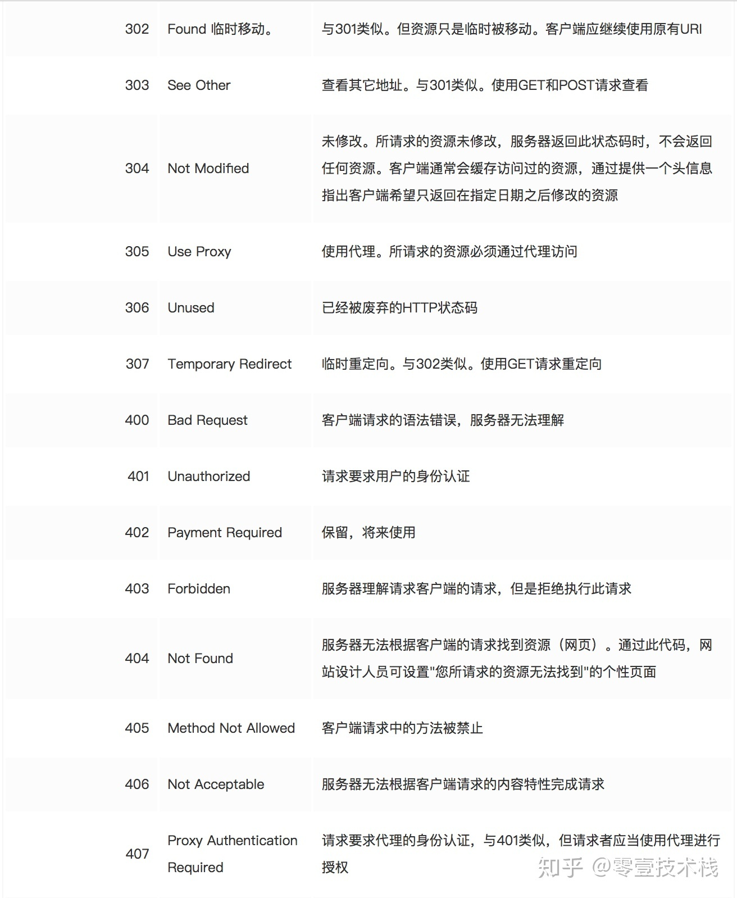
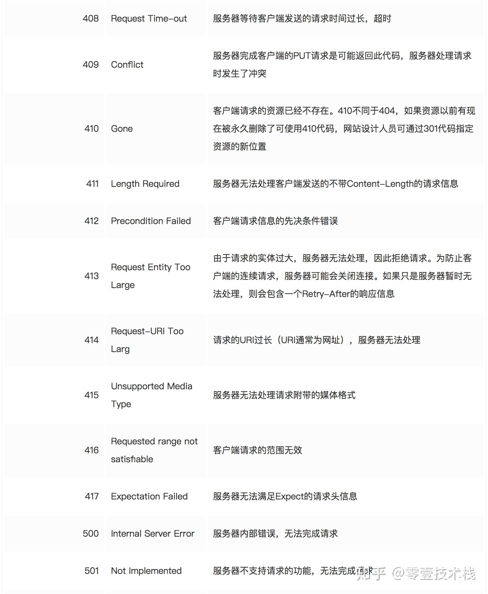
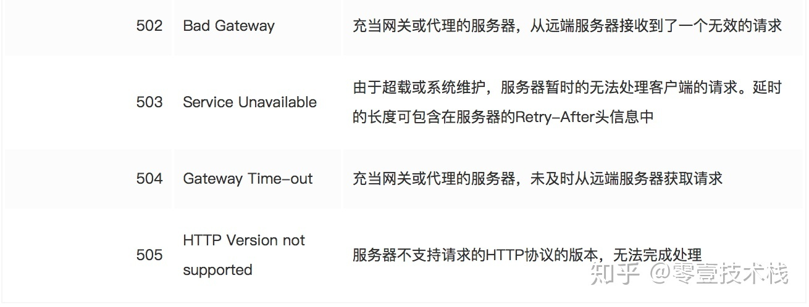

## 2. HTTP消息报头
用来说明客户端要使用的一些附加信息。
1. 通用首部字段:请求报文和响应报文双方都会使用的首部。

2. 响应首部字段:
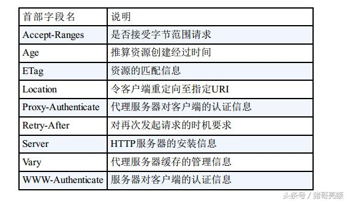
3. 实体首部字段:


## 3. 空行，消息报头后面的空行是必须的

## 4. HTTP响应正文，
服务器返回给客户端的文本信息。空行后面的html部分为响应正文。

# 五. HTTP幂等性
## 1. 定义
HTTP方法的幂等性是指一次和多次请求某一个资源应该具有同样的副作用。
## 2. HTTP GET、DELETE、PUT、POST四种主要方法的语义和幂等性
* HTTP GET方法用于获取资源，不应有副作用，所以是幂等的。比如：`GET http://www.bank.com/account/123456`，不会改变资源的状态，不论调用一次还是N次都没有副作用。
请注意，这里强调的是一次和N次具有相同的副作用，而不是每次GET的结果相同。GET http://www.news.com/latest-news这个HTTP请求可能会每次得到不同的结果，但它本身并没有产生任何副作用，因而是满足幂等性的。

* HTTP DELETE方法用于删除资源，有副作用，但它应该满足幂等性。比如：`DELETE http://www.forum.com/article/4231`，调用一次和N次对系统产生的副作用是相同的，即删掉id为4231的帖子；因此，调用者可以多次调用或刷新页面而不必担心引起错误。

**POST和PUT的区别容易被简单地误认为“POST表示创建资源，PUT表示更新资源”；而实际上，二者均可用于创建资源，更为本质的差别是在幂等性方面。**

* POST所对应的URI并非创建的资源本身，而是资源的接收者。比如：`POST http://www.forum.com/articles`的语义是在`http://www.forum.com/articles`下创建一篇帖子，HTTP响应中应包含帖子的创建状态以及帖子的URI。两次相同的POST请求会在服务器端创建两份资源，它们具有不同的URI；所以，POST方法不具备幂等性。

* PUT所对应的URI是要创建或更新的资源本身。比如：`PUT http://www.forum/articles/4231`的语义是创建或更新ID为4231的帖子。对同一URI进行多次PUT的副作用和一次PUT是相同的；因此，PUT方法具有幂等性。

# 六. HTTP中GET与POST的区别
> GET在浏览器回退时是无害的，而POST会再次提交请求。
> GET产生的URL地址可以被Bookmark，而POST不可以。
> GET请求会被浏览器主动cache，而POST不会，除非手动设置。
> GET请求只能进行url编码，而POST支持多种编码方式。
> GET请求参数会被完整保留在浏览器历史记录里，而POST中的参数不会被保留。
> GET请求在URL中传送的参数是有长度限制的，而POST么有。
> 对参数的数据类型，GET只接受ASCII字符，而POST没有限制。
> GET比POST更不安全，因为参数直接暴露在URL上，所以不能用来传递敏感信息。
> GET参数通过URL传递，POST放在Request body中。

以上只是表面的区别

HTTP的底层是TCP/IP。所以GET和POST的底层也是TCP/IP，也就是说，GET/POST都是TCP链接。GET和POST能做的事情是一样一样的。你要给GET加上request body，给POST带上url参数，技术上是完全行的通的。

浏览器通常都会限制url长度在2K个字节，而（大多数）服务器最多处理64K大小的url。超过的部分，恕不处理。如果你用GET服务，在request body偷偷藏了数据，不同服务器的处理方式也是不同的，有些服务器会读出数据，有些服务器直接忽略，所以，虽然GET可以带request body，也不能保证一定能被接收到哦。

GET和POST本质上就是TCP链接，并无差别。但是由于HTTP的规定和浏览器/服务器的限制，导致他们在应用过程中体现出一些不同。 


GET和POST还有一个重大区别，简单的说：

**GET产生一个TCP数据包；POST产生两个TCP数据包。**

详细来说：

* 对于GET方式的请求，浏览器会把http header和data一并发送出去，服务器响应200（返回数据）；

* 而对于POST，浏览器先发送header，服务器响应100 continue，浏览器再发送data，服务器响应200 ok（返回数据）。

因为POST需要两步，时间上消耗的要多一点，看起来GET比POST更有效。因此Yahoo团队有推荐用GET替换POST来优化网站性能。但这是一个坑！跳入需谨慎。为什么？

1. GET与POST都有自己的语义，不能随便混用。

2. 据研究，在网络环境好的情况下，发一次包的时间和发两次包的时间差别基本可以无视。而在网络环境差的情况下，两次包的TCP在验证数据包完整性上，有非常大的优点。

3. 并不是所有浏览器都会在POST中发送两次包，Firefox就只发送一次。

# 七. 长连接和短连接
HTTP的长连接和短连接本质上是**TCP长连接和短连接**。

* 在HTTP/1.0中默认使用短连接。也就是说，客户端和服务器每进行一次HTTP操作，就建立一次连接，任务结束就中断连接。当客户端浏览器访问的某个HTML或其他类型的Web页中包含有其他的Web资源（如JavaScript文件、图像文件、CSS文件等），每遇到这样一个Web资源，浏览器就会重新建立一个HTTP会话。

* 从HTTP/1.1起，默认使用长连接，用以保持连接特性。使用长连接的HTTP协议，会在响应头加入这行代码：
`Connection:keep-alive`
在使用长连接的情况下，当一个网页打开完成后，客户端和服务器之间用于传输HTTP数据的TCP连接不会关闭，客户端再次访问这个服务器时，会继续使用这一条已经建立的连接。Keep-Alive不会永久保持连接，它有一个保持时间，可以在不同的服务器软件（如Apache）中设定这个时间。实现长连接需要客户端和服务端都支持长连接。

# 八. HTTPS介绍

HTTP 协议中没有加密机制,但可以通 过和 SSL(Secure Socket Layer, 安全套接层 )或 TLS(Transport Layer Security, 安全层传输协议)的组合使用,加密 HTTP 的通信内容。属于通信加密，即在整个通信线路中加密。

```shell
HTTP + 加密 + 认证 + 完整性保护 = HTTPS（HTTP Secure ）
```
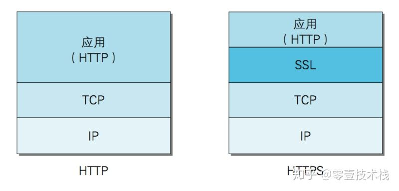


HTTPS 采用共享密钥加密（对称）和公开密钥加密（非对称）两者并用的混合加密机制。

若密钥能够实现安全交换,那么有可能会考虑仅使用公开密钥加密来通信。

但是公开密钥加密与共享密钥加密相比,其处理速度要慢。

所以应充分利用两者各自的优势, 将多种方法组合起来用于通信。 

在交换密钥阶段使用公开密钥加密方式,之后的建立通信交换报文阶段 则使用共享密钥加密方式。


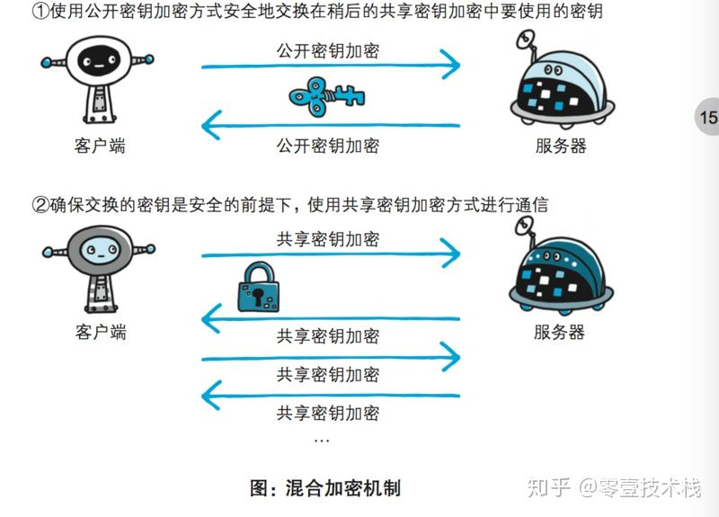


## HTTPS握手过程的简单描述如下：

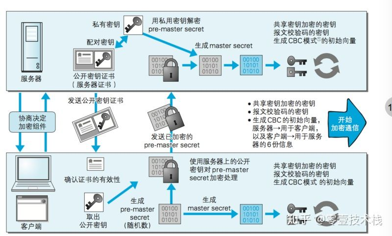


1. 浏览器将自己支持的一套加密规则发送给网站。
```shell
服务器获得浏览器公钥
```

2. 网站从中选出一组加密算法与HASH算法，并将自己的身份信息以证书的形式发回给浏览器。证书里面包含了网站地址，加密公钥，以及证书的颁发机构等信息。
```shell
浏览器获得服务器公钥
```
3. 获得网站证书之后浏览器要做以下工作：
    * 验证证书的合法性（颁发证书的机构是否合法，证书中包含的网站地址是否与正在访问的地址一致等），如果证书受信任，则浏览器栏里面会显示一个小锁头，否则会给出证书不受信的提示。
    * 如果证书受信任，或者是用户接受了不受信的证书，浏览器会生成一串随机数的密码（接下来通信的密钥），并用证书中提供的公钥加密（共享密钥加密）。
    * 使用约定好的HASH计算握手消息，并使用生成的随机数对消息进行加密，最后将之前生成的所有信息发送给网站。 
```shell
浏览器验证 -> 随机密码 服务器的公钥加密 -> 通信的密钥 通信的密钥 -> 服务器
```

4. 网站接收浏览器发来的数据之后要做以下的操作：
    * 使用自己的私钥将信息解密取出密码，使用密码解密浏览器发来的握手消息，并验证HASH是否与浏览器发来的一致。
    * 使用密码加密一段握手消息，发送给浏览器。
```shell
服务器用自己的私钥解出随机密码 -> 用密码解密握手消息（共享密钥通信）-> 验证HASH与浏览器是否一致（验证浏览器）
```

## HTTPS的不足
1. 加密解密过程复杂，导致访问速度慢

2. 加密需要认向证机构付费

3. 整个页面的请求都要使用HTTPS
