[TOC]
# 一. TCP/IP网络模型
TCP/IP 是互联网相关的各类协议族的总称，比如：TCP，UDP，IP，FTP，HTTP，ICMP，SMTP 等都属于 TCP/IP 族内的协议。

在网络层使用IP协议。 IP协议主要解决网络路由和寻址问题，TCP协议主要解决如何在IP层之上可靠地传递数据包，使得网络上接收端收到发送端所发出的所有包，并且顺序与发送顺序一致。

一系列网络协议可以划分为四层，分别为链路层、网络层、传输层和应用层。

* 链路层：负责封装和解封装IP报文，发送和接受ARP/RARP报文等。

* 网络层：负责路由以及把分组报文发送给目标网络或主机。

* 传输层：负责对报文进行分组和重组，并以TCP或UDP协议格式封装报文。

* 应用层：负责向用户提供应用程序，比如HTTP、FTP、Telnet、DNS、SMTP等。

TCP作为一种面向连接的，可靠的协议，它属于**传输层**的协议。只有在确认通信对端存在时才会发送数据，从而可以控制通信流量的浪费。TCP通过检验和、序列号、确认应答、重发控制、连接管理以及窗口控制等机制实现可靠性传输。

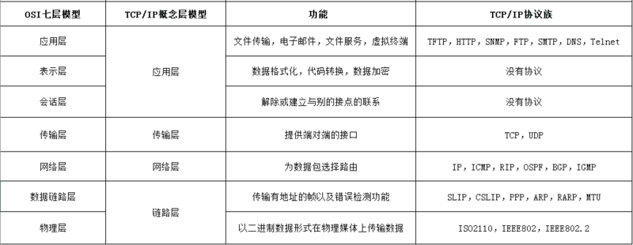

# 二. TCP/IP具体是怎么通信的呢？
利用TCP/IP协议族进行网络通信时，会通过分层顺序与对方进行通信。发送端从应用层往下走，接收端则往应用层往上走。

我们用HTTP举例来说明，

* 首先作为发送端的客户端在应用层（HTTP协议）发出一个想看某个Web页面的HTTP请求。

* 接着，为了传输方便，在传输层（TCP协议）把从应用层处收到的数据（HTTP请求报文）进行分割，并在各个报文上打上标记序号及端口号后转发给网络层。

* 在网络层（IP协议），增加作为通信目的地的MAC地址后转发给链路层。这样一来，发往网络的通信请求就准备齐全了。

* 接收端的服务器在链路层接收到数据，按序往上层发送，一直到应用层。当传输到应用层，才能算真正接收到由客户端发送过来的HTTP请求。

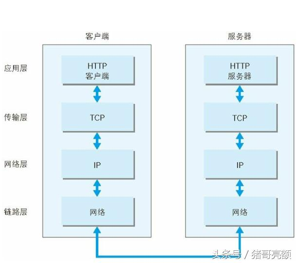

发送端在层与层之间传输数据时，每经过一层时必定会被打上一个该层所属的首部信息。

反之，接收端在层与层传输数据时，每经过一层时会把对应的首部消去。

这种把数据信息包装起来的做法称为封装（encapsulate）。

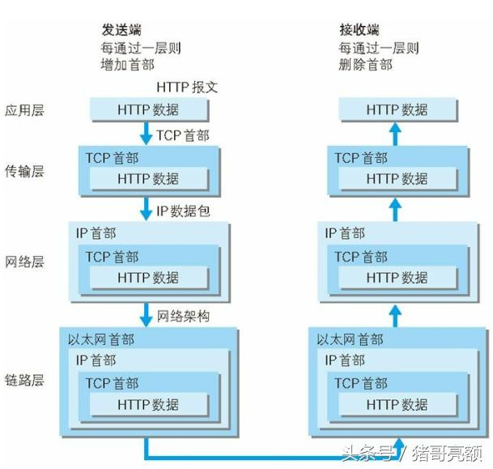

# 三. TCP首部格式
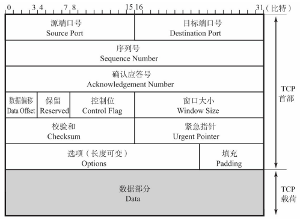

* **源端口号**：表示发送端端口号，字段长16位。

* **目标端口号**：表示接收端端口号，字段长度16位。

* **序列号**：字段长32位。序列号是指发送数据的位置。每发送一次数据，就累加一次该数据字节数的大小（用来标记数据段的顺序）。
    序列号不会从0或1开始，而是在建立连接时由计算机生成的随机数作为其初始值，通过SYN包传给接收端主机。然后再将每转发过去的字节数累加到初始值上表示数据的位置。
    此外，在建立连接和断开连接时发送的SYN包和FIN包虽然并不携带数据，但是也会作为一个字节增加对应的序列号。
    
* **确认应答号**：字段长度32位。是指下一次应该收到的数据的序列号。 
    实际上，它是指已收到确认应答号减一为止的数据。
    发送端收到这个确认应答以后可以认为在这个序号以前的数据都已经被正常接收。
    因此当前报文段最后一个字节的编号+1即为确认应答号。

* **数据偏移**：也称为**首部长度**，该字段表示TCP所传输的数据部分应该从TCP包的哪个位开始计算，当然也可以把它看作**TCP首部的长度**。
    该字段长4位，单位为4字节。
    如果不包括选项字段的话，此数据偏移字段可以设置为5。
    反之，如果该字段的值为5，那说明从TCP包的最一开始到20字节为止都是TCP首部，余下的部分为TCP数据。

* **保留**：该字段主要是为了以后扩展时使用，其长度为4位，一般设置为0。

* **窗口大小**：该字段长为16位。
    用于通知从相同TCP首部的确认应答号所指位置开始能够接收的数据大小，TCP不允许发送超过此处所示大小的数据。
    不过，如果窗口为0，则表示可以发送窗口探测，以了解最新的窗口大小。

* **紧急指针**： 该字段长为16位。只有在URG控制位为1时有效。该字段的数值表示本报文段中紧急数据的指针。

* **选项**：用于提高TCP的传输性能。

* **控制位**：字段长为8位，每一位从左至右分别为CWR、ECE、URG、ACK、 PSH、RST、SYN、FIN。这些控制标志也叫做控制位。
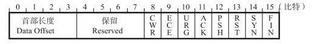

|字段	|含义|
| --- | --- |
|CWR |Congestion Window Reduced：拥塞窗口减少，CWR标志与后面的ECE标志都用于IP首部的ECN字段。ECE标志为1时，则通知对方已将拥塞窗口缩小。|
|ECE |表示ECNEcho。置为1会通知通信对方，从对方到这边的网络有拥塞。在收到数据包的IP首部中ECN为1时将TCP首部中的ECE设置为1。|
|URG	|紧急指针是否有效。为1时，表示某一位需要被优先处理|
|ACK	|确认应答号是否有效，1为有效。TCP规定除了最初建立连接时的SYN包之外该位必须设置为1|
|PSH	|为1时，表示需要将收到的数据立刻传给上层应用协议；为0时，则不需要立即传而是先进行缓存。|
|RST	|为1时表示TCP连接中出现异常必须强制断开连接。|
|SYN	|用于建立连接。SYN为1表示希望建立连接，并在其序列号的字段进行序列号初始值的设定。|
|FIN	|为1时，表示今后不会再有数据发送，希望断开连接。|

* **校验和**：发送端填充（为了让其全长为16位的整数倍，需要在数据部分的最后填充0），CRC校验，接收校验不通过，则认为数据有问题。和UDP的区别是，UDP校验的是数据本身，TCP校验的不仅包含TCP首部，而且包含TCP数据部分。

* **数据部分**：真实有效数据。

**在三次握手中和四次挥手中，我们只需要关注序列号、确认应答号、标志位即可。**

# 四.TCP三次握手
首先需要清楚的一点，不论握手多少次都不能确认一条信道一定是“可靠”的，但通过3次握手可以至少确认它是“可用”的，再往上加握手次数不过是提高它是“可用”的这个结论的可信度。也就是说任意次的握手都是“不可靠”的，**握手成功只能说明握手时的通信是正常的**，并不能保证握手后的通信是正常的。握手只能保证尽可能的可靠，而不可能保证绝对可靠。

TCP通过三次握手来建立可靠的连接。

## 第一次握手：
客户端向服务端发送**连接请求**报文段。该报文段的头部中`SYN=1，ACK=0`，同时选择一个初始序号`seq=x`。请求发送后，客户端便进入`SYN-SENT`状态。

## 第二次握手：
服务端收到连接请求报文段后，如果同意连接，会发送一个应答：`SYN=1，ACK=1，seq=y，ack(确认应答号)=x+1（表示确认接收了一个序列号为X的数据包，同时也表示期望接收的下一个序列号为X+1的数据包）`。发送完应答后服务端进入`SYN-RCVD`状态。

## 第三次握手：
客户端收到服务端连接同意的应答后，还会向服务端发送一个确认报文段，表示：服务端发来的连接同意应答已经成功收到。该报文段的头部为：`ACK=1，seq=x+1，ack(确认应答号)=y+1(表示确认接收了一个序列号为y的数据包，同时也表示期望接收的下一个序列号为y+1的数据包）`。该报文发送完毕后，客户端和服务器端都进入`ESTABLISHED`状态，完成TCP三次握手。

### 未连接队列：
在三次握手协议中，服务器会维护一个未连接队列，该队列为每个客户端的SYN包开设一个条目，该条目表明服务器已收到SYN包，并向客户发出确认，当收到客户的确认包后才删除该条目，服务器进入ESTAB_LISHED状态。

## 为什么是三次握手，而不是两次或四次？
1. **为什么不是两次握手**：是为了防止已失效的连接请求报文段突然又传送到了服务端，造成服务端资源的浪费。
> 在一次TCP连接中，客户端A向服务端B发送连接**请求SYN报文段**，假如这个报文段没有及时被服务端B接收，而是滞留在网络的某处，
> 于是客户端A超时重传，再次发送请求连接并且顺利与服务端B建立了连接，交换数据后断开连接。滞留在网络中的某处的陈旧报文就变成了**失效的连接请求报文**。

> 但如果这个失效的请求SYN报文段，现在又突然传送到了服务端B处，设想这时是使用两次握手而不是三次握手，服务端B就以为客户端A现在建立请求连接，于是服务端B发出确认，新的连接就建立了，服务端B分配资源，等待客户端A传送数据，但客户端A并没有想要建立TCP连接，不会理会服务端B发送的应答，也不会向服务端B传送数据，于是服务端B就白白等待，空耗资源。

> 使用三次握手可以避免这个情况。服务端B收到客户端A的失效的陈旧SYN报文段，向客户端A发送SYN报文段，选择自己的序号seq=y，确认收到客户端A的SYN报文段，确认号ack=x+1。第三次握手客户端A收到B的SYN报文段后，从确认号就可得知不应理睬这个SYN报文段（因为A现在并没有发送seq=x的报文段）。
> 这时，客户端A会发送复位报文段，这个复位报文段中，RST=1，ACK=1，确认号ack=y+1。服务端B收到A的复位报文，就知道不建立TCP连接，不会分配资源等待A发送数据。

2. 为什么不是四次握手：因为三次握手已经能说明握手时的通信是正常的，四次握手、五次握手就显得浪费了。

# 五.TCP四次挥手

TCP连接是双向的，在四次挥手中：
* 前两次挥手用于断开一个方向的连接

* 后两次挥手用于断开另一方向的连接。

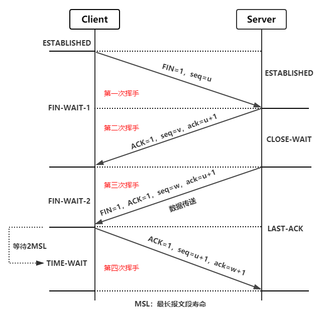

## 第一次挥手
客户端数据发送完成，则它向服务端发送连接释放请求。该请求只有报文头，头中携带的主要参数为：`FIN=1，seq=u`。此时，客户端将进入`FIN-WAIT-1`状态。TCP规定，FIN报文段即使不携带数据，也要消耗一个序号。

## 第二次挥手
服务器收到客户端连接释放报文，通知相应的高层应用进程，告诉它客户端向服务器这个方向的连接已经释放了。此时服务端进入了`CLOSE-WAIT`（关闭等待）状态，并向客户端发出连接释放的应答，其报文头包含：`ACK=1，ack=u+1，seq=v`。

客户端收到该应答后，进入`FIN-WAIT-2`状态，等待服务器发送连接释放报文（在这之前还需要接受服务器发送的最后的数据）。

第二次挥手完成后，客户端到服务端方向的连接已经释放，服务端不会再接收客户端的数据，客户端也没有数据要发送了。但**服务端到客户端方向的连接仍然存在**，服务器若发送数据，客户端依然要接受。这个状态还要持续一段时间，也就是整个`CLOSE-WAIT`状态持续的时间。

## 第三次挥手
服务端将最后的数据发送完毕后，就向客户端发送连接释放报文，其报文头包含：`FIN=1，ack=u+1`，由于在`CLOSE-WAIT`状态，服务端很可能又发送了一些数据，假定此时的序列号为`seq=w`，此时，服务器就进入了`LAST-ACK`（最后确认）状态，等待客户端的确认。

## 第四次挥手

客户端收到服务器的连接释放报文后，向服务端发出确认应答，报文头：`ACK=1，ack=w+1，seq=u+1`，此时，客户端就进入了`TIME-WAIT`（时间等待）状态。该状态会持续`2MSL`（最长报文段寿命）时间，这个期间TCP连接还未释放，若该时间段内没有服务端的重发请求的话，客户端就进入`CLOSED`状态，服务端只要收到了客户端发出的确认，立即进入`CLOSED`状态。就结束了这次的TCP连接。可以看到，服务器结束TCP连接的时间要比客户端早一些。

## 为什么客户端最后还要等待2MSL？

* 第一：**为了保证服务端能收到客户端的确认应答**。若客户端发完确认应答后直接进入`CLOSED`状态，那么如果该应答丢失，服务端等待超时后就会重新发送连接释放请求，但此时客户端已经关闭了，不会作出任何响应，因此服务端就无法正常关闭。

* 第二：**防止类似与“三次握手”中提到了的“已经失效的连接请求报文段”出现在本连接中**。客户端发送完最后一个确认报文后，在这个2MSL时间中，就可以使本连接持续的时间内所产生的所有报文段都从网络中消失。这样新的连接中不会出现旧连接的请求报文。
> MSL:报文段最大生存时间MSL.它是任何报文段被丢弃前网络内的最长时间。

## 为什么是四次挥手？
关闭连接时，服务器收到客户端的FIN报文时，仅仅表示客户端不再发送数据了但是还能接收数据，并且服务端也未必全部数据都发送给对方了，所以服务端可以立即关闭，也可以发送一些数据给对方后，再发送FIN报文给对方来表示同意现在关闭连接，因此，服务端的ACK和FIN一般都会分开发送，从而导致多了一次。

# 六. TCP中的流量控制
TCP中使用滑动窗口进行流量控制。
## 滑动窗口协议：
* TCP协议的使用，在TCP中，窗口的大小是在TCP三次握手后协定的，并且窗口的大小并不是固定的，而是会随着网络的情况进行调整。

* 维持发送方/接收方缓冲区，缓冲区是用来解决网络之间数据不可靠的问题，例如丢包，重复包，出错，乱序

## 问题一：如何保证次序？
> 在我们滑动窗口协议之前，我们如何来保证发送方与接收方之间，每个包都能被收到。并且是按次序的呢？

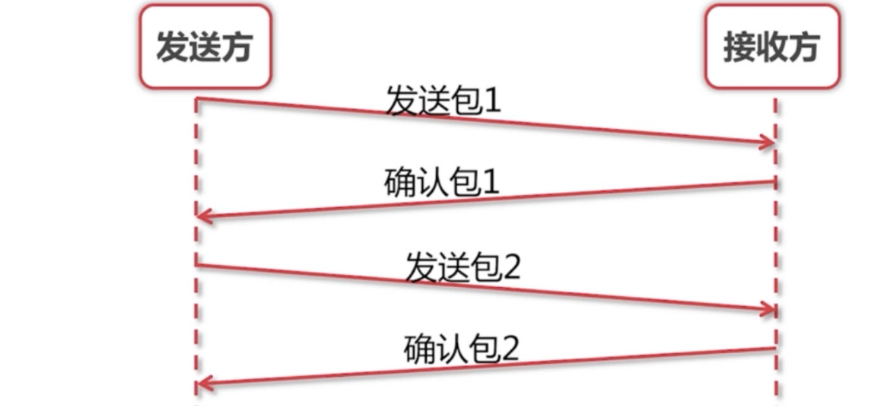

发送方发送一个包1，这时候接收方确认包1。发送包2，确认包2。就这样一直下去，知道把数据完全发送完毕，这样就结束了。

那么就解决了丢包，出错，乱序等一些情况！同时也存在一些问题。

吞吐量非常的低。我们发完包1，一定要等确认包1.我们才能发送第二个包。

## 问题二：如何提高吞吐量？
> 提出问题：那么我们就不能先连发几个包等他一起确认吗？这样的话，我们的速度会不会更快，吞吐量更高些呢？

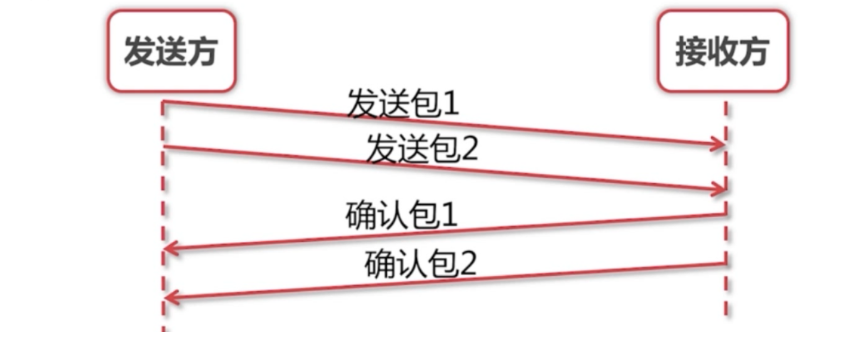

如图，这个就是我们把两个包一起发送，然后一起确认。可以看出我们改进的方案比之前的好很多，所花的时间只是一个来回的时间。

## 问题三：如何实现最优解？
> 问题：我们每次需要发多少个包过去呢？发送多少包是最优解呢？

我们能不能把第一个和第二个包发过去后，收到第一个确认包就把第三个包发过去呢？而不是去等到第二个包的确认包才去发第三个包。这样就很自然的产生了我们"**滑动窗口**"的实现。

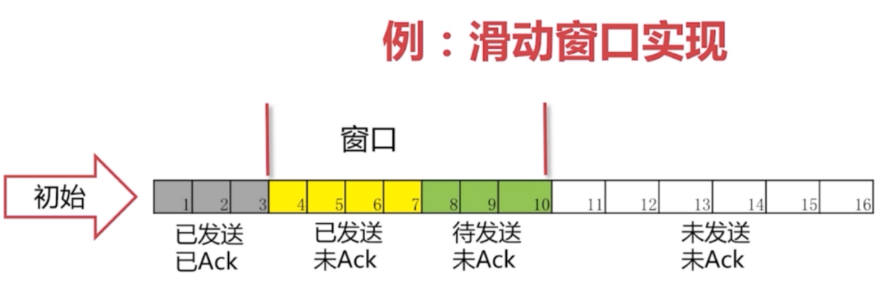

在图中，我们可看出灰色1号2号3号包已经发送完毕，并且已经收到Ack。这些包就已经是过去式。

4、5、6、7号包是黄色的，表示已经发送了。但是并没有收到对方的Ack，所以也不知道接收方有没有收到。

8、9、10号包是绿色的。是我们还没有发送的。这些绿色也就是我们接下来马上要发送的包。 

可以看出我们的窗口正好是11格。后面的11-16还没有被读进内存。要等4号-10号包有接下来的动作后，我们的包才会继续往下发送。

## 滑动窗口正常情况
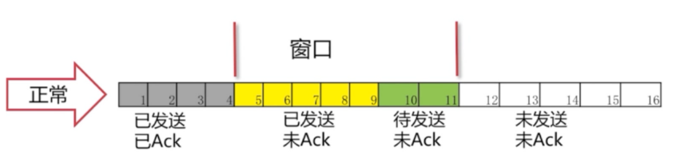
可以看到4号包对方已经被接收到，所以被涂成了灰色。“窗口”就往右移一格，这里只要保证“窗口”是7格的。 

我们就把11号包读进了我们的缓存。进入了“待发送”的状态。8、9号包已经变成了黄色，表示已经发送出去了。

接下来的操作就是一样的了，确认包后，窗口往后移继续将未发送的包读进缓存，把“待发送“状态的包变为”已发送“。

## 丢包情况
有可能我们包发过去，对方的Ack丢了。也有可能我们的包并没有发送过去。从发送方角度看就是我们没有收到Ack。

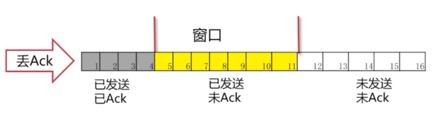
发生的情况：一直在等Ack。如果一直等不到的话，我们也会把读进缓存的待发送的包也一起发过去。但是，这个时候我们的窗口已经发满了。所以并不能把12号包读进来，而是始终在等待5号包的Ack。

## 超时重发
> 如果我们这个Ack始终不来怎么办呢？

这时候我们有个解决方法：**超时重传**
这里有一点要说明：这个Ack是要按顺序的。必须要等到5的Ack收到，才会把6-11的Ack发送过去。这样就保证了滑动窗口的一个顺序。

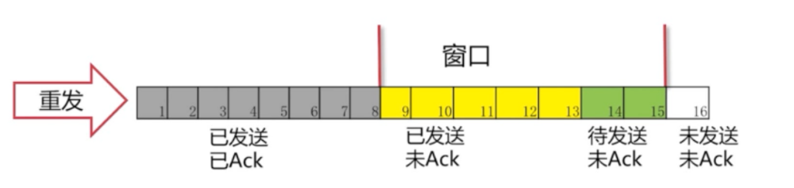
这时候可以看出5号包已经接受到Ack，后面的6、7、8号包也已经发送过去已Ack。窗口便继续向后移动。

## TCP的滑动窗口协议有什么意义呢
* 首先当然是可靠性，滑动窗口只有在队列前部的被确认之后，才会往后移动，保证数据包被接收方确认并接收。

* 其次是传输效率，假如没有窗口，服务端是杂乱无章地进行发包，因为TCP的队首效应，如果有前面的包没有发送成功，就会不停的重试，反而造成更差的传输效率。

* 最后是稳定性，TCP的滑动窗口大小，是整个复杂网络商榷的结果，会进行动态调整，可以尽量地避免网络拥塞，更加稳定。

# 七. TCP中的拥塞控制
## 1. 拥塞概念
路由器因无法处理高速到达的流量而被迫丢弃数据信息的现象称为拥塞。

## 2. 拥塞控制
防止过多的数据注入到网络当中，这样可以使网络中的路由器或链路不致过载。（通过拥塞窗口处理网络拥塞现象的一种机制）

1. 前提：网络能够承受现有的网络负荷。

2. 拥塞控制是一个全局性的过程，涉及到所有的主机、路由器，以及与降低网络传输性能有关的所有因素。

3. 为什么有的流量控制，还需要拥塞控制？流控只简单地表明了**接收方的处理能力**，并**不能代表中间网络的处理能力**，如果一开始把流控窗口内的数据全部发送出去，中间路由器可能一时处理不了如此多的突发流量

4. 代价：需要获得网络内部流量分布的信息。在实施拥塞控制之前，还需要在结点之间交换信息和各种命令，以便选择控制的策略和实施控制。这样就产生了额外的开销。拥塞控制还需要将一些资源分配给各个用户单独使用，使得网络资源能更好的实现共享。

## 3. 拥塞控制的几种方法
主要有四种方法：慢开始、拥塞避免、快重传和快恢复  
### 3.1 慢开始
#### 算法原理
当主机开始发送数据时，如果立即将大量数据字节注入到网络，那么就有可能因为不清楚当前网络的负荷情况而引起网络阻塞。所以，最好的方法是先探测一下，即由小到大逐渐增大发送窗口，也就是说，由小到大逐渐增大拥塞窗口数值。

通常在刚刚发送报文段时，先把拥塞窗口cwnd设置为一个最大报文段MSS的数值。而在每收到一个新的报文段的确认后，把拥塞窗口增加至多一个MSS的数值。
* 第一次发送完成，收到一个ack，cwnd=2MSS

* 第二次直接发两个报文，收到两个ack，cend=4MSS

所以这时是成指数级增长。

用这样的方法逐步增大发送方的拥塞窗口cwnd，可以使分组注入到网络的速率更加合理。

慢开始当中的“慢”并不是指cwnd的增长速率慢，而是在TCP开始发送报文段时先设置cwnd = 1,使得发送方在开始时只发送一一个报文段

当rwnd足够大的时候，为了防止拥塞窗口cwnd的增长引起网络阻塞，还需要另外一个变量------慢开始门限ssthresh.

* 当cwnd < ssthresh时，使用上述慢启动算法；

* 当cwnd >ssthresh时，停止使用慢启动算法，改用拥塞避免算法；

#### 慢开始的局限性

1. 需要获得网络内部流量分布的信息，浪费可用的网络容量，额外开销；

2. 估算合理的ssthresh值并不容易，可能耗时较长；

>注：
> 1. 接收端窗口rwnd，又称通知窗口（awnd），是接收端根据目前的接收缓存大小所许诺的最新窗口值，是**来自接收端的流量控制**。
> 2. 拥塞窗口cwnd是**发送端**根据自己估计的网络阻塞程度而设置的窗口值，是**来自发送端的流量控制**。实际的发送窗口：W=min(cwnd,awnd)。两者之间较小的。如果接收方慢：`W=awnd`，如果网络慢：`W=cwnd`
> 3. MSS是TCP数据包每次能够传输的最大数据分段，其中并不包括TCP首部。而MSS只出现在syn报文段当中。一般来说MSS的值在不分段的情况下越大越好（eg:一个外出接口的MSS值是MTU减去IP和TCP首部长度）

### 3.2 拥塞避免
#### 算法原理
让拥塞窗口cwnd缓慢的增大，即每经过一个往返时间RTT就把发送方的拥塞窗口cwnd加1，而不是加倍，这样拥塞窗口cwnd按线性规律缓慢的增长，比慢开始算法的拥塞窗口增长速率缓慢的多

无论是慢启动算法还是拥塞避免算法，只要判断网络出现拥塞，就要把慢启动开始门限（ssthresh）设置为发送窗口（即当前的数据发送窗口W=min(cwnd,awnd)）的一半，cwnd设置为1，然后再使用慢启动算法，

这样做的目的能迅速的减少网络当中的数据传输，使发生拥塞的路由器能够把队列中堆积的分组处理完毕。拥塞窗口是按照线性的规律增长

#### 控制过程
1. TCP连接初始化，将拥塞窗口cwnd设置为1个报文段，即cwnd = 1mss;

2. 执行慢开始算法，以后每收到一个ack，cwnd+=1mss，cwnd按指数规律增长，直到cwnd == ssthresh时，开始执行拥塞避免算法；

3. 当网络发生拥塞，把ssthresh值更新为ssthresh=max(cwnd/2, 2) 这个的意思是ssthresh为cwnd/2 但是至少是2个报文段，cwnd重新设置为1，再按照2执行；

示例：

1. 在TCP连接进行初始化的时候，cwnd = 1，ssthresh = 16;

2. 在慢启动算法开始时，cwnd的初始值是1，每次发送方收到一个ACK拥塞窗口就增加1，当ssthresh == cwnd时，启动拥塞控制算法，拥塞窗口按照线性规律增长；

3. 当cwnd = 24时，网络出现超时，发送方收不到确认ACK，此时设置ssthresh = 12,设置cwnd = 1,然后开始慢启动算法，当cwnd = ssthresh=12，慢启动算法变为拥塞控制算法，每收到一个ack，cwnd=cwnd+1/cwnd 即每一个轮次（一个轮次会有cwnd个ack），cwnd增加一个mss，cwnd按照线性速度增长
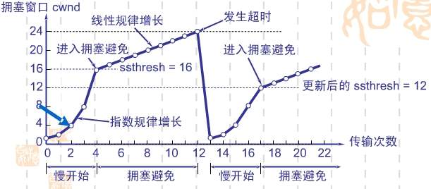 

### AIMD算法（加法增大乘法减小）
1. 乘法减小：无论在慢启动阶段还是在拥塞控制阶段，只要网络出现超时，就是将cwnd置为1，sthresh置为cwnd的一半，然后开始执行慢启动算法

2. 加法增大：当网络频发出现超时情况时，ssthresh就下降的很快，为了减少注入到网络当中的分组数，而加法增大是执行拥塞避免算法后，是拥塞窗口缓慢的增大，以防止网络过早出现拥塞。

这两个结合起来就是AIMD算法，是使用最广泛的算法。拥塞避免算法不能够完全避免网络y拥塞，通过控制拥塞窗口的大小只能使网络不易出现拥塞。

### 3.3 快重传
 一条TCP连接有时会因为等待重传计时的超时而空闲较长时间，慢开始和拥塞避免无法解决这类问题，因此提出了快重传和快恢复的拥塞控制方法。
#### 算法过程

快重传算法要求首先接收方收到一个失序的报文段后立刻发出重复确认，而不要等待自己发送数据时才进行捎带确认，如下图
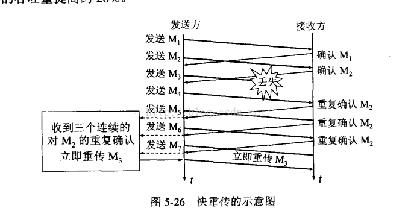

* 在上图中，接收方成功的接受了发送方发来的M1,M2并且分别发送了ACK，

* 现在接收方没有收到M3，而收到了M4，显然接收方不能确认M4，因为M4是失序的报文段。

* 如果根据可靠性传输原理接收方什么都不做，但是按照快速重传算法，在收到M4,M5等报文段的时候，不断重复的向发送方发送M2的ACK，

* 如果接收方一连收到三个重复的ACK，那么发送方不必等待超时重传计时器到期，由发送方尽早重传未被确认的报文段。

### 3.4 快恢复  

* 当发送方连续收到三个重复确认时，执行“乘法减小”算法，慢开始门限ssthresh=max(cwnd/2, 2)，为了预防网络发生阻塞。

* 由于发送方现在认为网络很可能没有发生阻塞，因此现在不执行慢启动算法，而是当收到新的ack时，cwnd重设为ssthresh，并退出快速恢复阶段。cwnd=ssthresh，然后开始执行拥塞避免算法，拥塞窗口cwnd值线性增大。

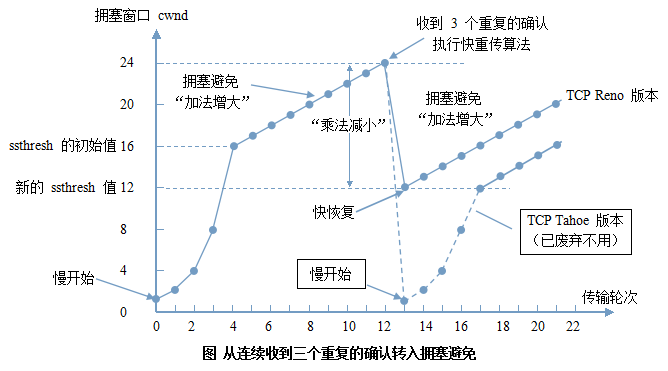
