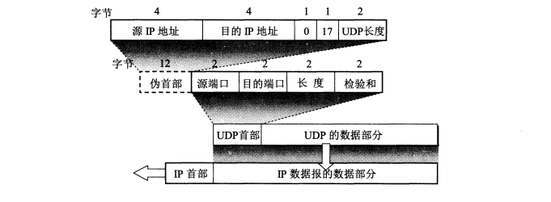

[TOC]
# 1. 概述
用户数据报协议（UDP，User Datagram Protocol）为应用程序提供了一种无需建立连接就可以发送封装的 IP 数据报的方法。
UDP是一种保留消息边界的简单的面向数据报的协议。

UDP不提供差错纠正、队列管理、重复消除、流量控制和拥塞控制，但提供差错检测（包含我们在传输层中碰到的第一个真实的端到端（end-to-end）校验和）。

这种协议自身提供最小功能，因此使用它的应用程序要做许多关于数据报如何发送和处理的控制工作。

想要保证数据被可靠传递或正确排序，应用程序必须自己实现这些保护功能。

一般来说，每个被应用程序请求的UDP输出操作只产生一个UDP数据报，从而发送一个IP数据报。

而对于面向数据流的传输层协议（例如TCP），应用程序写入的全部数据与真正在单个IP数据报里传送的或接收方接收的内容可能没有联系。

# 2. UDP 的主要特点

## 2.1 UDP 是无连接的
即发送数据之前不需要建立连接，因此减少了开销和发送数据之前的时延。

## 2.2 UDP 使用尽最大努力交付
即不保证可靠交付，因此主机不需要维持复杂的连接状态表。
## 2.3 UDP 是面向报文的。
发送方的UDP对应用程序交下来的报文，在添加首部后就向下交付IP层。UDP对应用层交下来的报文，既不合并，也不拆分，而是保留这些报文的边界。因此，应用程序必须选择合适大小的报文。
## 2.4 UDP 没有拥塞控制
因此网络出现的拥塞不会使源主机的发送速率降低。很多的**实时应用**（如IP电话、实时视频会议等）要去源主机以恒定的速率发送数据，并且允许在网络发生拥塞时丢失一些数据，但却不允许数据有太多的时延。UDP正好符合这种要求。
## 2.5 UDP 支持一对一、一对多、多对一和多对多的交互通信。

## 2.6 UDP 的首部开销小，只有8个字节，比TCP的20个字节的首部要短。

# 3. UDP 的首部格式

UDP有两个字段：数据字段和首部字段。首部字段很简单，只有8个字节，由4个字段组成，每个字段的长度都是两个字节。各字段意义如下：
* **源端口**：源端口号。在需要对方回信时选用。不需要时可用全0。

* **目的端口**：目的端口号。这在终点交付报文时必须要使用到。

* **长度**： UDP用户数据报的长度，其最小值是8（仅有首部），发送一个带0字节数据的UDP数据报是允许的。
值得注意的是，UDP长度字段是冗余的；
数据报的总长度包含了IPV4头部，因此，一个UDP/IPV4数据报的长度等于IPV4数据报的总长度减去IPV4头部的长度。
一个UDP/IPV6数据报的长度等于包含在IPV6头部中的负载长度（payload length）字段的值减去所有扩展头部（除非使用了超长数据报）的长度。
这两种情况下，UDP长度字段应该与从IP层提供的信息计算得到的长度是一致的。

* 校验和：检测UDP用户数据报在传输中是否有错。有错就丢弃。

## 伪首部
在UDP伪首部中，包含32位源IP地址，32位目的IP地址，8位填充0，8位协议，16位UDP长度。

伪首部并非TCP&UDP数据报中实际的有效成分。

伪首部是一个虚拟的数据结构，**其中的信息是从数据报所在IP分组头的分组头中提取的**，既不向下传送也不向上递交，而仅仅是为计算校验和。

伪头部的目的是让UDP层验证数据是否已经到达正确的目的地（即，该IP没有接受地址错误的数据报，也没有给UDP一个本该其他传输协议的数据报），计算UDP校验和时覆盖的字段，包含了伪头部以及UDP头部和负载。

# 4. TCP和UDP的比较
| |UDP	|TCP|
| --- | --- |--- |
|是否连接|	无连接	|面向连接|
|是否可靠	|不可靠传输，不使用流量控制和拥塞控制	|可靠传输，使用流量控制和拥塞控制|
|连接对象个数	|支持一对一，一对多，多对一和多对多交互通信	|只能是一对一通信|
|传输方式	|面向报文，没有分组开销|面向字节流，因此它能将信息分割成组，并在接收端将其重组|
|首部开销	|首部开销小，仅8字节	|首部最小20字节，最大60字节|
|适用场景	|适用于实时应用（IP电话、视频会议、直播等）	|适用于要求可靠传输的应用，例如文件传输|