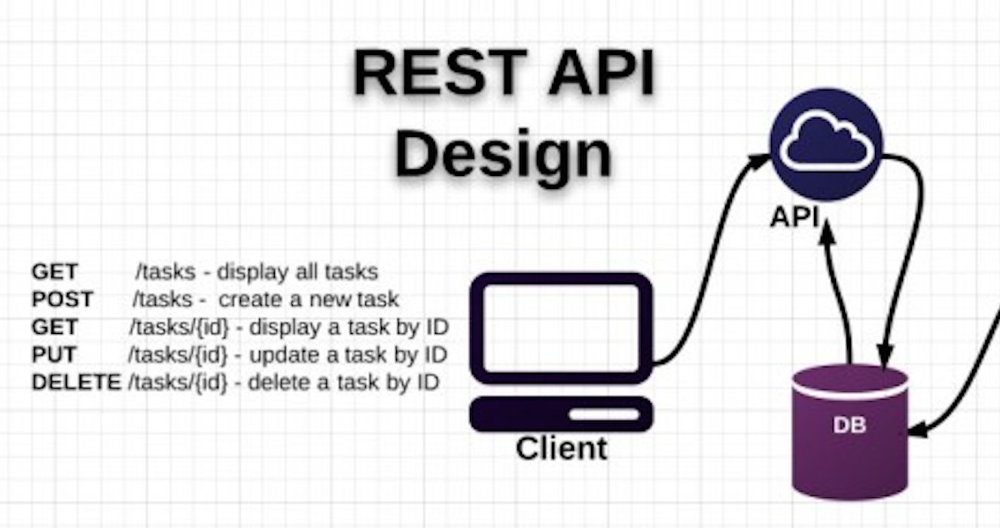
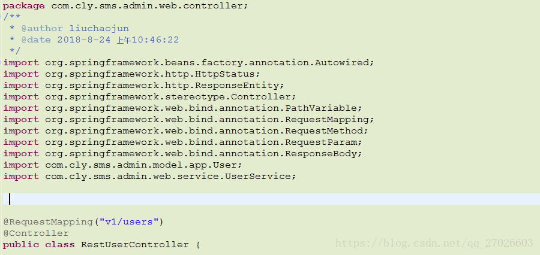
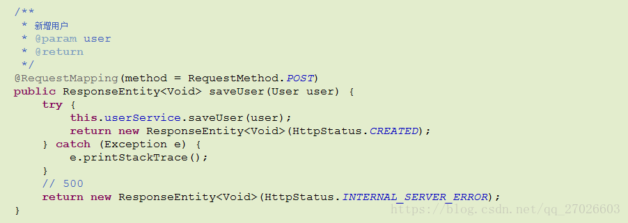
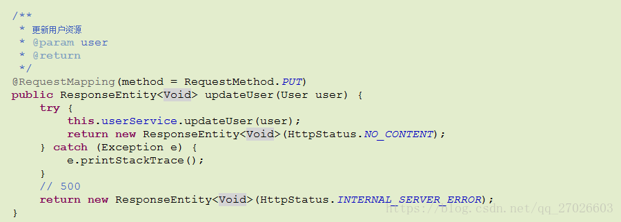
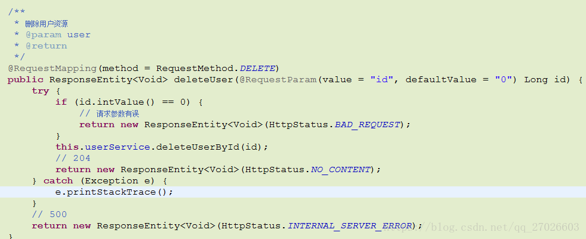

[TOC]
# 一. REST的定义
> REST -- REpresentational State Transfer 直接翻译：表现层状态转移。

精辟概括：**URL定位资源，用HTTP动词（POST、DELETE、PUT、GET）对资源进行操作，分别对应 添加、 删除、修改、查询。**

# 二. REST的使用
1. REST描述的是在网络中client和server的一种交互形式；REST本身不实用，实用的是如何设计 RESTful API（REST风格的网络接口）；

2. **传统方式操作资源** 
    * `http://127.0.0.1/item/queryUser.action?id=1`   查询,GET 

    * `http://127.0.0.1/item/saveUser.action`             新增,POST 

    * `http://127.0.0.1/item/updateUser.action`          更新,POST 

    * `http://127.0.0.1/item/deleteUser.action?id=1`  删除,GET或POST


3. **使用RESTful操作资源**:用HTTP协议里的动词来实现资源的添加，修改，删除等操作。即通过HTTP动词来实现资源的状态扭转：
    * GET    用来获取资源，
  
    * POST  用来新建资源（也可以用于更新资源），
    
    * PUT    用来更新资源，
    
    * DELETE  用来删除资源。

比如：

* 【GET】 /users : 查询用户信息列表

* 【GET】 /users/1001 : 查看某个用户信息

* 【POST】 /users : 新建用户信息

* 【PUT】 /users/1001 : 更新用户信息(全部字段)

* 【PATCH】 /users/1001 : 更新用户信息(部分字段)

* 【DELETE】 /users/1001 : 删除用户信息

* 禁止使用： GET http://api.qc.com/v1/deleteFriend 

图例：



之前的操作是没有问题的,但大神认为是有问题的,有什么问题呢?你每次请求的接口或者地址,都在做描述,例如查询的时候用了queryUser,新增的时候用了saveUser ，修改的时候用了updateUser,其实完全没有这个必要,我使用了get请求,就是查询.使用post请求,就是新增的请求,PUT就是修改，delete就是删除，我的意图很明显,完全没有必要做描述,这就是为什么有了restful.

 
# 三. API设计风格基本规则
## 1. 使用名词而不是动词
不要使用：

/getAllUsers
/createNewUser
/deleteAllUser

## 2. Get方法和查询参数不应该涉及状态改变
使用PUT, POST 和DELETE 方法 而不是 GET 方法来改变状态，不要使用GET 进行状态改变:

## 3. 使用复数名词
不要混淆名词单数和复数，为了保持简单，只对所有资源使用复数。

/cars 而不是 /car
/users 而不是 /user
/products 而不是 /product
/settings 而部署 /setting

## 4. 使用子资源表达关系
如果一个资源与另外一个资源有关系，使用子资源：

GET /cars/711/drivers/ 返回 car 711的所有司机
GET /cars/711/drivers/4 返回 car 711的4号司机

## 5. 使用Http头声明序列化格式
在客户端和服务端，双方都要知道通讯的格式，格式在HTTP-Header中指定

Content-Type 定义请求格式
Accept 定义系列可接受的响应格式

## 6.为集合提供过滤、排序、选择和分页等功能

### Filtering过滤:

使用唯一的查询参数进行过滤：

`GET /cars?color=red` 返回红色的cars
`GET /cars?seats<=2` 返回小于两座位的cars集合

### Sorting排序:

允许针对多个字段排序

`GET /cars?sort=-manufactorer,+model`

这是返回根据生产者降序和模型升序排列的car集合

### Field selection

移动端能够显示其中一些字段，它们其实不需要一个资源的所有字段，给API消费者一个选择字段的能力，这会降低网络流量，提高API可用性。

`GET /cars?fields=manufacturer,model,id,color`

### Paging分页

使用 limit 和offset.实现分页，缺省limit=20 和offset=0；

`GET /cars?offset=10&limit=5`

为了将总数发给客户端，使用订制的HTTP头： `X-Total-Count`.

链接到下一页或上一页可以在HTTP头的link规定，遵循Link规定:
```html
Link: <https://blog.mwaysolutions.com/sample/api/v1/cars?offset=15&limit=5>; rel="next",
<https://blog.mwaysolutions.com/sample/api/v1/cars?offset=50&limit=3>; rel="last",
<https://blog.mwaysolutions.com/sample/api/v1/cars?offset=0&limit=5>; rel="first",
<https://blog.mwaysolutions.com/sample/api/v1/cars?offset=5&limit=5>; rel="prev",
```

## 7. 版本化你的API
使得API版本变得强制性，不要发布无版本的API，使用简单数字，避免小数点如2.5.

一般在Url后面使用v：`/blog/api/v1`

## 8. 使用Http状态码处理错误

如果你的API没有错误处理是很难的，只是返回500和出错堆栈不一定有用

Http状态码提供70个出错，我们只要使用10个左右：

* 200 – OK – 一切正常

* 201 – OK – 新的资源已经成功创建

* 204 – OK – 资源已经成功擅长

* 304 – Not Modified – 客户端使用缓存数据

* 400 – Bad Request – 请求无效，需要附加细节解释如 "JSON无效"

* 401 – Unauthorized – 请求需要用户验证

* 403 – Forbidden – 服务器已经理解了请求，但是拒绝服务或这种请求的访问是不允许的。

* 404 – Not found – 没有发现该资源

* 422 – Unprocessable Entity – 只有服务器不能处理实体时使用，比如图像不能被格式化，或者重要字段丢失。

* 500 – Internal Server Error – API开发者应该避免这种错误。

使用详细的错误包装错误：
```json
{

  "errors": [

   {

    "userMessage": "Sorry, the requested resource does not exist",

    "internalMessage": "No car found in the database",

    "code": 34,

    "more info": "http://dev.mwaysolutions.com/blog/api/v1/errors/12345"

   }

  ]

}
```
## 9.允许覆盖http方法

一些代理只支持POST 和 GET方法， 为了使用这些有限方法支持RESTful API，需要一种办法覆盖http原来的方法。

使用订制的HTTP头 X-HTTP-Method-Override 来覆盖POST 方法.

# 四. Restful风格的springMVC例子





