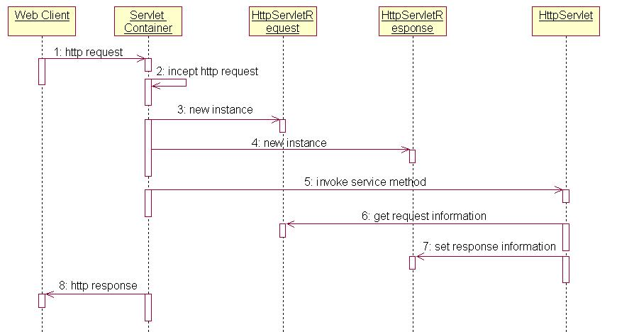

[TOC]
## Servlet 生命周期
Servlet 生命周期：Servlet 加载--->实例化--->服务--->销毁。


Tomcat 与 Servlet 是如何工作的：


工作步骤：

1. Web Client 向Servlet容器（Tomcat）发出Http请求。

2. Servlet容器接收Web Client的请求，Servlet容器创建一个HttpRequest对象，将Web Client请求的信息封装到这个对象中。

3. Servlet容器创建一个HttpResponse对象，Servlet容器调用HttpServlet对象的service方法，把HttpRequest对象与HttpResponse对象作为参数传给 HttpServlet 对象。

4. HttpServlet调用HttpRequest对象的有关方法，获取Http请求信息。

5. HttpServlet调用HttpResponse对象的有关方法，生成响应数据。

6. Servlet容器把HttpServlet的响应结果传给Web Client。

## Servlet中的方法

1.  init（）：在Servlet的生命周期中，仅执行一次init()方法。它是在服务器装入Servlet时执行的，负责初始化Servlet对象。可以配置服务器，以在启动服务器或客户机首次访问Servlet时装入Servlet。无论有多少客户机访问Servlet，都不会重复执行init（）。

2. service（）：
    * 它是Servlet的核心，负责响应客户的请求。每当一个客户请求一个HttpServlet对象，该对象的Service()方法就要调用，而且传递给这个方法一个“请求”（ServletRequest）对象和一个“响应”（ServletResponse）对象作为参数。在HttpServlet中已存在Service()方法。默认的服务功能是调用与HTTP请求的方法相应的do功能。

    * 如果重写了service方法，那么servlet容器就会把请求交给这个方法来处理，倘若你重写的service方法没有调用doXXX，即使你在Servlet中又重写了doGet doPost方法，这两个方法也是不会被调用的，所以如果你由于某种需要，需要重写service方法，并且根据不同的method调用doPost doGet等时，就要在末尾加上一句super.service(),这样就可以解决问题了。

    * 通过API可以看到在HttpServlet类中的两个service方法:
        
        1. service(ServletRequest, ServletResponse)方法是重写的其父类GenericServlet类的方法，这个方法是公共的（public），其作用是接受客户端的请求并将其传递给service(HttpServletRequest, HttpServletResponse)方法；
        
        2. service(HttpServletRequest, HttpServletResponse)方法是HttpServlet类定义的方法，是受保护的（protected），主要作用是接受标准的Http请求（HttpServletRequest），并根据请求方式不同分发到不同的doXXX(HttpServletRequest, HttpServletResponse)方法。
        
        3. 这就是HttpServlet有两个service方法的原因了。一般情况下我们的Servlet只需重写受保护的service方法就够了。
     * Servlet接口SUN公司定义了两个默认实现类，分别为：GenericServlet、HttpServlet。
        
        1. HttpServlet指能够处理HTTP请求的servlet，它在原有Servlet接口上添加了一些与HTTP协议处理方法，它比Servlet接口的功能更为强大。因此开发人员在编写Servlet时，通常应继承这个类，而避免直接去实现Servlet接口。
       
        2. HttpServlet在实现Servlet接口时，覆写了service方法，该方法体内的代码会自动判断用户的请求方式，如为GET请求，则调用HttpServlet的doGet方法，如为Post请求，则调用doPost方法。因此，开发人员在编写Servlet时，通常只需要覆写doGet或doPost方法，而不要去覆写service方法。


3. Servlet中doGet()方法：GET调用用于获取服务器信息，并将其做为响应返回给客户端。get方式数据的传输载体是URL（提交方式能form，也能任意的URL链接）当经由Web浏览器或通过HTML、JSP直接访问Servlet的URL时，一般用GET调用。GET调用在URL里显示正传送给SERVLET的数据，这在系统的安全方面可能带来一些问题，比如用户登录，表单里的用户名和密码需要发送到服务器端，若使用Get调用，就会在浏览器的URL中显示用户名和密码。

4. Servlet中的doPost()方法：它用于客户端把数据传送到服务器端，也会有副作用。但好处是可以隐藏传送给服务器的任何数据。Post适合发送大量的数据。POST是HTTP头键值对（只能以form方式提交）

示例：
可以把方法写在doGet()方法中,在doPost()方法中调用执行,这样,无论你提交的是post还是get方法都可以执行

```jsp
<form action="/servlet" method="post">
………
<input type="text" >
………
</form>
```
 ```java
public class servlet extends HttpServlet {
  public void doGet(HttpServletRequest request,HttpServletResponse response) throws IOException,ServletException {
      request.setCaracterEncoding(“gb2312”);//汉字转码
      PrintWriter out = response.getWriter();
      out.println("The Parameter are ："+request.getParameter("name1"));
  }
  public void doPost(HttpServletRequest request,HttpServletResponse response) throws IOException,ServletException {
      this.goGet(request,response);//调用doGet()方法
  }
}

```
5. destroy（）： 仅执行一次，在服务器端停止且卸载Servlet时执行该方法。当Servlet对象退出生命周期时，负责释放占用的资源。一个Servlet在运行service()方法时可能会产生其他的线程，因此需要确认在调用destroy()方法时，这些线程已经终止或完成。
## Servlet工作原理
1. 首先简单解释一下Servlet接收和响应客户请求的过程，首先客户发送一个请求，Servlet是调用service()方法对请求进行响应的，通过源代码可见，service()方法中对请求的方式进行了匹配，选择调用doGet,doPost等这些方法，然后再进入对应的方法中调用逻辑层的方法，实现对客户的响应。在Servlet接口和GenericServlet中是没有doGet（）、doPost（）等等这些方法的，HttpServlet中定义了这些方法，但是都是返回error信息，所以，我们每次定义一个Servlet的时候，都必须实现doGet或doPost等这些方法。

2. 每一个自定义的Servlet都必须实现Servlet的接口，Servlet接口中定义了五个方法，其中比较重要的三个方法涉及到Servlet的生命周期，分别是上文提到的init(),service(),destroy()方法。GenericServlet是一个通用的，不特定于任何协议的Servlet,它实现了Servlet接口。而HttpServlet继承于GenericServlet，因此HttpServlet也实现了Servlet接口。所以我们定义Servlet的时候只需要继承HttpServlet即可。

3. Servlet接口和GenericServlet是不特定于任何协议的，而HttpServlet是特定于HTTP协议的类，所以HttpServlet中实现了service()方法，并将请求ServletRequest、ServletResponse 强转为HttpRequest 和 HttpResponse。

4. servlet理论上可以处理多种形式的请求响应形式,http只是其中之一，所以HttpServletRequest、 HttpServletResponse分别是ServletRequest和ServletResponse的子类。HttpServletRequest和ServletRequest都是接口，HttpServletRequest继承自ServletRequest，HttpServletRequest比ServletRequest多了一些针对于Http协议的方法。 

## 创建Servlet对象的时机

1. Servlet容器启动时：读取web.xml配置文件中的信息，构造指定的Servlet对象，创建ServletConfig对象，同时将ServletConfig对象作为参数来调用Servlet对象的init方法。

2. 在Servlet容器启动后：客户首次向Servlet发出请求，Servlet容器会判断内存中是否存在指定的Servlet对象，如果没有则创建它，然后根据客户的请求创建HttpRequest、HttpResponse对象，从而调用Servlet 对象的service方法。

3. Servlet Servlet容器在启动时自动创建Servlet，这是由在web.xml文件中为Servlet设置的<load-on-startup>属性决定的。从中我们也能看到同一个类型的Servlet对象在Servlet容器中以**单例**的形式存在。

### 关于load-on-startup元素
1. load-on-startup元素标记容器是否在启动的时候就加载这个servlet(实例化并调用其init()方法)。
2. 它的值必须是一个整数，表示servlet应该被载入的顺序
3. 当值为0或者大于0时，表示容器在应用启动时就加载并初始化这个servlet；
4. 当值小于0或者没有指定时，则表示容器在该servlet被选择时才会去加载。
5. 正数的值越小，该servlet的优先级越高，应用启动时就越先加载。
6. 当值相同时，容器就会自己选择顺序来加载。

所以，`<load-on-startup>x</load-on-startup>` 中x的取值1，2，3，4，5代表的是优先级，而非启动延迟时间。

```xml
    <!-- spring mvc -->
    <servlet>
        <servlet-name>StatsWebServlet</servlet-name>
        <servlet-class>org.springframework.web.servlet.DispatcherServlet</servlet-class>
        <init-param>
            <param-name>contextConfigLocation</param-name>
            <param-value>classpath:spring-servlet-config.xml</param-value>
        </init-param>
        <load-on-startup>1</load-on-startup>
        <async-supported>true</async-supported>
    </servlet>

    <servlet-mapping>
        <servlet-name>StatsWebServlet</servlet-name>
        <url-pattern>/*</url-pattern>
    </servlet-mapping>

```
## Servlet到底是单例还是多例
总结下，一个Servlet究竟有几个实例呢？受如下几个原因影响：
1. 是否在分布式环境中部署

2. 是否实现SingleThreadModel（已经声明为废弃，官方不建议使用），如果实现则最多会创建20个实例

3. 在web.xml中声明了几次，即使同一个Servlet，如果声明多次，也会生成多个实例。


