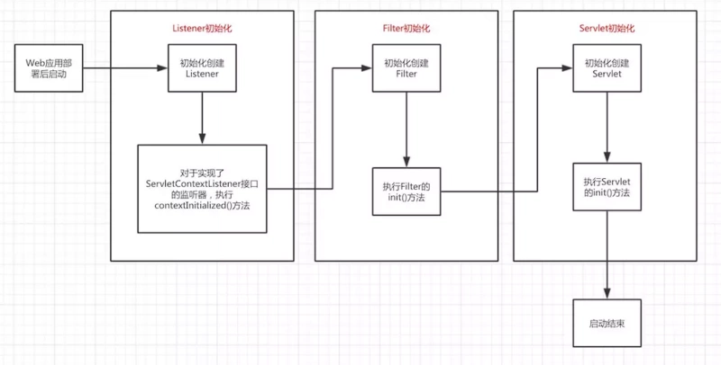

[TOC]
# 一. Web容器与Servlet容器简介
web容器（web服务器）主要有：Apache、IIS、Tomcat、Jetty、JBoss、webLogic等，**web容器是管理servlet（通过servlet容器），以及监听器(Listener)和过滤器(Filter)的。** 而Tomcat、Jetty、JBoss、webLogic同时也是servlet容器，或者说他们还包含了servlet容器。

* 没有servlet容器，你也可以用web容器直接访问静态页面，比如安装一个apache等，

* 但是如果要显示jsp/servlet，你就要安装一个servlet容器了，

* 但是光有servlet容器是不够的，因为它要被解析成html输出，所以你仍需要一个web容器。

大多数servlet容器同时提供了web容器的功能，也就是说大多servelt容器可以独立运行你的web应用。

1. **Servlet容器是管理servlet对象的。Tomcat作为Web服务器，同时也包含了Servlet容器。** 

2.  一个WEB应用程序只有一个ServletContext实例，在web容器完全启动web项目前被创建，生命周期伴随整个WEB应用。能够获得web.xml中的相关信息，同一个web应用的所有Servlet对象共享一个ServletContext，Servlet对象可以通过它来访问容器中的各种资源，指通过ServletContext可以访问tomcat，Jboss等容器中的各种资源，类似各种底层资源request，response等。

3.   必须在一个jvm中，每个servletContext才对应一个应用，如果应用在一个分布式环境中，则每个jvm对应一个servletContext。

4.   只有Httpsession对象会从一个VM移到另一个VM，每个VM有一个ServletContext，每个VM上每个servlet有一个ServletConfig。但对于每个WEB应用的一个给定对话ID，只有一个HttpSession对象，而不论应用分布在多少个VM中。


5. Servlet容器的作用：负责处理客户请求，当客户请求来到时，Servlet容器获取请求，然后调用某个Servlet，并把Servlet的执行结果返回给客户。

6. 使用Servlet容器的原因：       
    * 通信支持：利用容器提供的方法，你能轻松的让servlet与web服务器对话，而不用自己建立serversocket、监听某个端口、创建流等等。容器知道自己与web服务器之间的协议，所以你的servlet不用担心web服务器（如Apache）和你自己的web代码之间的API，只需要考虑如何在servlet中实现业务逻辑（如处理一个订单）。    
    * 生命周期管理：servlet容器控制着servlet的生与死，它负责加载类、实例化和初始化servlet，调用servlet方法，以及使servlet实例被垃圾回收，有了servlet容器，你不需要太多的考虑资源管理。
    * 多线程支持：容器会自动为它所接收的每个servlet请求创建一个新的java线程。针对用户的请求，如果servlet已经运行完相应的http服务方法，这个线程就会结束。这并不是说你不需要考虑线程安全性，其实你还会遇到同步问题，不过这样能使你少做很多工作。
    * 声明方式实现安全：利用servlet容器，可以使用xml部署描述文件来配置和修改安全性，而不必将其硬编码写到servlet类代码中。
    * JSP支持：servlet容器负责将jsp代码翻译为真正的java代码。

## 示例：Web容器之Tomcat


在Tomcat中有4种级别的容器：Engine，Host，Context和Wrapper。

* Engine：整个Catalina Servlet引擎；
* Host:包含一个或多个Context容器的虚拟主机；
* Context：表示一个Web应用程序，对应着一个Servlet上下文（ServletContext），可以包含多个Wrapper；
* Wrapper：表示一个独立的Servlet；
 
4个层级接口的标准实现分别是：StandardEngine类，StandardHost类，StandardContext类和StandardWrapper类。它们在org.apache.catalina.core包下。

### Tomcat结构目录

* /bin：包含启动和关闭Tomcat的文件
* /conf：包含不同的配置文件：server.xml，web.xml，tomcat-user.xml
* /lib：包含Tomcat使用的JAR文件
* /logs：包含日志文件
* /webapps：包含应用程序示例及自己开发的程序
* /work：包含有JSP生成的Servlet

# 二.  WEB容器初始化

根据tomcat架构设计Context的实现类是StandardContext，全称org.apache.catalina.core.StandardContext。看到其实现Lifecycle接口，我们在StandardContext中找到startInternal方法，下面给出把暂时无用的代码去掉后的注释版源码：

```java
/**
 * Start this component and implement the requirements
 * of {@link org.apache.catalina.util.LifecycleBase#startInternal()}.
 *
 * @exception LifecycleException if this component detects a fatal error
 *  that prevents this component from being used
 */
 @Override
 protectedsynchronized void startInternal() throwsLifecycleException {
  //设置webappLoader 代码省略
  
  // Standard container startup 代码省略
  
 　　try{
  
 　　　　// Set up the context init params 
 　　　　//初始化context-param节点数据
 　　　　mergeParameters();
  
  
 　　　　// Configure and call application event listeners
 　　　　//配置和调用应用程序事件listeners 
 　　　　if(ok) {
 　　　　　　if(!listenerStart()) {
 　　　　　　　　log.error("Error listenerStart");
 　　　　　　　　ok = false;
 　　　　　　}
 　　　　}
  
 　　　　// Configure and call application filters
 　　　　//配置和调用应用程序filters
 　　　　if(ok) {
 　　　　　　if(!filterStart()) {
 　　　　　　　　log.error("Error filterStart");
 　　　　　　　　ok = false;
 　　　　　　}
 　　　　}
  
 　　　　// Load and initialize all "load on startup" servlets
 　　　　//加载和初始化配置在load on startup的servlets
 　　　　if(ok) {
 　　　　　　loadOnStartup(findChildren());
 　　　　}
  
 　　　　// Start ContainerBackgroundProcessor thread
 　　　　super.threadStart();
 　　}finally{
 　　　　// Unbinding thread
 　　　　unbindThread(oldCCL);
 　　}
  
 }
```
结合代码，根据Web项目的启动顺序：

## 1. web容器读取web.xml配置文件，并首先读取<context-param>和<listener>两个结点。
```xml
<context-param>
　　<param-name>contextConfigLocation</param-name>
　　<param-value>classpath:root-context.xml</param-value>
 </context-param>
<listener>
　　<listener-class>org.springframework.web.context.ContextLoaderListener</listener-class>
</listener>
```
## 2. 容器为每一个应用创建自己的一个ServletContext（servlet上下文），该应用的的所有部分都将共享这个上下文。　　

## 3. 容器将<context-param>转换为键值对，初始化context-param节点，并交给servletContext。　　

## 4. 容器创建<listener>中的类实例，配置和调用listeners，并开始监听。
 **此时会创建Spring容器实例**。调用web.xml中配置的ContextLoaderListener，初始化WebApplicationContext上下文环境（即IOC容器），加载context-param指定的配置文件信息到IOC容器中。WebApplicationContext在ServletContext中以键值对的形式保存。Spring把bean放在这个容器中，在需要的时候，可以通过注解等方式获取， Spring容器是管理service和dao的。


## 5. 然后配置和调用filters，filters开始起作用　　

## 6. 最后加载和初始化配置在load-on-startup的servlets，此时创建SpringMVC容器实例。
调用web.xml中配置的servlet-class，为其初始化自己的上下文信息，并加载其设置的配置信息到该上下文中。将WebApplicationContext设置为它的父容器。 

Spring MVC容器可以访问父容器中的Bean，但是父容器不能访问子容器的Bean， 也就是说Spring根容器不能访问SpringMVC容器里的Bean。说的通俗点就是，在Controller里可以访问Service对象，但是在Service里不可以访问Controller对象。
```xml
<!-- springMVC配置 -->

<servlet>
　　<servlet-name>appServlet</servlet-name>
　　<servlet-class>org.springframework.web.servlet.DispatcherServlet</servlet-class>

　　<init-param>
　　　　<param-name>contextConfigLocation</param-name>
　　　　<param-value>classpath:servlet-context.xml</param-value>
　　</init-param>

　　<init-param>
　　　　<param-name>activeReverseAjaxEnabled</param-name>
　　　　<param-value>true</param-value>
　　</init-param>

　　<init-param>
　　　　<param-name>allowScriptTagRemoting</param-name >
　　　　<param-value>true </param-value>
　　</init-param>

　　<load-on-startup>1</load-on-startup>
</servlet>

<servlet-mapping>
　　<servlet-name>appServlet</servlet-name>
　　<url-pattern>*.do</url-pattern>
</servlet-mapping>
```
## 7. 此后的所有servlet的初始化都按照3步中方式创建，初始化自己的上下文环境，
将WebApplicationContext设置为自己的父上下文环境。

即元素加载顺序为：
```
context-param --> listeners --> filters --> servlets --> init-param
```

注意：

1. 该加载顺序并不会受元素在web.xml文件中的位置的影响。　　

2. 但对于某类配置节而言，与它们出现的顺序是有关的。以 filter 为例，web.xml 中当然可以定义多个 filter，与 filter 相关的一个配置节是 filter-mapping，这里一定要注意，对于拥有相同 filter-name 的 filter 和 filter-mapping 配置节而言，filter-mapping 必须出现在 filter 之后，否则当解析到 filter-mapping 时，它所对应的 filter-name 还未定义。web 容器启动时初始化每个 filter 时，是按照 filter 配置节出现的顺序来初始化的，当请求资源匹配多个 filter-mapping 时，filter 拦截资源是按照 filter-mapping 配置节出现的顺序来依次调用 doFilter() 方法的。


### 关于load-on-startup　　
* load-on-startup 元素在web应用启动的时候指定了servlet被加载的顺序，它的值必须是一个整数。　　
* 如果它的值是一个负整数或是这个元素不存在，那么容器会在该servlet被调用的时候，加载这个servlet。　　
* 如果值是正整数或零，容器在配置的时候就加载并初始化这个servlet，容器必须保证值小的先被加载。如果值相等，容器可以自动选择先加载谁。　　
* 正数的值越小，启动该servlet的优先级越高。

## 8. context-param和init-param区别
web.xml里面可以定义两种参数(servlet范围大于application范围)
1. application范围内的参数，存放在servletcontext中，`context-param`即为该范围的参数，在web.xml中配置如下：
```xml
<context-param>
           <param-name>context/param</param-name>
           <param-value>avalible during application</param-value>
</context-param>
```
2. servlet范围内的参数，**只能在servlet的init()方法中取得**，`init-param`即为该范围的参数，在web.xml中配置如下：
```xml
<servlet>
    <servlet-name>MainServlet</servlet-name>
    <servlet-class>com.wes.controller.MainServlet</servlet-class>
    <init-param>
       <param-name>param1</param-name>
       <param-value>avalible in servlet init()</param-value>
    </init-param>
    <load-on-startup>0</load-on-startup>
</servlet>
```
获取代码:
```java
package com.wes.controller;
import javax.servlet.ServletException;
import javax.servlet.http.HttpServlet;
public class MainServlet extends HttpServlet ...{
    public MainServlet() ...{
        super();
     }
    public void init() throws ServletException ...{
         System.out.println("下面的两个参数param1是在servlet中存放的");
         System.out.println(this.getInitParameter("param1"));
         System.out.println("下面的参数是存放在servletcontext中的");
        System.out.println(getServletContext().getInitParameter("context/param"));
      }
}
```

## 9. Spring容器与SpringMVC容器的区别和联系
1. Spring容器和SpringMVC容器的关系是父子容器的关系。

2. Spring容器是父容器，SpringMVC容器是子容器。在子容器里可以访问父容器里的对象，但是在父容器里不可以访问子容器的对象，

3. 说的通俗点就是，在controller里可以访问service对象，但是在service里不可以访问controller对象。

4. 所以这么看的话，所有的bean，都是被Spring或者SpringMVC容器管理的，他们可以直接注入。

5. 然后SpringMVC的拦截器也是SpringMVC容器管理的，所以在SpringMVC的拦截器里，可以直接注入bean对象。


## 10. Servlet容器和ServletContext的关系

1. Tomcat作为Web服务器，同时也包含了Servlet容器。

2. ServletContext是servlet与servlet容器之间的直接通信的接口。

3. Servlet容器在启动一个Web应用时，会为它创建一个servletContext对象。

4. 每个web应用有唯一的servletContext对象。

5. 同一个web应用的所有servlet对象共享一个serveltContext,servlet对象可以通过它来访问容器中的各种资源。 