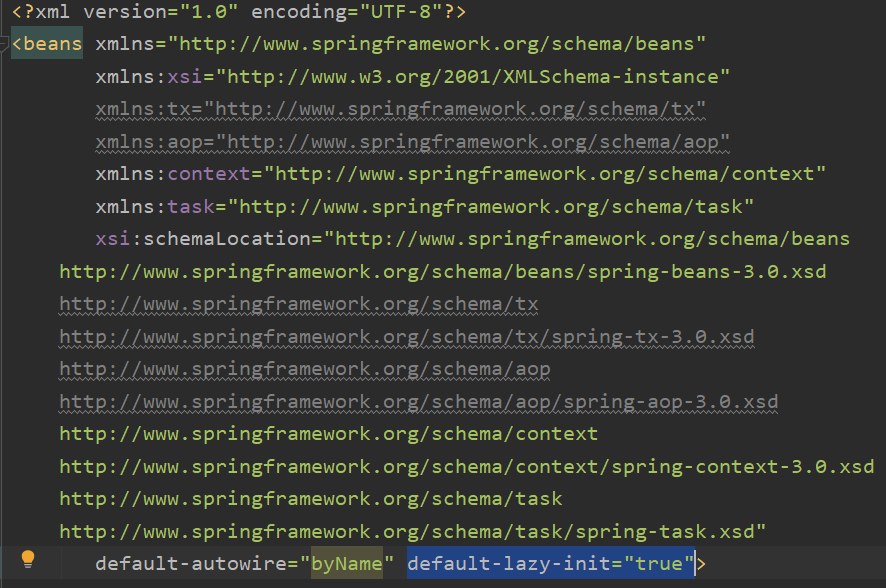

[TOC]
## 执行顺序
1. Spring 通过 在xml中定义init-method 和  destory-method方法

2. Spring 通过注解 @PostConstruct 和 @PreDestroy 方法实现初始化和销毁bean之前进行的操作

3. 通过ServletContextListener监听器实现

4. 通过Servlet的过滤器Filter实现

5. 通过Servlet实现

> **Spring的环境是通过Listener来实现的，所以，只要将Spring的Listener配置在其他Listener前，这样就是Spring的环境先启动，从而在3,4,5中都可以拿到Spring容器的Context，但由于这三种情况不在Spring的容器的管理中，所以无法实现自动注入。**

### 使用spring框架
#### 1. 通过注解@PostConstruct 和 @PreDestroy 方法 实现初始化和销毁bean之前进行的操作
```java
import javax.annotation.PostConstruct;    
import javax.annotation.PreDestroy;    

@Component
public class DataInitializer{     
    @PostConstruct  
    public void initMethod() throws Exception {  
        System.out.println("initMethod 被执行");  
    }  
    @PreDestroy  
    public void destroyMethod() throws Exception {  
        System.out.println("destroyMethod 被执行");  
    }  
}  
```
注意：
1. 类上要注明@Component，将类加入Spring的管理，否则不会生效。
2. 如果在Spring的配置文件中标明了`default-lazy-init="true"` ,则程序启动时依旧不会生效，需要在bean被调用时才会生效。



#### 2. 通过 在xml中定义init-method 和  destory-method方法
```java
public class DataInitializer{  
    public void initMethod() throws Exception {  
        System.out.println("initMethod 被执行");  
    }  
    public void destroyMethod() throws Exception {  
        System.out.println("destroyMethod 被执行");  
    }  
}  
```
配置文件：
```xml
<bean id="dataInitializer" class="com.somnus.demo.DataInitializer" init-method="initMethod" destory-method="destroyMethod"/>  
```
#### 3. 通过bean实现InitializingBean和 DisposableBean接口

```java
import org.springframework.beans.factory.DisposableBean;  
  
public class DataInitializer implements InitializingBean，DisposableBean{  
      
    @Override  
    public void afterPropertiesSet() throws Exception {  
        System.out.println("afterPropertiesSet 被执行");  
    }  
      
    @Override  
    public void destroy() throws Exception {  
        System.out.println("destroy 被执行");  
    }  
  
}  
```

其中第一种和第二种是同一种形式，只不过一种xml配置，另外一种采用注解形式罢了，有很大区别的是第三种，如果同一个bean同时采用两种方式初始化的时候执行某个方法，首先在执行顺序上就会体现出来。

**先执行afterPropertiesSet()，后执行initMethod()**

#### 实现原理

通过查看spring的加载bean的源码类(AbstractAutowireCapableBeanFactory)可看出其中奥妙AbstractAutowireCapableBeanFactory类中的invokeInitMethods讲解的非常清楚，源码如下：
```java
protected void invokeInitMethods(String beanName, final Object bean, RootBeanDefinition mbd)  
      throws Throwable {  
  //判断该bean是否实现了实现了InitializingBean接口，如果实现了InitializingBean接口，则只掉调用bean的afterPropertiesSet方法  
  boolean isInitializingBean = (bean instanceof InitializingBean);  
  if (isInitializingBean && (mbd == null || !mbd.isExternallyManagedInitMethod("afterPropertiesSet"))) {  
      if (logger.isDebugEnabled()) {  
          logger.debug("Invoking afterPropertiesSet() on bean with name '" + beanName + "'");  
      }  
        
      if (System.getSecurityManager() != null) {  
          try {  
              AccessController.doPrivileged(new PrivilegedExceptionAction<Object>() {  
                  public Object run() throws Exception {  
                      //直接调用afterPropertiesSet  
                      ((InitializingBean) bean).afterPropertiesSet();  
                      return null;  
                  }  
              },getAccessControlContext());  
          } catch (PrivilegedActionException pae) {  
              throw pae.getException();  
          }  
      }                  
      else {  
          //直接调用afterPropertiesSet  
          ((InitializingBean) bean).afterPropertiesSet();  
      }  
  }  
  if (mbd != null) {  
      String initMethodName = mbd.getInitMethodName();  
      //判断是否指定了init-method方法，如果指定了init-method方法，则再调用制定的init-method  
      if (initMethodName != null && !(isInitializingBean && "afterPropertiesSet".equals(initMethodName)) &&  
              !mbd.isExternallyManagedInitMethod(initMethodName)) {  
              //进一步查看该方法的源码，可以发现init-method方法中指定的方法是通过反射实现  
          invokeCustomInitMethod(beanName, bean, mbd);  
      }  
  }  
```


总结：
1. spring为bean提供了两种初始化bean的方式，实现InitializingBean接口，实现afterPropertiesSet方法，或者在配置文件中通过init-method指定，两种方式可以同时使用
2. 实现InitializingBean接口是直接调用afterPropertiesSet方法，比通过反射调用init-method指定的方法效率相对来说要高点。
3. 如果调用afterPropertiesSet方法时出错，则不调用init-method指定的方法。

### 通过ServletContextListener实现
使用servlet，但是他不能使用spring 的bean，还需要手动获取,比较麻烦.
1. 创建一个类实现ServletContextListener 接口，实现里面的contextInitialized和contextDestroyed方法
```java
package com.test. listener;
 
import javax.servlet.ServletContextEvent;
import javax.servlet.ServletContextListener;
//创建的类名根据需要定义，但一定要实现ServletContextListener接口
public class WebContextListener implements ServletContextListener {
 
    
    @Override
    public void contextInitialized(ServletContextEvent arg0) {
        // TODO Auto-generated method stub
        //这里可以放你要执行的代码或方法    
    }
    
    @Override
    public void contextDestroyed(ServletContextEvent arg0) {
        // TODO Auto-generated method stub
        
    }
 
    
}
```

其中contextInitialized方法是项目在启动初始化的时候就会执行的方法，contextDestroyed是在消亡的时候执行的方法，这里我们需要把随项目启动时执行的代码放在contextInitialized方法中。
2. 在web.xml中为这个监听器添加配置。
```xml
 <listener>
    <listener-class> com.test.listener.WebContextListener</listener-class>
 </listener>
```

其中listenner-class配置的是上面定义的监听器类路径，这样就就可以了，部署好项目，启动就可以执行contextInitialized里面的代码了。

### 通过Servlet的过滤器Filter实现
此时Spring容器的上下文已加载，可以调用。

```java
public class InitFilter implements Filter {  
	@Override 
	public void destroy() {  
 
	}  
 
	@Override 
	public void doFilter(ServletRequest arg0, ServletResponse arg1, FilterChain arg2) throws IOException, ServletException {  
 
	}  
 
	@Override 
	public void init(FilterConfig config) throws ServletException {  
		System.out.println("================>[Filter]自动加载启动开始.");  
		//写启动需要执行的代码  
		System.out.println("================>[Filter]自动加载启动结束.");  
	}  
}
```

然后在web.xml文件配置过滤器即可：
```xml
	<filter>  
		<filter-name>InitFilter</filter-name>  
		<filter-class>com.test.init.InitFilter</filter-class>  
	</filter>  
	<filter-mapping>  
		<filter-name>InitFilter</filter-name>  
		<url-pattern>/</url-pattern>  
	</filter-mapping>

```

### 通过Servlet实现

编写一个Servlet,在web.xml里面配置容器启动后执行即可
```java
public class InitServlet extends HttpServlet {  
 
	private static final long serialVersionUID = 1L;  
   
	@Override 
	public void init(ServletConfig config) {  
		try {  
			super.init();  
		} catch (ServletException e) {  
			e.printStackTrace();  
		}  
		System.out.println("================>[Servlet]自动加载启动开始.");  
		//执行想要的代码  
		System.out.println("================>[Servlet]自动加载启动结束.");  
	}  
}  
```

然后在web.xml文件配置该Servlet的启动方式为：容器启动后执行  
```xml
<servlet>  
	<servlet-name>InitServlet</servlet-name>  
	<servlet-class>com.test.init.InitServlet</servlet-class>  
	<init-param>  
		<param-name>username</param-name>  
		<param-value>test</param-value>  
	</init-param>  
	<!-- 此处指定加载顺序为2,表明还有优先级更高的Servlet要先执行 -->  
	<load-on-startup>2</load-on-startup>  
</servlet>  
<servlet-mapping>  
	<servlet-name>InitServlet</servlet-name>  
	<url-pattern>/</url-pattern>  
</servlet-mapping>  
```

关于启动后执行，由load-on-startup指定：  

1. 当值为0或者大于0时，表示容器在应用启动时就加载这个servlet。值越小，启动优先级越高；  
2. 当是一个负数时或者没有指定时，表示该servlet被调用时才加载。

