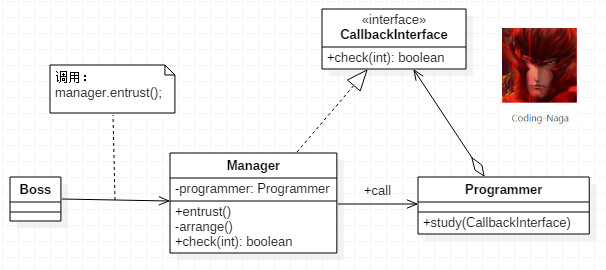

[TOC]
> 所谓回调：就是A类中调用B类中的某个方法C，然后B类中反过来调用A类中的方法D，D这个方法就叫回调方法。实际在使用的时候，也会有不同的回调形式。

## 同步回调

这里我假设这样的一种情况。
A 公司的总监 B 跟他的下属（项目经理 C）说要做一个调研，不过不用 C 自己亲力亲为。可以让经理 C 去安排他下面的程序员 D 去完成。
经理 C 找到了程序员 D，并告诉他，现在要完成一个调研任务。并且把调研的结果告诉经理 C。如果有问题，还是要继续的。
因为这里是 C 让 D 去做一件事情，之后 D 还是要将结果与 C 进行沟通。这样就是回调的模型了。下面是一般回调的类图：



1. 首先我们要有一个回调的接口 CallbackInterface
CallbackInterface.java
```java
public interface CallbackInterface {
    public boolean check(int result);
}
```
2. 背景里，程序员 D 是要将结果与项目经理 C 进行沟通的，所以这里项目经理需要实现上面的回调接口：
Manager.java
```java
public class Manager implements CallbackInterface {

    private Programmer programmer = null;

    public Manager(Programmer _programmer) {
        this.programmer = _programmer;
    }

    /**
     * 用于 Boss 下达的委托
     */
    public void entrust() {
        arrange();
    }

    // 进行安排下属进行 study 工作
    private void arrange() {
        System.out.println("Manager 正在为 Programmer 安排工作");
        programmer.study(Manager.this);
        System.out.println("为 Programmer 安排工作已经完成，Manager 做其他的事情去了。");
    }

    @Override
    public boolean check(int result) {
        if (result == 5) {
            return true;
        }
        return false;
    }

}
```
3. 对于程序员 D 来说他需要持有一个经理 C 的引用，以便与他沟通。不过，这里是总监 B 让 经理 C 去安排的任务。也就是说这里也可以让其他的经理，比如说经理 B1， B2等等。因为经理都实现了回调的接口，所以这里就可以直接让程序员 D 持有这个接口就可以了。如下：
Programmer.java
```java
public class Programmer {

    public void study(CallbackInterface callback) {
        int result = 0;
        do {
            result++;
            System.out.println("第 " + result + " 次研究的结果");
        } while (!callback.check(result));

        System.out.println("调研任务结束");
    }
}
```
4. 对于总监来说就更简单明了了，因为这相当于一个 Client 测试：
Boss.java
```java
public class Boss {

    public static void main(String[] args) {
        Manager manager = new Manager(new Programmer());
        manager.entrust();
    }
}
```
运行结果

> Manager 正在为 Programmer 安排工作
第 1 次研究的结果
第 2 次研究的结果
第 3 次研究的结果
第 4 次研究的结果
第 5 次研究的结果
调研任务结束
为 Programmer 安排工作已经完成，Manager 做其他的事情去了。

## 异步回调

还是上面的例子，你的项目经理不可能要一直等你调研的结果。而是把这个任务交给你之后，他就不管了，他做他的，你做你的。所以，这里需要对回调的函数进行异步处理。
所以，这里我们需要修改 Programmer 类的代码，修改如下：
Programmer.java
```java
public class Programmer {

    public Programmer() {
    }

    public void study(CallbackInterface callback) {
        new StudyThread(callback).start();
    }

    // --------------------------- Programmer 正在做的工作 ---------------------------

    class StudyThread extends Thread {

        CallbackInterface callback = null;

        public StudyThread(CallbackInterface _callback) {
            callback = _callback;
        }

        @Override
        public void run() {
            int result = 0;
            do {
                result++;
                System.out.println("第 " + result + " 次研究的结果");
            } while (!callback.check(result));

            System.out.println("调研任务结束");
        }
    }
}
```

运行结果:
> Manager 正在为 Programmer 安排工作
为 Programmer 安排工作已经完成，Manager 做其他的事情去了。
第 1 次研究的结果
第 2 次研究的结果
第 3 次研究的结果
第 4 次研究的结果
第 5 次研究的结果
调研任务结束