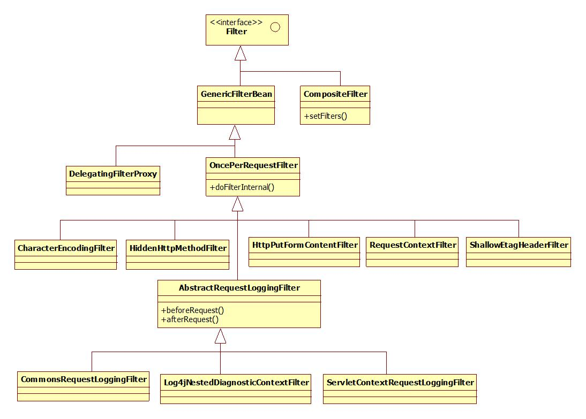
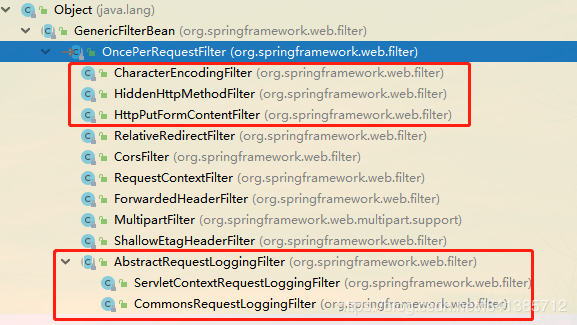

[TOC]



Spring的web包中中有很多过滤器，这些过滤器位于org.springframework.web.filter并且理所当然地实现了javax.servlet.Filter，不过实现的方式有以下几类：

1. 直接实现Filter，这一类过滤器只有CompositeFilter；

2. 继承抽象类GenericFilterBean，该类实现了javax.servlet.Filter，这一类的过滤器只有一个，即DelegatingFilterProxy；

3. 继承抽象类OncePerRequestFilter，该类为GenericFilterBean的直接子类，这一类过滤器包括CharacterEncodingFilter、HiddenHttpMethodFilter、HttpPutFormContentFilter、RequestContextFilter和ShallowEtagHeaderFilter；

4. 继承抽象类AbstractRequestLoggingFilter，该类为OncePerRequestFilter的直接子类，这一类过滤器包括CommonsRequestLoggingFilter、Log4jNestedDiagnosticContextFilter和ServletContextRequestLoggingFilter。

 本文要讲述的，即是GenericFilterBean、OncePerRequestFilter和AbstractRequestLoggingFilter。
 
 ## GenericFilterBean
 
 抽象类GenericFilterBean实现了javax.servlet.Filter、org.springframework.beans.factory.BeanNameAware、org.springframework.context.EnvironmentAware、org.springframework.web.context.ServletContextAware、org.springframework.beans.factory.InitializingBean和org.springframework.beans.factory.DisposableBean五个接口，作用如下：

1. Filter，实现过滤器；

2. BeanNameAware，实现该接口的setBeanName方法，便于Bean管理器生成Bean；

3. EnvironmentAware，实现该接口的setEnvironment方法，指明该Bean运行的环境；

4. ServletContextAware，实现该接口的setServletContextAware方法，指明上下文；

5. InitializingBean，实现该接口的afterPropertiesSet方法，指明设置属性生的操作；

6. DisposableBean，实现该接口的destroy方法，用于回收资源。

GenericFilterBean的工作流程是：init-doFilter-destory，其中的init和destory在该类中实现，doFilter在具体实现类中实现。init的代码如下：
```java
/**
	 * Standard way of initializing this filter.
	 * Map config parameters onto bean properties of this filter, and
	 * invoke subclass initialization.
	 * @param filterConfig the configuration for this filter
	 * @throws ServletException if bean properties are invalid (or required
	 * properties are missing), or if subclass initialization fails.
	 * @see #initFilterBean
	 */
	public final void init(FilterConfig filterConfig) throws ServletException {
		Assert.notNull(filterConfig, "FilterConfig must not be null");
		if (logger.isDebugEnabled()) {
			logger.debug("Initializing filter '" + filterConfig.getFilterName() + "'");
		}
 
		this.filterConfig = filterConfig;
 
		// Set bean properties from init parameters.
		try {
			PropertyValues pvs = new FilterConfigPropertyValues(filterConfig, this.requiredProperties);
			BeanWrapper bw = PropertyAccessorFactory.forBeanPropertyAccess(this);
			ResourceLoader resourceLoader = new ServletContextResourceLoader(filterConfig.getServletContext());
			bw.registerCustomEditor(Resource.class, new ResourceEditor(resourceLoader, this.environment));
			initBeanWrapper(bw);
			bw.setPropertyValues(pvs, true);
		}
		catch (BeansException ex) {
			String msg = "Failed to set bean properties on filter '" +
			    filterConfig.getFilterName() + "': " + ex.getMessage();
			logger.error(msg, ex);
			throw new NestedServletException(msg, ex);
		}
 
		// Let subclasses do whatever initialization they like.
		initFilterBean();
 
		if (logger.isDebugEnabled()) {
			logger.debug("Filter '" + filterConfig.getFilterName() + "' configured successfully");
		}
	}
```

 该方法来自于javax.servlet.Filter，即过滤器的初始化，它的主要工作集中于以下几行代码：
 ```java
// 从properties文件中获取值，这里是web.xml
PropertyValues pvs = new FilterConfigPropertyValues(filterConfig, this.requiredProperties);
// 设置bean适配器
BeanWrapper bw = PropertyAccessorFactory.forBeanPropertyAccess(this);
// 设置上下文，这里的servletContext的设定继承自ServletContextAware的setter
ResourceLoader resourceLoader = new ServletContextResourceLoader(filterConfig.getServletContext());
// 将上下文信息和环境信息设置到bean适配器中，这里的environment来自于EnvironmentAware的setter
bw.registerCustomEditor(Resource.class, new ResourceEditor(resourceLoader, this.environment));
// 初始化bean适配器
initBeanWrapper(bw);
// 将从properties中获取的资源放置到bean适配器
bw.setPropertyValues(pvs, true);
// 初始化bean
initFilterBean();
```

其中initFilterBean方法在两个位置起作用，
1. 一处是上文所述的init方法，
2. 另一处是afterPropertiesSet方法，在调用该方法前，需要保证用于Filter的所有的bean都已被设置，该方法由子类实现，用于在项目初始化时进行一定的操作。

GenericFilterBean中包含一个内部私有类FilterConfigPropertyValues，主要用于将web.xml中定义的init-param的值取出。

## OncePerRequestFilter

抽象类oncePerRequestFilter继承自GenericFilterBean，它保留了GenericFilterBean中的所有方法并对之进行了扩展，在oncePerRequestFilter中的主要方法是doFilter，代码如下：

```java
/**
	 * This <code>doFilter</code> implementation stores a request attribute for
	 * "already filtered", proceeding without filtering again if the
	 * attribute is already there.
	 * @see #getAlreadyFilteredAttributeName
	 * @see #shouldNotFilter
	 * @see #doFilterInternal
	 */
	public final void doFilter(ServletRequest request, ServletResponse response, FilterChain filterChain)
			throws ServletException, IOException {
 
		if (!(request instanceof HttpServletRequest) || !(response instanceof HttpServletResponse)) {
			throw new ServletException("OncePerRequestFilter just supports HTTP requests");
		}
		HttpServletRequest httpRequest = (HttpServletRequest) request;
		HttpServletResponse httpResponse = (HttpServletResponse) response;
                // 调用GenericFilterBean的getFilterName方法返回已过滤的属性名
		String alreadyFilteredAttributeName = getAlreadyFilteredAttributeName();
		if (request.getAttribute(alreadyFilteredAttributeName) != null || shouldNotFilter(httpRequest)) {
			// 未调用该过滤器或已过滤
			filterChain.doFilter(request, response);
		}
		else {
			// 进行过滤
			request.setAttribute(alreadyFilteredAttributeName, Boolean.TRUE);
			try {
				doFilterInternal(httpRequest, httpResponse, filterChain);
			}
			finally {
				// Remove the "already filtered" request attribute for this request.
				request.removeAttribute(alreadyFilteredAttributeName);
			}
		}
	}
```


> 在Spring中，Filter默认继承OncePerRequestFilter

OncePerRequestFilter：顾名思义，它能够确保在一次请求中只通过一次filter，而需要重复的执行。大家常识上都认为，一次请求本来就只filter一次，为什么还要由此特别限定呢。

往往我们的常识和实际的实现并不真的一样，经过一番资料的查阅，此方法是为了兼容不同的web container，也就是说并不是所有的container都入我们期望的只过滤一次，servlet版本不同，执行过程也不同，我们可以看看Spring的javadoc怎么说：
```log
 *
 * <p>As of Servlet 3.0, a filter may be invoked as part of a
 * {@link javax.servlet.DispatcherType#REQUEST REQUEST} or
 * {@link javax.servlet.DispatcherType#ASYNC ASYNC} dispatches that occur in
 * separate threads. A filter can be configured in {@code web.xml} whether it
 * should be involved in async dispatches. However, in some cases servlet
 * containers assume different default configuration. 

```
简单的说就是去适配了不同的web容器，以及对异步请求，也只过滤一次的需求。另外打个比方：如：servlet2.3与servlet2.4也有一定差异：
> 在servlet2.3中，Filter会经过一切请求，包括服务器内部使用的forward转发请求和`<%@ include file=”/login.jsp”%>`的情况
servlet2.4中的Filter默认情况下只过滤外部提交的请求，forward和include这些内部转发都不会被过滤，

> 因此此处我有个建议：我们若是在Spring环境下使用Filter的话，个人建议继承OncePerRequestFilter吧，而不是直接实现Filter接口。这是一个比较稳妥的选择

需要注意的是：
```java
@Override
public final void init(FilterConfig filterConfig) throws ServletException {}
```
它Final掉了init方法，因此若我们继承它，无法使用init方法了。但我们可以复写initFilterBean这个方法，实现我们比init方法更强大的一些逻辑，可以直接使用容器对象了，如下：

```java
@Component("helloFilter")
public class HelloFilter extends OncePerRequestFilter {

    @Override
    protected void initFilterBean() throws ServletException {
        System.out.println("Filter初始化...");
    }

    @Override
    protected void doFilterInternal(HttpServletRequest request, HttpServletResponse response, FilterChain filterChain) throws ServletException, IOException {
        FilterConfig filterConfig = super.getFilterConfig();
        ServletContext servletContext = super.getServletContext();
        Environment environment = super.getEnvironment();

        filterChain.doFilter(request, response);
    }
}
```

## AbstractRequestLoggingFilter

AbstractRequestLoggingFilter继承了OncePerRequestFilter并实现了其doFilterInternal方法，该方法代码如下：
```java
/**
	 * Forwards the request to the next filter in the chain and delegates down to the subclasses to perform the actual
	 * request logging both before and after the request is processed.
	 *
	 * @see #beforeRequest
	 * @see #afterRequest
	 */
	@Override
	protected void doFilterInternal(HttpServletRequest request, HttpServletResponse response, FilterChain filterChain)
			throws ServletException, IOException {
		if (isIncludePayload()) {
                        // 若日志中包含负载，则重置request
			request = new RequestCachingRequestWrapper(request);
		}
                // 过滤前执行的方法
		beforeRequest(request, getBeforeMessage(request));
		try {
                        // 执行过滤
			filterChain.doFilter(request, response);
		}
		finally {
                        // 过滤后执行的方法
			afterRequest(request, getAfterMessage(request));
		}
	}
```

 doFilter方法中的beforeRequest和afterRequest方法由子类实现，RequestCachingRequestWrapper为AbstractRequestLoggingFilter的内部类，主要作用是重置request。
 
 
## 区别
  我们在使用过滤器时，通常没必要知道GenericFilterBean、OncePerRequestFilter和AbstractRequestLoggingFilter，但不防碍我们了解这几个类，就上文所述，AbstractRequestLoggingFilter继承自OncePerRequestFilter，OncePerRequestFilter继承自GenericFilterBean，所以我们知道，genericFilterBean是任何类型的过滤器的一个比较方便的超类，这个类主要实现的就是从web.xml文件中取得init-param中设定的值，然后对Filter进行初始化（当然，其子类可以覆盖init方法）。

OncePerRequestFilter继承自GenericFilterBean，那么它自然知道怎么去获取配置文件中的属性及其值，所以其重点不在于取值，而在于确保在接收到一个request后，每个filter只执行一次，它的子类只需要关注Filter的具体实现即doFilterInternal。

 AbstractRequestLoggingFilter是对OncePerRequestFilter的扩展，它除了遗传了其父类及祖先类的所有功能外，还在doFilterInternal中决定了在过滤之前和之后执行的事件，它的子类关注的是beforeRequest和afterRequest。

总体来说，这三个类分别执行了Filter的某部分功能，当然，具体如何执行由它们的子类规定，若你需要实现自己的过滤器，也可以根据上文所述继承你所需要的类。
