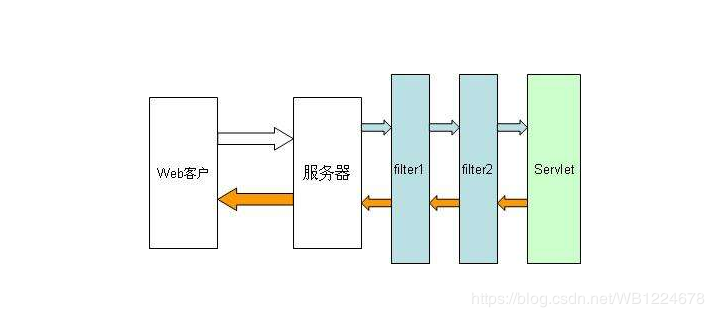
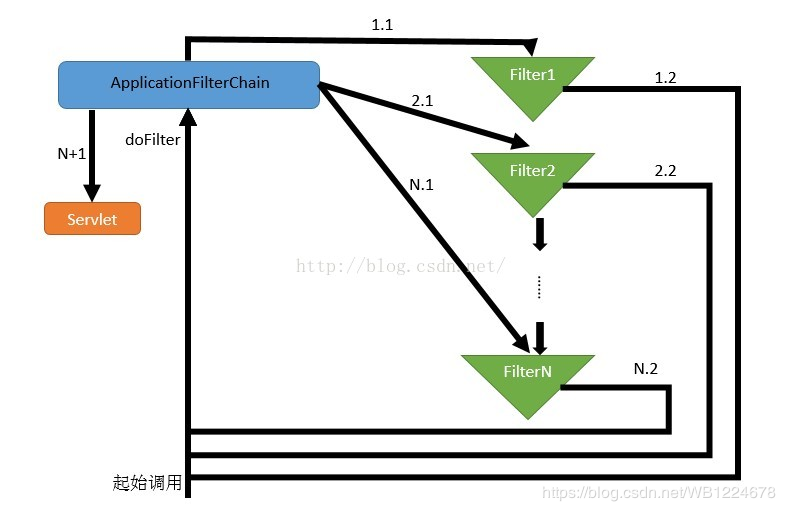

[TOC]

FilterChain是Filter的链路，每次url请求过来的时候就会进入链路然后根据事先设定好的Filter顺序按照顺序过滤下去，每次Filter完成了自己的操作后就会调用filterChain.doFilter(servletRequest, servletResponse);将请求发到FilterChain中的下一个Filter处理，如果没有下一个，就直接放行，然后进入servlet获取资源

所以说回调指的是FilterChain，而不是类似拦截器那样指如何拦截的（AOP）等，如果没有filter，则Web请求直接到达Servlet，现在有了filter，回调指在web请求先调用filter后，请求如何到达Servlet，这个过程用的是函数回调来实现的


Filter代码示例：
```java
package com.hxkj.rbac.filter;

import javax.servlet.*;
import java.io.IOException;

/** 字符编码过滤器
 * Create by wangbin
 * 2019-03-28-14:52
 */
public class EncodingFilter implements Filter {

    private String encode;

    @Override
    public void init(FilterConfig filterConfig) throws ServletException {
        //Filter初始化
        // 读取web.xml中Filter配置的初始化参数
        encode = filterConfig.getInitParameter("encode");
    }

    @Override
    public void doFilter(ServletRequest servletRequest, ServletResponse servletResponse, FilterChain filterChain) throws IOException, ServletException {
        // 设置初始化的参数encode
        servletRequest.setCharacterEncoding(encode);
        servletResponse.setCharacterEncoding(encode);
        servletResponse.setContentType("text/html; charset=UTF-8");
        filterChain.doFilter(servletRequest, servletResponse); // 放行，转到下一个过滤器

    }

    @Override
    public void destroy() {
        //在Filter销毁前，完毕某些资源的回收
    }
}

```

从Filter的 `doFilter(ServletRequest servletRequest, ServletResponse servletResponse, FilterChain filterChain) ` 这个方法中可以看到，FilterChain作为一个参数传递了进来，
当前的字符过滤Filter将字符编码设置好后，调用了FilterChain的 filterChain.doFilter(servletRequest, servletResponse); 让FilterChain去找下一个Filter进行新的处理，如果没有下一个Filter了，就直接放行，访问servlet获取资源

这就是典型的一个函数回调：

Filter就相当于类A
FilterChain就相当于类B

A（B）

FilterChain作为参数传递给了Filter的doFilter()方法，然后在该方法中又调用了FilterChain的doFilter()方法，即为：函数回调，这也就是为什么说Filter是基于函数回调的原因了
