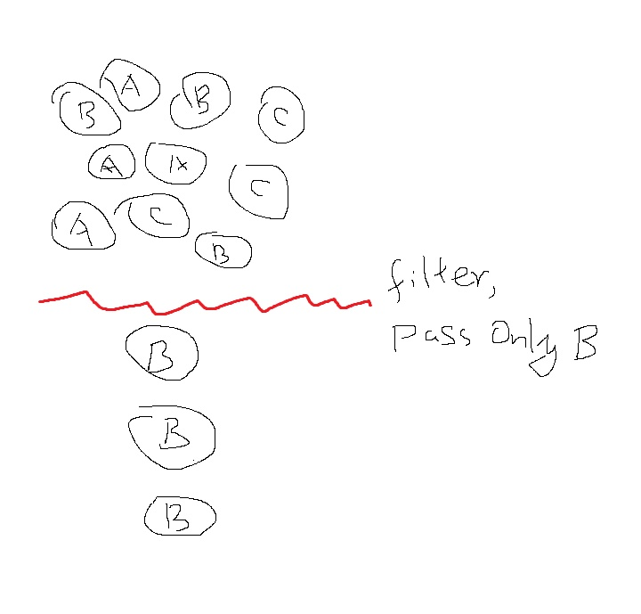
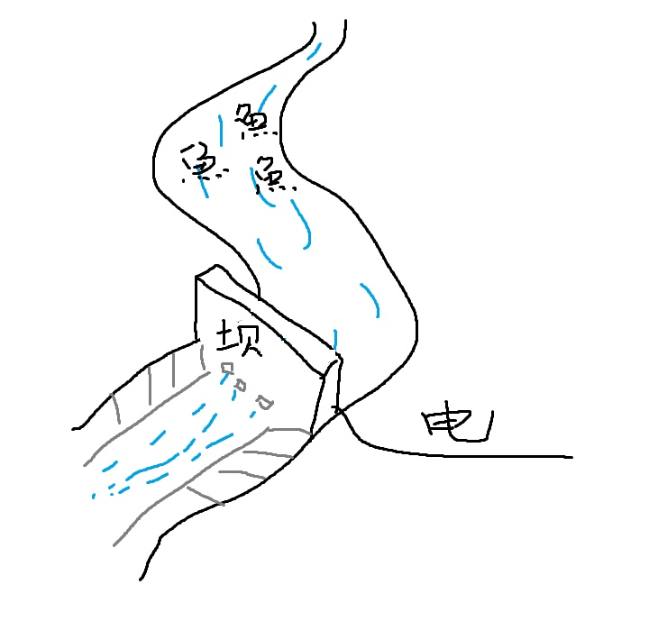
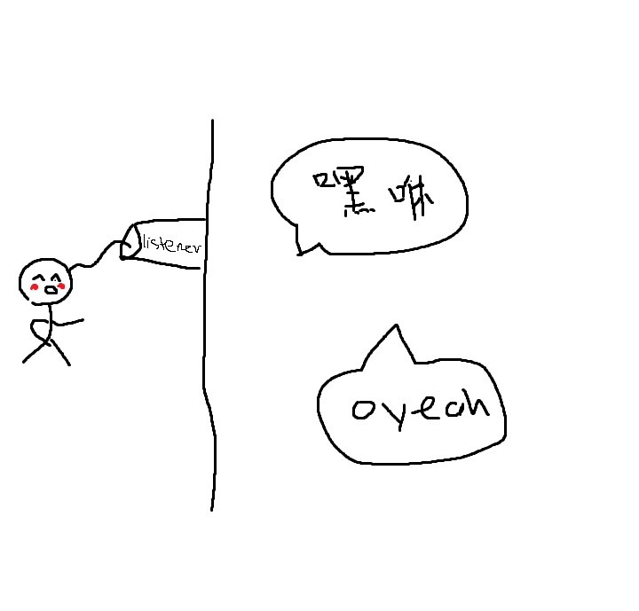

[TOC]
# 元素加载顺序为：
```
context-param --> listeners --> filters --> servlets
```
# 区别
## 从设计模式的角度分析它们的不同

### 过滤器（Filter）
当你有一堆东西的时候，你只希望选择符合你要求的某一些东西。定义这些要求的工具，就是过滤器。

只想要在一堆东西里面选个B

如果你在这里改变了对象的状态（当然例子里的String类型本来就不可以改变），就违背了filter的约定。

### 拦截器（Interceptor）
在一个流程正在进行的时候，你希望干预它的进展，甚至终止它进行，这是拦截器做的事情。

把水流变小点，把鱼都拦住！顺便发个电


Interceptor几乎可以对流程做任何事情，所以没有什么特别要注意的地方

#### 拦截器（Interceptor）和过滤器（Filter）的区别


| Filter |Interceptor  |Summary  |
| --- | --- | --- |
| Filter基于函数回调实现 |Interceptor基于AOP动态代理实现  |  |
| Filter 接口定义在 javax.servlet 包中 |接口 HandlerInterceptor 定义在org.springframework.web.servlet 包中  |  |
| Filter 定义在 web.xml 中 | Interceptor定义在Spring MVC的配置文件中 |  |
| Filter在只在 Servlet 前后起作用。Filters 通常将 请求和响应（request/response） 当做黑盒子，Filter 通常不考虑servlet 的实现。 |拦截器能够深入到方法前后、异常抛出前后等，因此拦截器的使用具有更大的弹性。允许用户介入（hook into）请求的生命周期，在请求过程中获取信息，Interceptor 通常和请求更加耦合。  | 在Spring构架的程序中，要优先使用拦截器。几乎所有 Filter 能够做的事情， interceptor 都能够轻松的实现 |
|可以对几乎所有的请求起作用 |只能对action请求起作用 | |
| Filter 是 Servlet 规范规定的。 | 而拦截器既可以用于Web程序，也可以用于Application、Swing程序中。 | 使用范围不同 |
| Filter 是在 Servlet 规范中定义的，是 Servlet 容器支持的。 | 而拦截器是在 Spring容器内的，是Spring框架支持的。 | 规范不同 |
| Filter 不能够使用 Spring 容器资源 | 拦截器是一个Spring的组件，归Spring管理，配置在Spring文件中，因此能使用Spring里的任何资源、对象，例如 Service对象、数据源、事务管理等，通过IoC注入到拦截器即可 | Spring 中使用 interceptor 更容易 |
| Filter 是被 Server(like Tomcat) 调用 | Interceptor 是被 Spring 调用 | 因此 Filter 总是优先于 Interceptor 执行 |
### 监听器（Listener）
当一个事件发生的时候，你希望获得这个事件发生的详细信息，而并不想干预这个事件本身的进程，这就要用到监听器。


在Listener中不管是传入了可变的对象，或是对该对象进行了修改，都是违背设计模式约定的做法，会给其他读代码的人造成困扰。

# 使用详解
## 1. Java过滤器（Filter）使用详解
> 在Servlet作为过滤器使用时，它可以对客户的请求进行处理。处理完成后，它会交给下一个过滤器处理，这样，客户的请求在过滤链里逐个处理，直到请求发送到目标为止。例如，某网站里有提交“修改的注册信息”的网页，当用户填写完修改信息并提交后，服务器在进行处理时需要做两项工作：判断客户端的会话是否有效；对提交的数据进行统一编码。这两项工作可以在由两个过滤器组成的过滤链里进行处理。当过滤器处理成功后，把提交的数据发送到最终目标；如果过滤器处理不成功，将把视图派发到指定的错误页面。

```java
public class RedirectFilter implements Filter {
       public void doFilter(ServletRequest request, ServletResponse response,FilterChain filterChain)  {
    //对request或response做一些操作
   // 激活下一个Filter
            filterChain.doFilter(request, response);

        }
}
```
在web.xml里面配置自定义的过滤器
```java
<filter>
   <filter-name>Redirect Filter</filter-name>
   <filter-class>com.xx.filter.RedirectFilter</filter-class>
</filter>

<filter-mapping>
   <filter-name>Redirect Filter</filter-name>
   <url-pattern>/xx/xx/*</url-pattern>
</filter-mapping>
```
也可以通过注解，不需要在web.xml中配置
```java
package filter;

import javax.servlet.*;
import javax.servlet.annotation.WebFilter;
import javax.servlet.annotation.WebInitParam;
import java.io.IOException;

@WebFilter(filterName = "CharsetFilter",
        urlPatterns = "/*",/*通配符（*）表示对所有的web资源进行拦截*/
        initParams = {
                @WebInitParam(name = "charset", value = "utf-8")/*这里可以放一些初始化的参数*/
        })
public class CharsetFilter implements Filter {
    private String filterName;
    private String charset;
    
    public void init(FilterConfig config) throws ServletException {

        /*初始化方法  接收一个FilterConfig类型的参数 该参数是对Filter的一些配置*/

        filterName = config.getFilterName();
        charset = config.getInitParameter("charset");

        System.out.println("过滤器名称：" + filterName);
        System.out.println("字符集编码：" + charset);

    }
    

    public void doFilter(ServletRequest req, ServletResponse resp, FilterChain chain) throws ServletException, IOException {
        /*过滤方法 主要是对request和response进行一些处理，然后交给下一个过滤器或Servlet处理*/
		System.out.println(filterName + "doFilter()");
        req.setCharacterEncoding(charset);
        resp.setCharacterEncoding(charset);
        chain.doFilter(req, resp);
    }

    public void destroy() {
        /*销毁时调用*/

        System.out.println(filterName + "销毁");
    }
}


```
### 多个Filter的执行顺序
1. 在web.xml中，filter执行顺序跟<filter-mapping>的顺序有关，先声明的先执行

2. 使用注解配置的话，filter的执行顺序跟名称的字母顺序有关，例如AFilter会比BFilter先执行

3. 如果既有在web.xml中声明的Filter，也有通过注解配置的Filter，那么会优先执行web.xml中配置的Filter


## 2. Java拦截器（Interceptor）使用详解
> 拦截器，在AOP（Aspect-Oriented Programming）中用于在某个方法或字段被访问之前，进行拦截然后在之前或之后加入某些操作。拦截是AOP的一种实现策略。 

> 谈到拦截器，还有一个词大家应该知道——拦截器链（Interceptor Chain）。拦截器链就是将拦截器按一定的顺序联结成一条链。在访问被拦截的方法或字段时，拦截器链中的拦截器就会按其之前定义的顺序被调用。

> 大部分时候，拦截器方法都是通过代理的方式来调用的。

> Spring MVC 的拦截器（Interceptor）与 Java Servlet 的过滤器（Filter）类似，它主要用于拦截用户的请求并做相应的处理，通常应用在权限验证、记录请求信息的日志、判断用户是否登录等功能上。

在 Spring MVC 框架中定义一个拦截器需要对拦截器进行定义和配置，定义一个拦截器可以通过两种方式：

* 一种是通过实现 HandlerInterceptor 接口或继承 HandlerInterceptor 接口的实现类（HandlerInterceptorAdapter）来定义；HandlerInterceptorAdapter需要继承，HandlerInterceptor需要实现，建议使用HandlerInterceptorAdapter，因为可以按需进行方法的覆盖。
* 另一种是通过实现 WebRequestInterceptor 接口或继承 WebRequestInterceptor 接口的实现类来定义。
> HandlerInterceptor与WebRequestInterceptor的异同
1. 相同点
两个接口都可用于Contrller层请求拦截，接口中定义的方法作用也是一样的。
```java
//HandlerInterceptor
boolean preHandle(HttpServletRequest request, HttpServletResponse response, Object handler)throws Exception;
void postHandle(HttpServletRequest request, HttpServletResponse response, Object handler, ModelAndView modelAndView)throws Exception;
void afterCompletion(HttpServletRequest request, HttpServletResponse response, Object handler, Exception ex)throws Exception;

//WebRequestInterceptor
void preHandle(WebRequest request) throws Exception;
void postHandle(WebRequest request, ModelMap model) throws Exception;
void afterCompletion(WebRequest request, Exception ex) throws Exception;
```
WebRequestInterceptor间接实现了HandlerInterceptor，只是他们之间使用WebRequestHandlerInterceptorAdapter适配器类联系。
2. 不同点
* WebRequestInterceptor的入参WebRequest是包装了HttpServletRequest 和HttpServletResponse的，通过WebRequest获取Request中的信息更简便。
* WebRequestInterceptor的preHandle是没有返回值的，说明该方法中的逻辑并不影响后续的方法执行，所以这个接口实现就是为了获取Request中的信息，或者预设一些参数供后续流程使用。
* HandlerInterceptor的功能更强大也更基础，可以在preHandle方法中就直接拒绝请求进入controller方法。

### 示例代码
本节以实现 HandlerInterceptor 接口的定义方式为例讲解自定义拦截器的使用方法。示例代码如下：

```java
package interceptor;

import javax.servlet.http.HttpServletRequest;
import javax.servlet.http.HttpServletResponse;

import org.springframework.web.servlet.HandlerInterceptor;
import org.springframework.web.servlet.ModelAndView;

public class TestInterceptor implements HandlerInterceptor {
    @Override
    public void afterCompletion(HttpServletRequest request,
            HttpServletResponse response, Object handler, Exception ex)
            throws Exception {
        System.out.println("afterCompletion方法在控制器的处理请求方法执行完成后执行，即视图渲染结束之后执行");

    }

    @Override
    public void postHandle(HttpServletRequest request,
            HttpServletResponse response, Object handler,
            ModelAndView modelAndView) throws Exception {
        System.out.println("postHandle方法在控制器的处理请求方法调用之后，解析视图之前执行");
    }

    @Override
    public boolean preHandle(HttpServletRequest request,
            HttpServletResponse response, Object handler) throws Exception {
        System.out.println("preHandle方法在控制器的处理请求方法调用之后，解析视图之前执行");
        return false;
    }
}
```

在上述拦截器的定义中实现了 HandlerInterceptor 接口，并实现了接口中的 3 个方法。有关这 3 个方法的描述如下。
* preHandle 方法：该方法在控制器的处理请求方法前执行，其返回值表示是否中断后续操作，返回 true 表示继续向下执行，返回 false 表示中断后续操作。
* postHandle 方法：该方法在控制器的处理请求方法调用之后、解析视图之前执行，可以通过此方法对请求域中的模型和视图做进一步的修改。
* afterCompletion 方法：该方法在控制器的处理请求方法执行完成后执行，即视图渲染结束后执行，可以通过此方法实现一些资源清理、记录日志信息等工作。

拦截器的配置(Springmvc.xml):写在Spring MVC的配置文件中。

```xml
<!-- 配置拦截器 拦截器栈，拦截顺序从上到下 -->
<mvc:interceptors>
    <!-- 配置一个全局拦截器，拦截所有请求 -->
    <bean class="interceptor.TestInterceptor" /> 
    <mvc:interceptor>
        <!-- 配置拦截器作用的路径 -->
        <mvc:mapping path="/**" />
        <!-- 配置不需要拦截作用的路径 -->
        <mvc:exclude-mapping path="" />
        <!-- 定义<mvc:interceptor>元素中，表示匹配指定路径的请求才进行拦截 -->
        <bean class="interceptor.Interceptor1" />
    </mvc:interceptor>
    <mvc:interceptor>
        <!-- 配置拦截器作用的路径 -->
        <mvc:mapping path="/gotoTest" />
        <!-- 定义在<mvc: interceptor>元素中，表示匹配指定路径的请求才进行拦截 -->
        <bean class="interceptor.Interceptor2" />
    </mvc:interceptor>
</mvc:interceptors>
```
在上述示例代码中，<mvc：interceptors> 元素用于配置一组拦截器，其子元素 <bean> 定义的是全局拦截器，即拦截所有的请求。

<mvc：interceptor> 元素中定义的是指定路径的拦截器，其子元素 <mvc：mapping> 用于配置拦截器作用的路径，该路径在其属性 path 中定义。

如上述示例代码中，path 的属性值`“/**”`表示拦截所有路径，`“/gotoTest”`表示拦截所有以`“/gotoTest”`结尾的路径。如果在请求路径中包含不需要拦截的内容，可以通过 `<mvc：exclude-mapping>` 子元素进行配置。

需要注意的是，<mvc：interceptor> 元素的子元素必须按照` <mvc：mapping.../>、<mvc：exclude-mapping.../>、<bean.../> `的顺序配置。


## 3. Java监听器（Listener）使用详解
监听器用于监听web应用中某些对象、信息的创建、销毁、增加，修改，删除等动作的发生，然后作出相应的响应处理。当范围对象的状态发生变化的时候，服务器自动调用监听器对象中的方法。常用于统计在线人数和在线用户，系统加载时进行信息初始化，统计网站的访问量等等。
 ### 分类
#### 1.  ServletContextListener
 监听servletContext对象的创建以及销毁
 ```java
contextInitialized(ServletContextEvent arg0)    
contextDestroyed(ServletContextEvent arg0)
```
#### 2. HttpSessionListener
监听session对象的创建以及销毁
```java
sessionCreated(HttpSessionEvent se) 
sessionDestroyed(HttpSessionEvent se)
```
#### 3. ServletRequestListener
监听request对象的创建以及销毁
```java
requestInitialized(ServletRequestEvent sre)
requestDestroyed(ServletRequestEvent sre)
```
#### 4. ServletContextAttributeListener
监听servletContext对象中属性的改变
```java
//添加属性时执行
attributeAdded(ServletContextAttributeEvent event) 
//修改属性时执行
attributeReplaced(ServletContextAttributeEvent event)
//删除属性时执行
attributeRemoved(ServletContextAttributeEvent event) 
```

#### 5. HttpSessionAttributeListener
监听session对象中属性的改变
```java
//添加属性时执行
attributeAdded(HttpSessionBindingEvent event)
//修改属性时执行
attributeReplaced(HttpSessionBindingEvent event)
//删除属性时执行
attributeRemoved(HttpSessionBindingEvent event)
```
#### 6. ServletRequestAttributeListener
监听request对象中属性的改变
```java
//添加属性时执行
attributeAdded(ServletRequestAttributeEvent srae)
//修改属性时执行
attributeReplaced(ServletRequestAttributeEvent srae)
//删除属性时执行
attributeRemoved(ServletRequestAttributeEvent srae)
```

### 示例： 用监听器统计网站在线人数
原理：每当有一个访问连接到服务器时，服务器就会创建一个session来管理会话。那么我们就可以通过统计session的数量来获得当前在线人数。
所以这里用到的是HttpSessionListener。
1. 创建监听器类，实现HttpSessionListener接口。重写监听器类中的方法。
 ```java
public class onLineCount implements HttpSessionListener {

    public int count=0;//记录session的数量
    public void sessionCreated(HttpSessionEvent arg0) {//监听session的创建
        count++;
        arg0.getSession().getServletContext().setAttribute("Count", count);

    }

    @Override
    public void sessionDestroyed(HttpSessionEvent arg0) {//监听session的撤销
        count--;
        arg0.getSession().getServletContext().setAttribute("Count", count);
    }

}
```
2. 在web.xml中配置监听器
```xml
<listener>
     <listener-class>com.ygj.control.onLineCount</listener-class>
  </listener>
```
在Servlet3.0中，监听器的配置可以直接在代码中通过注释来完成，无需在web.xml中再配置。

```java
@WebListener   //在此注明以下类是监听器
public class onLineCount implements HttpSessionListener {

    public int count=0;
    public void sessionCreated(HttpSessionEvent arg0) {
        count++;
        arg0.getSession().getServletContext().setAttribute("Count", count);

    }

    @Override
    public void sessionDestroyed(HttpSessionEvent arg0) {
        count--;
        arg0.getSession().getServletContext().setAttribute("Count", count);
    }
```
3. 在显示在线人数处通过session.getAttribute("Count")即可获取在线人数值。