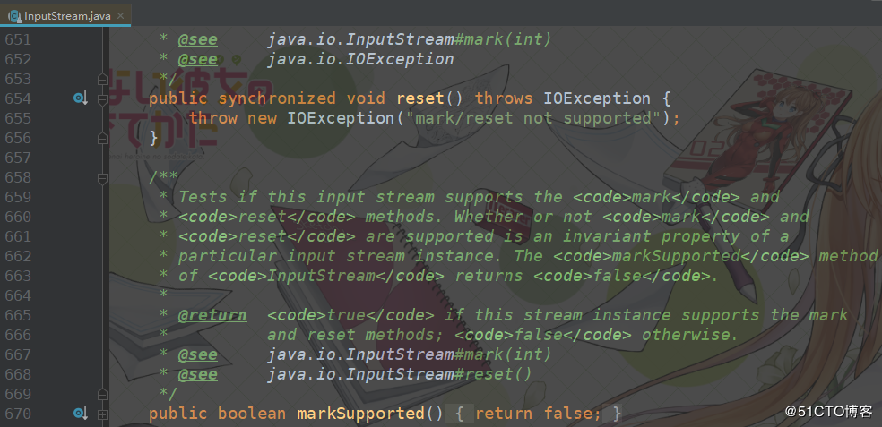
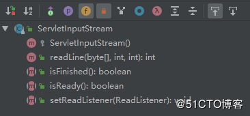
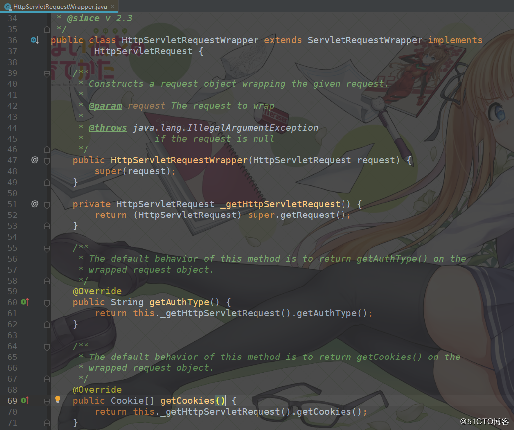

[TOC]
## 背景


通常对安全性有要求的接口都会对请求参数做一些签名验证，而我们一般会把验签的逻辑统一放到过滤器或拦截器里，这样就不用每个接口都去重复编写验签的逻辑。

在一个项目中会有很多的接口，而不同的接口可能接收不同类型的数据，例如表单数据和json数据，表单数据还好说，调用request的getParameterMap就能全部取出来。而json数据就有些麻烦了，因为json数据放在body中，我们需要通过request的输入流去读取。

但问题在于request的输入流只能读取一次不能重复读取，所以我们在过滤器或拦截器里读取了request的输入流之后，请求走到controller层时就会报错。而本文的目的就是介绍如何解决在这种场景下遇到HttpServletRequest的输入流只能读取一次的问题。

注：本文代码基于SpringBoot框架

## HttpServletRequest的输入流只能读取一次的原因


我们先来看看为什么HttpServletRequest的输入流只能读一次，当我们调用getInputStream()方法获取输入流时得到的是一个InputStream对象，而实际类型是ServletInputStream，它继承于InputStream。


InputStream的read()方法内部有一个postion，标志当前流被读取到的位置，每读取一次，该标志就会移动一次，如果读到最后，read()会返回-1，表示已经读取完了。如果想要重新读取则需要调用reset()方法，position就会移动到上次调用mark的位置，mark默认是0，所以就能从头再读了。调用reset()方法的前提是已经重写了reset()方法，当然能否reset也是有条件的，它取决于markSupported()方法是否返回true。

InputStream默认不实现reset()，并且markSupported()默认也是返回false，这一点查看其源码便知：



我们再来看看ServletInputStream，可以看到该类没有重写mark()，reset()以及markSupported()方法：



综上，InputStream默认不实现reset的相关方法，而ServletInputStream也没有重写reset的相关方法，这样就无法重复读取流，这就是我们从request对象中获取的输入流就只能读取一次的原因。


## 使用HttpServletRequestWrapper + Filter解决输入流不能重复读取问题

既然ServletInputStream不支持重新读写，那么为什么不把流读出来后用容器存储起来，后面就可以多次利用了。那么问题就来了，要如何存储这个流呢？


所幸JavaEE提供了一个 HttpServletRequestWrapper类，从类名也可以知道它是一个http请求包装器，其基于装饰者模式实现了HttpServletRequest界面，部分源码如下：



从上图中的部分源码可以看到，该类并没有真正去实现HttpServletRequest的方法，而只是在方法内又去调用HttpServletRequest的方法，所以我们可以通过继承该类并实现想要重新定义的方法以达到包装原生HttpServletRequest对象的目的。


首先我们要定义一个容器，将输入流里面的数据存储到这个容器里，这个容器可以是数组或集合。然后我们重写getInputStream方法，每次都从这个容器里读数据，这样我们的输入流就可以读取任意次了。


具体的实现代码如下：

```java

package com.example.wrapperdemo.controller.wrapper;

import lombok.extern.slf4j.Slf4j;

import javax.servlet.ReadListener;
import javax.servlet.ServletInputStream;
import javax.servlet.ServletRequest;
import javax.servlet.http.HttpServletRequest;
import javax.servlet.http.HttpServletRequestWrapper;
import java.io.*;
import java.nio.charset.Charset;

/**
 * @author 01
 * @program wrapper-demo
 * @description 包装HttpServletRequest，目的是让其输入流可重复读
 * @create 2018-12-24 20:48
 * @since 1.0
 **/@Slf4j
public class RequestWrapper extends HttpServletRequestWrapper {
    /**
     * 存储body数据的容器
     */
    private final byte[] body;

    public RequestWrapper(HttpServletRequest request) throws IOException {
        super(request);

        // 将body数据存储起来
        String bodyStr = getBodyString(request);
        body = bodyStr.getBytes(Charset.defaultCharset());
    }

    /**
     * 获取请求Body
     *
     * @param request request
     * @return String
     */
    public String getBodyString(final ServletRequest request) {
        try {
            return inputStream2String(request.getInputStream());
        } catch (IOException e) {
            log.error("", e);
            throw new RuntimeException(e);
        }
    }

    /**
     * 获取请求Body
     *
     * @return String
     */
    public String getBodyString() {
        final InputStream inputStream = new ByteArrayInputStream(body);

        return inputStream2String(inputStream);
    }

    /**
     * 将inputStream里的数据读取出来并转换成字符串
     *
     * @param inputStream inputStream
     * @return String
     */
    private String inputStream2String(InputStream inputStream) {
        StringBuilder sb = new StringBuilder();
        BufferedReader reader = null;

        try {
            reader = new BufferedReader(new InputStreamReader(inputStream, Charset.defaultCharset()));
            String line;
            while ((line = reader.readLine()) != null) {
                sb.append(line);
            }
        } catch (IOException e) {
            log.error("", e);
            throw new RuntimeException(e);
        } finally {
            if (reader != null) {
                try {
                    reader.close();
                } catch (IOException e) {
                    log.error("", e);
                }
            }
        }

        return sb.toString();
    }

    @Override
    public BufferedReader getReader() throws IOException {
        return new BufferedReader(new InputStreamReader(getInputStream()));
    }

    @Override
    public ServletInputStream getInputStream() throws IOException {

        final ByteArrayInputStream inputStream = new ByteArrayInputStream(body);

        return new ServletInputStream() {
            @Override
            public int read() throws IOException {
                return inputStream.read();
            }

            @Override
            public boolean isFinished() {
                return false;
            }

            @Override
            public boolean isReady() {
                return false;
            }

            @Override
            public void setReadListener(ReadListener readListener) {
            }
        };
    }
}
```


除了要写一个包装器外，我们还需要在**过滤器**里将原生的HttpServletRequest对象替换成我们的RequestWrapper对象，代码如下：
```java

package com.example.wrapperdemo.controller.filter;

import com.example.wrapperdemo.controller.wrapper.RequestWrapper;
import lombok.extern.slf4j.Slf4j;

import javax.servlet.*;
import javax.servlet.http.HttpServletRequest;
import java.io.IOException;

/**
 * @author 01
 * @program wrapper-demo
 * @description 替换HttpServletRequest
 * @create 2018-12-24 21:04
 * @since 1.0
 **/@Slf4j
public class ReplaceStreamFilter implements Filter {
    @Override
    public void init(FilterConfig filterConfig) throws ServletException {
        log.info("StreamFilter初始化...");
    }

    @Override
    public void doFilter(ServletRequest request, ServletResponse response, FilterChain chain) throws IOException, ServletException {
        ServletRequest requestWrapper = new RequestWrapper((HttpServletRequest) request);
        chain.doFilter(requestWrapper, response);
    }

    @Override
    public void destroy() {
        log.info("StreamFilter销毁...");
    }
}
```

然后我们就可以在拦截器中愉快的获取json数据也不慌controller层会报错了：

```java

package com.example.wrapperdemo.controller.interceptor;

import com.example.wrapperdemo.controller.wrapper.RequestWrapper;
import lombok.extern.slf4j.Slf4j;
import org.springframework.http.MediaType;
import org.springframework.web.servlet.HandlerInterceptor;
import org.springframework.web.servlet.ModelAndView;

import javax.servlet.http.HttpServletRequest;
import javax.servlet.http.HttpServletResponse;

/**
 * @author 01
 * @program wrapper-demo
 * @description 签名拦截器
 * @create 2018-12-24 21:08
 * @since 1.0
 **/@Slf4j
public class SignatureInterceptor implements HandlerInterceptor {
    @Override
    public boolean preHandle(HttpServletRequest request, HttpServletResponse response, Object handler) throws Exception {
        log.info("[preHandle] executing... request uri is {}", request.getRequestURI());
        if (isJson(request)) {
            // 获取json字符串
            String jsonParam = new RequestWrapper(request).getBodyString();
            log.info("[preHandle] json数据 : {}", jsonParam);

            // 验签逻辑...略...
        }

        return true;
    }

    @Override
    public void postHandle(HttpServletRequest request, HttpServletResponse response, Object handler, ModelAndView modelAndView) throws Exception {

    }

    @Override
    public void afterCompletion(HttpServletRequest request, HttpServletResponse response, Object handler, Exception ex) throws Exception {

    }

    /**
     * 判断本次请求的数据类型是否为json
     *
     * @param request request
     * @return boolean
     */
    private boolean isJson(HttpServletRequest request) {
        if (request.getContentType() != null) {
            return request.getContentType().equals(MediaType.APPLICATION_JSON_VALUE) ||
                    request.getContentType().equals(MediaType.APPLICATION_JSON_UTF8_VALUE);
        }

        return false;
    }
}
```

编写完以上的代码后，还需要将过滤器和拦截器在配置类中进行注册才会生效。
在springBoot中配置，参考[SpringBoot配置](https://blog.51cto.com/zero01/2334836)

以下参考，在SpringMVC中配置。
在web.xml上配置过滤器，这里要注意的是这个包装过滤器可能要写在web.xml配置文件里某些过滤器的前面，比如解密过滤器，否则被解密过滤器先读取流的话，包装过滤器就读取不了流了。

```java
 <filter>
    <filter-name>RequestWrapperFilter</filter-name>
    <filter-class>com.example.wrapperdemo.controller.filter.ReplaceStreamFilter</filter-class>
  </filter>
  <filter-mapping>
    <filter-name>RequestWrapperFilter</filter-name>
    <url-pattern>/*</url-pattern>
  </filter-mapping>
```


