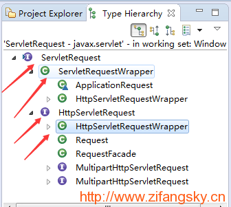
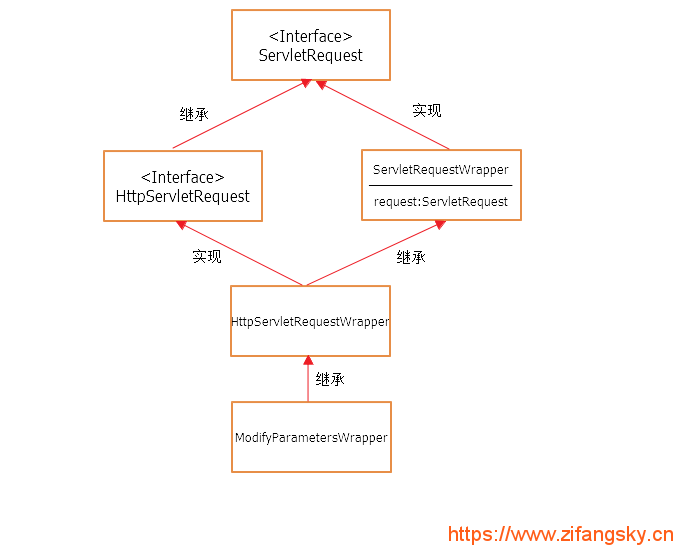
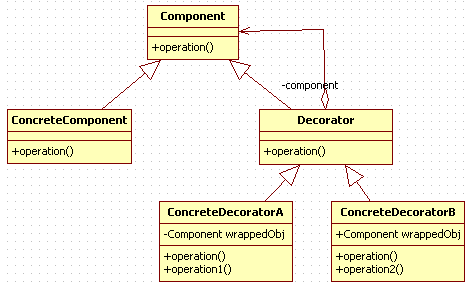

[TOC]
## 问题

我们是否可以在一个Filter中将 HttpServletRequest 里的所有参数都取出来分别进行过滤然后再放回到该HttpServletRequest 中呢?

## 解决

### 1. setAttribute(String name, Object o) 方法
* HttpServletRequest 中的 setAttribute(String name, Object o) 这个方法用来设置向前端传递的参数，用于在前端显示的，而不是用于向后端传递参数的。
* request.setAttribute(position,nameOfObj);也可以用于页面之间的传值，从a.jsp到b.jsp一次传递，之后这个request就会失去他的作用范围，再传就要重新设一个request.setAttribute()。（使用session.setAttribute()会在一个过程中始终保持这个值）
* 在前后端分离后，该方法也没啥用了

### 2. ServletRequest、HttpServletRequest、ServletRequestWrapper以及HttpServletRequestWrapper这几个接口或者类之间的层次关系


**UML类图**



如果学过“装饰模式”的童鞋可能已经发现了，上面这个关系毫无疑问是一个很标准的装饰模式：

* ServletRequest    抽象组件
* HttpServletRequest    抽象组件的一个子类，它的实例被称作“被装饰者”
* ServletRequestWrapper    一个基本的装饰类，这里是非抽象的
* HttpServletRequestWrapper    一个具体的装饰者，当然这里也继承了HttpServletRequest这个接口，是为了获取一些在ServletRequest中没有的方法
* ModifyParametersWrapper    同样是 一个具体的装饰者（PS：我自定义的一个类）

> 注：一个标准的装饰模式的UML类图是这样的
 

所以，只需要在Filter中自定义一个类继承于HttpServletRequestWrapper，并复写getParameterNames、getParameter、getParameterValues等方法即可修改后台Controller中获取到的HttpServletRequest中的参数

### 3. 代码实现
#### 一，自定义的过滤器ModifyParametersFilter.java
``` java
package cn.zifangsky.filter;

import java.io.IOException;
import java.util.Enumeration;
import java.util.Map;
import java.util.Vector;

import javax.servlet.FilterChain;
import javax.servlet.ServletException;
import javax.servlet.http.HttpServletRequest;
import javax.servlet.http.HttpServletRequestWrapper;
import javax.servlet.http.HttpServletResponse;

import org.springframework.web.filter.OncePerRequestFilter;

public class ModifyParametersFilter extends OncePerRequestFilter {

	@Override
	protected void doFilterInternal(HttpServletRequest request, HttpServletResponse response, FilterChain filterChain)
			throws ServletException, IOException {
		ModifyParametersWrapper mParametersWrapper = new ModifyParametersWrapper(request);
		filterChain.doFilter(mParametersWrapper, response);
	}

	/**
	 * 继承HttpServletRequestWrapper，创建装饰类，以达到修改HttpServletRequest参数的目的
	 */
	private class ModifyParametersWrapper extends HttpServletRequestWrapper {
		private Map<String, String[]> parameterMap; // 所有参数的Map集合

		public ModifyParametersWrapper(HttpServletRequest request) {
			super(request);
			parameterMap = request.getParameterMap();
		}

		// 重写几个HttpServletRequestWrapper中的方法
		/**
		 * 获取所有参数名
		 * 
		 * @return 返回所有参数名
		 */
		@Override
		public Enumeration<String> getParameterNames() {
			Vector<String> vector = new Vector<String>(parameterMap.keySet());
			return vector.elements();
		}

		/**
		 * 获取指定参数名的值，如果有重复的参数名，则返回第一个的值 接收一般变量 ，如text类型
		 * 
		 * @param name
		 *            指定参数名
		 * @return 指定参数名的值
		 */
		@Override
		public String getParameter(String name) {
			String[] results = parameterMap.get(name);
			if (results == null || results.length <= 0)
				return null;
			else {
				System.out.println("修改之前： " + results[0]);
				return modify(results[0]);
			}
		}

		/**
		 * 获取指定参数名的所有值的数组，如：checkbox的所有数据 
		 * 接收数组变量 ，如checkobx类型
		 */
		@Override
		public String[] getParameterValues(String name) {
			String[] results = parameterMap.get(name);
			if (results == null || results.length <= 0)
				return null;
			else {
				int length = results.length;
				for (int i = 0; i < length; i++) {
					System.out.println("修改之前2： " + results[i]);
					results[i] = modify(results[i]);
				}
				return results;
			}
		}

		/**
		 * 自定义的一个简单修改原参数的方法，即：给原来的参数值前面添加了一个修改标志的字符串
		 * 
		 * @param string
		 *            原参数值
		 * @return 修改之后的值
		 */
		private String modify(String string) {
			return "Modified: " + string;
		}
	}

}
```
上面的代码很简单，就是添加了一个内部类：ModifyParametersWrapper，然后复写了ServletRequest中的几个方法，具体来说就是将原来的每个参数的值的前面加上了“Modified: ”这个字符串

#### 二，在web.xml中注册该过滤器：

```xml
	<filter>
		<filter-name>ModifyParametersFilter</filter-name>
		<filter-class>cn.zifangsky.filter.ModifyParametersFilter</filter-class>
	</filter>
	<filter-mapping>
		<filter-name>ModifyParametersFilter</filter-name>
		<url-pattern>/param/*</url-pattern>
		<!-- 直接从客户端过来的请求以及通过forward过来的请求都要经过该过滤器 -->
		<dispatcher>REQUEST</dispatcher>
		<dispatcher>FORWARD</dispatcher>
	</filter-mapping>
```

#### 三，添加一个测试使用的Controller，即：TestModifyController.java：

```java
package cn.zifangsky.controller;

import org.springframework.stereotype.Controller;
import org.springframework.web.bind.annotation.RequestMapping;
import org.springframework.web.bind.annotation.RequestParam;

@Controller
public class TestModifyController {
	
	@RequestMapping("/param/modify.html")
	public void modify(@RequestParam("name") String name){
		System.out.println("修改之后： " + name);
	}
}
```
#### 四，测试
```log
 修改之前2： abc
修改之后： Modified: abc
```
这就表明了我们前面自定义的过滤器已经将HttpServletRequest中原来的参数成功修改了。同时，还说明SpringMVC的@RequestParam注解本质上调用的是ServletRequest中的 getParameterValues(String name) 方法而不是 getParameter(String name) 方法

