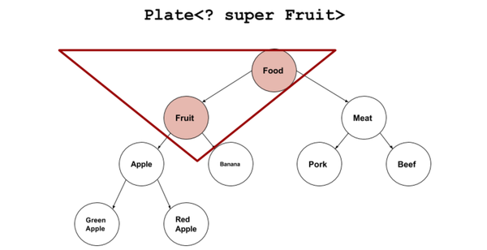

[TOC]
# 一. 泛型概念的提出
> 有许多原因促成了泛型的出现，而最引人注意的一个原因，就是**为了创建容器类**。

# 二. 泛型类
```java
public class Container<K, V> {
private K key;
private V value;

public Container(K k, V v) {
key = k;
value = v;
}

public K getKey() {
return key;
}

public void setKey(K key) {
this.key = key;
}

public V getValue() {
return value;
}

public void setValue(V value) {
this.value = value;
}
}
```
在编译期，是无法知道K和V具体是什么类型，只有在运行时才会真正根据类型来构造和分配内存。可以看一下现在Container类对于不同类型的支持情况：
```java
public class Main {

public static void main(String[] args) {
    Container<String, String> c1 = new Container<String, String>("name", "findingsea");
    Container<String, Integer> c2 = new Container<String, Integer>("age", 24);
    Container<Double, Double> c3 = new Container<Double, Double>(1.1, 2.2);
    System.out.println(c1.getKey() + " : " + c1.getValue());
    System.out.println(c2.getKey() + " : " + c2.getValue());
    System.out.println(c3.getKey() + " : " + c3.getValue());
    }
}
```
输出：
```shell
name : findingsea
age : 24
1.1 : 2.2
```
# 三. 泛型接口
在泛型接口中，生成器是一个很好的理解，看如下的生成器接口定义：
```java
public interface Generator<T> {
    public T next();
}
```
然后定义一个生成器类来实现这个接口：
```java
public class FruitGenerator implements Generator<String> {

    private String[] fruits = new String[]{"Apple", "Banana", "Pear"};

    @Override
    public String next() {
    Random rand = new Random();
    return fruits[rand.nextInt(3)]; 
    }
}
```
调用：
```java
public class Main {

public static void main(String[] args) {
    FruitGenerator generator = new FruitGenerator();
    System.out.println(generator.next());
    System.out.println(generator.next());
    System.out.println(generator.next());
    System.out.println(generator.next());
}
}
```
输出：
```shell
Banana
Banana
Pear
Banana
```
# 四. 泛型方法
一个基本的原则是：**无论何时，只要你能做到，你就应该尽量使用泛型方法**。也就是说，如果使用泛型方法可以取代将整个类泛化，那么应该有限采用泛型方法。下面来看一个简单的泛型方法的定义：
```java
public class Main {

public static <T> void out(T t) {
System.out.println(t);
}

public static void main(String[] args) {
out("findingsea");
out(123);
out(11.11);
out(true);
}
}
```
可以看到方法的参数彻底泛化了，这个过程涉及到编译器的类型推导和自动打包，也就说原来需要我们自己对类型进行的判断和处理，现在编译器帮我们做了。这样在定义方法的时候不必考虑以后到底需要处理哪些类型的参数，大大增加了编程的灵活性。

再看一个泛型方法和可变参数的例子：
```java
public class Main {

public static <T> void out(T... args) {
for (T t : args) {
System.out.println(t);
}
}

public static void main(String[] args) {
out("findingsea", 123, 11.11, true);
}
}
```
输出和前一段代码相同，可以看到泛型可以和可变参数非常完美的结合。

## 两种相似泛型方法的区别
### 第一种：
```java
public static <T extends CommonService> T getService(Class<T> clazz) {
        T service = (T) serviceMap.get(clazz.getName());
        if (service == null) {
            service = (T) ServiceLocator.getService(clazz.getName());
            serviceMap.put(clazz.getName(), service);
        }
        return service;
    }
```
    
### 第二种：
```java
public static <T> T getService(Class<? extends CommonService> clazz) {
        T service = (T) serviceMap.get(clazz.getName());
        if (service == null) {
            service = (T) ServiceLocator.getService(clazz.getName());
            serviceMap.put(clazz.getName(), service);
        }
        return service;
    }
```
### 调用第一种泛型方法：
```java
NoticeService noticeService=CommonService.getService(NoticeService.class);//正确的使用第一种泛型方法，不会出现编译错误。
        NoticeService noticeService=CommonService.getService(UserService.class);//不正确的使用第一种泛型方法，会出现编译错误。
```
### 调用第二种泛型方法:
```java
 NoticeService noticeService=CommonService.getService(NoticeService.class);//正确的使用第二种泛型方法，不会出现编译错误，逻辑也正确，运行时不会出现异常。
        NoticeService noticeService=CommonService.getService(UserService.class);//不正确的使用第二种泛型方法，不会出现编译错误，但逻辑不正确，运行时会出现异常，危险！
```
### 区别：
在于不正确调用两种泛型方法时，即返回值和参数值的类型不一致时，第二种在编译期不会报错，直到运行期才会报错，非常危险。

# 五. 类型参数“<T>”和无界通配符“<?>”的区别

## 1. 类型参数“<T>”主要用于**声明**泛型类或泛型方法
* <T>声明泛型类的类型参数
```java
class Box<T>{
    private List<T> item;
    public List<T> get(){return item;}
    public void set(List<T> t){item=t;}
}
```
* <T>声明泛型方法
```java
class Fuction{
    public static <T> List<T> reduce(List<T> list){
        //...do something
    }
}
```

## 2. 无界通配符“<?>”主要用于**使用**泛型类或泛型方法。
首先要明确通配符不能拿来声明泛型。像下面这样用通配符"?"来表示类型参数的约束是肯定不行的。
```java
//Error Example
class Box<?>{
    private ? item1;
    private ? item2;
}
```
**通配符是拿来使用定义好的泛型的**。比如声明List容器的一个实例对象。

但List<?>这个写法非常坑。因为，这时候通配符会捕获具体的String类型，

但编译器不叫它String，而是起个临时的代号，比如”CAP#1“。

所以以后再也不能往list里存任何元素，包括String。唯一能存的就是null。

```java
List<?> list = new ArrayList<String>();

list.add("hello");    //ERROR
list.add(111);    //ERROR

//argument mismatch; String cannot be converted to CAP#1
//argument mismatch; int cannot be converted to CAP#1
```

## 3. 有界通配符<? extends T>，<? super T>
### 上界通配符（Upper Bounds Wildcards）<? extends T>
上界通配符 “Plate<？ extends Fruit>” 覆盖下图中蓝色的区域。


上界<? extends T>不能往里存，只能往外取
```java
Plate<? extends Fruit> p=new Plate<Apple>(new Apple());

//不能存入任何元素
p.set(new Fruit()); //Error
p.set(new Apple()); //Error

//读取出来的东西只能存放在Fruit或它的基类里。
Fruit newFruit1=p.get();
Object newFruit2=p.get();
Apple newFruit3=p.get(); //Error
```
原因是编译器只知道容器内是Fruit或者它的派生类，但具体是什么类型不知道。

可能是Fruit？可能是Apple？也可能是Banana，RedApple，GreenApple？

编译器在看到后面用Plate<Apple>赋值以后，盘子里没有被标上有“苹果”。而是标上一个占位符：CAP#1，来表示捕获一个Fruit或Fruit的子类，具体是什么类不知道，代号CAP#1。

然后无论是想往里插入Apple或者Meat或者Fruit编译器都不知道能不能和这个CAP#1匹配，所以就都不允许。

### 下界通配符（Lower Bounds Wildcards） <? super T>
Plate<？ super Fruit>覆盖下图中红色的区域


下界<? super T>不影响往里存，但往外取只能放在Object对象里
```java
Plate<? super Fruit> p=new Plate<Fruit>(new Fruit());

//存入元素正常
p.set(new Fruit());
p.set(new Apple());

//读取出来的东西只能存放在Object类里。
Apple newFruit3=p.get(); //Error
Fruit newFruit1=p.get(); //Error
Object newFruit2=p.get();
```
因为下界规定了元素的最小粒度的下限，实际上是放松了容器元素的类型控制。既然元素是Fruit的基类，那往里存粒度比Fruit小的都可以。但往外读取元素就费劲了，只有所有类的基类Object对象才能装下。但这样的话，元素的类型信息就全部丢失。

### PECS原则
1. 频繁往外读取内容的，适合用上界Extends。

2. 经常往里插入的，适合用下界Super。

# 六. Java泛型－类型擦除
## 1. 编译器如何处理泛型
通常情况下，一个编译器处理泛型有两种方式：

1. Code specialization。在实例化一个泛型类或泛型方法时都产生一份新的目标代码（字节码or二进制代码）。例如，针对一个泛型list，可能需要 针对string，integer，float产生三份目标代码。

    C++中的模板（template）是典型的Code specialization实现。C++编译器会为每一个泛型类实例生成一份执行代码。执行代码中integer list和string list是两种不同的类型。这样会导致代码膨胀（code bloat），不过有经验的C＋＋程序员可以有技巧的避免代码膨胀。
    
    Code specialization另外一个弊端是在引用类型系统中，浪费空间，因为引用类型集合中元素本质上都是一个指针。没必要为每个类型都产生一份执行代码。而这也是Java编译器中采用Code sharing方式处理泛型的主要原因。


2. Code sharing。对每个泛型类只生成唯一的一份目标代码；该泛型类的所有实例都映射到这份目标代码上，在需要的时候执行类型检查和类型转换。

    Java编译器通过Code sharing方式为每个泛型类型创建唯一的字节码表示，并且将该泛型类型的实例都映射到这个唯一的字节码表示上。将**多种泛型类形实例映射到唯一的字节码**表示是通过 **类型擦除（type erasue）** 实现的。
    
    
## 2. 什么是类型擦除
类型擦除可以简单的理解为将泛型java代码转换为普通java代码，只不过编译器更直接点，将泛型java代码直接转换成普通java字节码。

类型擦除的主要过程如下：

1. 将所有的泛型参数用其最左边界（最顶级的父类型）类型替换。

2. 移除所有的类型参数。

```java
interface Comparable <A> {   
  public int compareTo( A that);   
}   
//---------------擦除后-------------------
//泛型类Comparable <A>擦除后 A被替换为最左边界Object
interface Comparable { 
 public int compareTo( Object that);   
}  

//----------------------------------------
final class NumericValue implements Comparable <NumericValue> {   
  private byte value;    
  public  NumericValue (byte value) { this.value = value; }    
  public  byte getValue() { return value; }    
  public  int compareTo( NumericValue that) { return this.value - that.value; }   
}   
//---------------擦除后-------------------
//Comparable<NumericValue>的类型参数NumericValue被擦除掉，但是这直 接导致NumericValue没有实现接口Comparable的compareTo(Object that)方法，于是编译器充当好人，添加了一个桥接方法compareTo(Object that)。

final class NumericValue implements Comparable {   
  private byte value;    
  public  NumericValue (byte value) { this.value = value; }    
  public  byte getValue() { return value; }    
  public  int compareTo( NumericValue that)   { return this.value - that.value; }   
  public  int compareTo(Object that) { return this.compareTo((NumericValue)that);  }   
}
//----------------------------------------

class Collections {    
  public static <A extends Comparable<A>>A max(Collection <A> xs) {   
    Iterator <A> xi = xs.iterator();   
    A w = xi.next();   
    while (xi.hasNext()) {   
      A x = xi.next();   
      if (w.compareTo(x) < 0) w = x;   
    }   
    return w;   
  }   
}   
//---------------擦除后-------------------
//限定了类型参数的边界<A extends Comparable<A>>A，A必须为Comparable<A>的子类，按照类型擦除的过程，先将所有的类型参数 ti换为最左边界Comparable<A>，然后去掉参数类型A，得到最终的擦除后结果。

class Collections {    
  public static Comparable max(Collection xs) {   
    Iterator xi = xs.iterator();   
    Comparable w = (Comparable) xi.next();   
    while (xi.hasNext()) {   
      Comparable x = (Comparable) xi.next();   
      if (w.compareTo(x) < 0) w = x;   
    }   
    return w;   
  }   
}   
//----------------------------------------
final class Test {   
  public static void main (String[ ] args) {   
    LinkedList <NumericValue> numberList = new LinkedList <NumericValue> ();   
    numberList .add(new NumericValue((byte)0));    
    numberList .add(new NumericValue((byte)1));    
    NumericValue y = Collections.max( numberList );    
  }  
//---------------擦除后-------------------
  final class Test {   
  public static void main (String[ ] args) {   
    LinkedList numberList = new LinkedList();   
    numberList .add(new NumericValue((byte)0));  ，  
    numberList .add(new NumericValue((byte)1));    
    NumericValue y = (NumericValue) Collections.max( numberList );    
  }
} 
```
## 3. 类型擦除带来的问题
### 1. 用同一泛型类的实例区分方法签名？——NO！
```java
 public class Erasure{  
            public void test(List<String> ls){  
                System.out.println("Sting");  
            }  
            public void test(List<Integer> li){  
                System.out.println("Integer");  
            }  
    }
```
编译该类:


类型擦除后，List<String>和List<Integer>就都是List了。

### 2.  同时catch同一个泛型异常类的多个实例？——NO！

如果定义了一个泛型一场类GenericException<T>，千万别同时catch GenericException<Integer>和GenericException<String>，因为他们是一样一样滴⋯⋯
### 3. 泛型类的静态变量是共享的？——Yes！
```java
public class StaticTest{  
    public static void main(String[] args){  
        GT<Integer> gti = new GT<Integer>();  
        gti.var=1;  
        GT<String> gts = new GT<String>();  
        gts.var=2;  
        System.out.println(gti.var);  
    }  
}  
class GT<T>{  
    public static int var=0;  
    public void nothing(T x){}  
}
```
输出是2！由于经过类型擦除，所有的泛型类实例都关联到同一份字节码上，泛型类的所有静态变量是共享的。
## 4. Just remember
1. 虚拟机中没有泛型，只有普通类和普通方法
2. 所有泛型类的类型参数在编译时都会被擦除
3. 创建泛型对象时请指明类型，让编译器尽早的做参数检查（Effective Java，第23条：请不要在新代码中使用原生态类型）
4. 不要忽略编译器的警告信息，那意味着潜在的ClassCastException等着你。

## 5. 为什么不能创建泛型数组
父类：
```java
public class Father {  
  
}  
```
子类：
```java
public class Son extends Father{  
  
}  
```
测试类：
```java
public class Test {  
      
    public static void main(String[] args) {  
          
        Father[] son=new Son[10];  
    }  
} 
```
数组是允许把一个子类数组赋给一个父类数组变量的！这会发生什么！？
```java

// 假设可以创建泛型数组
List<String>[] stringLists = new ArrayList<String>[1];
List<Integer> intLists = Arrays.asList(42);
// 泛型擦除，List 继承自 Object，所以可以如此赋值
// 在数组中，子类数组 是 父类数组 的子类，Object[] o = new ArrayList[1];
Object[] objects = stringLists;
// 同理，泛型擦除后，List 类型变量赋值给 Object 类型变量
// 但此时出现问题了，**** List<Integer> 实例添加到了声明为 List<String>[] 类型的数组中了 ******
objects[0] = intList;
String s = stringLists[0].get(0);
```

由于泛型擦除，结果就是泛型的检查作用失效，可以将 List<Integer> 类型的值添加到 List<String>[] 类型的数组中。


