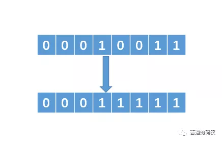

[TOC]
# 1.位运算符认知
1. Java位运算是针对于整型（byte、char、short、int、long）数据类型的二进制进行的移位操作。
2.  | 数据类型 | 位数 |
    | --- | --- |
    |boolean|8|
    |short|	16|
    |int|	32|
    |long|	64|
    |float|	32|
    |double|64|
    |char|	16|
3. 计算机表示数字正负不是用+ -加减号来表示，而是用最高位数字来表示，0表示正，1表示负 。

# 2.位运算符实验

> A = 60 = 0011 1100 
> B = 13 = 0000 1101

| 操作名 |操作  |示例|
| --- | --- |--- |
|   &：按位与 |  如果相对应位都是1，则=为1，否则为0    | （A＆B），得到12，即0000 1100|
|   \|：按位或    |   如果相对应位都是0，则=为0，否则为1   | （A \| B）得到61，即 0011 1101 |
|   ~：按位非    | 按位取反运算符翻转操作数的每一位，即01互换| （〜A）得到61，即1100 0011   |     
|   ^：按位异或  |    如果相对应位值相同，则=为0，否则为1 | （A ^ B）得到49，即 0011 0001 |    
| <<左位移运算符 | 左操作数按位左移右操作数指定的位数。      |   A << 2得到240，即 1111 0000 |     
| >>右位移运算符 |  左操作数按位右移右操作数指定的位数       |     A >> 2得到15即 1111      |    
| >>> 无符号右移  |    左操作数的值按右操作数指定的位数右移移动得到的空位以零填充  |    A>>>2得到15即0000 1111    |

```java
/**
 * @author YuanHaiLiang
 * @date 2018-08-14
 */
public class bitOperation {

    /*
     优先级S：~  波浪
        优先级A：<<、>>和>>>
            优先级B：＆
                优先级C：^  shift+6
                    优先级D：/
     */

    public static void main(String[] args) {
        /* 60 = 0011 1100 */
        /* 13 = 0000 1101 */
        int A = 60;                   int B = 13;                 

        System.out.println( "A&B=" + (A&B) );
        System.out.println( "A|B=" + (A|B) );
        System.out.println( "~A=" + (~A) );
        System.out.println( "~A=" + (A^B) );
        System.out.println( "A<<2=" + (A<<2) );
        System.out.println( "A>>2=" + (A>>2) );
        System.out.println( "A>>>2=" + (A>>>2) );

    }

}
```

# 3.重点是什么时候用
位运算的运算效率比直接对数字进行加减乘除高很多（至于为什么会快，不明白的可以去搜下为什么C的代码执行速度比Java,python快），代码需要考虑性能的时候

# 4.使用
## 场景1：判断奇偶数 
把 a 以二进制的形式展示的话，其实我们只需要判断最后一个二进制位是 1 还是 0 就行了，
* 如果是 1 的话，代表是奇数，

* 如果是 0 则代表是偶数

所以，a&1 结果为 0 ，a就是偶数 结果为 1 ，a就是奇数

## 场景2：求平均数 （x+y）/2 这样吗？

考虑过 x+y可能超过int的范围吗？正确的姿势是 (x&y)+((x^y)>>1)

## 场景3：有两个int类型变量x、y,要求两者数字交换，不用临时变量？(当年学java的时候这可是奥数级别的题目)
```java
x = x ^ y   // （1）
y = x ^ y   // （2）
x = x ^ y   // （3）
```

我们知道，两个相同的数异或之后结果会等于 0，即 n ^ n = 0。并且任何数与 0 异或等于它本身，即 n ^ 0 = n。所以，解释如下：

1. 把（1）中的 x 带入 （2）中的 x，有y = x^y = (x^y)^y = x^(y^y) = x^0 = x。 x 的值成功赋给了 y。

2. 对于（3）,推导如下：x = x^y = (x^y)^x = (x^x)^y = 0^y = y。

## 场景4：求绝对值

int abs( int x ) { int y= x >> 31 ; return (x^y)-y ; //or: (x+y)^y }

## 场景5：取模 
a % (2^n) 等价于 a & (2^n - 1)

## 场景6：快速乘法 
a * (2^n) 等价于 a << n

## 场景7：快速除法 
a / (2^n) 等价于 a >> n

## 场景8：求相反数 
(~x+1)

## 场景9：找出没有重复的数
>给你一组整型数据，这些数据中，其中有一个数只出现了一次，其他的数都出现了两次，让你来找出一个数 。


这道题可能很多人会用一个哈希表来存储，每次存储的时候，记录 某个数出现的次数，最后再遍历哈希表，看看哪个数只出现了一次。这种方法的时间复杂度为 O(n)，空间复杂度也为 O(n)了。

两个相同的数异或的结果是 0，一个数和 0 异或的结果是它本身，所以我们把这一组整型全部异或一下，例如这组数据是：1，  2，  3，  4，  5，  1，  2，  3，  4。其中 5 只出现了一次，其他都出现了两次，

把他们全部异或一下，结果如下：由于异或支持交换律和结合律，所以:1^2^3^4^5^1^2^3^4 = （1^1)^(2^2)^(3^3)^(4^4)^5= 0^0^0^0^5 = 5。

也就是说，那些出现了两次的数异或之后会变成0，那个出现一次的数，和 0 异或之后就等于它本身。就问这个解法牛不牛逼？所以代码如下:
```java
int find(int[] arr){
    int tmp = arr[0];
    for(int i = 1;i < arr.length; i++){
        tmp = tmp ^ arr[i];
    }
    return tmp;
}
```
时间复杂度为 O(n)，空间复杂度为 O(1)，

## 场景10：找出不大于N的最大的2的幂指数

传统的做法就是让 1 不断着乘以 2，代码如下：
```java
int findN(int N){
    int sum = 1;
   while(true){
        if(sum * 2 > N){
            return sum;
        }
        sum = sum * 2;
   }
}
```

这样做的话，时间复杂度是 O(logn)。
### 使用位运算：
例如 N = 19，那么转换成二进制就是 00010011（这里为了方便，我采用8位的二进制来表示）。那么我们要找的数就是，把二进制中最左边的 1 保留，后面的 1 全部变为 0。即我们的目标数是 00010000。那么如何获得这个数呢？相应解法如下：

1. 找到最左边的 1，然后把它右边的所有 0 变成 1。



2. 把得到的数值加 1，可以得到 00100000即 00011111 + 1 = 00100000。

3. 把 得到的 00100000 向右移动一位，即可得到 00010000，即 00100000 >> 1 = 00010000。
###  问题: 第一步中把最左边 1 中后面的 0 转化为 1 该怎么弄呢？
```java
n |= n >> 1;
n |= n >> 2;
n |= n >> 4;
```
所以，最终的代码是：
```java
int findN(int n){
    n |= n >> 1;
    n |= n >> 2;
    n |= n >> 4;
    n |= n >> 8 // 整型一般是 32 位，上面我是假设 8 位。
    return (n + 1) >> 1;
}
```
这种做法的时间复杂度近似 O(1)

总之，整型所涉及到的操作它都可以更快速的实现，有兴趣可以仔细研究。