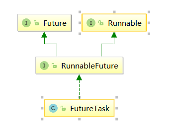
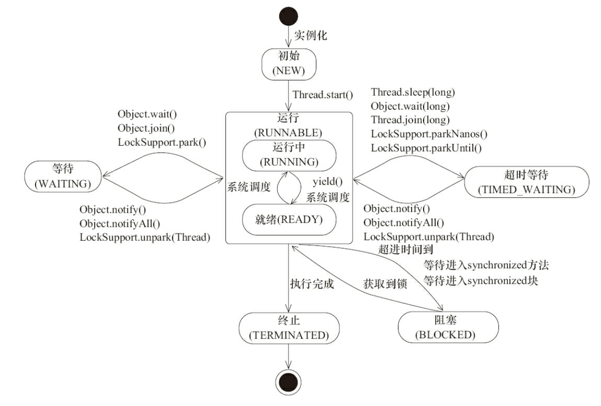
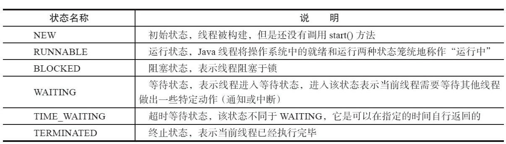
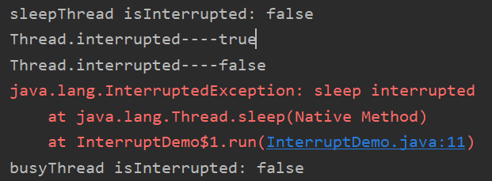

[TOC]
## 1. 新建线程
一个java程序从main()方法开始执行，然后按照既定的代码逻辑执行，看似没有其他线程参与，但实际上java程序天生就是一个多线程程序，包含了：
1. 分发处理发送给给JVM信号的线程；
2. 调用对象的finalize方法的线程；
3. 清除Reference的线程；
4. main线程，用户程序的入口。

在用户程序中新建一个线程了，有三种方式：
1. 通过继承Thread类，重写run方法；
2. 通过实现runable接口；
3. 通过实现callable接口这三种方式，下面看具体demo。

```java
public class CreateThreadDemo {
	public static void main(String[] args) {
		//1.继承Thread
		Thread thread = new Thread() {
			@Override
			public void run() {
				System.out.println("继承Thread");
				super.run();
			}
		};
		thread.start();
		//2.实现runable接口
		Thread thread1 = new Thread(new Runnable() {
			@Override
			public void run() {
				System.out.println("实现runable接口");
			}
		});
		thread1.start();
		//3.实现callable接口
		ExecutorService service = Executors.newSingleThreadExecutor();
		Future<String> future = service.submit(new Callable() {
			@Override
			public String call() throws Exception {
				return "通过实现Callable接口";
			}
		});
		try {
			String result = future.get();
			System.out.println(result);
		} catch (InterruptedException e) {
			e.printStackTrace();
		} catch (ExecutionException e) {
			e.printStackTrace();
		}
	}
}
```
三种新建线程的方式具体看以上注释，需要注意的是：

* 由于java不能多继承可以实现多个接口，因此，在创建线程的时候尽量多考虑采用实现接口的形式；

* 实现callable接口，提交给ExecutorService返回的是异步执行的结果，另外，通常也可以利用FutureTask(Callable<V> callable)将callable进行包装然后FeatureTask提交给ExecutorsService。如图，


另外由于FeatureTask也实现了Runable接口也可以利用上面第二种方式（实现Runable接口）来新建线程；

* 可以通过Executors将Runable转换成Callable，具体方法是：Callable<T> callable(Runnable task, T result)， Callable<Object> callable(Runnable task)。

## 2. 线程状态转换


线程是会在不同的状态间进行转换的，java线程线程转换图如上图所示。

线程创建之后调用 `start()`方法开始运行，
当调用 `wait(),join(),LockSupport.lock()` 方法,线程会进入到WAITING状态，

而 ` wait(long timeout)，sleep(long),join(long),LockSupport.parkNanos(),LockSupport.parkUtil()` 增加了超时等待的功能，也就是调用这些方法后线程会进入TIMED_WAITING状态，当超时等待时间到达后，线程会切换到Runable的状态。

另外当 `WAITING`和 `TIMED _WAITING`状态时可以通过 `Object.notify(),Object.notifyAll()`方法使线程转换到Runable状态。

当线程出现资源竞争时，即等待获取锁的时候，线程会进入到 ` BLOCKED` 阻塞状态，

当线程获取锁时，线程进入到 ` Runable` 状态。

线程运行结束后，线程进入到 ` TERMINATED` 状态，

状态转换可以说是线程的生命周期。另外需要注意的是：

* 当线程进入到 ` synchronized` 方法或者 ` synchronized` 代码块时，线程切换到的是 ` BLOCKED` 状态，而使用 ` java.util.concurrent.locks` 下lock进行加锁的时候线程切换的是 ` WAITING` 或者 ` TIMED_WAITING` 状态，因为` lock`会调用 ` LockSupport` 的方法(具有超时等待功能)。此时可以通过 `Object.notify(),Object.notifyAll()`方法使线程转换到Runable状态，而 ` synchronized` 则不行。


用一个表格将上面六种状态进行一个总结归纳。


## 3. 线程状态的基本操作
### 3.1 interrupted
中断可以理解为线程的一个标志位，**只是一个标志位，是否要中断线程，要看线程内部是否根据这个标志位进行操作**，它表示了一个运行中的线程是否被其他线程标记了中断。它不会中断一个正在运行的线程。

中断好比其他线程对该线程打了一个招呼。其他线程可以调用该线程的interrupt()方法对其进行中断操作，同时该线程可以调用 isInterrupted（）来感知其他线程对其自身的中断操作，从而做出响应。

另外，同样可以调用Thread的静态方法interrupted（）对当前线程进行中断操作，该方法会清除中断标志位。


**对于受阻塞的线程**，该方法会给受阻塞的线程发出一个中断信号，这样受阻线程就得以退出阻塞的状态。

更确切的说，如果线程被`Object.wait, Thread.join和Thread.sleep`三种方法之一阻塞，此时调用该线程的interrupt()方法，那么该线程将抛出一个`InterruptedException`中断异常（该线程必须事先预备好处理此异常），从而提早地终结被阻塞状态。

如果线程没有被阻塞，这时调用 interrupt()将不起作用，直到执行到wait(),sleep(),join()时,才马上会抛出 InterruptedException。

需要注意的是，当抛出InterruptedException时候，会清除中断标志位，也就是说在调用isInterrupted会返回false。

| 方法名 |详细解释  |备注  |
| --- | --- | --- |
| `public void interrupt() `|`xxThread.interrupt()`中断该线程对象（此线程不一定是当前线程，而是指调用该方法的Thread实例所代表的线程），但实际上只是给线程设置一个中断标志，线程仍会继续运行 | 如果该线程调用了`Object.wait()/Object.wait(long)`,或者被调用`Sleep(long),join()/join(long)`方法时会抛出`java.lang.InterruptedException`，并且中断标志位会被清除 |
| `public boolean isInterrupted()` |`xxThread.isInterrupted()`测试该线程对象是否被中断  |中断标志位不会被清除  |
|`public static boolean interrupted()`  |`Thread.interrupted()`，Thread对象的静态方法 ，测试当前线程是否被中断 |中断标志位会被清除  |
下面结合具体的实例来看一看
```java
public class InterruptDemo {
	public static void main(String[] args) throws InterruptedException {
		//sleepThread睡眠1000ms
		final Thread sleepThread = new Thread() {
			@Override
			public void run() {
				try {
					Thread.sleep(1000);
				} catch (InterruptedException e) {
					e.printStackTrace();
				}
				super.run();
			}
		};
		//busyThread执行两次Thread.interrupted()，第一次会显示true，第二次显示false，中断标志位被清除
		Thread busyThread = new Thread() {
			@Override
			public void run() {
				for (int i = 0; i < 2; i++) {
					System.out.println("Thread.interrupted----" + Thread.interrupted());
				}
			}
		};
		sleepThread.start();
		busyThread.start();
		sleepThread.interrupt();
		busyThread.interrupt();
		while (sleepThread.isInterrupted());
		System.out.println("sleepThread isInterrupted: " + sleepThread.isInterrupted());
		Thread.sleep(100);
		System.out.println("busyThread isInterrupted: " + busyThread.isInterrupted());
	}
}
```
> 运行结果：
> 


开启了两个线程分别为sleepThread和BusyThread, sleepThread睡眠1s，BusyThread执行循环。然后分别对着两个线程进行中断操作，可以看出sleepThread抛出InterruptedException后清除标志位，而busyThread就不会清除标志位。

另外，同样可以通过中断的方式实现线程间的简单交互， while (sleepThread.isInterrupted()) 表示在Main中会持续监测sleepThread，一旦sleepThread的中断标志位清零，即sleepThread.isInterrupted()返回为false时才会继续Main线程才会继续往下执行。因此，中断操作可以看做线程间一种简便的交互方式。**一般在结束线程时通过中断标志位或者标志位的方式可以有机会去清理资源，相对于武断而直接的结束线程，这种方式要优雅和安全。**

### 3.2 join
如果一个线程实例A执行了threadB.join(),其含义是：当前线程A会等待threadB线程终止后threadA才会继续执行。关于join方法一共提供如下这些方法:
```java
public final synchronized void join(long millis)
public final synchronized void join(long millis, int nanos)
public final void join() throws InterruptedException
```
Thread类除了提供join()方法外，另外还提供了超时等待的方法，如果线程threadB在等待的时间内还没有结束的话，threadA会在超时之后继续执行。

join方法源码关键是：
```java
while (isAlive()) {
		wait(0);
}
```
可以看出来当前等待对象threadA会一直阻塞，直到被等待对象threadB结束后即isAlive()返回false的时候才会结束while循环，当threadB退出时会调用notifyAll()方法通知所有的等待线程。

下面用一个具体的例子来说说join方法的使用：

```java
public class JoinDemo {
	public static void main(String[] args) {
		Thread previousThread = Thread.currentThread();
		for (int i = 1; i <= 10; i++) {
			Thread curThread = new JoinThread(previousThread);
			curThread.start();
			previousThread = curThread;
		}
		System.out.println("main thread terminated.");
	}

	static class JoinThread extends Thread {
		private Thread thread;

		public JoinThread(Thread thread) {
			this.thread = thread;
		}

		@Override
		public void run() {
			try {
				thread.join();
				System.out.println(thread.getName() + " terminated.");
			} catch (InterruptedException e) {
				e.printStackTrace();
			}
		}
	}
}
```
输出结果为：
> main thread terminated.
main terminated.
Thread-0 terminated.
Thread-1 terminated.
Thread-2 terminated.
Thread-3 terminated.
Thread-4 terminated.
Thread-5 terminated.
Thread-6 terminated.
Thread-7 terminated.
Thread-8 terminated.

在上面的例子中一个创建了10个线程，每个线程都会等待前一个线程结束才会继续运行。可以通俗的理解成接力，前一个线程将接力棒传给下一个线程，然后又传给下一个线程......

### 3.3 sleep

public static native void sleep(long millis)方法显然是Thread的静态方法，很显然它是让当前线程按照指定的时间休眠，其休眠时间的精度取决于处理器的计时器和调度器。**需要注意的是如果当前线程获得了锁，sleep方法并不会失去锁。**

sleep方法经常拿来与Object.wait()方法进行比价，这也是面试经常被问的地方。

> sleep() VS wait()

两者主要的区别：
1. sleep()方法是Thread的静态方法，而wait是Object实例方法
2. wait()方法必须要在同步方法或者同步块中调用，也就是必须已经获得对象锁。而sleep()方法没有这个限制可以在任何地方使用。另外，wait()方法会释放占有的对象锁，使得该线程进入等待池中，等待下一次获取资源。而sleep()方法只是会让出CPU并不会释放掉对象锁；
3. sleep()方法在休眠时间达到后如果再次获得CPU时间片就会继续执行，而wait()方法必须等待
`Object.notift/Object.notifyAll`通知后，才会离开等待池，并且再次获得CPU时间片才会继续执行。


### 3.4 yield
public static native void yield();这是一个静态方法，一旦执行，它会使当前线程让出CPU，但是，需要注意的是，让出的CPU并不是代表当前线程不再运行了，如果在下一次竞争中，又获得了CPU时间片当前线程依然会继续运行。另外，让出的时间片只会分配给当前线程相同优先级的线程。

**什么是线程优先级了？下面就来具体聊一聊。**

1. 现代操作系统基本采用时分的形式调度运行的线程，操作系统会分出一个个时间片，线程会分配到若干时间片，当前时间片用完后就会发生线程调度，并等待这下次分配。线程分配到的时间多少也就决定了线程使用处理器资源的多少，而线程优先级就是决定线程需要或多或少分配一些处理器资源的线程属性。

2. 在Java程序中，通过一个整型成员变量Priority来控制优先级，优先级的范围从1~10.在构建线程的时候可以通过setPriority(int)方法进行设置，默认优先级为5，优先级高的线程相较于优先级低的线程优先获得处理器时间片。需要注意的是在不同JVM以及操作系统上，线程规划存在差异，有些操作系统甚至会忽略线程优先级的设定。

3. 每个线程都具有各自的优先级，线程的优先级可以在程序中表明该线程的重要性，如果有很多线程处于就绪状态，系统会根据优先级来决定首先使哪个线程进入运行状态。但这个并不意味着低
优先级的线程得不到运行，而只是它运行的几率比较小，如垃圾回收机制线程的优先级就比较低。所以很多垃圾得不到及时的回收处理。
4. 线程优先级具有继承特性比如A线程启动B线程，则B线程的优先级和A是一样的。
5. 线程优先级具有随机性也就是说线程优先级高的不一定每一次都先执行完。
6. Thread类中包含的成员变量代表了线程的某些优先级。如：
Thread.MIN_PRIORITY（常数1），
Thread.NORM_PRIORITY（常数5）,
Thread.MAX_PRIORITY（常数10）。
其中每个线程的优先级都在Thread.MIN_PRIORITY（常数1） 到Thread.MAX_PRIORITY（常数10） 之间，在默认情况下优先级都是Thread.NORM_PRIORITY（常数5）。


**sleep()和yield()方法，同样都是当前线程会交出处理器资源，**
而它们不同的是：
* sleep()交出来的时间片其他线程都可以去竞争，也就是说都有机会获得当前线程让出的时间片。
* 而yield()方法只允许与当前线程具有相同优先级的线程能够获得释放出来的CPU时间片。

 yield()做的是让当前运行线程回到可运行状态，以允许具有相同优先级的其他线程获得运行机会。因此，使用yield()的目的是让相同优先级的线程之间能适当的轮转执行。但是，实际中无法保证yield()达到让步目的，因为让步的线程还有可能被线程调度程序再次选中。
 
结论：yield()从未导致线程转到等待/睡眠/阻塞状态。在大多数情况下，yield()将导致线程从运行状态转到可运行状态，但有可能没有效果

### 3.5 守护线程Daemon

守护线程是一种特殊的线程，就和它的名字一样，它是系统的守护者，在后台默默地守护一些系统服务，比如垃圾回收线程，JIT线程就可以理解守护线程。与之对应的就是用户线程，用户线程就可以认为是系统的工作线程，它会完成整个系统的业务操作。用户线程完全结束后就意味着整个系统的业务任务全部结束了，因此系统就没有对象需要守护的了，守护线程自然而然就会退。当一个Java应用，只有守护线程的时候，虚拟机就会自然退出。下面以一个简单的例子来表述Daemon线程的使用。

```java
public class DaemonDemo {
	public static void main(String[] args) {
		Thread daemonThread = new Thread(new Runnable() {
			@Override
			public void run() {
				while (true) {
					try {
						System.out.println("i am alive");
						Thread.sleep(500);
					} catch (InterruptedException e) {
						e.printStackTrace();
					} finally {
						System.out.println("finally block");
					}
				}
			}
		});
		daemonThread.setDaemon(true);
		daemonThread.start();
		//确保main线程结束前能给daemonThread能够分到时间片
		try {
			Thread.sleep(800);
		} catch (InterruptedException e) {
			e.printStackTrace();
		}
	}
}
```
输出结果为:
> i am alive
finally block
i am alive

上面的例子中daemodThread run方法中是一个while死循环，会一直打印,但是当main线程结束后
daemonThread就会退出所以不会出现死循环的情况。main线程先睡眠800ms保证daemonThread能够拥有一次时间片的机会，也就是说可以正常执行一次打印“i am alive”操作和一次finally块中"finally block"操作。紧接着main 线程结束后，daemonThread退出，这个时候只打印了"i am alive"并没有打印finnal块中的。因此，**这里需要注意的是守护线程在退出的时候并不会执行finnaly块中的代码，所以将释放资源等操作不要放在finnaly块中执行，这种操作是不安全的**

线程可以通过setDaemon(true)的方法将线程设置为守护线程。并且需要注意的是设置守护线程要先于start()方法，否则会报
>Exception in thread "main" java.lang.IllegalThreadStateException
at java.lang.Thread.setDaemon(Thread.java:1365)
at learn.DaemonDemo.main(DaemonDemo.java:19)

这样的异常，但是该线程还是会执行，只不过会当做正常的用户线程执行。


## 4.一些问题
### 4.1 什么是上下文切换

当前任务在执行完CPU时间片切换到另一个任务之前会先保存自己的状态，以便下次再切换会这个任务时，可以再加载这个任务的状态。**任务从保存到再加载的过程就是一次上下文切换。**

上下文切换通常是计算密集型的。也就是说，它需要相当可观的处理器时间，在每秒几十上百次的切换中，每次切换都需要纳秒量级的时间。所以，上下文切换对系统来说意味着消耗大量的 CPU 时间，事实上，可能是操作系统中时间消耗最大的操作。

Linux相比与其他操作系统（包括其他类 Unix 系统）有很多的优点，其中有一项就是，其上下文切换和模式切换的时间消耗非常少。

### 4.2 如何减少上下文切换的次数

上下文切换又分为2种：
1. **让步式上下文切换**
指执行线程主动释放CPU，与锁竞争严重程度成正比，可通过减少锁竞争和使用CAS算法来避免；
2. **抢占式上下文切换**
指线程因分配的时间片用尽而被迫放弃CPU或者被其他优先级更高的线程所抢占，一般由于线程数大于CPU可用核心数引起，可通过适当减少线程数和使用协程来避免。

总结一下：

* 减少锁的使用。因为多线程竞争锁时会引起上下文切换。

* 使用CAS算法。这种算法也是为了减少锁的使用。CAS算法是一种无锁算法。

* 减少线程的使用。人物很少的时候创建大量线程会导致大量线程都处于等待状态。

* 使用协程。


**CAS算法**
> CAS（比较与交换，Compare and swap） 是一种有名的无锁算法。无锁编程，即不使用锁的情况下实现多线程之间的变量同步，也就是在没有线程被阻塞的情况下实现变量的同步，所以也叫非阻塞同步（Non-blocking Synchronization）。实现非阻塞同步的方案称为“无锁编程算法”（ Non-blocking algorithm）。
相对应的，独占锁是一种悲观锁，synchronized就是一种独占锁，它假设最坏的情况，并且只有在确保其它线程不会造成干扰的情况下执行，会导致其它所有需要锁的线程挂起，等待持有锁的线程释放锁。

**协程**
>协程也可以说是微线程或者说是轻量级的线程，它占用的内存更少并且更灵活。很多编程语言中都有协程。Lua, Ruby 等等都有自己的协程实现。

### 4.3 避免死锁

在操作系统中，死锁是指两个或两个以上的进程在执行过程中，由于竞争资源或者由于彼此通信而造成的一种阻塞的现象，若无外力作用，它们都将无法推进下去。此时称系统处于死锁状态或系统产生了死锁，这些永远在互相等待的进程称为死锁进程。

在线程中，如果两个线程同时等待对方释放锁也会产生死锁。

锁是一个好东西，但是使用不当就会造成死锁。一旦死锁产生程序就无法继续运行下去。所以如何避免死锁的产生，在我们使用并发编程时至关重要。

根据《Java并发编程的艺术》有下面四种避免死锁的常见方法：

* 避免一个线程同时获得多个锁

* 避免一个线程在锁内同时占用多个资源，尽量保证每个锁只占用一个资源

* 尝试使用定时锁，使用lock.tryLock(timeout)来替代使用内部锁机制

* 对于数据库锁，加锁和解锁必须在一个数据库连接里，否则会出现解锁失败的情况


### 4.4 解决资源限制

**什么是资源限制？？？**

> 所谓资源限制就是我们在进行并发编程时，程序的运行速度受限于计算机硬件资源比如CPU,内存等等或软件资源比如软件的质量、性能等等。举个例子：如果说服务器的带宽只有2MB/s，某个资源的下载速度是1MB/s，系统启动10个线程下载该资源并不会导致下载速度编程10MB/s，所以在并发编程时，需要考虑这些资源的限制。硬件资源限制有：带宽的上传和下载速度、硬盘读写速度和CPU处理速度；软件资源限制有数据库的连接数、socket连接数、软件质量和性能等等。

**资源限制引发的问题**

> 在并发编程中，程序运行加快的原因是运行方式从串行运行变为并发运行，但是如果如果某段程序的并发执行由于资源限制仍然在串行执行的话，这时候程序的运行不仅不会加快，反而会更慢，因为可能增加了上下文切换和资源调度的时间。

**如何解决资源限制的问题**
>对于硬件资源限制，可以考虑使用集群并行执行程序。既然单机的资源有限制，那么就让程序在多机上运行。比如使用Hadoop或者自己搭建服务器集群。
对于软件资源的限制，可以考虑使用资源池将资源复用。比如使用连接池将数据库和Socket复用，或者在调用对方webservice接口获取数据时，只建立一个连接。另外还可以考虑使用良好的开源软件。

**在资源限制的情况下如何进行并发编程**

> 根据不同的资源限制调整程序的并发度，比如下载文件程序依赖于两个资源-带宽和硬盘读写速度。有数据库操作时，设计数据库练连接数，如果SQL语句执行非常快，而线程的数量比数据库连接数大很多，则某些线程会被阻塞，等待数据库连接。


