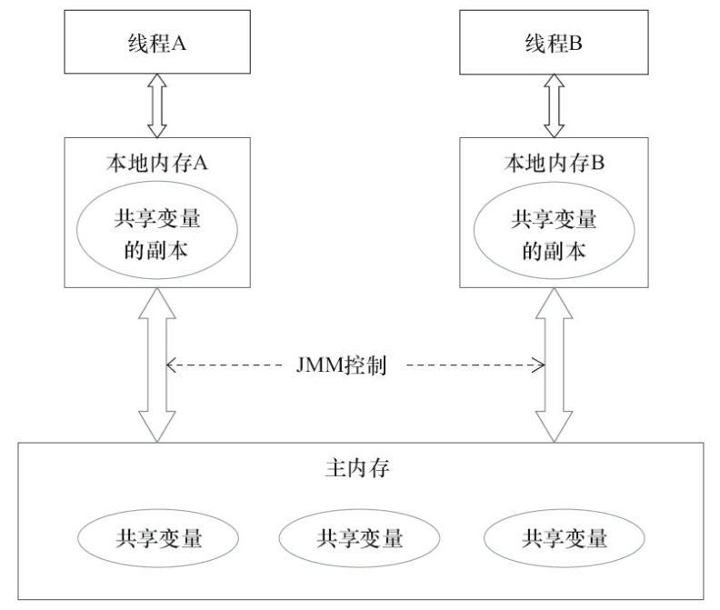
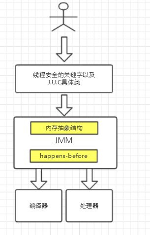
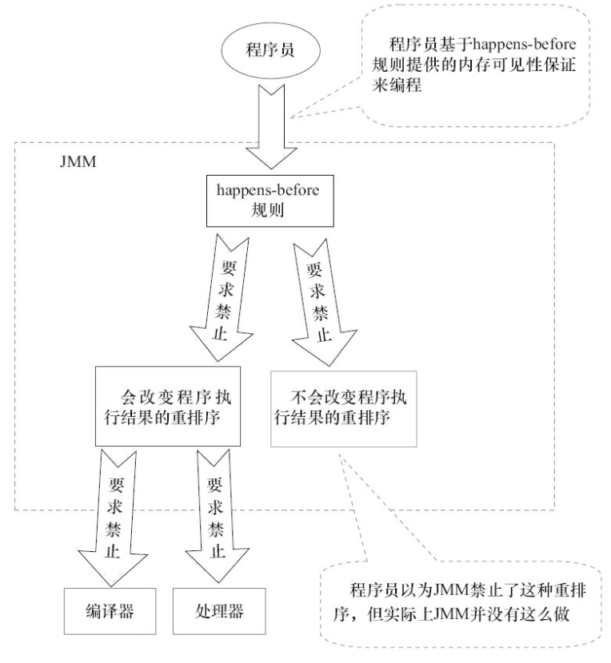
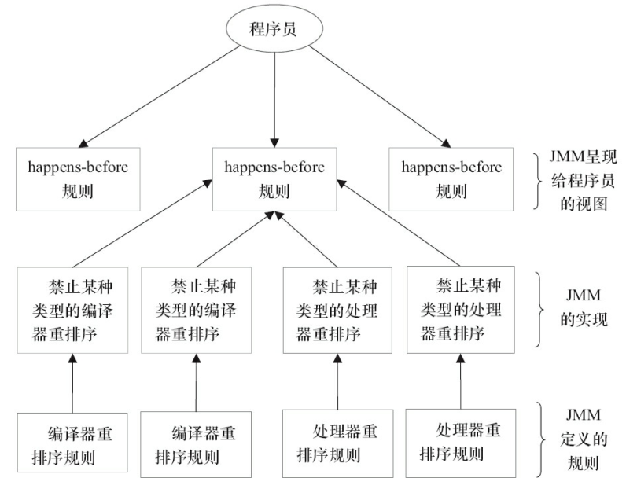

[TOC]
# 1. JMM简介
线程安全定义：当多个线程访问同一个对象时，如果不用考虑这些线程在运行时环境下的调度和交替运行，也不需要进行额外的同步，或者在调用方进行任何其他的协调操作，调用这个对象的行为都可以获取正确的结果，那这个对象是线程安全的。

出现线程安全的问题一般是因为主内存和工作内存数据不一致性和重排序导致的，而解决线程安全的问题最重要的就是理解这两种问题是怎么来的，那么，理解它们的核心在于理解java内存模型（JMM）。

在多线程条件下，多个线程肯定会相互协作完成一件事情，

一般来说就会涉及到**多个线程间相互通信告知彼此的状态以及当前的执行结果等**，

另外，为了性能优化，还会涉及到**编译器指令重排序和处理器指令重排序**。下面会一一来聊聊这些知识。

# 2. 内存模型抽象结构

在并发编程中主要需要解决两个问题：
1. 线程之间如何通信；通信是指线程之间以何种机制来交换信息，主要有两种：共享内存和消息传递。java内存模型是共享内存的并发模型，线程之间主要通过读-写共享变量来完成隐式通信。
2. 线程之间如何完成同步（这里的线程指的是并发执行的活动实体）。 

### 2.1 哪些是共享变量
1. java内存中栈内存是线程独占的，其中栈内存中保存局部变量的值，包括：
   
    * 保存基本数据类型的值
    
    * 保存引用变量，即堆区对象的引用（指针）
    
    * 保存加载方法时的帧。
    
2. java内存中堆内存是被所有线程共享的。用来存放动态产生的数据，比如new产生的对象，数组。注意创建出来的对象只包含属于各自的成员变量（即类的全局变量），并不包括成员方法。因为**同一个类的对象拥有各自的成员变量，存储在各自的堆中，但是他们共享该类的方法，并不是每创建一个对象就把成员方法复制一次。**

### 2.2 JMM抽象结构模型
每个CPU都会有缓存。因此，共享变量会先放在主存中，每个线程都有属于自己的工作内存，并且会把位于主存中的共享变量拷贝到自己的工作内存，之后的读写操作均使用位于工作内存的变量副本，并在某个时刻将工作内存的变量副本写回到主存中去。JMM就从抽象层次定义了这种方式，并且JMM决定了一个线程对共享变量的写入何时对其他线程是可见的。

如图为JMM抽象示意图，线程A和线程B之间要完成通信的话，要经历如下两步：

1. 线程A从主内存中将共享变量读入线程A的工作内存后并进行操作，之后将数据重新写回到主内存中；

2. 线程B从主存中读取最新的共享变量

从横向去看看，线程A和线程B就好像通过共享变量在进行隐式通信。这其中有很有意思的问题，如果线程A更新后数据并没有及时写回到主存，而此时线程B读到的是过期的数据，这就出现了“脏读”现象。可以通过同步机制（控制不同线程间操作发生的相对顺序）来解决或者通过volatile关键字使得每次volatile变量都能够强制刷新到主存，从而对每个线程都是可见的。

# 3. 重排序
在不改变程序执行结果的前提下，尽可能提高并行度。JMM对底层尽量减少约束，使其能够发挥自身优势。因此，在执行程序时，为了提高性能，编译器和处理器常常会对指令进行重排序。 

从源码到最终执行的指令序列的示意图

一般重排序可以分为如下三种：
 
 **编译器重排序：**
 
1. 编译器优化的重排序。编译器在不改变单线程程序语义的前提下，可以重新安排语句的执行顺序；

**处理器重排序：**

2. 指令级并行的重排序。现代处理器采用了指令级并行技术来将多条指令重叠执行。如果不存在数据依赖性，处理器可以改变语句对应机器指令的执行顺序；

3. 内存系统的重排序。由于处理器使用缓存和读/写缓冲区，这使得加载和存储操作看上去可能是在乱序执行的。

针对**编译器重排序**，JMM的编译器重排序规则会**禁止一些特定类型的编译器重排序**；

针对**处理器重排序**，编译器在生成指令序列的时候会通过**插入内存屏障指令来禁止某些特殊的处理器重排序。**

编译器和处理器在重排序时，会遵守数据依赖性，编译器和处理器不会改变存在数据依赖性关系的两个操作的执行顺序

> as-if-serial语义：不管怎么重排序（编译器和处理器为了提供并行度），（单线程）程序的执行结果不能被改变。编译器，runtime和处理器都必须遵守as-if-serial语义。as-if-serial语义把单线程程序保护了起来，**遵守as-if-serial语义的编译器，runtime和处理器共同为编写单线程程序的程序员创建了一个幻觉：单线程程序是按程序的顺序来执行的。** 在单线程中，会让人感觉代码是一行一行顺序执行上，实际上如果A，B两行代码不存在数据依赖性可能会进行重排序，即A，B不是顺序执行的。**as-if-serial语义使程序员不必担心单线程中重排序的问题干扰他们，也无需担心内存可见性问题。**

# 4. happens-before规则

### 4.1 happens-before定义
具体的定义为：

1. 如果一个操作happens-before另一个操作，那么第一个操作的执行结果将对第二个操作可见，而且第一个操作的执行顺序排在第二个操作之前。
  
    > 这是JMM对程序员的承诺。从程序员的角度来说，可以这样理解happens-before关系：如果A happens-before B，那么Java内存模型将向程序员保证——A操作的结果将对B可见，且A的执行顺序排在B之前。注意，这只是Java内存模型向程序员做出的保证！
 
2. 两个操作之间存在happens-before关系，并不意味着Java平台的具体实现必须要按照happens-before关系指定的顺序来执行。如果重排序之后的执行结果，与按happens-before关系来执行的结果一致，那么这种重排序并不非法（也就是说，JMM允许这种重排序）。
    > 这是JMM对编译器和处理器重排序的约束原则。正如前面所言，JMM其实是在遵循一个基本原则：只要不改变程序的执行结果（指的是单线程程序和正确同步的多线程程序），编译器和处理器怎么优化都行。JMM这么做的原因是：程序员对于这两个操作是否真的被重排序并不关心，程序员关心的是程序执行时的语义不能被改变（即执行结果不能被改变）。因此，happens-before关系本质上和as-if-serial语义是一回事。

#### 比较 as-if-serial VS happens-before
1. as-if-serial语义保证**单线程内程序**的执行结果不被改变，happens-before关系保证**正确同步的多线程程序**的执行结果不被改变。

2. as-if-serial语义给编写单线程程序的程序员创造了一个幻境：单线程程序是按程序的顺序来执行的。happens-before关系给编写正确同步的多线程程序的程序员创造了一个幻境：正确同步的多线程程序是按happens-before指定的顺序来执行的。

3. as-if-serial语义和happens-before这么做的目的，都是为了在不改变程序执行结果的前提下，尽可能地提高程序执行的并行度。

### 4.2 具体规则
具体的一共有八项规则：

1. 程序顺序规则：一个线程中的每个操作，happens-before于该线程中的任意后续操作。

2. 监视器锁规则：对一个锁的解锁，happens-before于随后对这个锁的加锁。

3. volatile变量规则：对一个volatile域的写，happens-before于任意后续对这个volatile域的读。

4. 传递性：如果A happens-before B，且B happens-before C，那么A happens-before C。

5. start()规则：如果线程A执行操作ThreadB.start()（启动线程B），那么A线程的ThreadB.start()操作happens-before于线程B中的任意操作。

6. join()规则：如果线程A执行操作ThreadB.join()并成功返回，那么线程B中的任意操作happens-before于线程A从ThreadB.join()操作成功返回。

7. 程序中断规则：对线程interrupted()方法的调用先行于被中断线程的代码检测到中断时间的发生。

8. 对象finalize规则：一个对象的初始化完成（构造函数执行结束）先行于发生它的finalize()方法的开始。

# 5. JMM的设计

JMM层级图：

JMM是语言级的内存模型，在我的理解中JMM处于中间层，包含了两个方面：
（1）内存模型；
（2）重排序以及happens-before规则。
同时，为了禁止特定类型的重排序会对编译器和处理器指令序列加以控制。而上层会有基于JMM的关键字和J.U.C包下的一些具体类用来方便程序员能够迅速高效率的进行并发编程。站在JMM设计者的角度，在设计JMM时需要考虑两个关键因素:

1. 程序员对内存模型的使用
程序员希望内存模型易于理解、易于编程。程序员希望基于一个强内存模型来编写代码。

2. 编译器和处理器对内存模型的实现
编译器和处理器希望内存模型对它们的束缚越少越好，这样它们就可以做尽可能多的优化来提高性能。编译器和处理器希望实现一个弱内存模型。

关于重排序问题，更简单的说，重排序可以分为两类：
1. 会改变程序执行结果的重排序。

2. 不会改变程序执行结果的重排序。

JMM对这两种不同性质的重排序，采取了不同的策略，如下：

1. 对于会改变程序执行结果的重排序，JMM要求编译器和处理器必须禁止这种重排序。

2. 对不会改变程序执行结果的重排序，JMM对编译器和处理器不做要求（JMM允许这种重排序）

JMM的设计图为

从图可以看出：
1. JMM向程序员提供的happens-before规则能满足程序员的需求。JMM的happens-before规则不但简单易懂，而且也向程序员提供了足够强的内存可见性保证（有些内存可见性保证其实并不一定真实存在，比如上面的A happens-before B）。

2. JMM对编译器和处理器的束缚已经尽可能少。从上面的分析可以看出，JMM其实是在遵循一个基本原则：**只要不改变程序的执行结果（指的是单线程程序和正确同步的多线程程序），编译器和处理器怎么优化都行**。
例如，如果编译器经过细致的分析后，认定一个锁只会被单个线程访问，那么这个锁可以被消除。
再如，如果编译器经过细致的分析后，认定一个volatile变量只会被单个线程访问，那么编译器可以把这个volatile变量当作一个普通变量来对待。

    这些优化既不会改变程序的执行结果，又能提高程序的执行效率。
    
# 6. happens-before与JMM的关系

一个happens-before规则对应于一个或多个编译器和处理器重排序规则。对于Java程序员来说，happens-before规则简单易懂，它避免Java程序员为了理解JMM提供的内存可见性保证而去学习复杂的重排序规则以及这些规则的具体实现方法。
