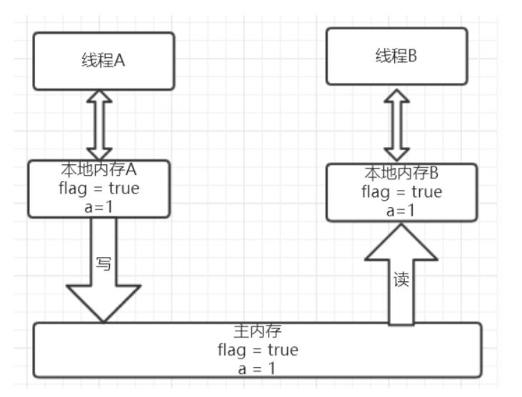

[TOC]
## 1. volatile简介
把变量声明为 volatile，这就指示 JVM，这个变量是不稳定的，每次使用它都到主存中进行读取。

被volatile修饰的变量能够保证每个线程能够获取该变量的最新值，从而避免出现数据脏读的现象。

```java
public class VolatileDemo {
	private static  boolean isOver = false;

	public static void main(String[] args) {
		Thread thread = new Thread(new Runnable() {
			@Override
			public void run() {
				while (!isOver) ;
			}
		});
		thread.start();
		try {
			Thread.sleep(500);
		} catch (InterruptedException e) {
			e.printStackTrace();
		}
		isOver = true;
	}
}
```
isOver变量没有加上volatile关键字时，运行以上代码会出现死循环，这是因为isOver变量虽然在主线程被修改但是没有被写到主存中，这也就导致该子线程在本地内存中的值一直为true，这样就导致了死循环的产生。

解决办法也很简单：isOver变量前加上volatile关键字即可。

但 假如你把while循环代码里加上**任意一个输出语句**或者**sleep方法**你会发现死循环也会停止，不管isRunning变量是否被加上了上volatile关键字。
 ```java
while (!isOver) {
    System.out.println("...............");
    //Thread.sleep(1000);
}
```
因为：**JVM会尽力保证内存的可见性，即便这个变量没有加同步关键字。** 换句话说，只要CPU有时间，JVM会尽力去保证变量值的更新。这种与volatile关键字的不同在于，**volatile关键字会强制的保证线程的可见性**。而不加这个关键字，JVM也会尽力去保证可见性，但是如果CPU一直有其他的事情在处理，它也没办法。最开始的代码，一直处于死循环中，CPU处于一直占用的状态，这个时候CPU没有时间，JVM也不能强制要求CPU分点时间去取最新的变量值。**而加了输出或者sleep语句之后，CPU就有可能有时间去保证内存的可见性，于是while循环可以被终止。**


## 2. volatile实现原理
为了提高处理速度，处理器不直接和内存进行通信，而是先将系统内存的数据读到内部缓存（L1，L2或其他）后再进行操作，但操作完不知道何时会写到内存。

如果对声明了volatile的变量进行写操作，JVM就会向处理器发送一条Lock前缀的指令，将这个变量所在缓存行的数据写回到系统内存。但是，就算写回到内存，如果其他处理器缓存的值还是旧的，再执行计算操作就会有问题。

所以，在多处理器下，为了保证各个处理器的缓存是一致的，就会实现**缓存一致性协议**，**每个处理器通过嗅探在总线上传播的数据来检查自己缓存的值是不是过期了**，当处理器发现自己缓存行对应的内存地址被修改，就会将当前处理器的缓存行设置成无效状态，当处理器对这个数据进行修改操作的时候，会重新从系统内存中把数据读到处理器缓存里。

因此，经过分析我们可以得出如下结论：
* Lock前缀的指令会引起处理器缓存写回内存；
* 一个处理器的缓存回写到内存会导致其他处理器的缓存失效；
* 当处理器发现本地缓存失效后，就会从内存中重读该变量数据，即可以获取当前最新值。

这样针对volatile变量通过这样的机制就使得每个线程都能获得该变量的最新值。

## 3. volatile的happens-before关系
在六条happens-before规则中有一条是：**volatile变量规则：对一个volatile域的写，happens-before于任意后续对这个volatile域的读。**下面我们结合具体的代码，我们利用这条规则推导下：

```java
public class VolatileExample {
	private int a = 0;
	private volatile boolean flag = false;
	public void writer(){
		a = 1; //1
		flag = true; //2
	}
	public void reader(){
		if(flag){ //3
			int i = a; //4
		}
	}
}
```
上面的实例代码对应的happens-before关系如下图所示:


加锁线程A先执行writer方法，然后线程B执行reader方法。

图中每一个箭头两个节点就代表一个happens-before关系，

黑色的代表根据程序顺序规则推导出来，红色的是根据volatile变量的写happens-before 于任意后续对volatile变量的读，而蓝色的就是根据传递性规则推导出来的。

这里的2 happen-before 3，同样根据happens-before规则定义：如果A happens-before B,则A的执行结果对B可见，并且A的执行顺序先于B的执行顺序，

我们可以知道操作2执行结果对操作3来说是可见的，也就是说当线程A将volatile变量 flag更改为true后线程B就能够迅速感知。

## 4. volatile的内存语义
假设线程A先执行writer方法，线程B随后执行reader方法，初始时线程的本地内存中flag和a都是初始状态，下图是线程A执行volatile写后的状态图。


当volatile变量写后，线程中本地内存中共享变量就会置为失效的状态，因此线程B再需要读取从主内存中去读取该变量的最新值。下图就展示了线程B读取同一个volatile变量的内存变化示意图


从横向来看，线程A和线程B之间进行了一次通信，线程A在写volatile变量时，实际上就像是给B发送了一个消息告诉线程B你现在的值都是旧的了，然后线程B读这个volatile变量时就像是接收了线程A刚刚发送的消息。既然是旧的了，那线程B该怎么办了？自然而然就只能去主内存去取啦。

### 4.1 volatile的内存语义实现

**内存屏障（memory barrier）是一个CPU指令。分为两种：Load Barrier 和 Store Barrier即读屏障和写屏障。有两个作用：**
1. 阻止屏障两侧的指令重排序；编译器和CPU可以在保证输出结果一样的情况下对指令重排序，使性能得到优化。插入一个内存屏障，相当于告诉CPU和编译器先于这个命令的必须先执行，后于这个命令的必须后执行。
2. 强制把写缓冲区/高速缓存中的脏数据等写回主内存，让缓存中相应的数据失效。
    * 对于Load Barrier来说，在指令前插入Load Barrier，可以让高速缓存中的数据失效，强制从新从主内存加载数据；
    * 对于Store Barrier来说，在指令后插入Store Barrier，能让写入缓存中的最新数据更新写入主内存，让其他线程可见。

**内存屏障（memory barrier）和volatile什么关系？**

上面的虚拟机指令里面有提到，如果你的字段是volatile，Java内存模型将在**写操作后插入一个写屏障指令，在读操作前插入一个读屏障指令**。这意味着如果你对一个volatile字段进行写操作，你必须知道：
1. 一旦你完成写入，任何访问这个字段的线程将会得到最新的值。
2. 在你写入前，会保证所有之前发生的事已经发生，并且任何更新过的数据值也是可见的，因为内存屏障会把之前的写入值都刷新到缓存。

java的内存屏障通常所谓的四种即LoadLoad,StoreStore,LoadStore,StoreLoad实际上也是上述两种的组合，完成一系列的屏障和数据同步功能。

* LoadLoad屏障：对于这样的语句Load1; LoadLoad; Load2，在Load2及后续读取操作要读取的数据被访问前，保证Load1要读取的数据被读取完毕。
* StoreStore屏障：对于这样的语句Store1; StoreStore; Store2，在Store2及后续写入操作执行前，保证Store1的写入操作对其它处理器可见。
* LoadStore屏障：对于这样的语句Load1; LoadStore; Store2，在Store2及后续写入操作被刷出前，保证Load1要读取的数据被读取完毕。
* StoreLoad屏障：对于这样的语句Store1; StoreLoad; Load2，在Load2及后续所有读取操作执行前，保证Store1的写入对所有处理器可见。它的开销是四种屏障中最大的。在大多数处理器的实现中，这个屏障是个万能屏障，兼具其它三种内存屏障的功能


volatile的内存屏障策略非常严格保守，非常悲观且毫无安全感的心态：
* 在每个volatile写操作前插入StoreStore屏障，在写操作后插入StoreLoad屏障；
* 在每个volatile读操作前插入LoadLoad屏障，在读操作后插入LoadStore屏障；

#### volatile 性能：
volatile 的读性能消耗与普通变量几乎相同，但是写操作稍慢，因为它需要在本地代码中插入许多内存屏障指令来保证处理器不发生乱序执行。

## 5. volatile关键字能保证原子性吗？

#### volatile没有原子性举例：AtomicInteger自增
例如你让一个volatile的integer自增（i++），其实要分成3步：
1. 读取volatile变量值到local； 
2. 增加变量的值；
3. 把local的值写回，让其它的线程可见。

这3步的jvm指令为：
```
mov    0xc(%r10),%r8d ; Load
inc    %r8d           ; Increment
mov    %r8d,0xc(%r10) ; Store
lock addl $0x0,(%rsp) ; StoreLoad Barrier
```
注意最后一步是内存屏障。

#### volatile为什么没有原子性?
回到前面的JVM指令：从Load到store到内存屏障，一共4步，其中最后一步jvm让这个最新的变量的值在所有线程可见，也就是最后一步让所有的CPU内核都获得了最新的值，但**中间的几步（从Load到Store）是不安全的**，中间如果其他的CPU修改了值将会丢失。下面的测试代码可以实际测试voaltile的自增没有原子性：

```java
private static volatile long _longVal = 0;
     
    private static class LoopVolatile implements Runnable {
        public void run() {
            long val = 0;
            while (val < 10000000L) {
                _longVal++;
                val++;
            }
        }
    }
     
    private static class LoopVolatile2 implements Runnable {
        public void run() {
            long val = 0;
            while (val < 10000000L) {
                _longVal++;
                val++;
            }
        }
    }
     
    private  void testVolatile(){
        Thread t1 = new Thread(new LoopVolatile());
        t1.start();
         
        Thread t2 = new Thread(new LoopVolatile2());
        t2.start();
         
        while (t1.isAlive() || t2.isAlive()) {
        }
 
        System.out.println("final val is: " + _longVal);
    }
 
Output:-------------
     
final val is: 11223828
final val is: 17567127
final val is: 12912109
```