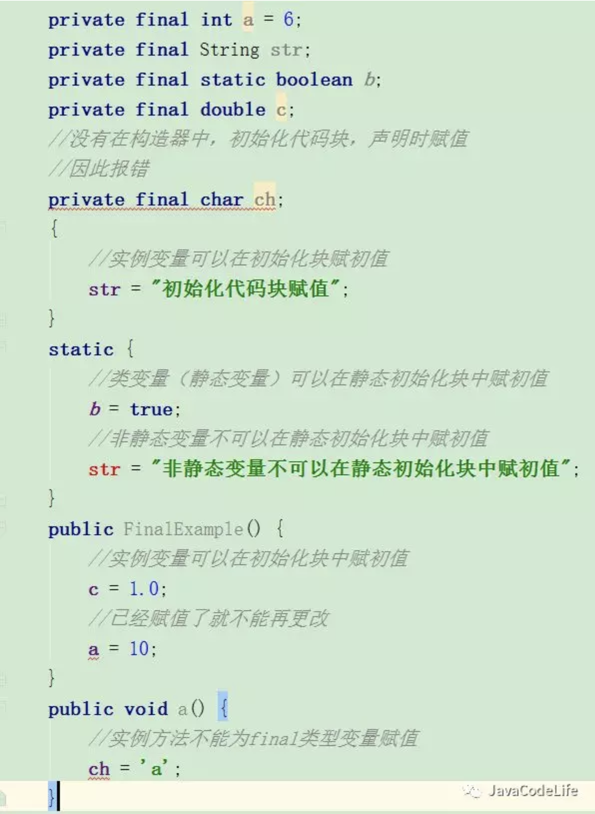
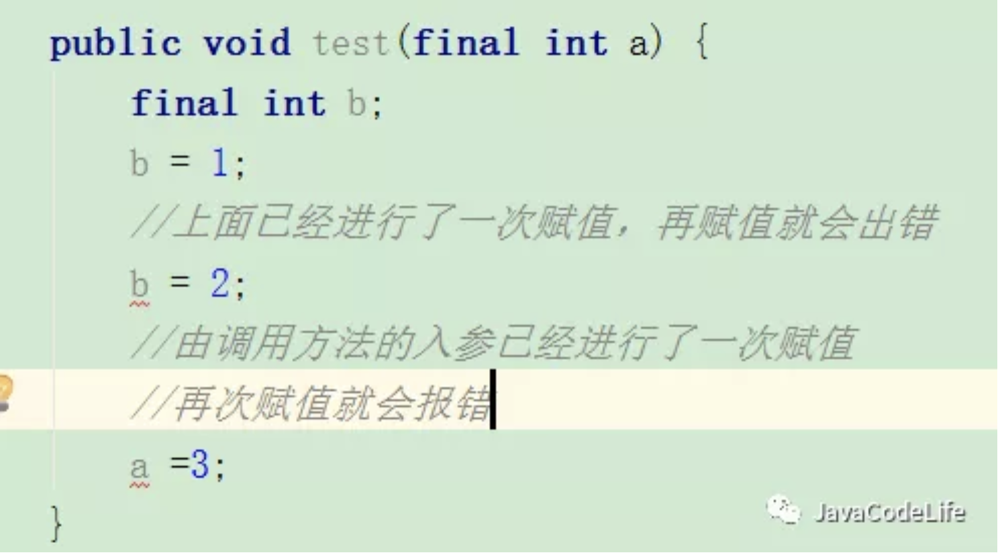
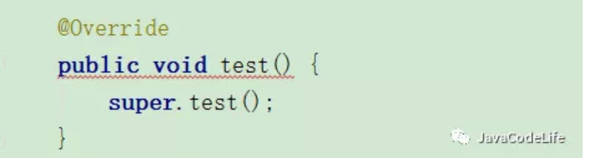
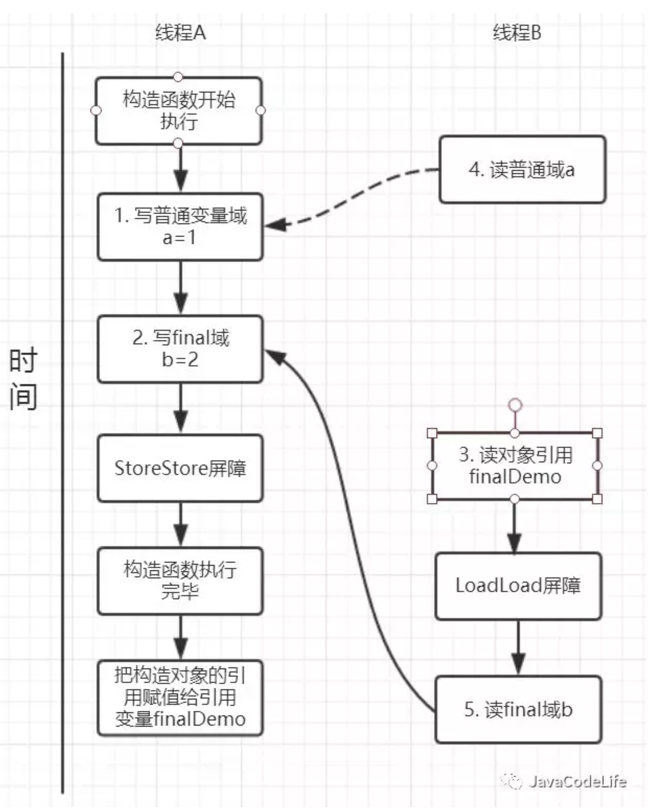
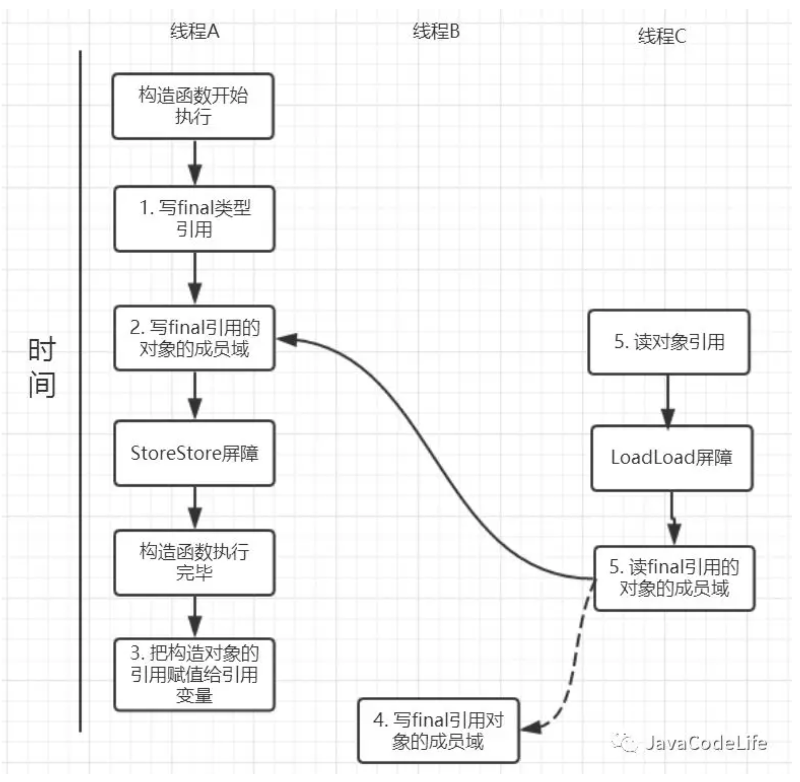
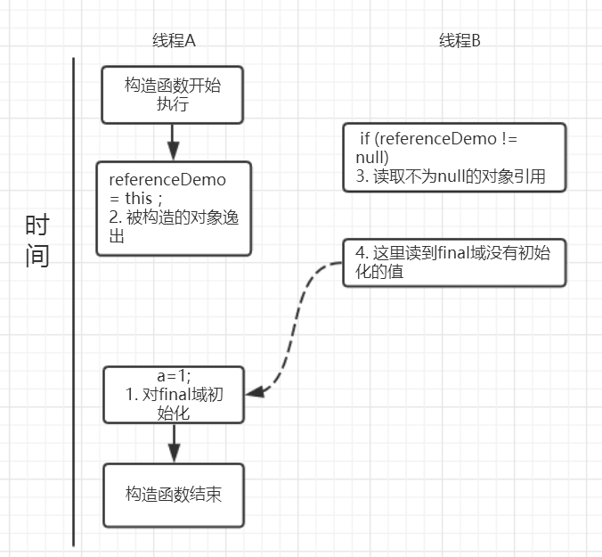

[TOC]
# 1. final的简介
final可以修饰**变量，方法和类**，用于表示所修饰的内容一旦赋值之后就不会再被改变，比如String类就是一个final类型的类。

# 2. final的具体使用场景

## 2.1 final修饰变量

在java中变量，可以分为**成员变量**以及**方法局部变量**。

当final变量是基本数据类型以及String类型时，如果在编译期间能知道它的确切值，则编译器会把它当做编译期常量使用。

不过要注意，只有在编译期间能确切知道final变量值的情况下，编译器才会进行这样的优化，比如下面的这段代码就不会进行优化：

```java
public class Test {
    public static void main(String[] args)  {
        String a = "hello2"; 
        final String b = getHello();
        String c = b + 2; 
        System.out.println((a == c));
 
    }
     
    public static String getHello() {
        return "hello”;
        //在编译成.class时能够识别为同一字符串的,自动优化成常量,所以也引用自同一String对象
        //在运行时创建的字符串具有独立的内存地址,所以不引用自同一String对象
    }
}
```

### 2.1.1 final成员变量

通常每个类中的成员变量可以分为**类变量（static修饰的变量）**以及**实例变量**。针对这两种类型的变量赋初值的时机是不同的，

1. 类变量两个时机赋初值，可以在声明变量的时候直接赋初值或者在静态代码块中给类变量赋初值。

2. 实例变量有三个时机赋初值，可以在声明变量的时候给实例变量赋初值，在非静态初始化块中以及构造器中赋初值。

当final变量未初始化时系统不会进行隐式初始化，会出现报错。这样说起来还是比较抽象，下面用具体的代码来演示。



看上面的图片已经将每种情况整理出来了，这里用截图的方式也是觉得在IDE出现红色出错的标记更能清晰的说明情况。现在我们来将这几种情况归纳整理一下：

1. 类变量：必须要在**静态初始化块**中指定初始值或者**声明该类变量**时指定初始值，而且只能在这两个地方之一进行指定；

2. 实例变量：必须要在**非静态初始化块**，**声明该实例变量**或者**在构造器中**指定初始值，而且只能在这三个地方进行指定。

### 2.2.2 final局部变量
final局部变量由程序员进行显式初始化，

如果final局部变量已经进行了初始化则后面就不能再次进行更改，

如果final变量未进行初始化，可以进行赋值，当且仅有一次赋值，一旦赋值之后再次赋值就会出错。下面用具体的代码演示final局部变量的情况：



### 2.2.3 final基本数据类型  VS final引用数据类型

```java
public class FinalExample {
        //在声明final实例成员变量时进行赋值
        private final static Person person = new Person(24, 170);
        public static void main(String[] args) {
            //对final引用数据类型person进行更改
            person.age = 22;
            System.out.println(person.toString());
        }
        static class Person {
            private int age;
            private int height;

            public Person(int age, int height) {
                this.age = age;
                this.height = height;
            }
            @Override
            public String toString() {
                return "Person{" +
                        "age=" + age +
                        ", height=" + height +
                        '}';
            }
        }
    }
```
当我们对final修饰的引用数据类型变量person的属性改成22，是可以成功操作的。通过这个实验我们就可以看出来:

1. 当final修饰基本数据类型变量时，不能对基本数据类型变量重新赋值，因此基本数据类型变量不能被改变。

2. 而对于引用类型变量而言，它仅仅保存的是一个引用，final只保证这个引用类型变量所引用的地址不会发生改变，即一直引用这个对象，但这个对象属性是可以改变的。

### 2.2.4 宏变量

利用final变量的不可更改性，在满足以下三个条件时，该变量就会成为一个“宏变量”，即是一个常量。

1. 使用final修饰符修饰；

2. 在定义该final变量时就指定了初始值；

3. 该初始值在编译时就能够唯一指定。

注意：当程序中其他地方使用该宏变量的地方，编译器会直接替换成该变量的值


## 2.2 final修饰方法
注：类的private方法会隐式地被指定为final方法

### 2.2.1 被final修饰的方法不能够被子类所重写
当父类的方法被final修饰的时候，子类不能重写父类的该方法，

比如在Object中，getClass()方法就是final的，我们就不能重写该方法，但是hashCode()方法就不是被final所修饰的，我们就可以重写hashCode()方法。

我们还是来写一个例子来加深一下理解： 先定义一个父类，里面有final修饰的方法test();

```java
public class FinalExampleParent {
        public final void test() {
        }
    }
```
然后FinalExample继承该父类，当重写test()方法时出现报错，如下图：



### 2.2.2  final方法是可以被重载的

```java
 public class FinalExampleParent {
        public final void test() {
        }

        public final void test(String str) {
        }
    }
```

可以看出被final修饰的方法是可以重载的。

## 2.3 类
**当一个类被final修饰时，表名该类是不能被子类继承的**。

子类继承往往可以重写父类的方法和改变父类属性，会带来一定的安全隐患，

因此，当一个类不希望被继承时就可以使用final修饰。还是来写一个小例子：

```java
public final class FinalExampleParent {
        public final void test() {
        }
    }
```
父类会被final修饰，当子类继承该父类的时候，就会报错，如下图：


# 3. final的例子

final经常会被用作不变类上，利用final的不可更改性。

不变类的意思是创建该类的实例后，该实例的实例变量是不可改变的。满足以下条件则可以成为不可变类：

1. 使用private和final修饰符来修饰该类的成员变量

2. 提供带参的构造器用于初始化类的成员变量；

3. 仅为该类的成员变量提供getter方法，不提供setter方法，因为普通方法无法修改fina修饰的成员变量；

4. 如果有必要就重写Object类 的hashCode()和equals()方法，应该保证用equals()判断相同的两个对象其Hashcode值也是相等的。

JDK中提供的八个包装类和String类都是不可变类，我们来看看String的实现。
```java
 /** The value is used for character storage. */
     private final char value[];
```
可以看出String的value就是final修饰的，上述其他几条性质也是吻合的。

# 4. 多线程中你真的了解final吗？

## 4.1 final域重排序规则
### 4.1.1 final域为基本类型
先看一段示例性的代码：
```java
public class FinalDemo {
        private int a;  //普通域
        private final int b; //final域
        private static FinalDemo finalDemo;

        public FinalDemo() {
            a = 1; // 1. 写普通域
            b = 2; // 2. 写final域
        }

        public static void writer() {
            finalDemo = new FinalDemo();
        }

        public static void reader() {
            FinalDemo demo = finalDemo; // 3.读对象引用
            int a = demo.a;    //4.读普通域
            int b = demo.b;    //5.读final域
        }
    }
```

假设线程A在执行writer()方法，线程B执行reader()方法。

**写final域重排序规则**

写final域的重排序规则禁止对final域的写重排序到构造函数之外，这个规则的实现主要包含了两个方面：

1. JMM禁止编译器把final域的写重排序到构造函数之外；

2. 编译器会在final域写之后，构造函数return之前，插入一个storestore屏障（关于内存屏障可以看这篇文章）。这个屏障可以禁止处理器把final域的写重排序到构造函数之外。

我们再来分析writer方法，虽然只有一行代码，但实际上做了两件事情：

1. 构造了一个FinalDemo对象；

2. 把这个对象赋值给成员变量finalDemo。

我们来画下存在的一种可能执行时序图，如下：


* 由于a,b之间没有数据依赖性，普通域（普通变量）a可能会被重排序到构造函数之外，线程B就有可能读到的是普通变量a初始化之前的值（零值），这样就可能出现错误。

* 而final域变量b，根据重排序规则，会禁止final修饰的变量b重排序到构造函数之外，从而b能够正确赋值，线程B就能够读到final变量初始化后的值。

因此，写final域的重排序规则可以确保：**在对象引用为任意线程可见之前，对象的final域已经被正确初始化过了，而普通域就不具有这个保障。**比如在上例，线程B有可能就是一个未正确初始化的对象finalDemo。

**读final域重排序规则**

读final域重排序规则为：**在一个线程中，初次读对象引用和初次读该对象包含的final域，JMM会禁止这两个操作的重排序。**（注意，这个规则仅仅是针对处理器），

处理器会在读final域操作的前面插入一个LoadLoad屏障。

实际上，读对象的引用和读该对象的final域存在间接依赖性，一般处理器不会重排序这两个操作。但是有一些处理器会重排序，因此，这条禁止重排序规则就是针对这些处理器而设定的。

read()方法主要包含了三个操作：

1. 初次读引用变量finalDemo;

2. 初次读引用变量finalDemo的普通域a;

3. 初次读引用变量finalDemo的final与b;

假设线程A写过程没有重排序，那么线程A和线程B有一种的可能执行时序为下图：



读对象的普通域被重排序到了读对象引用的前面,

就会出现线程B还未读到对象引用,

就在读取该对象的普通域变量，这显然是错误的操作。

而final域的读操作就“限定”了在读final域变量前已经读到了该对象的引用，从而就可以避免这种情况。

读final域的重排序规则可以确保：**在读一个对象的final域之前，一定会先读这个包含这个final域的对象的引用。**

### 4.1.2 final域为引用类型

**final修饰的对象的成员域写操作**

针对引用数据类型，final域写针对编译器和处理器重排序**增加了这样的约束**：

在构造函数内对一个final修饰的对象的成员域的写入，

与随后在构造函数之外把这个被构造的对象的引用赋给一个引用变量，

这两个操作是不能被重排序的。

注意这里的是“增加”也就说前面对final基本数据类型的重排序规则在这里还是使用。这句话是比较拗口的，下面结合实例来看。

```java
 public class FinalReferenceDemo {
        final int[] arrays;
        private FinalReferenceDemo finalReferenceDemo;

        public FinalReferenceDemo() {
            arrays = new int[1];  //1
            arrays[0] = 1;        //2
        }

        public void writerOne() {
            finalReferenceDemo = new FinalReferenceDemo(); //3
        }

        public void writerTwo() {
            arrays[0] = 2;  //4
        }

        public void reader() {
            if (finalReferenceDemo != null) {  //5
                int temp = finalReferenceDemo.arrays[0];  //6
            }
        }
    }
```

针对上面的实例程序，

线程线程A执行wirterOne方法，

执行完后线程B执行writerTwo方法，

然后线程C执行reader方法。下图就以这种执行时序出现的一种情况来讨论



由于对final域的写禁止重排序到构造方法外，因此1和3不能被重排序。

由于一个final域的引用对象的成员域写入不能与随后将这个被构造出来的对象赋给引用变量重排序，因此2和3不能重排序。

**final修饰的对象的成员域读操作**

JMM可以确保线程C至少能看到写线程A对final引用的对象的成员域的写入，即能看下arrays[0] = 1，

而写线程B对数组元素的写入可能看到可能看不到。

JMM不保证线程B的写入对线程C可见，线程B和线程C之间存在数据竞争，此时的结果是不可预知的。

如果可见的，可使用锁或者volatile。


#### **关于final重排序的总结**

按照final修饰的数据类型分类：

* 基本数据类型:

    1. final域写：禁止final域写与构造方法重排序，即禁止final域写重排序到构造方法之外，从而保证该对象对所有线程可见时，该对象的final域全部已经初始化过。

    2. final域读：禁止初次读对象的引用与读该对象包含的final域的重排序。

* 引用数据类型：

    额外增加约束：禁止在构造函数对**一个final修饰的对象的成员域的写入**与**随后将这个被构造的对象的引用赋值给引用变量** 重排序
    
# 5.final的实现原理

上面我们提到过，

写final域会要求编译器在final域写之后，构造函数返回前插入一个StoreStore屏障。

读final域的重排序规则会要求编译器在读final域的操作前插入一个LoadLoad屏障。


很有意思的是，如果以X86处理为例，X86不会对写-写重排序，所以StoreStore屏障可以省略。

由于不会对有间接依赖性的操作重排序，所以在X86处理器中，读final域需要的LoadLoad屏障也会被省略掉。

也就是说，以X86为例的话，对final域的读/写的内存屏障都会被省略！具体是否插入还是得看是什么处理器


# 6. 为什么final引用不能从构造函数中“逸出”

上面对final域写重排序规则可以确保我们在使用一个对象引用的时候该对象的final域已经在构造函数被初始化过了。但是这里其实是有一个前提条件的，也就是：

**在构造函数，不能让这个被构造的对象被其他线程可见，也就是说该对象引用不能在构造函数中“逸出”。** 以下面的例子来说：

```java
public class FinalReferenceEscapeDemo {
    private final int a;
    private FinalReferenceEscapeDemo referenceDemo;

    public FinalReferenceEscapeDemo() {
        a = 1;  //1
        referenceDemo = this; //2  this引用溢出
    }

    public void writer() {
        new FinalReferenceEscapeDemo();
    }

    public void reader() {
        if (referenceDemo != null) {  //3
            int temp = referenceDemo.a; //4
        }
    }
}

```

可能的执行时序如图所示：



假设一个线程A执行writer方法另一个线程执行reader方法。

因为构造函数中操作1和2之间没有数据依赖性，1和2可以重排序，先执行了2，这个时候引用对象referenceDemo是个没有完全初始化的对象，

而当线程B去读取该对象时就会出错。

尽管依然满足了final域写重排序规则：在引用对象对所有线程可见时，其final域已经完全初始化成功。

但是，引用对象“this”“逸出”，该代码依然存在线程安全的问题。