[TOC]
## 1. ThreadLocal的简介
1. 在多线程编程中通常解决线程安全的问题我们会利用synchronzed或者lock控制线程对临界区资源的同步顺序从而解决线程安全的问题，但是这种加锁的方式会让未获取到锁的线程进行阻塞等待，很显然这种方式的时间效率并不是很好。

2. **线程安全问题的核心在于多个线程会对同一个临界区共享资源进行操作**，那么，如果每个线程都使用自己的“共享资源”，各自使用各自的，又互相不影响到彼此即让多个线程间达到隔离的状态，这样就不会出现线程安全的问题。

3. 事实上，这就是一种“空间换时间”的方案，每个线程都会都拥有自己的“共享资源”无疑内存会大很多，但是由于不需要同步也就减少了线程可能存在的阻塞等待的情况从而提高的时间效率。

4. 虽然ThreadLocal并不在java.util.concurrent包中而在java.lang包中，但我更倾向于把它当作是一种 **并发容器（虽然真正存放数据的是ThreadLoclMap）** 进行归类。从ThreadLocal这个类名可以顾名思义的进行理解，**表示线程的“本地变量”，即每个线程都拥有该变量副本，达到人手一份的效果，各用各的这样就可以避免共享资源的竞争。**

5. **ThreadLocal 不是用来解决共享对象的多线程访问问题的**，数据实质上是放在每个thread实例引用的threadLocalMap,也就是说**每个不同的线程都拥有专属于自己的数据容器（threadLocalMap），彼此不影响。** 因此**threadLocal只适用于 共享对象会造成线程安全 的业务场景**。比如hibernate中通过threadLocal管理Session就是一个典型的案例，不同的请求线程（用户）拥有自己的session,若将session共享出去被多线程访问，必然会带来线程安全问题。

6. 线程类（Thread）有一个成员变量，类似于Map类型的，专门用于存储ThreadLocal类型的数据。从逻辑从属关系来讲，这些ThreadLocal数据是属于Thread类的成员变量级别的。从所在“位置”的角度来讲，这些ThreadLocal数据是分配在公共区域的堆内存中的。

7. **ThreadLocal对象建议使用static修饰**，这个变量是针对一个线程内所有操作共享的，所以设置为静态变量，所有此类实例共享此静态变量，也就是说在类第一次被使用时装载，只分配一块存储空间，所有此类的对象（只要是这个线程内定义的）都可以 操控这个变量。


## 2. ThreadLocal的使用

### 使用一
SimpleDateFormat.parse方法会有线程安全的问题，我们可以尝试使用threadLocal包装SimpleDateFormat，将该实例不被多线程共享即可。
```java
public class ThreadLocalDemo {
    private static ThreadLocal<SimpleDateFormat> sdf = new ThreadLocal<>();

    public static void main(String[] args) {
        ExecutorService executorService = Executors.newFixedThreadPool(10);
        for (int i = 0; i < 100; i++) {
            executorService.submit(new DateUtil("2019-11-25 09:00:" + i % 60));
        }
    }

    static class DateUtil implements Runnable {
        private String date;

        public DateUtil(String date) {
            this.date = date;
        }

        @Override
        public void run() {
            if (sdf.get() == null) {
                sdf.set(new SimpleDateFormat("yyyy-MM-dd HH:mm:ss"));
            } else {
                try {
                    Date date = sdf.get().parse(this.date);
                    System.out.println(date);
                } catch (ParseException e) {
                    e.printStackTrace();
                }
            }
        }
    }
}
```

1. 如果当前线程不持有SimpleDateformat对象实例，那么就新建一个并把它设置到当前线程中，如果已经持有，就直接使用。另外，从` if (sdf.get() == null){….}else{…..}`可以看出为每一个线程分配一个SimpleDateformat对象实例是从应用层面（业务代码逻辑）去保证的。

2. 在上面我们说过threadLocal有可能存在内存泄漏，在使用完之后，最好使用remove方法将这个变量移除，就像在使用数据库连接一样，及时关闭连接。

### 使用二
一个序列号生成器的程序，可能同时会有多个线程并发访问它，要保证每个线程得到的序列号都是自增的，而不能相互干扰。

先定义一个接口：
```java
public interface Sequence {
 
    int getNumber();
}
```
每次调用 getNumber() 方法可获取一个序列号，下次再调用时，序列号会自增。

再做一个线程类：在线程中连续输出三次线程名与其对应的序列号。
```java
public class ClientThread extends Thread {
 
    private Sequence sequence;
 
    public ClientThread(Sequence sequence) {
        this.sequence = sequence;
    }
 
    @Override
    public void run() {
        for (int i = 0; i < 3; i++) {
            System.out.println(Thread.currentThread().getName() + " => " + sequence.getNumber());
        }
    }
}


```
ThreadLocal的使用
```java
public class SequenceB implements Sequence {
 
    private static ThreadLocal<Integer> numberContainer = new ThreadLocal<Integer>() {
        @Override
        protected Integer initialValue() {
            return 0;
        }
    };
 
    public int getNumber() {
        numberContainer.set(numberContainer.get() + 1);
        return numberContainer.get();
    }
 
    public static void main(String[] args) {
        Sequence sequence = new SequenceB();
 
        ClientThread thread1 = new ClientThread(sequence);
        ClientThread thread2 = new ClientThread(sequence);
        ClientThread thread3 = new ClientThread(sequence);
 
        thread1.start();
        thread2.start();
        thread3.start();
    }
}
```

通过 ThreadLocal 封装了一个 Integer 类型的 numberContainer 静态成员变量，并且初始值是0。

再看 getNumber() 方法，首先从 numberContainer 中 get 出当前的值，加1，随后 set 到 numberContainer 中，

最后将 numberContainer 中 get 出当前的值并返回。

搞清楚 ThreadLocal 的原理之后，有必要总结一下 ThreadLocal 的 API，其实很简单。

1. public void set(T value)：将值放入线程局部变量中

2. public T get()：从线程局部变量中获取值

3. public void remove()：从线程局部变量中移除值（有助于 JVM 垃圾回收）

4. protected T initialValue()：返回线程局部变量中的初始值（默认为 null）

为什么 initialValue() 方法是 protected 的呢？就是为了提醒程序员们，这个方法是要你们来实现的，请给这个线程局部变量一个初始值吧，因为protected对于子女、朋友来说，就是public的，可以自由使用，没有任何限制，而对于其他的外部class，protected就变成private。

注意：**当您在一个类中使用了 static 成员变量的时候，一定要多问问自己，这个 static 成员变量需要考虑“线程安全”吗？（也就是说，多个线程需要独享自己的 static 成员变量吗？）如果需要考虑，那就请用 ThreadLocal 吧！**

## 3. ThreadLocal的实现原理
要想学习到ThreadLocal的实现原理，就必须了解它的几个核心方法，包括怎样存怎样取等等，下面我们一个个来看。

### 3.1 void set(T value)

set方法设置在当前线程中threadLocal变量的值，该方法的源码为：
```java
public void set(T value) {
    //1. 获取当前线程实例对象
    Thread t = Thread.currentThread();
    //2. 通过当前线程实例获取到ThreadLocalMap对象
    ThreadLocalMap map = getMap(t);
    if (map != null)
        //3. 如果Map不为null,则以当前threadLocl实例为key,值为value进行存入
        map.set(this, value);
    else
        //4.map为null,则新建ThreadLocalMap并存入value
        createMap(t, value);
}
```
通过源码我们知道value是存放在了ThreadLocalMap里了，当前先把它理解为一个普普通通的map即可，

也就是说，数据value是真正的存放在了ThreadLocalMap这个容器中了，并且是以当前threadLocal实例为key。

**首先ThreadLocalMap是怎样来的？** 源码很清楚，是通过getMap(t)进行获取：
```java
ThreadLocalMap getMap(Thread t) {
    return t.threadLocals;
}
```
该方法直接返回的就是当前线程对象t的一个成员变量threadLocals：

```java
/* ThreadLocal values pertaining to this thread. This map is maintained
 * by the ThreadLocal class. */
ThreadLocal.ThreadLocalMap threadLocals = null;
```
就是说ThreadLocalMap的引用是作为Thread的一个成员变量，被Thread进行维护的。回过头再来看看set方法，当map为Null的时候会通过createMap(t，value)方法：
```java
void createMap(Thread t, T firstValue) {
    t.threadLocals = new ThreadLocalMap(this, firstValue);
}
```
该方法就是**new一个ThreadLocalMap实例对象，然后同样以当前threadLocal实例作为key,值为value存放到threadLocalMap中，然后将当前线程对象的threadLocals赋值为threadLocalMap。**

现在来对set方法进行总结一下：

* **通过当前线程对象thread获取该thread所维护的threadLocalMap,**

* **若threadLocalMap不为null,则以threadLocal实例为key,值为value的键值对存入threadLocalMap,**

* **若threadLocalMap为null的话，就新建threadLocalMap然后在以threadLocal为键，值为value的键值对存入即可。**

### 3.2 T get()
get方法是获取当前线程中threadLocal变量的值，同样的还是来看看源码：
```java
public T get() {
    //1. 获取当前线程的实例对象
    Thread t = Thread.currentThread();
    //2. 获取当前线程的threadLocalMap
    ThreadLocalMap map = getMap(t);
    if (map != null) {
        //3. 获取map中当前threadLocal实例为key的值的entry
        ThreadLocalMap.Entry e = map.getEntry(this);
        if (e != null) {
            @SuppressWarnings("unchecked")
            //4. 当前entitiy不为null的话，就返回相应的值value
            T result = (T)e.value;
            return result;
        }
    }
    //5. 若map为null或者entry为null的话通过该方法初始化，并返回该方法返回的value
    return setInitialValue();
}
```
另外，看下setInitialValue主要做了些什么事情？
```java
private T setInitialValue() {
    T value = initialValue();
    Thread t = Thread.currentThread();
    ThreadLocalMap map = getMap(t);
    if (map != null)
        map.set(this, value);
    else
        createMap(t, value);
    return value;
}
```
这段方法的逻辑和set方法几乎一致，另外值得关注的是initialValue方法:
```java
protected T initialValue() {
    return null;
}
```
**这个方法是protected修饰的也就是说继承ThreadLocal的子类可重写该方法，实现赋值为其他的初始值。** 关于get方法来总结一下：

1. 通过当前线程thread实例获取到它所维护的threadLocalMap，

2. 然后以当前threadLocal实例为key获取该map中的键值对（Entry），

3. 若Entry不为null则返回Entry的value。

4. 如果获取threadLocalMap为null或者Entry为null的话，就以当前threadLocal为Key，value为null存入map后，并返回null。

### 3.3 void remove()
```java
public void remove() {
    //1. 获取当前线程的threadLocalMap
    ThreadLocalMap m = getMap(Thread.currentThread());
    if (m != null)
        //2. 从map中删除以当前threadLocal实例为key的键值对
        m.remove(this);
}
```
1. 删除数据当然是从map中删除数据，

2. 先获取与当前线程相关联的threadLocalMap

3. 然后从map中删除该threadLocal实例为key的键值对即可。

## 4. ThreadLocalMap详解

从上面的分析我们已经知道，数据其实都放在了threadLocalMap中，threadLocal的get，set和remove方法实际上具体是通过threadLocalMap的getEntry,set和remove方法实现的。

如果想真正全方位的弄懂threadLocal，势必得在对threadLocalMap做一番理解。

### 4.1 Entry数据结构
ThreadLocalMap是threadLocal一个静态内部类，和大多数容器一样内部维护了一个数组，

同样的threadLocalMap内部维护了一个Entry类型的table数组。

```java
/**
 * The table, resized as necessary.
 * table.length MUST always be a power of two.
 */
private Entry[] table;
```

通过注释可以看出，table数组的长度为2的幂次方。接下来看下Entry是什么：
```java
static class Entry extends WeakReference<ThreadLocal<?>> {
    /** The value associated with this ThreadLocal. */
    Object value;

    Entry(ThreadLocal<?> k, Object v) {
        super(k);
        value = v;
    }
}
```
Entry是一个以ThreadLocal为key,Object为value的键值对，另外需要注意的是这里的**threadLocal是弱引用，因为Entry继承了WeakReference，在Entry的构造方法中，调用了super(k)方法就会将threadLocal实例包装成一个WeakReferenece。** 到这里我们可以用一个图来理解下` thread,threadLocal,threadLocalMap，Entry`之间的关系：
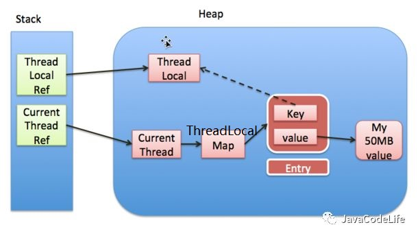

注意上图中的**实线表示强引用，虚线表示弱引用**。如图所示。

每个线程实例中可以通过threadLocals获取到threadLocalMap，

而threadLocalMap实际上就是一个以threadLocal实例为key，任意对象为value的Entry数组。

当我们为threadLocal变量赋值，实际上就是以当前threadLocal实例为key，值为value的Entry往这个threadLocalMap中存放。

需要注意的是**Entry中的key是弱引用**，引用链为：ThreadLocal Ref -> ThreadLocal, Entry的key弱引用->ThreadLocal。

当threadLocal外部强引用被置为`null(threadLocalInstance=null)`,那么系统 GC 的时候，根据可达性分析，这个threadLocal实例就没有任何一条链路能够引用到它，这个ThreadLocal势必会被回收。

这样一来，ThreadLocalMap中就会出现key为null的Entry，就没有办法访问这些key为null的Entry的value，如果当前线程再迟迟不结束的话，这些key为null的Entry的value就会一直存在一条强引用链：CurrentThread Ref -> CurrentThread -> ThreaLocalMap -> Entry -> value永远无法回收，造成内存泄漏。

当然，如果当前thread运行结束，threadLocal，threadLocalMap,Entry没有引用链可达，在垃圾回收的时候都会被系统进行回收。

在实际开发中，会使用线程池去维护线程的创建和复用，比如固定大小的线程池，线程为了复用是不会主动结束的，所以，threadLocal的内存泄漏问题，是应该值得我们思考和注意的问题，后面我们会继续关注这个问题。

### 4.2 set方法
与concurrentHashMap，hashMap等容器一样，threadLocalMap也是采用散列表进行实现的。在了解set方法前，我们先来回顾下关于**散列表**相关的知识。


#### 散列表
理想状态下，散列表就是一个包含关键字的固定大小的数组，通过使用散列函数，将关键字映射到数组的不同位置。下面是
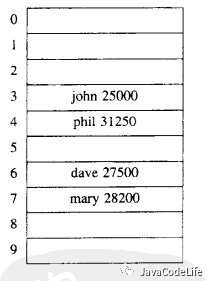

在理想状态下，哈希函数可以将关键字均匀的分散到数组的不同位置，不会出现两个关键字散列值相同（假设关键字数量小于数组的大小）的情况。但是在实际使用中，经常会出现多个关键字散列值相同的情况（被映射到数组的同一个位置），我们将这种情况称为散列冲突。为了解决散列冲突，主要采用下面两种方式： **分离链表法（separate chaining）和开放定址法（open addressing）**

##### 分离链表法
分散链表法使用链表解决冲突，将散列值相同的元素都保存到一个链表中。

当查询的时候，首先找到元素所在的链表，然后遍历链表查找对应的元素，

典型实现为hashMap，concurrentHashMap的拉链法。下面是一个示意图：

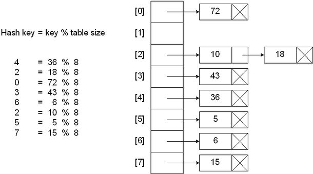

##### 开放定址法

开放定址法不会创建链表，当关键字散列到的数组单元已经被另外一个关键字占用的时候，就会尝试在数组中寻找其他的单元，直到找到一个空的单元。

探测数组空单元的方式有很多，这里介绍一种最简单的 -- 线性探测法。

线性探测法就是从冲突的数组单元开始，依次往后搜索空单元，如果到数组尾部，再从头开始搜索（环形查找）。如下图所示：
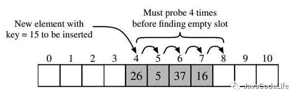


**ThreadLocalMap 中使用开放地址法来处理散列冲突，** 而 HashMap 中使用的分离链表法。

之所以采用不同的方式主要是因为：

在 ThreadLocalMap 中的散列值分散的十分均匀，很少会出现冲突。并且 ThreadLocalMap 经常需要清除无用的对象，使用纯数组更加方便。

**set方法的源码为：**
```java
private void set(ThreadLocal<?> key, Object value) {

    // We don't use a fast path as with get() because it is at
    // least as common to use set() to create new entries as
    // it is to replace existing ones, in which case, a fast
    // path would fail more often than not.

    Entry[] tab = table;
    int len = tab.length;
    //根据threadLocal的hashCode确定Entry应该存放的位置
    int i = key.threadLocalHashCode & (len-1);

    //采用开放地址法，hash冲突的时候使用线性探测
    for (Entry e = tab[i];
         e != null;
         e = tab[i = nextIndex(i, len)]) {
        ThreadLocal<?> k = e.get();
        //覆盖旧Entry
        if (k == key) {
            e.value = value;
            return;
        }
        //当key为null时，说明threadLocal强引用已经被释放掉，那么就无法
        //再通过这个key获取threadLocalMap中对应的entry，这里就存在内存泄漏的可能性
        if (k == null) {
            //用当前插入的值替换掉这个key为null的“脏”entry
            replaceStaleEntry(key, value, i);
            return;
        }
    }
    //新建entry并插入table中i处
    tab[i] = new Entry(key, value);
    int sz = ++size;
    //插入后再次清除一些key为null的“脏”entry,如果大于阈值就需要扩容
    if (!cleanSomeSlots(i, sz) && sz >= threshold)
        rehash();
}
```
set方法的关键部分请看上面的注释，主要有这样几点需要注意：
##### 1. threadLocal的hashcode?
```java
private final int threadLocalHashCode = nextHashCode();
private static final int HASH_INCREMENT = 0x61c88647;
private static AtomicInteger nextHashCode =new AtomicInteger();
/**
 * Returns the next hash code.
 */
private static int nextHashCode() {
    return nextHashCode.getAndAdd(HASH_INCREMENT);
}
```
从源码中我们可以清楚的看到threadLocal实例的hashCode是通过nextHashCode()方法实现的，

该方法实际上总是用一个AtomicInteger加上0x61c88647来实现的。

0x61c88647这个数是有特殊意义的，它能够保证hash表的每个散列桶能够均匀的分布，这是Fibonacci Hashing。

也正是能够均匀分布，所以threadLocal选择使用开放地址法来解决hash冲突的问题。

##### 2. 怎样确定新值插入到哈希表中的位置？
该操作源码为：`key.threadLocalHashCode & (len-1)` ，同hashMap和ConcurrentHashMap等容器的方式一样，利用当前key(即threadLocal实例)的hashcode与哈希表大小相与，因为哈希表大小总是为2的幂次方，所以相与等同于一个取模的过程，这样就可以通过Key分配到具体的哈希桶中去。而至于为什么取模要通过位与运算的原因就是位运算的执行效率远远高于了取模运算。

##### 3. 怎样解决hash冲突？
源码中通过`nextIndex(i, len)` 方法解决hash冲突的问题，该方法为`((i + 1 < len) ? i + 1 : 0);`，也就是不断往后线性探测，当到哈希表末尾的时候再从0开始，成环形。

##### 4. 怎样解决“脏”Entry？

 在分析threadLocal,threadLocalMap以及Entry的关系的时候，我们已经知道使用threadLocal有可能存在内存泄漏（对象创建出来后，在之后的逻辑一直没有使用该对象，但是垃圾回收器无法回收这个部分的内存），

 在源码中针对这种key为null的Entry称之为“stale entry”，直译为不新鲜的entry，我把它理解为“脏entry”，

 自然而然，Josh Bloch and Doug Lea大师考虑到了这种情况,在set方法的for循环中寻找和当前Key相同的可覆盖entry的过程中通过replaceStaleEntry方法解决脏entry的问题。

 如果当前table[i]为null的话，直接插入新entry后也会通过cleanSomeSlots来解决脏entry的问题，关于cleanSomeSlots和replaceStaleEntry方法，会在详解threadLocal内存泄漏中讲到，具体可看那篇文章

##### 5. 如何进行扩容？
###### threshold的确定

也几乎和大多数容器一样，threadLocalMap会有扩容机制，那么它的 **threshold** 又是怎样确定的了？

```java
 private int threshold; // Default to 0
    /**
     * The initial capacity -- MUST be a power of two.
     */
    private static final int INITIAL_CAPACITY = 16;

    ThreadLocalMap(ThreadLocal<?> firstKey, Object firstValue) {
        table = new Entry[INITIAL_CAPACITY];
        int i = firstKey.threadLocalHashCode & (INITIAL_CAPACITY - 1);
        table[i] = new Entry(firstKey, firstValue);
        size = 1;
        setThreshold(INITIAL_CAPACITY);
    }

    /**
     * Set the resize threshold to maintain at worst a 2/3 load factor.
     */
    private void setThreshold(int len) {
        threshold = len * 2 / 3;
    }
```
根据源码可知，在第一次为threadLocal进行赋值的时候会创建初始大小为16的threadLocalMap,

并且通过setThreshold方法设置threshold，其值为当前哈希数组长度乘以（2/3），也就是说加载因子为2/3

> 加载因子是衡量哈希表密集程度的一个参数，如果加载因子越大的话，说明哈希表被装载的越多，出现hash冲突的可能性越大，反之，则被装载的越少，出现hash冲突的可能性越小。同时如果过小，很显然内存使用率不高，该值取值应该考虑到内存使用率和hash冲突概率的一个平衡，如hashMap,concurrentHashMap的加载因子都为0.75。

这里**threadLocalMap初始大小为16，加载因子为2/3**，所以哈希表可用大小为：`16*2/3=10` ，即哈希表可用容量为10。

######  扩容resize
从set方法中可以看出当hash表的size大于threshold的时候，会进行rehash（），在该方法中进行了resize()。
```java
  private void rehash() {
      expungeStaleEntries();

    // Use lower threshold for doubling to avoid hysteresis
    if (size >= threshold - threshold / 4)
              resize();
     }
```

```java
/**
 * Double the capacity of the table.
 */
private void resize() {
    Entry[] oldTab = table;
    int oldLen = oldTab.length;
    //新数组为原数组的2倍
    int newLen = oldLen * 2;
    Entry[] newTab = new Entry[newLen];
    int count = 0;

    for (int j = 0; j < oldLen; ++j) {
        Entry e = oldTab[j];
        if (e != null) {
            ThreadLocal<?> k = e.get();
            //遍历过程中如果遇到脏entry的话直接令value为null,有助于value能够被回收
            if (k == null) {
                e.value = null; // Help the GC
            } else {
                //重新确定entry在新数组的位置，然后进行插入
                int h = k.threadLocalHashCode & (newLen - 1);
                while (newTab[h] != null)
                    h = nextIndex(h, newLen);
                newTab[h] = e;
                count++;
            }
        }
    }
    //设置新哈希表的threshHold和size属性
    setThreshold(newLen);
    size = count;
    table = newTab;
}  
```
新建一个大小为原来数组长度的两倍的数组，

然后遍历旧数组中的entry并将其插入到新的hash数组中，

需要注意的是，在扩容的过程中针对脏entry的话会令value为null，以便能够被垃圾回收器能够回收，解决隐藏的内存泄漏的问题。


### 4.3 getEntry方法

getEntry方法源码为：
```java
private Entry getEntry(ThreadLocal<?> key) {
    //1. 确定在散列数组中的位置
    int i = key.threadLocalHashCode & (table.length - 1);
    //2. 根据索引i获取entry
    Entry e = table[i];
    //3. 满足条件则返回该entry,如果获得的entry的key和传入的key相同，说明没有hash冲突，否则说明有hash冲突，需要做额外的处理。
    if (e != null && e.get() == key)
        return e;
    else
        //4. 未查找到满足条件的entry，额外在做的处理
        return getEntryAfterMiss(key, i, e);
}
```
方法逻辑很简单，
若能当前定位的entry的key和查找的key相同的话就直接返回这个entry，
否则的话就是在set的时候存在hash冲突的情况，需要通过getEntryAfterMiss做进一步处理。getEntryAfterMiss方法为：

```java
private Entry getEntryAfterMiss(ThreadLocal<?> key, int i, Entry e) {
    Entry[] tab = table;
    int len = tab.length;

    while (e != null) {
        ThreadLocal<?> k = e.get();
        if (k == key)
            //找到和查询的key相同的entry则返回
            return e;
        if (k == null)
            //解决脏entry的问题
            expungeStaleEntry(i);
        else
            //继续向后环形查找
            i = nextIndex(i, len);
        e = tab[i];
    }
    return null;
}
```

这个方法同样很好理解，通过nextIndex往后环形查找，

如果找到和查询的key相同的entry的话就直接返回，

如果在查找过程中遇到脏entry的话使用expungeStaleEntry方法进行处理。

到目前为止，为了解决潜在的内存泄漏的问题，在set，resize,getEntry这些地方都会对这些脏entry进行处理，可见为了尽可能解决这个问题几乎无时无刻都在做出努力。

### 4.4 remove
```java
/**
 * Remove the entry for key.
 */
private void remove(ThreadLocal<?> key) {
    Entry[] tab = table;
    int len = tab.length;
    int i = key.threadLocalHashCode & (len-1);
    for (Entry e = tab[i];
         e != null;
         e = tab[i = nextIndex(i, len)]) {
        if (e.get() == key) {
            //将entry的key置为null
            e.clear();
            //将该entry的value也置为null
            expungeStaleEntry(i);
            return;
        }
    }
}
```
该方法逻辑很简单，通过往后环形查找到与指定key相同的entry后，

先通过clear方法将key置为null后，使其转换为一个脏entry，

然后调用expungeStaleEntry方法将其value置为null，以便垃圾回收时能够清理，同时将table[i]置为null。

## 5. 关于ThreadLocal的内存泄漏

造成内存泄漏的原因是使用弱引用导致的。

### 5.1 为什么使用弱引用


> 如果使用强引用


假设threadLocal使用的是强引用，在业务代码中执行threadLocalInstance==null操作，以达到清理掉threadLocal实例的目的，
但是因为threadLocalMap的Entry强引用threadLocal，因此在gc的时候进行可达性分析，threadLocal依然可达，对threadLocal并不会进行垃圾回收，这样就无法真正达到业务逻辑的目的，出现逻辑错误

> 如果使用弱引用

假设Entry弱引用threadLocal，尽管会出现内存泄漏的问题，但是在threadLocal的生命周期里（set,getEntry,remove）里，都会针对key为null的脏entry进行处理。

从以上的分析可以看出，使用弱引用的话在threadLocal生命周期里会尽可能的保证不出现内存泄漏的问题，达到安全的状态。


### 5.2 Thread.exit()
当线程退出时会执行exit方法：
```java
private void exit() {
    if (group != null) {
        group.threadTerminated(this);
        group = null;
    }
    /* Aggressively null out all reference fields: see bug 4006245 */
    target = null;
    /* Speed the release of some of these resources */
    threadLocals = null;
    inheritableThreadLocals = null;
    inheritedAccessControlContext = null;
    blocker = null;
    uncaughtExceptionHandler = null;
}
```

从源码可以看出当线程结束时，会令threadLocals=null，

也就意味着GC的时候就可以将threadLocalMap进行垃圾回收，

换句话说threadLocalMap生命周期实际上和thread的生命周期相同。

### 5.3 threadLocal最佳实践
通过这篇文章对threadLocal的内存泄漏做了很详细的分析，我们可以完全理解threadLocal内存泄漏的前因后果，那么实践中我们应该怎么做？

1. 每次使用完ThreadLocal，都调用它的remove()方法，清除数据。

2. 在使用线程池的情况下，没有及时清理ThreadLocal，不仅是内存泄漏的问题，更严重的是可能导致业务逻辑出现问题。所以，使用ThreadLocal就跟加锁完要解锁一样，用完就清理。

## 6.为了解决ThreadLocal内存泄漏，已经做出了哪些改进？
实际上，为了解决threadLocal潜在的内存泄漏的问题，Josh Bloch and Doug Lea大师已经做了一些改进。在threadLocal的set和get方法中都有相应的处理。下文为了叙述，针对key为null的entry，源码注释为stale entry，直译为不新鲜的entry，这里我就称之为“脏entry”。比如在ThreadLocalMap的set方法中：

```java
private void set(ThreadLocal<?> key, Object value) {

    // We don't use a fast path as with get() because it is at
    // least as common to use set() to create new entries as
    // it is to replace existing ones, in which case, a fast
    // path would fail more often than not.

    Entry[] tab = table;
    int len = tab.length;
    int i = key.threadLocalHashCode & (len-1);

    for (Entry e = tab[i];
             e != null;
             e = tab[i = nextIndex(i, len)]) {
        ThreadLocal<?> k = e.get();

        if (k == key) {
            e.value = value;
            return;
        }

        if (k == null) {
            replaceStaleEntry(key, value, i);
            return;
        }
     }

    tab[i] = new Entry(key, value);
    int sz = ++size;
    if (!cleanSomeSlots(i, sz) && sz >= threshold)
        rehash();
}
```
在该方法中针对脏entry做了这样的处理：

1. 如果当前table[i]！=null的话，说明hash冲突就需要向后环形查找，若在查找过程中遇到脏entry就通过`replaceStaleEntry` 进行处理；

2. 如果当前table[i]==null的话，说明新的entry可以直接插入，但是插入后会调用 `cleanSomeSlots` 方法检测并清除脏entry。

### 6.1 cleanSomeSlots
该方法的源码为：
```java
/* @param i a position known NOT to hold a stale entry. The
 * scan starts at the element after i.
 *
 * @param n scan control: {@code log2(n)} cells are scanned,
 * unless a stale entry is found, in which case
 * {@code log2(table.length)-1} additional cells are scanned.
 * When called from insertions, this parameter is the number
 * of elements, but when from replaceStaleEntry, it is the
 * table length. (Note: all this could be changed to be either
 * more or less aggressive by weighting n instead of just
 * using straight log n. But this version is simple, fast, and
 * seems to work well.)
 *
 * @return true if any stale entries have been removed.
 */
private boolean cleanSomeSlots(int i, int n) {
    boolean removed = false;
    Entry[] tab = table;
    int len = tab.length;
    do {
        i = nextIndex(i, len);
        Entry e = tab[i];
        if (e != null && e.get() == null) {
            n = len;
            removed = true;
            i = expungeStaleEntry(i);
        }
    } while ( (n >>>= 1) != 0);
    return removed;
}

```
#### 入参i

插入entry的位置i，很显然在上述情况2（table[i]==null）中，entry刚插入后该位置i很显然不是脏entry;

#### 入参n
##### 1. n的用途
主要用于**扫描控制（scan control）**，

**从while中是通过n来进行条件判断的说明n就是用来控制扫描趟数（循环次数）的。**

在扫描过程中，如果没有遇到脏entry就整个扫描过程持续log2(n)次，log2(n)的得来是因为n >>>= 1，每次n右移一位相当于n除以2。

如果在扫描过程中遇到脏entry的话就会令n为当前hash表的长度（n=len），再扫描log2(n)趟，

注意此时n增加无非就是多增加了循环次数从而通过 `nextIndex` 往后搜索的范围扩大，示意图如下
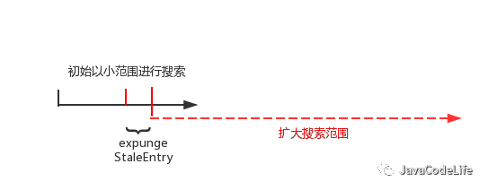

按照n的初始值，搜索范围为黑线，

当遇到了脏entry，此时n变成了哈希数组的长度（n取值增大），搜索范围log2(n)增大，红线表示。

如果在整个搜索过程没遇到脏entry的话，搜索结束，采用这种方式的主要是用于时间效率上的平衡。

##### 2.n的取值

如果是在set方法插入新的entry后调用（上述情况2），n位当前已经插入的entry个数size；

如果是在replaceSateleEntry方法中调用n为哈希表的长度len。

##### 3.总结
1. 从当前位置i处（位于i处的entry一定不是脏entry）为起点在初始小范围（log2(n)，n为哈希表已插入entry的个数size）开始向后搜索脏entry，若在整个搜索过程没有脏entry，方法结束退出。

2. 如果在搜索过程中遇到脏entryt通过expungeStaleEntry方法清理掉当前脏entry，并且该方法会返回下一个哈希桶(table[i])为null的索引位置为i。这时重新令搜索起点为索引位置i，n为哈希表的长度len，再次扩大搜索范围为log2(n)继续搜索。


下面，以一个例子更清晰的来说一下，假设当前table数组的情况如下图。
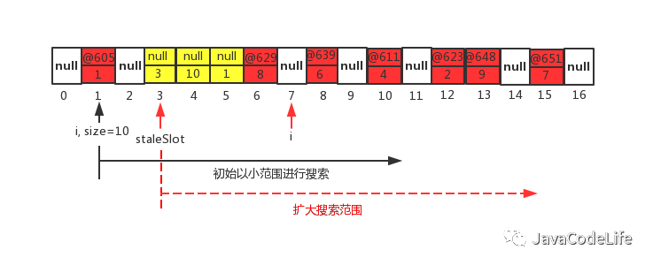


1. 如图当前n等于hash表的size即n=10，i=1,在第一趟搜索过程中通过nextIndex,i指向了索引为2的位置，此时table[2]为null，说明第一趟未发现脏entry,则第一趟结束进行第二趟的搜索。

2. 第二趟搜索先通过nextIndex方法，索引由2的位置变成了i=3,当前table[3]!=null但是该entry的key为null，说明找到了一个脏entry，先将n置为哈希表的长度len,然后继续调用expungeStaleEntry方法，该方法会将当前索引为3的脏entry给清除掉（令value为null，并且table[3]也为null）,但是该方法可不想偷懒，它会继续往后环形搜索，往后会发现索引为4,5的位置的entry同样为脏entry，索引为6的位置的entry不是脏entry保持不变，直至i=7的时候此处table[7]位null，该方法就以i=7返回。至此，第二趟搜索结束；

3. 由于在第二趟搜索中发现脏entry，n增大为数组的长度len，因此扩大搜索范围（增大循环次数）继续向后环形搜索；

4. 直到在整个搜索范围里都未发现脏entry，cleanSomeSlot方法执行结束退出。


### 6.2 expungeStaleEntry

如果对输入参数能够理解的话，那么cleanSomeSlots方法搜索基本上清除了脏entry，

但是全部搞定还需要掌握expungeStaleEntry方法，

当在搜索过程中遇到了脏entry的话就会调用该方法去清理掉脏entry。源码为：

```java
/**
 * Expunge a stale entry by rehashing any possibly colliding entries
 * lying between staleSlot and the next null slot.  This also expunges
 * any other stale entries encountered before the trailing null.  See
 * Knuth, Section 6.4
 *
 * @param staleSlot index of slot known to have null key
 * @return the index of the next null slot after staleSlot
 * (all between staleSlot and this slot will have been checked
 * for expunging).
 */
private int expungeStaleEntry(int staleSlot) {
    Entry[] tab = table;
    int len = tab.length;

    //清除当前脏entry
    // expunge entry at staleSlot
    tab[staleSlot].value = null;
    tab[staleSlot] = null;
    size--;

    // Rehash until we encounter null
    Entry e;
    int i;
    //2.往后环形继续查找,直到遇到table[i]==null时结束
    for (i = nextIndex(staleSlot, len);
         (e = tab[i]) != null;
         i = nextIndex(i, len)) {
        ThreadLocal<?> k = e.get();
        //3. 如果在向后搜索过程中再次遇到脏entry，同样将其清理掉
        if (k == null) {
            e.value = null;
            tab[i] = null;
            size--;
        } else {
            //处理rehash的情况
            int h = k.threadLocalHashCode & (len - 1);
            if (h != i) {
                tab[i] = null;

                // Unlike Knuth 6.4 Algorithm R, we must scan until
                // null because multiple entries could have been stale.
                while (tab[h] != null)
                    h = nextIndex(h, len);
                tab[h] = e;
            }
        }
    }
    return i;
}
```
该方法逻辑请看注释（第1,2,3步），主要做了这么几件事情：

1. 清理当前脏entry，即将其value引用置为null，并且将table[staleSlot]也置为null。value置为null后该value域变为不可达，在下一次gc的时候就会被回收掉，同时table[staleSlot]为null后以便于存放新的entry;

2. 从当前staleSlot位置向后环形（nextIndex）继续搜索，直到遇到哈希桶（tab[i]）为null的时候退出；

3. 若在搜索过程再次遇到脏entry，继续将其清除。

也就是说该方法，清理掉当前脏entry后，并没有闲下来，

继续向后搜索，若再次遇到脏entry继续将其清理，直到哈希桶（table[i]）为null时退出。

因此方法执行完的结果为 从当前脏entry（staleSlot）位到返回的i位，这中间所有的entry不是脏entry。

为什么是遇到null退出呢？原因是存在脏entry的前提条件是 当前哈希桶（table[i]）不为null,只是该entry的key域为null。如果遇到哈希桶为null,很显然它连成为脏entry的前提条件都不具备。


###  6.3 replaceStaleEntry
先来看replaceStaleEntry 方法，该方法源码为：
```java
/*
 * @param  key the key
 * @param  value the value to be associated with key
 * @param  staleSlot index of the first stale entry encountered while
 *         searching for key.
 */
private void replaceStaleEntry(ThreadLocal<?> key, Object value,
                               int staleSlot) {
    Entry[] tab = table;
    int len = tab.length;
    Entry e;

    // Back up to check for prior stale entry in current run.
    // We clean out whole runs at a time to avoid continual
    // incremental rehashing due to garbage collector freeing
    // up refs in bunches (i.e., whenever the collector runs).

    //向前找到第一个脏entry
    int slotToExpunge = staleSlot;
    for (int i = prevIndex(staleSlot, len);
         (e = tab[i]) != null;
         i = prevIndex(i, len))
        if (e.get() == null)
1.          slotToExpunge = i;

    // Find either the key or trailing null slot of run, whichever
    // occurs first
    for (int i = nextIndex(staleSlot, len);
         (e = tab[i]) != null;
         i = nextIndex(i, len)) {
        ThreadLocal<?> k = e.get();

        // If we find key, then we need to swap it
        // with the stale entry to maintain hash table order.
        // The newly stale slot, or any other stale slot
        // encountered above it, can then be sent to expungeStaleEntry
        // to remove or rehash all of the other entries in run.
        if (k == key) {

            //如果在向后环形查找过程中发现key相同的entry就覆盖并且和脏entry进行交换
2.            e.value = value;
3.            tab[i] = tab[staleSlot];
4.            tab[staleSlot] = e;

            // Start expunge at preceding stale entry if it exists
            //如果在查找过程中还未发现脏entry，那么就以当前位置作为cleanSomeSlots
            //的起点
            if (slotToExpunge == staleSlot)
5.                slotToExpunge = i;
            //搜索脏entry并进行清理
6.            cleanSomeSlots(expungeStaleEntry(slotToExpunge), len);
            return;
        }

        // If we didn't find stale entry on backward scan, the
        // first stale entry seen while scanning for key is the
        // first still present in the run.
        //如果向前未搜索到脏entry，则在查找过程遇到脏entry的话，后面就以此时这个位置
        //作为起点执行cleanSomeSlots
        if (k == null && slotToExpunge == staleSlot)
7.            slotToExpunge = i;
    }

    // If key not found, put new entry in stale slot
    //如果在查找过程中没有找到可以覆盖的entry，则将新的entry插入在脏entry
8.    tab[staleSlot].value = null;
9.    tab[staleSlot] = new Entry(key, value);

    // If there are any other stale entries in run, expunge them
10.    if (slotToExpunge != staleSlot)
        //执行cleanSomeSlots
11.        cleanSomeSlots(expungeStaleEntry(slotToExpunge), len);
}
```

下面我结合各种情况详细说一下该方法的执行过程。首先先看这一部分的代码：
```java
int slotToExpunge = staleSlot;
    for (int i = prevIndex(staleSlot, len);
         (e = tab[i]) != null;
         i = prevIndex(i, len))
        if (e.get() == null)
            slotToExpunge = i;
```
这部分代码通过PreIndex方法实现往前环形搜索脏entry的功能，初始时slotToExpunge和staleSlot相同，若在搜索过程中发现了脏entry，则更新slotToExpunge为当前索引i。

另外，说明replaceStaleEntry并不仅仅局限于处理当前已知的脏entry，它认为在出现脏entry的相邻位置也有很大概率出现脏entry，

所以为了一次处理到位，就需要向前环形搜索，找到前面的脏entry。那么根据在向前搜索中是否还有脏entry以及在for循环后向环形查找中是否找到可覆盖的entry，

我们分这四种情况来充分理解这个方法：

#### 1.前向有脏entry
##### 1.1后向环形查找找到可覆盖的entry
该情形如下图所示。
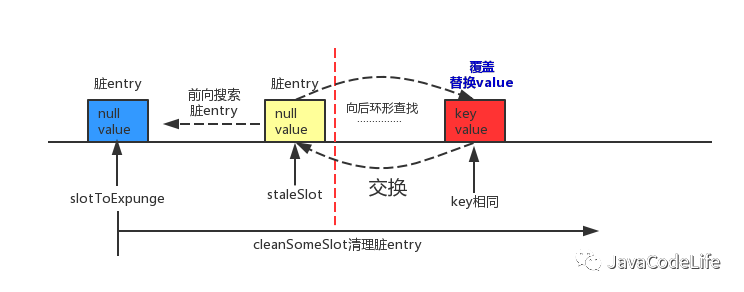

如图，slotToExpunge初始状态和staleSlot相同，

当前向环形搜索遇到脏entry时，在第1行代码中slotToExpunge会更新为当前脏entry的索引i，直到遇到哈希桶（table[i]）为null的时候，前向搜索过程结束。

在接下来的for循环中进行后向环形查找，若查找到了可覆盖的entry，第2,3,4行代码先覆盖当前位置的entry，然后再与staleSlot位置上的脏entry进行交换。

交换之后脏entry就更换到了i处，最后使用cleanSomeSlots方法从slotToExpunge为起点开始进行清理脏entry的过程。

##### 1.2后向环形查找未找到可覆盖的entry
该情形如下图所示。
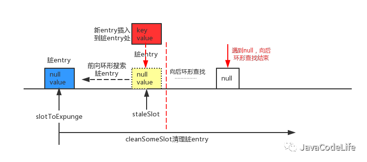
如图，slotToExpunge初始状态和staleSlot相同，

当前向环形搜索遇到脏entry时，在第1行代码中slotToExpunge会更新为当前脏entry的索引i，直到遇到哈希桶（table[i]）为null的时候，前向搜索过程结束。

在接下来的for循环中进行后向环形查找，若没有查找到了可覆盖的entry，哈希桶（table[i]）为null的时候，后向环形查找过程结束。

那么接下来在8,9行代码中，将插入的新entry直接放在staleSlot处即可，最后使用cleanSomeSlots方法从slotToExpunge为起点开始进行清理脏entry的过程。

#### 2.前向没有脏entry
##### 2.1后向环形查找找到可覆盖的entry
该情形如下图所示。
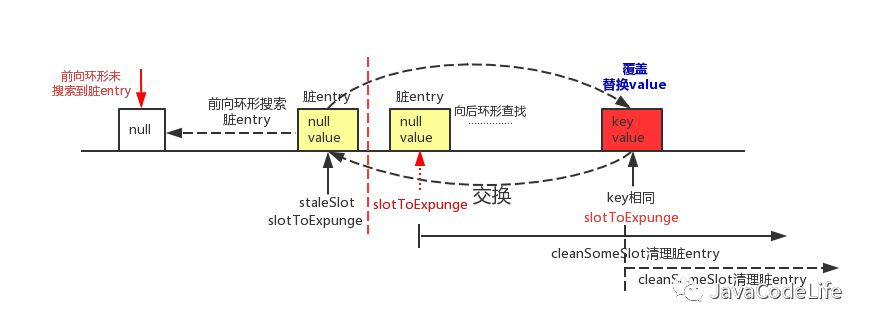

如图，slotToExpunge初始状态和staleSlot相同，

当前向环形搜索直到遇到哈希桶（table[i]）为null的时候，前向搜索过程结束，

若在整个过程未遇到脏entry，slotToExpunge初始状态依旧和staleSlot相同。

在接下来的for循环中进行后向环形查找，若遇到了脏entry，在第7行代码中更新slotToExpunge为位置i。若查找到了可覆盖的entry，第2,3,4行代码先覆盖当前位置的entry，然后再与staleSlot位置上的脏entry进行交换，交换之后脏entry就更换到了i处。

如果在整个查找过程中都还没有遇到脏entry的话，会通过第5行代码，将slotToExpunge更新当前i处，最后使用cleanSomeSlots方法从slotToExpunge为起点开始进行清理脏entry的过程。

##### 2.2后向环形查找未找到可覆盖的entry
该情形如下图所示。
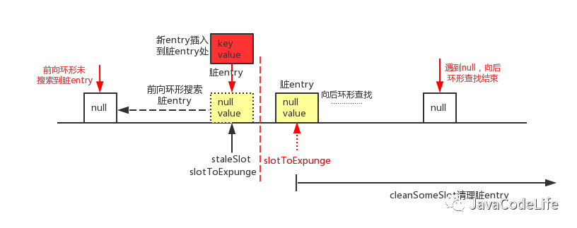

如图，slotToExpunge初始状态和staleSlot相同，

当前向环形搜索直到遇到哈希桶（table[i]）为null的时候，前向搜索过程结束，

若在整个过程未遇到脏entry，slotToExpunge初始状态依旧和staleSlot相同。

在接下来的for循环中进行后向环形查找，若遇到了脏entry，在第7行代码中更新slotToExpunge为位置i。若没有查找到了可覆盖的entry，哈希桶（table[i]）为null的时候，后向环形查找过程结束。

那么接下来在8,9行代码中，将插入的新entry直接放在staleSlot处即可。

另外，如果发现slotToExpunge被重置，则第10行代码if判断为true,就使用cleanSomeSlots方法从slotToExpunge为起点开始进行清理脏entry的过程。

下面用一个实例来有个直观的感受，示例代码就不给出了，代码debug时table状态如下图所示：
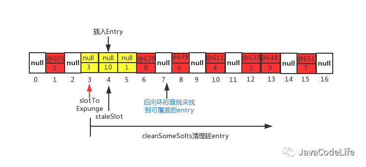

如图所示，当前的staleSolt为i=4，

首先先进行前向搜索脏entry，当i=3的时候遇到脏entry，slotToExpung更新为3，当i=2的时候tabel[2]为null，因此前向搜索脏entry的过程结束。

然后进行后向环形查找，直到i=7的时候遇到table[7]为null，结束后向查找过程，并且在该过程并没有找到可以覆盖的entry。

最后只能在staleSlot（4）处插入新entry，然后从slotToExpunge（3）为起点进行cleanSomeSlots进行脏entry的清理。是不是上面的1.2的情况。


**从以上set,getEntry,remove方法看出，在threadLocal的生命周期里，针对threadLocal存在的内存泄漏的问题，都会通过expungeStaleEntry，cleanSomeSlots,replaceStaleEntry这三个方法清理掉key为null的脏entry。**

