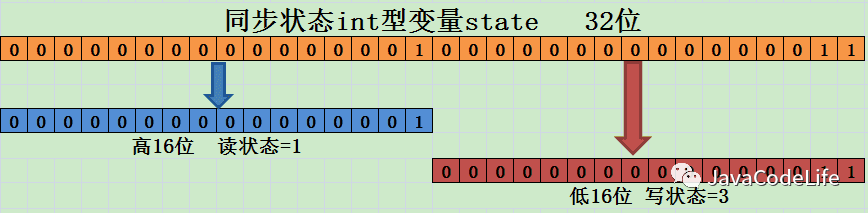

[TOC]
# 一.ReentrantLock
## 1. ReentrantLock的介绍
ReentrantLock重入锁，是实现Lock接口的一个类，也是在实际编程中使用频率很高的一个锁，

支持重入性，**表示能够对共享资源能够重复加锁，即当前线程获取该锁再次获取不会被阻塞。**

在java关键字synchronized隐式支持重入性，synchronized通过获取自增，释放自减的方式实现重入。

ReentrantLock还支持公平锁和非公平锁两种方式。那么，要想完完全全的弄懂ReentrantLock的话，主要也就是ReentrantLock同步语义的学习：

1. 重入性的实现原理；

2. 公平锁和非公平锁。

## 2. 重入性的实现原理

要想支持重入性，就要解决两个问题：
1. 在线程获取锁的时候，如果已经获取锁的线程是当前线程的话则直接再次获取成功；

2. 由于锁会被获取n次，那么只有锁在被释放同样的n次之后，该锁才算是完全释放成功。

我们来看看ReentrantLock是怎样实现的，以非公平锁为例，判断当前线程能否获得锁为例，核心方法为nonfairTryAcquire：

```java
final boolean nonfairTryAcquire(int acquires) {
    final Thread current = Thread.currentThread();
    int c = getState();
    //1. 如果该锁未被任何线程占有，该锁能被当前线程获取
    if (c == 0) {
        if (compareAndSetState(0, acquires)) {
            setExclusiveOwnerThread(current);
            return true;
        }
    }
    //2.若被占有，检查占有线程是否是当前线程
    else if (current == getExclusiveOwnerThread()) {
        // 3. 再次获取，计数加一
        int nextc = c + acquires;
        if (nextc < 0) // overflow
            throw new Error("Maximum lock count exceeded");
        setState(nextc);
        return true;
    }
    return false;
}
```
为了支持重入性，在第二步增加了处理逻辑，如果该锁已经被线程所占有了，会继续检查占有线程是否为当前线程，

如果是的话，同步状态加1返回true，表示可以再次获取成功。

每次重新获取都会对同步状态进行加一的操作，那么释放的时候处理思路是怎样的了？（依然还是以非公平锁为例）核心方法为tryRelease：
```java
protected final boolean tryRelease(int releases) {
    //1. 同步状态减1
    int c = getState() - releases;
    if (Thread.currentThread() != getExclusiveOwnerThread())
        throw new IllegalMonitorStateException();
    boolean free = false;
    if (c == 0) {
        //2. 只有当同步状态为0时，锁成功被释放，返回true
        free = true;
        setExclusiveOwnerThread(null);
    }
    // 3. 锁未被完全释放，返回false
    setState(c);
    return free;
}
```
需要注意的是:

1. 重入锁的释放必须得等到同步状态为0时锁才算成功释放，否则锁仍未释放。

2. 如果锁被获取n次，释放了n-1次，该锁未完全释放返回false，只有被释放n次才算成功释放，返回true。


## 3. 公平锁与非公平锁

ReentrantLock支持两种锁：公平锁和非公平锁。

何谓公平性，是针对获取锁而言的，如果一个锁是公平的，那么锁的获取顺序就应该符合请求上的绝对时间顺序，满足FIFO。

ReentrantLock的构造方法无参时是构造非公平锁，源码为：
```java
public ReentrantLock() {
    sync = new NonfairSync();
}
```
另外还提供了另外一种方式，可传入一个boolean值，true时为公平锁，false时为非公平锁，源码为：
```java
public ReentrantLock(boolean fair) {
    sync = fair ? new FairSync() : new NonfairSync();
}
```
在上面**非公平锁**获取时（nonfairTryAcquire方法）只是简单的获取了一下当前状态做了一些逻辑处理，并没有考虑到当前同步队列中线程等待的情况。

我们来看看**公平锁**的处理逻辑是怎样的，核心方法为：

```java
protected final boolean tryAcquire(int acquires) {
    final Thread current = Thread.currentThread();
    int c = getState();
    if (c == 0) {
        if (!hasQueuedPredecessors() &&
            compareAndSetState(0, acquires)) {
            setExclusiveOwnerThread(current);
            return true;
        }
    }
    else if (current == getExclusiveOwnerThread()) {
        int nextc = c + acquires;
        if (nextc < 0)
            throw new Error("Maximum lock count exceeded");
        setState(nextc);
        return true;
    }
    return false;
  }
}
```
这段代码的逻辑与nonfairTryAcquire基本上一致，

唯一的不同在于增加了hasQueuedPredecessors的逻辑判断，

方法名就可知道该方法用来判断当前节点在同步队列中是否有前驱节点的判断，

如果有前驱节点说明有线程比当前线程更早的请求资源，根据公平性，当前线程请求资源失败。

如果当前节点没有前驱节点的话，才有做后面的逻辑判断的必要性。

公平锁每次都是从同步队列中的第一个节点获取到锁，而非公平性锁则不一定，有可能刚释放锁的线程能再次获取到锁。

> 公平锁 VS 非公平锁

1. 公平锁每次获取到锁为同步队列中的第一个节点，保证请求资源时间上的绝对顺序，而非公平锁有可能刚释放锁的线程下次继续获取该锁，则有可能导致其他线程永远无法获取到锁，造成“饥饿”现象。

2. 公平锁为了保证时间上的绝对顺序，需要频繁的上下文切换，而非公平锁会降低一定的上下文切换，降低性能开销。因此，ReentrantLock默认选择的是非公平锁，则是为了减少一部分上下文切换，保证了系统更大的吞吐量。

# 二.ReentrantReadWriteLock

在并发场景中用于解决线程安全的问题，我们几乎会高频率的使用到独占式锁，通常使用java提供的关键字synchronized或者concurrents包中实现了Lock接口的ReentrantLock。它们都是独占式获取锁，也就是在同一时刻只有一个线程能够获取锁。

而在一些业务场景中，大部分只是读数据，写数据很少，如果仅仅是读数据的话并不会影响数据正确性（出现脏读），而如果在这种业务场景下，依然使用独占锁的话，很显然这将是出现性能瓶颈的地方。

针对这种读多写少的情况，java还提供了另外一个实现Lock接口的ReentrantReadWriteLock(读写锁)。读写锁允许同一时刻被多个读线程访问，但是在写线程访问时，所有的读线程和其他的写线程都会被阻塞。

在分析WirteLock和ReadLock的互斥性时可以按照WriteLock与WriteLock之间，WriteLock与ReadLock之间以及ReadLock与ReadLock之间进行分析。这里做一个归纳总结：
1. 公平性选择：支持非公平性（默认）和公平的锁获取方式，吞吐量还是非公平优于公平；

2. 重入性：支持重入，读锁获取后能再次获取，写锁获取之后能够再次获取写锁，同时也能够获取读锁；

3. 锁降级：遵循获取写锁，获取读锁再释放写锁的次序，写锁能够降级成为读锁

要想能够彻底的理解读写锁必须能够理解这样几个问题：

1. 读写锁是怎样实现分别记录读写状态的？

2. 写锁是怎样获取和释放的？

3. 读锁是怎样获取和释放的？

## 1. 写锁详解
### 写锁的获取
写锁的同步语义是通过重写AQS中的tryAcquire方法实现的。
其主要逻辑为：当读锁已经被读线程获取或者写锁已经被其他写线程获取，则写锁获取失败；否则，获取成功并支持重入，增加写状态。
源码为:
```java
protected final boolean tryAcquire(int acquires) {
    /*
     * Walkthrough:
     * 1\. If read count nonzero or write count nonzero
     *    and owner is a different thread, fail.
     * 2\. If count would saturate, fail. (This can only
     *    happen if count is already nonzero.)
     * 3\. Otherwise, this thread is eligible for lock if
     *    it is either a reentrant acquire or
     *    queue policy allows it. If so, update state
     *    and set owner.
     */
    Thread current = Thread.currentThread();
    // 1. 获取锁当前的同步状态，c!=0,证明有线程获取锁了，不管是读锁还是写锁。state代表共享资源，值代表共享资源被线程获取的次数，获取一次就加一，与节点状态waitStatus无关
    int c = getState();
    // 2. 获取写锁获取的次数
    int w = exclusiveCount(c);
    if (c != 0) {
        // (Note: if c != 0 and w == 0 then shared count != 0)
        // 3.1 w=0 证明当前写锁获取的次数为0，因为这个锁是被获取到了（c!=0），所以证明读锁已被读线程获取。
        // 或者当前线程不是已经获取写锁的线程的话
        if (w == 0 || current != getExclusiveOwnerThread())
            return false;// 当前线程获取写锁失败
        if (w + exclusiveCount(acquires) > MAX_COUNT)
            throw new Error("Maximum lock count exceeded");
        // Reentrant acquire
        // 3.2 当前线程获取写锁，支持可重复加锁
        setState(c + acquires);
        return true;
    }
    // 3.3 走到这一步，说明c=0，锁未被任何线程获取，当前线程可获取写锁
    // writerShouldBlock 留给子类实现，用于实现公平性策略。由FairSync和NonfairSync实现这个方法
    //根据公平性策略，如果允许获取写锁，则用 CAS 更新状态。
    if (writerShouldBlock() || !compareAndSetState(c, c + acquires))
        return false; // 不允许获取锁 或 CAS 失败。
    setExclusiveOwnerThread(current);// 设置拥有独占锁（写锁为独占的）的线程
    return true;
}
```

#### 在写锁的获取中，`exclusiveCount(c)`方法，该方法源码为：
```java
static int exclusiveCount(int c) { return c & EXCLUSIVE_MASK; }
```
其中EXCLUSIVE_MASK的源码为：
```java
static final int EXCLUSIVE_MASK = (1 << SHARED_SHIFT) - 1;
```
`EXCLUSIVE_MASK` 为1左移16位然后减1，即为16个1。

而`exclusiveCount`方法是将同步状态（state为int类型）与0x0000FFFF相与，即取同步状态的低16位。

那么低16位代表什么呢？根据exclusiveCount方法的注释为**独占式获取的次数**即**写锁**被获取的次数，

现在就可以得出来一个结论:**同步状态的低16位用来表示写锁的获取次数。**

#### 在读锁的获取中，`sharedCount(int c)` 方法，该方法源码为：
```java
static int sharedCount(int c)    { return c >>> SHARED_SHIFT; }
```

该方法是**获取读锁被获取的次数**，是将同步状态（int c）右移16次，即取同步状态的高16位，

现在我们可以得出另外一个结论: **同步状态的高16位用来表示读锁被获取的次数。**


#### 读写锁是怎样实现分别记录读锁和写锁的状态的
ReentrantReadWriteLock将这个int型state变量（32位,int类型的）辦成两份，

读锁用高16位，表示持有读锁的线程数（sharedCount），

写锁低16位，表示写锁的重入次数 （exclusiveCount）。

状态值为 0 表示锁空闲，

sharedCount不为 0 表示分配了读锁，

exclusiveCount 不为 0 表示分配了写锁，

sharedCount和exclusiveCount 肯定不会同时不为 0。

详见ReentrantReadWriteLock的内部类Sync :
```java
abstract static class Sync extends AbstractQueuedSynchronizer {
        static final int SHARED_SHIFT   = 16;
        static final int SHARED_UNIT    = (1 << SHARED_SHIFT);
        static final int MAX_COUNT      = (1 << SHARED_SHIFT) - 1;
        static final int EXCLUSIVE_MASK = (1 << SHARED_SHIFT) - 1;

        /** Returns the number of shared holds represented in count  */
        static int sharedCount(int c)    { return c >>> SHARED_SHIFT; }
        /** Returns the number of exclusive holds represented in count  */
        static int exclusiveCount(int c) { return c & EXCLUSIVE_MASK; }
        ...
}                                                                  
```


### 写锁的释放
写锁释放通过重写AQS的tryRelease方法，源码为：
```java
protected final boolean tryRelease(int releases) {
    if (!isHeldExclusively())
        throw new IllegalMonitorStateException();
    //1.同步状态减去写状态
    int nextc = getState() - releases;
    //2. 当前写状态是否为0，为0则释放写锁
    boolean free = exclusiveCount(nextc) == 0;
    if (free)
        setExclusiveOwnerThread(null);
    //3. 不为0则更新同步状态
    setState(nextc);
    return free;
}
```

源码的实现逻辑请看注释，不难理解与ReentrantLock基本一致，

这里需要注意的是，减少写状态int nextc = getState() - releases;只需要用当前同步状态直接减去写状态,

原因正是我们刚才所说的写状态是由同步状态的低16位表示的。

## 2. 读锁详解
### 读锁的获取
读锁不是独占式锁，即同一时刻该锁可以被多个读线程获取也就是一种共享式锁。按照之前对AQS介绍，实现共享式同步组件的同步语义需要通过重写AQS的tryAcquireShared方法和tryReleaseShared方法。读锁的获取实现方法为：
```java
protected final int tryAcquireShared(int unused) {
    /*
     * Walkthrough:
     * 1\. If write lock held by another thread, fail.
     * 2\. Otherwise, this thread is eligible for
     *    lock wrt state, so ask if it should block
     *    because of queue policy. If not, try
     *    to grant by CASing state and updating count.
     *    Note that step does not check for reentrant
     *    acquires, which is postponed to full version
     *    to avoid having to check hold count in
     *    the more typical non-reentrant case.
     * 3\. If step 2 fails either because thread
     *    apparently not eligible or CAS fails or count
     *    saturated, chain to version with full retry loop.
     */
    Thread current = Thread.currentThread();
    int c = getState();
    //1. 如果写锁已经被获取并且获取写锁的线程不是当前线程的话，当前
    // 线程获取读锁失败返回-1
    if (exclusiveCount(c) != 0 &&
        getExclusiveOwnerThread() != current)
        return -1;
    int r = sharedCount(c);
    if (!readerShouldBlock() &&
        r < MAX_COUNT &&
        //2. 当前线程获取读锁
        compareAndSetState(c, c + SHARED_UNIT)) {
        //3. 下面的代码主要是新增的一些功能，比如getReadHoldCount()方法
        //返回当前获取读锁的次数
        if (r == 0) {
            firstReader = current;
            firstReaderHoldCount = 1;
        } else if (firstReader == current) {
            firstReaderHoldCount++;
        } else {
            HoldCounter rh = cachedHoldCounter;
            if (rh == null || rh.tid != getThreadId(current))
                cachedHoldCounter = rh = readHolds.get();
            else if (rh.count == 0)
                readHolds.set(rh);
            rh.count++;
        }
        return 1;
    }
    //4. 处理在第二步中CAS操作失败的自旋,已经实现重入性
    return fullTryAcquireShared(current);
}
```
代码的逻辑请看注释，需要注意的是:

当写锁被其他线程获取后，读锁获取失败，否则获取成功利用CAS更新同步状态。

另外，当前同步状态需要加上SHARED_UNIT（(1 << SHARED_SHIFT)即0x00010000）的原因,这是我们在上面所说的同步状态的高16位用来表示读锁被获取的次数。

如果CAS失败或者已经获取读锁的线程再次获取读锁时，是靠fullTryAcquireShared方法实现的，这段代码就不展开说了，有兴趣可以看看。

### 读锁的释放
读锁释放的实现主要通过方法tryReleaseShared，源码如下，主要逻辑请看注释：
```java
protected final boolean tryReleaseShared(int unused) {
    Thread current = Thread.currentThread();
    // 前面还是为了实现getReadHoldCount等新功能
    if (firstReader == current) {
        // assert firstReaderHoldCount > 0;
        if (firstReaderHoldCount == 1)
            firstReader = null;
        else
            firstReaderHoldCount--;
    } else {
        HoldCounter rh = cachedHoldCounter;
        if (rh == null || rh.tid != getThreadId(current))
            rh = readHolds.get();
        int count = rh.count;
        if (count <= 1) {
            readHolds.remove();
            if (count <= 0)
                throw unmatchedUnlockException();
        }
        --rh.count;
    }
    for (;;) {
        int c = getState();
        // 读锁释放 将同步状态减去读状态即可
        int nextc = c - SHARED_UNIT;
        if (compareAndSetState(c, nextc))
            // Releasing the read lock has no effect on readers,
            // but it may allow waiting writers to proceed if
            // both read and write locks are now free.
            return nextc == 0;
    }
}
```

## 3. 锁降级

读写锁支持锁降级，写锁能够降级成为读锁，不支持锁升级。

实现方式是：先获取写入锁，然后获取读取锁，最后释放写入锁。但是，**从读取锁升级到写入锁是不可能的。**

关于锁降级下面的示例代码摘自ReentrantWriteReadLock源码中：

```java
void processCachedData() {
        rwl.readLock().lock();
        if (!cacheValid) {
            // Must release read lock before acquiring write lock
            rwl.readLock().unlock();
            rwl.writeLock().lock();
            try {
                // Recheck state because another thread might have
                // acquired write lock and changed state before we did.
                if (!cacheValid) {
                    data = ...
            cacheValid = true;
          }
          // Down grade by acquiring read lock before releasing write lock
          rwl.readLock().lock();
        } finally {
          rwl.writeLock().unlock(); // Unlock write, still hold read
        }
      }

      try {
        use(data);
      } finally {
        rwl.readLock().unlock();
      }
    }
}
```