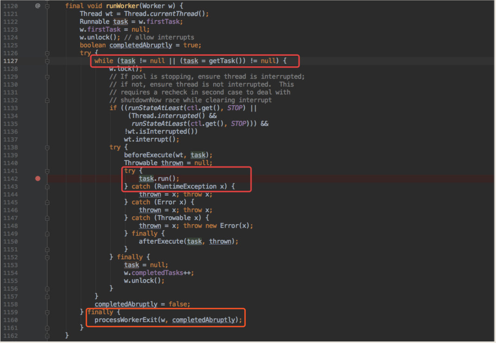
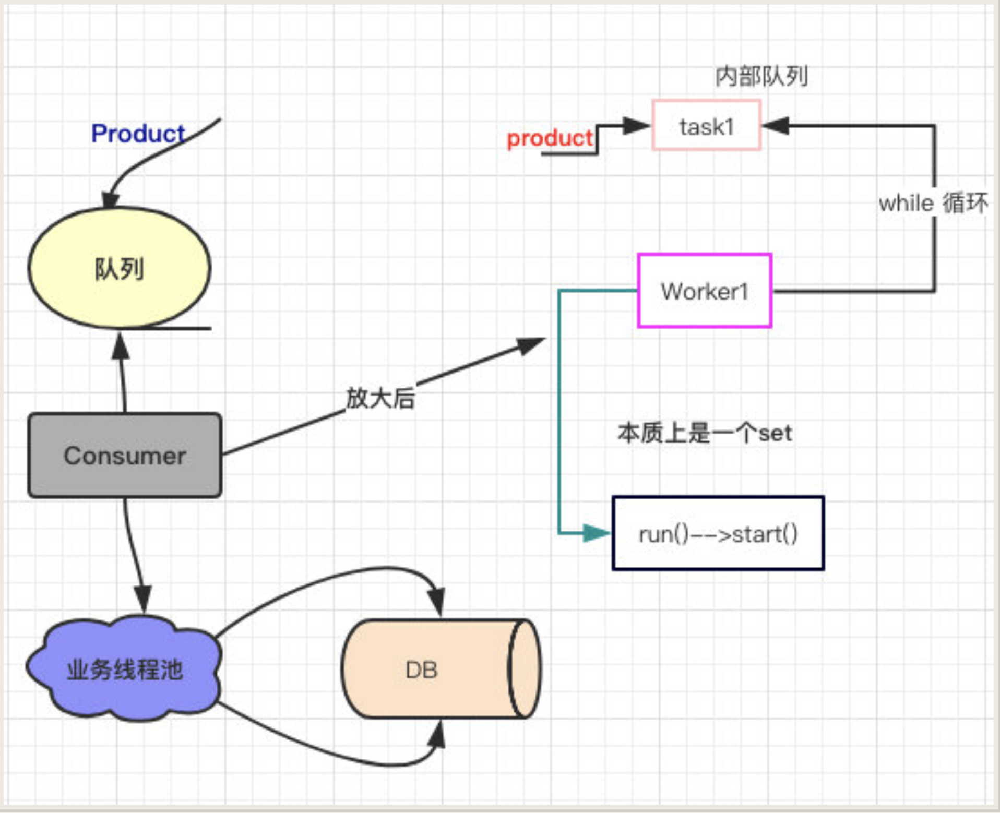
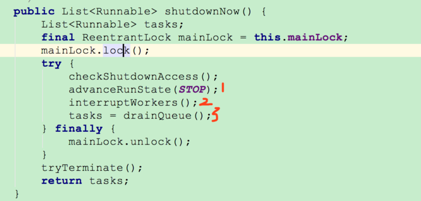
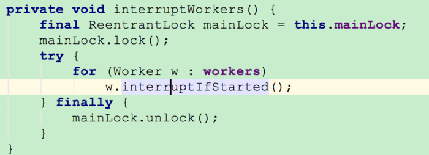
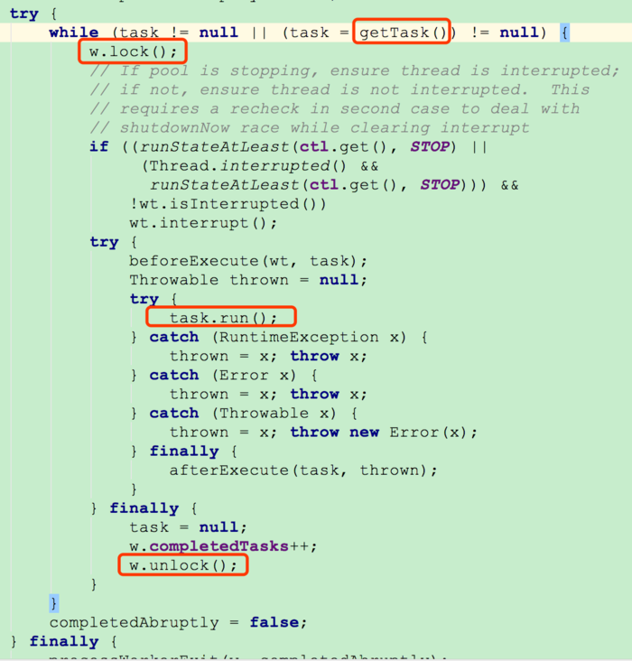
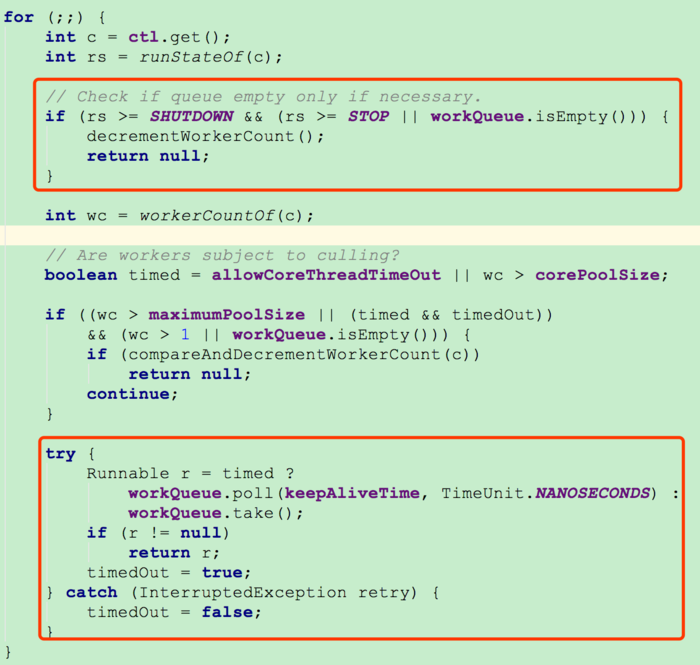
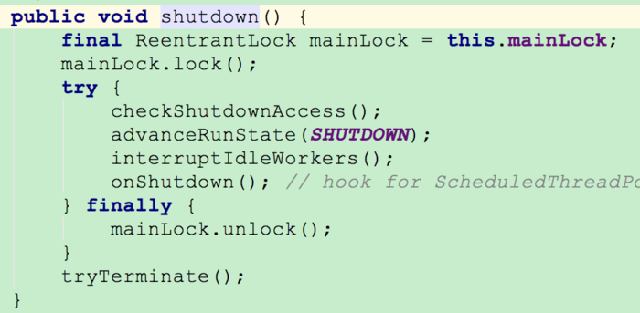
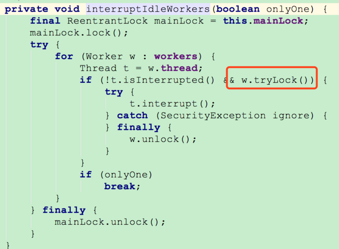

[TOC]
# 线程池介绍
在web开发中，服务器需要接受并处理请求，所以会为一个请求来分配一个线程来进行处理。如果每次请求都新创建一个线程的话实现起来非常简便，但是存在一个问题：

**如果并发的请求数量非常多，但每个线程执行的时间很短，这样就会频繁的创建和销毁线程，如此一来会大大降低系统的效率。可能出现服务器在为每个请求创建新线程和销毁线程上花费的时间和消耗的系统资源要比处理实际的用户请求的时间和资源更多。**

那么有没有一种办法使执行完一个任务，并不被销毁，而是可以继续执行其他的任务呢？

这就是线程池的目的了。线程池为线程生命周期的开销和资源不足问题提供了解决方案。通过对多个任务重用线程，线程创建的开销被分摊到了多个任务上。

## 什么时候使用线程池？

* 单个任务处理时间比较短

* 需要处理的任务数量很大
## 使用线程池的好处

* 降低资源消耗。通过重复利用已创建的线程降低线程创建和销毁造成的消耗。

* 提高响应速度。当任务到达时，任务可以不需要的等到线程创建就能立即执行。

* 提高线程的可管理性。线程是稀缺资源，如果无限制的创建，不仅会消耗系统资源，还会降低系统的稳定性，使用线程池可以进行统一的分配，调优和监控。

# 线程池的创建
线程池不允许使用 Executors 去创建，而是通过 ThreadPoolExecutor 的方式，这样的处理方式让写的同学更加明确线程池的运行规则，规避资源耗尽的风险.
Executors 返回线程池对象的弊端如下：
* FixedThreadPool 和 SingleThreadExecutor ： 允许请求的队列长度为 Integer.MAX_VALUE,可能堆积大量的请求，从而导致OOM。

* CachedThreadPool 和 ScheduledThreadPool ： 允许创建的线程数量为 Integer.MAX_VALUE ，可能会创建大量线程，从而导致OOM。

## 线程池分为以下三类：
* FixedThreadPool： 适用于为了满足资源管理需求，而需要限制当前线程数量的应用场景。它适用于负载比较重的服务器；

* SingleThreadExecutor： 适用于需要保证顺序地执行各个任务并且在任意时间点，不会有多个线程是活动的应用场景。

* CachedThreadPool： 适用于执行很多的短期异步任务的小程序，或者是负载较轻的服务器；

### 1. 固定线程数线程池FixedThreadPool
    FixedThreadPool被称为可重用固定线程数的线程池。通过Executors类中的相关源代码来看一下相关实现：
```java
/**
     * 创建一个可重用固定数量线程的线程池
	 *在任何时候至多有n个线程处于活动状态
	 *如果在所有线程处于活动状态时提交其他任务，则它们将在队列中等待，
	 *直到线程可用。 如果任何线程在关闭之前的执行期间由于失败而终止，
	 *如果需要执行后续任务，则一个新的线程将取代它。池中的线程将一直存在
	 *直到调用shutdown方法
     * @param nThreads 线程池中的线程数
     * @param threadFactory 创建新线程时使用的factory
     * @return 新创建的线程池
     * @throws NullPointerException 如果threadFactory为null
     * @throws IllegalArgumentException if {@code nThreads <= 0}
     */
    public static ExecutorService newFixedThreadPool(int nThreads, ThreadFactory threadFactory) {
        return new ThreadPoolExecutor(nThreads, nThreads,
                                      0L, TimeUnit.MILLISECONDS,
                                      new LinkedBlockingQueue<Runnable>(),
                                      threadFactory);
    }
```
另外还有一个FixedThreadPool的实现方法，和上面的类似，所以这里不多做阐述：
```java
public static ExecutorService newFixedThreadPool(int nThreads) {
        return new ThreadPoolExecutor(nThreads, nThreads,
                                      0L, TimeUnit.MILLISECONDS,
                                      new LinkedBlockingQueue<Runnable>());
    }
```

从上面源代码可以看出新创建的FixedThreadPool的corePoolSize和maximumPoolSize都被设置为nThreads。
FixedThreadPool的execute()方法运行示意图:

上图说明：
1. 如果当前运行的线程数小于corePoolSize，则创建新的线程来执行任务；
2. 当前运行的线程数等于corePoolSize后，将任务加入LinkedBlockingQueue；
3. 线程执行完1中的任务后，会在循环中反复从LinkedBlockingQueue中获取任务来执行；

**FixedThreadPool使用无界队列 LinkedBlockingQueue（队列的容量为Intger.MAX_VALUE）作为线程池的工作队列会对线程池带来如下影响**：
1. 因为FixedThreadPool的corePoolSize和maximumPoolSize都被设置为nThreads，大小相同，所以当线程池中的线程数达到corePoolSize后，新任务将在无界队列中等待，因此线程池中的线程数不会超过corePoolSize；
2. 由于1，使用无界队列时maximumPoolSize将是一个无效参数；
3. 由于1和2，使用无界队列时keepAliveTime将是一个无效参数；
    > 因为keepAliveTime是指当线程池中的线程数量大于corePoolSize的时候，如果这时没有新的任务提交，核心线程外的线程不会立即销毁，而是会等待，直到等待的时间超过了keepAliveTime；
    >所以由于1，核心线程外不会有线程，故keepAliveTime是个无效参数。

4. 运行中的FixedThreadPool（未执行shutdown()或shutdownNow()方法）不会拒绝任务，会将任务都放入无界队列。

### 2.单线程池SingleThreadExecutor
SingleThreadExecutor是使用单个worker线程的Executor。下面看看SingleThreadExecutor的实现：
```java
/**
     *创建使用单个worker线程运行无界队列的Executor
	 *并使用提供的ThreadFactory在需要时创建新线程
     *
     * @param threadFactory 创建新线程时使用的factory
     *
     * @return 新创建的单线程Executor
     * @throws NullPointerException 如果ThreadFactory为空
     */
    public static ExecutorService newSingleThreadExecutor(ThreadFactory threadFactory) {
        return new FinalizableDelegatedExecutorService
            (new ThreadPoolExecutor(1, 1,
                                    0L, TimeUnit.MILLISECONDS,
                                    new LinkedBlockingQueue<Runnable>(),
                                    threadFactory));
    }

```

```java
public static ExecutorService newSingleThreadExecutor() {
        return new FinalizableDelegatedExecutorService
            (new ThreadPoolExecutor(1, 1,
                                    0L, TimeUnit.MILLISECONDS,
                                    new LinkedBlockingQueue<Runnable>()));
    }
```

从上面源代码可以看出新创建的SingleThreadExecutor的corePoolSize和maximumPoolSize都被设置为1.其他参数和FixedThreadPool相同。

SingleThreadExecutor使用无界队列LinkedBlockingQueue作为线程池的工作队列（队列的容量为Intger.MAX_VALUE）。

SingleThreadExecutor使用无界队列作为线程池的工作队列会对线程池带来的影响与FixedThreadPool相同。

SingleThreadExecutor的运行示意图：


上图说明;

1. 如果当前运行的线程数少于corePoolSize，则创建一个新的线程执行任务；

2. 当前线程池中有一个运行的线程后，将任务加入LinkedBlockingQueue；

3. 线程执行完1中的任务后，会在循环中反复从LinkedBlockingQueue中获取任务来执行；

### 3. 可缓存线程池CachedThreadPool
CachedThreadPool是一个会根据需要创建新线程的线程池。下面通过源码来看看 CachedThreadPool的实现：
```java
/**
     * 创建一个线程池，根据需要创建新线程，但会在先前构建的线程可用时重用它，
	 *并在需要时使用提供的ThreadFactory创建新线程。
     * @param threadFactory 创建新线程使用的factory
     * @return 新创建的线程池
     * @throws NullPointerException 如果threadFactory为空
     */
    public static ExecutorService newCachedThreadPool(ThreadFactory threadFactory) {
        return new ThreadPoolExecutor(0, Integer.MAX_VALUE,
                                      60L, TimeUnit.SECONDS,
                                      new SynchronousQueue<Runnable>(),
                                      threadFactory);
    }

```

```java
public static ExecutorService newCachedThreadPool() {
        return new ThreadPoolExecutor(0, Integer.MAX_VALUE,
                                      60L, TimeUnit.SECONDS,
                                      new SynchronousQueue<Runnable>());
    }
```

CachedThreadPool的corePoolSize被设置为空（0），maximumPoolSize被设置为Integer.MAX.VALUE，即它是无界的，

这也就意味着如果主线程提交任务的速度高于maximumPool中线程处理任务的速度时，CachedThreadPool会不断创建新的线程。极端情况下，这样会导致耗尽cpu和内存资源。

CachedThreadPool的execute()方法的执行示意图:

上图说明：

1. 首先执行SynchronousQueue.offer(Runnable task)。如果当前maximumPool中有闲线程正在执行SynchronousQueue.poll(keepAliveTime,TimeUnit.NANOSECONDS)，那么主线程执行offer操作与空闲线程执行的poll操作配对成功，主线程把任务交给空闲线程执行，execute()方法执行完成，否则执行下面的步骤2；

2. 当初始maximumPool为空，或者maximumPool中没有空闲线程时，将没有线程执行SynchronousQueue.poll(keepAliveTime,TimeUnit.NANOSECONDS)。这种情况下，步骤1将失败，此时CachedThreadPool会创建新线程执行任务，execute方法执行完成；

# 线程池的使用
Executor 框架是Java5之后引进的，在Java 5之后，通过 Executor 来启动线程比使用 Thread 的 start 方法更好，除了更易管理，效率更好（用线程池实现，节约开销）外，还有关键的一点：有助于避免 this 逃逸问题。
> this逃逸是指在构造函数返回之前其他线程就持有该对象的引用. 调用尚未构造完全的对象的方法可能引发令人疑惑的错误。

Executor 框架的使用：


1. 主线程首先要创建实现Runnable或者Callable接口的任务对象。(由于FutureTask实现了Runnable，也可以创建FutureTask)
     >区别：Runnable接口不会返回结果但是Callable接口可以返回结果。
     >FutureTask是对Runnable和Callable的进一步封装，并且这种任务是有返回值的，它的返回值存在FutureTask类的一个名叫outcome的数据成员中。


2. 然后可以把创建完成的Runnable对象或Callable对象直接交给ExecutorService执行
    ExecutorService.execute（Runnable command）
    ExecutorService.submit（Runnable task）
    ExecutorService.submit（Callable task）
    > 执行execute()方法和submit()方法的区别是什么呢？
    > 1. execute()方法用于提交不需要返回值的任务，所以无法判断任务是否被线程池执行成功与否；
    > 2. submit()方法用于提交需要返回值的任务。线程池会返回一个future类型的对象，通过这个future对象可以判断任务是否执行成功，并且可以通过future的get()方法来获取返回值，get()方法会阻塞当前线程直到任务完成，而使用get（long timeout，TimeUnit unit）方法则会阻塞当前线程一段时间后立即返回，这时候有可能任务没有执行完。

## 使用示例
首先创建一个Runnable接口的实现类：
```java
import java.util.Date;

/**
 * 这是一个简单的Runnable类，需要大约5秒钟来执行其任务。
 */
public class WorkerThread implements Runnable {

    private String command;

    public WorkerThread(String s) {
        this.command = s;
    }

    @Override
    public void run() {
        System.out.println(Thread.currentThread().getName() + " Start. Time = " + new Date());
        processCommand();
        System.out.println(Thread.currentThread().getName() + " End. Time = " + new Date());
    }

    private void processCommand() {
        try {
            Thread.sleep(5000);
        } catch (InterruptedException e) {
            e.printStackTrace();
        }
    }

    @Override
    public String toString() {
        return this.command;
    }
}
```
编写测试程序，我们这里以FixedThreadPool为例子
```java
import java.util.concurrent.ExecutorService;
import java.util.concurrent.Executors;

public class ThreadPoolExecutorDemo {

    public static void main(String[] args) {
        //创建一个FixedThreadPool对象
        ExecutorService executor = Executors.newFixedThreadPool(5);
        for (int i = 0; i < 10; i++) {
            //创建WorkerThread对象（WorkerThread类实现了Runnable 接口）
            Runnable worker = new WorkerThread("" + i);
            //执行Runnable
            executor.execute(worker);
        }
        //终止线程池
        executor.shutdown();
        while (!executor.isTerminated()) {
        }
        System.out.println("Finished all threads");
    }
}
```
输出示例：
```log
pool-1-thread-5 Start. Time = Wed Dec 18 17:11:22 CST 2019
pool-1-thread-2 Start. Time = Wed Dec 18 17:11:22 CST 2019
pool-1-thread-4 Start. Time = Wed Dec 18 17:11:22 CST 2019
pool-1-thread-1 Start. Time = Wed Dec 18 17:11:22 CST 2019
pool-1-thread-3 Start. Time = Wed Dec 18 17:11:22 CST 2019
pool-1-thread-5 End. Time = Wed Dec 18 17:11:27 CST 2019
pool-1-thread-2 End. Time = Wed Dec 18 17:11:27 CST 2019
pool-1-thread-5 Start. Time = Wed Dec 18 17:11:27 CST 2019
pool-1-thread-2 Start. Time = Wed Dec 18 17:11:27 CST 2019
pool-1-thread-3 End. Time = Wed Dec 18 17:11:27 CST 2019
pool-1-thread-1 End. Time = Wed Dec 18 17:11:27 CST 2019
pool-1-thread-3 Start. Time = Wed Dec 18 17:11:27 CST 2019
pool-1-thread-4 End. Time = Wed Dec 18 17:11:27 CST 2019
pool-1-thread-1 Start. Time = Wed Dec 18 17:11:27 CST 2019
pool-1-thread-4 Start. Time = Wed Dec 18 17:11:27 CST 2019
pool-1-thread-2 End. Time = Wed Dec 18 17:11:32 CST 2019
pool-1-thread-5 End. Time = Wed Dec 18 17:11:32 CST 2019
pool-1-thread-3 End. Time = Wed Dec 18 17:11:32 CST 2019
pool-1-thread-1 End. Time = Wed Dec 18 17:11:32 CST 2019
pool-1-thread-4 End. Time = Wed Dec 18 17:11:32 CST 2019
Finished all threads
```


# 线程池的工作原理

Java中的线程池是用ThreadPoolExecutor类来实现的. 本文就结合JDK 1.8对该类的源码来分析一下这个类内部对于线程的创建, 管理以及后台任务的调度等方面的执行原理。

先看一下线程池的类图：


Executor框架是一个根据一组执行策略调用，调度，执行和控制的异步任务的框架，目的是提供一种将”任务提交”与”任务如何运行”分离开来的机制。


当一个并发任务提交给线程池，线程池分配线程去执行任务的过程如下图所示：


从图可以看出，线程池执行所提交的任务过程主要有这样几个阶段：

1. 先判断线程池中**核心线程池**所有的线程是否都在执行任务。如果不是，则新创建一个线程执行刚提交的任务，否则，核心线程池中所有的线程都在执行任务，则进入第2步；

2. 判断当前**阻塞队列**是否已满，如果未满，则将提交的任务放置在阻塞队列中；否则，则进入第3步；

3. 判断**线程池中所有的线程**是否都在执行任务，如果没有，则创建一个新的线程来执行任务，否则，则交给饱和策略进行处理

下面再介绍下线程池的运行状态. 线程池一共有五种状态, 分别是:

1. RUNNING ：能接受新提交的任务，并且也能处理阻塞队列中的任务；
2. SHUTDOWN：关闭状态，不再接受新提交的任务，但却可以继续处理阻塞队列中已保存的任务。在线程池处于 RUNNING 状态时，调用 shutdown()方法会使线程池进入到该状态。（finalize() 方法在执行过程中也会调用shutdown()方法进入该状态）；
3. STOP：不能接受新任务，也不处理队列中的任务，会中断正在处理任务的线程。在线程池处于 RUNNING 或 SHUTDOWN 状态时，调用 shutdownNow() 方法会使线程池进入到该状态；
4. TIDYING：如果所有的任务都已终止了，workerCount (有效线程数) 为0，线程池进入该状态后会调用 terminated() 方法进入TERMINATED 状态。
5. TERMINATED：在terminated() 方法执行完后进入该状态，默认terminated()方法中什么也没有做。
进入TERMINATED的条件如下：
    * 线程池不是RUNNING状态；
    * 线程池状态不是TIDYING状态或TERMINATED状态；
    * 如果线程池状态是SHUTDOWN并且workerQueue为空；
    * workerCount为0；
    * 设置TIDYING状态成功。
    
下图为线程池的状态转换过程：


## 几个重要的字段
```java
private final AtomicInteger ctl = new AtomicInteger(ctlOf(RUNNING, 0));
private static final int COUNT_BITS = Integer.SIZE - 3;
private static final int CAPACITY   = (1 << COUNT_BITS) - 1;
// runState is stored in the high-order bits
private static final int RUNNING    = -1 << COUNT_BITS;
private static final int SHUTDOWN   =  0 << COUNT_BITS;
private static final int STOP       =  1 << COUNT_BITS;
private static final int TIDYING    =  2 << COUNT_BITS;
private static final int TERMINATED =  3 << COUNT_BITS;
```
ctl是对线程池的运行状态和线程池中有效线程的数量进行控制的一个字段， 
它包含两部分的信息: 

* 线程池的运行状态 (runState) 
* 线程池内有效线程的数量 (workerCount)，

这里可以看到，使用了Integer类型来保存，高3位保存runState，低29位保存workerCount。

COUNT_BITS 就是29，CAPACITY就是1左移29位减1（29个1），这个常量表示workerCount的上限值，大约是5亿。


## 这里还有几个对ctl进行计算的方法：
```java
private static int runStateOf(int c)     { return c & ~CAPACITY; }//获取运行状态；
private static int workerCountOf(int c)  { return c & CAPACITY; }//获取当前活动的线程数
private static int ctlOf(int rs, int wc) { return rs | wc; }//获取运行状态和活动线程数的值。
```

## 创建线程池主要是ThreadPoolExecutor类来完成

ThreadPoolExecutor的有许多重载的构造方法，通过参数最多的构造方法来理解创建线程池有哪些需要配置的参数。ThreadPoolExecutor的构造方法为：

```java
public ThreadPoolExecutor(int corePoolSize,
                          int maximumPoolSize,
                          long keepAliveTime,
                          TimeUnit unit,
                          BlockingQueue<Runnable> workQueue,
                          ThreadFactory threadFactory,
                          RejectedExecutionHandler handler) {
    if (corePoolSize < 0 ||
        maximumPoolSize <= 0 ||
        maximumPoolSize < corePoolSize ||
        keepAliveTime < 0)
        throw new IllegalArgumentException();
    if (workQueue == null || threadFactory == null || handler == null)
        throw new NullPointerException();
    this.corePoolSize = corePoolSize;
    this.maximumPoolSize = maximumPoolSize;
    this.workQueue = workQueue;
    this.keepAliveTime = unit.toNanos(keepAliveTime);
    this.threadFactory = threadFactory;
    this.handler = handler;
}
```
构造方法中的字段含义如下：

* **corePoolSize**：核心线程数量，当有新任务在execute()方法提交时，会执行以下判断：

    * 如果运行的线程少于 corePoolSize，则创建新线程来处理任务，**即使线程池中的其他线程是空闲的；**
    
    * 如果线程池中的线程数量大于等于 corePoolSize 且小于 maximumPoolSize，则只有当workQueue满时才创建新的线程去处理任务；
    
    * 如果设置的corePoolSize 和 maximumPoolSize相同，则创建的线程池的大小是固定的，这时如果有新任务提交，若workQueue未满，则将请求放入workQueue中，等待有空闲的线程去从workQueue中取任务并处理；

    * 如果运行的线程数量大于等于maximumPoolSize，这时如果workQueue已经满了，则通过handler所指定的策略来处理任务；

    * 如果调用了prestartCoreThread()或者 prestartAllCoreThreads()，线程池创建的时候所有的核心线程都会被创建并且启动。

    所以，任务提交时，判断的顺序为 corePoolSize –> workQueue –> maximumPoolSize。
    
* **maximumPoolSize**：最大线程数量；如果当阻塞队列已满时，并且当前线程池线程个数没有超过maximumPoolSize的话，就会创建新的线程来执行任务。
* **keepAliveTime**：空闲线程存活时间。当线程池中的线程数量大于corePoolSize的时候，如果这时没有新的任务提交，核心线程外的线程不会立即销毁，而是会等待，直到等待的时间超过了keepAliveTime；
* **unit**：时间单位。为keepAliveTime指定时间单位。
* **workQueue**：阻塞队列。用于保存任务的阻塞队列,可以使用ArrayBlockingQueue, LinkedBlockingQueue, SynchronousQueue, PriorityBlockingQueue。
* **threadFactory**：创建线程的工程类。可以通过指定线程工厂为每个创建出来的线程设置更有意义的名字，如果出现并发问题，也方便查找问题原因。
* **handler**：饱和策略。当线程池的阻塞队列已满和指定的线程都已经开启，说明当前线程池已经处于饱和状态了，那么就需要采用一种策略来处理这种情况。采用的策略有这几种：
    * AbortPolicy： 直接拒绝所提交的任务，并抛出RejectedExecutionException异常；
    * CallerRunsPolicy：只用调用者所在的线程来执行任务；
    * DiscardPolicy：不处理直接丢弃掉任务；
    * DiscardOldestPolicy：丢弃掉阻塞队列中存放时间最久的任务，执行当前任务

## 线程池执行逻辑

### execute方法
通过ThreadPoolExecutor创建线程池后，提交任务后执行过程是怎样的，下面来通过源码来看一看。execute方法源码如下：
```java
public void execute(Runnable command) {
    if (command == null)
        throw new NullPointerException();
    /*
     * clt记录着runState和workerCount
     */
    int c = ctl.get();
    /*
     * workerCountOf方法取出低29位的值，表示当前活动的线程数；
     * 如果当前活动线程数小于corePoolSize，则新建一个线程放入线程池中；
     * 并把任务添加到该线程中。
     */
    if (workerCountOf(c) < corePoolSize) {
        /*
         * addWorker中的第二个参数表示限制添加线程的数量是根据corePoolSize来判断还是maximumPoolSize来判断；
         * 如果为true，根据corePoolSize来判断；
         * 如果为false，则根据maximumPoolSize来判断
         */
        if (addWorker(command, true))
            return;
        /*
         * 如果添加失败，则重新获取ctl值
         */
        c = ctl.get();
    }
     //如果线程池处于RUNNING状态，则添加任务到阻塞队列
    if (isRunning(c) && workQueue.offer(command)) {
        // 重新获取ctl值
        int recheck = ctl.get();
        // 再次判断线程池的运行状态，如果不是运行状态，由于在上面的if判断中已经把command添加到workQueue中了，
        // 这时需要移除该command
        // 执行过后通过handler使用拒绝策略对该任务进行处理，整个方法返回
        if (! isRunning(recheck) && remove(command))
            reject(command);
       else if (workerCountOf(recheck) == 0)// 获取线程池中的有效线程数，如果数量是0，则执行addWorker方法,如果判断workerCount大于0，则直接返回，在workQueue中新增的command会在将来的某个时刻被执行。
        /* addWorker(null, false);
         * 这里传入的参数表示：
         * 1. 第一个参数为null，表示在线程池中创建一个线程，但不去启动；
         * 2. 第二个参数为false，将线程池的有限线程数量的上限设置为maximumPoolSize，添加线程时根据maximumPoolSize来判断；
         * 创建一个线程，但并没有传入任务，因为任务已经被添加到workQueue中了，所以worker在执行的时候，会直接从workQueue中获取任务。
         * 所以，在workerCountOf(recheck) == 0时执行addWorker(null, false);也是为了保证线程池在RUNNING状态下必须要有一个线程来执行任务。
         */
            addWorker(null, false);
    }
    /*
     * 如果执行到这里，有两种情况：
     * 1. 线程池已经不是RUNNING状态；
     * 2. 线程池是RUNNING状态，但workerCount >= corePoolSize并且workQueue已满。
     * 这时，再次调用addWorker方法，但第二个参数传入为false，将线程池的有限线程数量的上限设置为maximumPoolSize；
     * 如果失败则拒绝该任务
     */
    else if (!addWorker(command, false))
        reject(command);
}
```
简单来说，在执行execute()方法时如果状态一直是RUNNING时，的执行过程如下：

* 如果workerCount < corePoolSize，则创建并启动一个线程来执行新提交的任务；

* 如果workerCount >= corePoolSize，且线程池内的阻塞队列未满，则将任务添加到该阻塞队列中；

* 如果workerCount >= corePoolSize && workerCount < maximumPoolSize，且线程池内的阻塞队列已满，则创建并启动一个线程来执行新提交的任务；

* 如果workerCount >= maximumPoolSize，并且线程池内的阻塞队列已满, 则根据拒绝策略来处理该任务, 默认的处理方式是直接抛异常。

execute方法执行流程如下：


### addWorker方法
addWorker方法的主要工作是在线程池中创建一个新的线程并执行，

firstTask参数 用于指定新增的线程执行的第一个任务，

core参数为true表示在新增线程时会判断当前活动线程数是否少于corePoolSize，false表示新增线程前需要判断当前活动线程数是否少于maximumPoolSize，

代码如下：
```java
private boolean addWorker(Runnable firstTask, boolean core) {
    retry:
    for (;;) {
        int c = ctl.get();//ctl记录着线程池的运行状态 (runState)和线程池内有效线程的数量 (workerCount)，
        int rs = runStateOf(c);// 获取运行状态
        
        /*
         * 这个if判断
         * 如果rs >= SHUTDOWN，则表示此时不再接收新任务；
         * 接着判断以下3个条件，只要有1个不满足，则返回false：
         * 1. rs == SHUTDOWN，这时表示关闭状态，不再接受新提交的任务，但却可以继续处理阻塞队列中已保存的任务
         * 2. firsTask为空
         * 3. 阻塞队列不为空
         * 
         * 首先考虑rs == SHUTDOWN的情况
         * 这种情况下不会接受新提交的任务，所以在firstTask不为空的时候会返回false；
         * 然后，如果firstTask为空，并且workQueue也为空，则返回false，
         * 因为队列中已经没有任务了，不需要再添加线程了
         */
        // Check if queue empty only if necessary.
        if (rs >= SHUTDOWN &&
            ! (rs == SHUTDOWN &&
               firstTask == null &&
               ! workQueue.isEmpty()))
            return false;
        for (;;) {
            // 获取线程数
            int wc = workerCountOf(c);
            // 如果当前的线程数量超过最大容量或者大于（根据传入的core决定是核心线程数还是最大线程数）核心线程数 || 最大线程数，则返回false
            if (wc >= CAPACITY ||
                wc >= (core ? corePoolSize : maximumPoolSize))
                return false;
            // 尝试增加workerCount，如果成功，则跳出第一个for循环
            if (compareAndIncrementWorkerCount(c))
                break retry;
            // 如果增加workerCount失败，则重新获取ctl的值
            c = ctl.get();  // Re-read ctl
            // 如果当前的运行状态不等于rs，说明状态已被改变，返回第一个for循环继续执行
            if (runStateOf(c) != rs)
                continue retry;
            // else CAS failed due to workerCount change; retry inner loop
        }
    }
    //CAS成功
    boolean workerStarted = false;
    boolean workerAdded = false;
    Worker w = null;
    try {
        // 根据firstTask来创建Worker对象
        w = new Worker(firstTask);
        // 每一个Worker对象都会创建一个线程
        final Thread t = w.thread;
        if (t != null) {
            final ReentrantLock mainLock = this.mainLock;
            mainLock.lock();
            try {
                //重新检查线程池状态
                //避免ThreadFactory退出故障或者在锁获取前线程池被关闭
                int rs = runStateOf(ctl.get());
                // rs < SHUTDOWN表示是RUNNING状态；
                // 如果rs是RUNNING状态或者rs是SHUTDOWN状态并且firstTask为null，向线程池中添加线程。
                // 因为在SHUTDOWN时不会在添加新的任务，但还是会执行workQueue中的任务
                if (rs < SHUTDOWN ||
                    (rs == SHUTDOWN && firstTask == null)) {
                    if (t.isAlive()) // 先检查线程是否是可启动的
                        throw new IllegalThreadStateException();
                    // workers是一个HashSet
                    workers.add(w);
                    int s = workers.size();
                    // largestPoolSize记录着线程池中出现过的最大线程数量
                    if (s > largestPoolSize)
                        largestPoolSize = s;
                    workerAdded = true;
                }
            } finally {
                mainLock.unlock();
            }
            if (workerAdded) {
                // 启动线程，启动时会调用Worker类中的run方法，Worker本身实现了Runnable接口，所以一个Worker类型的对象也是一个线程。
                t.start();
                workerStarted = true;
            }
        }
    } finally {
        if (! workerStarted)
            addWorkerFailed(w);
    }
    return workerStarted;
}
```
这里可以将addWorker分为两部分，第一部分增加线程池个数，第二部分是将任务添加到workder里面并执行。

#### 第一部分主要是两个循环

1. **外层循环**主要是判断线程池状态
`
rs >= SHUTDOWN &&! (rs == SHUTDOWN && firstTask == null && ! workQueue.isEmpty())`
展开！运算后等价于
`rs >= SHUTDOWN && (rs != SHUTDOWN || firstTask != null || workQueue.isEmpty()) `
 也就是说下面几种情况下会返回false：

* 当前线程池状态为STOP，TIDYING，TERMINATED

* 当前线程池状态为SHUTDOWN并且addWork方法传入了task

* 当前线程池状态为SHUTDOWN并且任务队列为空

2. **内层循环**作用是使用cas增加线程个数，如果线程个数超限则返回false，否者进行cas，cas成功则退出双循环，否者cas失败了，要看当前线程池的状态是否变化了，如果变了，则重新进入外层循环重新获取线程池状态，否者进入内层循环继续进行cas尝试。

#### 第二部分说明CAS成功了
到了第二部分说明CAS成功了，也就是说线程个数加一了，但是现在任务还没开始执行，这里使用全局的独占锁来控制workers里面添加任务，其实也可以使用并发安全的set，但是性能没有独占锁好（这个从注释中知道的）。

这里需要注意的是要在获取锁后重新检查线程池的状态，这是因为其他线程可可能在本方法获取锁前改变了线程池的状态，比如调用了shutdown方法。添加成功则启动任务执行。

## Worker对象
Worker是定义在ThreadPoolExecutor中的finnal类，其中继承了AbstractQueuedSynchronizer类和实现Runnable接口，其中的run方法如下
```java
public void run() {
    runWorker(this);
}
```
线程启动时调用了runWorker方法，关于类的其他方面这里就不在叙述。
## runWorker
```java
final void runWorker(Worker w) {
    Thread wt = Thread.currentThread();
    Runnable task = w.firstTask;
    w.firstTask = null;
    w.unlock();
    boolean completedAbruptly = true;
    try {
        //循环获取任务
        while (task != null || (task = getTask()) != null) {
            w.lock();
            // 当线程池是处于STOP状态或者TIDYING、TERMINATED状态时，设置当前线程处于中断状态
            // 如果不是，当前线程就处于RUNNING或者SHUTDOWN状态，确保当前线程不处于中断状态
            // 重新检查当前线程池的状态是否大于等于STOP状态
            if ((runStateAtLeast(ctl.get(), STOP) ||
                 (Thread.interrupted() &&
                  runStateAtLeast(ctl.get(), STOP))) &&
                !wt.isInterrupted())
                wt.interrupt();
            try {
                //提供给继承类使用做一些统计之类的事情，在线程运行前调用
                beforeExecute(wt, task);
                Throwable thrown = null;
                try {
                    task.run();
                } catch (RuntimeException x) {
                    thrown = x; throw x;
                } catch (Error x) {
                    thrown = x; throw x;
                } catch (Throwable x) {
                    thrown = x; throw new Error(x);
                } finally {
                    //提供给继承类使用做一些统计之类的事情，在线程运行之后调用
                    afterExecute(task, thrown);
                }
            } finally {
                task = null;
                //统计当前worker完成了多少个任务
                w.completedTasks++;
                w.unlock();
            }
        }
        completedAbruptly = false;
    } finally {
        //整个线程结束时调用，线程退出操作。统计整个线程池完成的任务个数之类的工作
        processWorkerExit(w, completedAbruptly);
    }
}
```
### 为什么是task.run()而不是采用task.start()
1. task.run(),因为task本身是一个线程，所以如果使用start()方法后，操作系统会创建一个独立的线程运行，而 run() 方法只是一个普通的方法调用。

2. 在线程池这个场景中却恰好就是要利用它只是一个普通方法调用。线程池它就是一个调度任务的工具。

3. 假设这里是调用的 Runnable 的 start 方法，那会发生什么事情。
    * 如果我们往一个核心、最大线程数为 2 的线程池里丢了 1000 个任务，那么它会额外的创建 1000 个线程，同时每个任务都是异步执行的，一下子就执行完毕了。

    * 从而法做到由这两个 Worker 线程来调度这 1000 个任务，而只有当做一个同步阻塞的 run() 方法调用时才能满足这个要求。


## getTask
getTask方法的主要作用其实从方法名就可以看出来了，就是获取任务
```java
private Runnable getTask() {
    // timeOut变量的值表示上次从阻塞队列中取任务时是否超时
    boolean timedOut = false; // Did the last poll() time out?
    //循环
    for (;;) {
        int c = ctl.get();
        int rs = runStateOf(c);
       // Check if queue empty only if necessary.
        /*
         * 如果线程池状态rs >= SHUTDOWN，也就是非RUNNING状态，再进行以下判断：
         * 1. rs >= STOP，线程池是否正在stop；
         * 2. 阻塞队列是否为空。
         * 如果以上条件满足，则将workerCount（线程池中线程数）减1并返回null。
         * 因为如果当前线程池状态的值是SHUTDOWN或以上时，不允许再向阻塞队列中添加任务。
         */
        if (rs >= SHUTDOWN && (rs >= STOP || workQueue.isEmpty())) {
            decrementWorkerCount();
            return null;
        }
        //线程数量
        int wc = workerCountOf(c);
        // Are workers subject to culling?
        // timed变量用于判断是否需要进行超时控制。
        // allowCoreThreadTimeOut默认是false，也就是核心线程不允许进行超时；
        // wc > corePoolSize，表示当前线程池中的线程数量大于核心线程数量；
        // 对于超过核心线程数量的这些线程，需要进行超时控制
        boolean timed = allowCoreThreadTimeOut || wc > corePoolSize;

        /*
         * wc > maximumPoolSize的情况是因为可能在此方法执行阶段同时执行了setMaximumPoolSize方法；
         * timed && timedOut 如果为true，表示当前操作需要进行超时控制，并且上次从阻塞队列中获取任务发生了超时
         * 接下来判断，如果有效线程数量大于1，或者阻塞队列是空的，那么尝试将workerCount减1；
         * 如果减1失败，则返回重试。
         * 如果wc == 1时，也就说明当前线程是线程池中唯一的一个线程了。
         */
        if ((wc > maximumPoolSize || (timed && timedOut))
            && (wc > 1 || workQueue.isEmpty())) {
            if (compareAndDecrementWorkerCount(c))
                return null;
            continue;
        }
        /* 该if判断的目的是控制线程池的有效线程数量。
        由上文中的分析可以知道，在执行execute方法时，如果当前线程池的线程数量超过了corePoolSize且小于maximumPoolSize，并且workQueue已满时，则可以增加工作线程，
        * 但这时如果超时没有获取到任务，也就是timedOut为true的情况，说明workQueue已经为空了，
        * 也就说明了当前线程池中不需要那么多线程来执行任务了，
        * 可以把多于corePoolSize数量的线程销毁掉，保持线程数量在corePoolSize即可。
        */ 

        try {
            /*
             * 根据timed来判断，如果为true，则通过阻塞队列的poll方法进行超时控制，如果在keepAliveTime时间内没有获取到任务，则返回null；
             * 否则通过take方法，如果这时队列为空，则take方法会阻塞直到队列不为空。
             * 
             */
            Runnable r = timed ?
                workQueue.poll(keepAliveTime, TimeUnit.NANOSECONDS) :
                workQueue.take();
            if (r != null)
                return r;
            timedOut = true;
        } catch (InterruptedException retry) {
            timedOut = false;
        }
    }
}
```
* 如果在try语句中，从队列中获取任务时，发生了超时，这时会将timeOut设置为true，从而导致在下一次循环中，第二个if判断中，如果线程减一成功，getTask()方法会返回null。
* 这时在runWorker方法中会跳出while循环，然后会执行processWorkerExit方法。

## processWorkerExit方法
```java
private void processWorkerExit(Worker w, boolean completedAbruptly) {
    // 如果completedAbruptly值为true，则说明线程执行时出现了异常，需要将workerCount减1；
    // 如果线程执行时没有出现异常，说明在getTask()方法中已经已经对workerCount进行了减1操作，这里就不必再减了。  
    if (completedAbruptly) // If abrupt, then workerCount wasn't adjusted
        decrementWorkerCount();
    final ReentrantLock mainLock = this.mainLock;
    mainLock.lock();
    try {
        //统计完成的任务数
        completedTaskCount += w.completedTasks;
        // 从workers中移除，也就表示着从线程池中移除了一个工作线程
        workers.remove(w);
    } finally {
        mainLock.unlock();
    }
    // 根据线程池状态进行判断是否结束线程池
    tryTerminate();
    int c = ctl.get();
    /*
     * 当线程池是RUNNING或SHUTDOWN状态时，如果worker是异常结束，那么会直接addWorker；
     * 如果allowCoreThreadTimeOut=true，并且等待队列有任务，至少保留一个worker；
     * 如果allowCoreThreadTimeOut=false，workerCount不少于corePoolSize，则直接返回，否则会通过addWork增加线程。
     */
    if (runStateLessThan(c, STOP)) {
        if (!completedAbruptly) {
            int min = allowCoreThreadTimeOut ? 0 : corePoolSize;
            if (min == 0 && ! workQueue.isEmpty())
                min = 1;
            if (workerCountOf(c) >= min)
                return; // replacement not needed
        }
        addWorker(null, false);
    }
}
```

http://www.ideabuffer.cn/2017/04/04/%E6%B7%B1%E5%85%A5%E7%90%86%E8%A7%A3Java%E7%BA%BF%E7%A8%8B%E6%B1%A0%EF%BC%9AThreadPoolExecutor/


https://www.jianshu.com/p/b95adad0df25
### 如果在task的执行中，线程抛异常，会发生什么


1. 如果在运行中发生未被捕获的异常，会运行finally中的processWorkerExit(w, completedAbruptly);
2. 在该方法中Worker1 被回收，顺带的它所调度的线程 task1（这个task1 也就是在执行一个 while 循环消费左图中的那个队列） 也会被回收掉。
3. 新创建的 Worker2 会取代 Worker1 继续执行 while 循环从内部队列里获取任务，但此时这个队列就一直会是空的，因为执行的是`addWorker(null, false)`,所以也就是处于 Waiting 状态。因为没有执行execute方法往新建的队列中添加任务。


## 线程池的关闭
关闭线程池，可以通过shutdown和shutdownNow这两个方法。它们的原理都是遍历线程池中所有的线程，然后依次中断线程。

`shutdownNow`方法的解释是：线程池拒接收新提交的任务，同时立马关闭线程池，线程池里的任务不再执行。

`shutdown`方法的解释是：线程池拒接收新提交的任务，同时等待线程池里的任务执行完毕后关闭线程池。

以上的说法虽然没错，但是还有很多的细节，比如调用shutdown方法后，正在执行任务的线程做出什么反应？正在等待任务的线程又做出什么反应？线程在什么情况下才会彻底退出。如果不了解这些细节，在关闭线程池时就难免遇到，像线程池关闭不了，关闭线程池出现报错等情况。


调用完shutdownNow和shuwdown方法后，**并不代表线程池已经完成关闭操作**，它只是**异步的通知线程池进行关闭处理**。**如果要同步等待线程池彻底关闭后才继续往下执行，需要调用`awaitTermination`方法进行同步等待。**

假如子线程用到`BufferedReader`，而`BufferedReader` 的`readLine`是阻塞的，如果流没有关闭那么他一定会一直读取。

即便是`awaitTermination`执行完，超时之后返回到主线程。但是子线程没有像预计的那样中断退出，`awaitTermination `是不会中断线程的。

### 0. awaitTermination(long timeOut, TimeUnit unit)
当前线程阻塞，直到
* 等所有已提交的任务（包括正在跑的和队列中等待的）执行完
* 或者等超时时间到
* 或者线程被中断，抛出InterruptedException

然后返回true（shutdown请求后所有任务执行完毕）或false（已超时）


### 1. shutdownNow

在shutdownNow方法里，

* 第一句就是原子性的修改线程池的状态为STOP状态。

* 第三句是将队列里还没有执行的任务放到列表里，返回给调用方。

* 第二句是遍历线程池里的所有工作线程，然后调用线程的interrupt方法。如下图：

以上就是shutdownNow方法的执行逻辑：将线程池状态修改为STOP，然后调用线程池里的所有线程的interrupt方法。

调用shutdownNow后，线程池里的线程会做如何反应呢？那就要看，线程池里线程正在执行的代码逻辑了。其在线程池的`runWorker`方法里(对线程池的执行原理不了解的，请看之前的文章)，其代码如下：

正常情况下，线程池里的线程，就是在这个while循环里不停地执行。其中代码task.run()就是在执行我们提交给线程池的任务，

如当我们调用shutdownNow时，task.run()里面正处于IO阻塞，则会导致报错，

如果task.run()里正在正常执行，则不受影响，继续执行完这个任务。

从上图看的出来，**如果getTask()方法返回null,也会导致线程的退出**。我们再来看看getTask方法的实现：

如果我们调用shutdownNow方法时，线程处于从队列里读取任务而阻塞中(图中下边的红框)，则会导致抛出InterruptedException异常，但因为异常被捕获，线程将会继续在这个for循环里执行。

shutdownNow方法里将线程修改为STOP状态吧，当执行到上边红框里的代码时，**由于STOP状态值是大于SHUTDOWN状态，STOP也大于等于STOP，不管任务队列是否为空，都会进入if语句从而返回null,线程退出。**


#### 总结：
当我们调用线程池的shutdownNow时，

* 如果线程正在getTask方法中执行，则会通过for循环进入到if语句，于是getTask返回null,从而线程退出。不管线程池里是否有未完成的任务。

* 如果线程因为执行提交到线程池里的任务而处于阻塞状态，则会导致报错(如果任务里没有捕获InterruptedException异常)，否则线程会执行完当前任务，然后通过getTask方法返回为null来退出。

### 2. shutdown
我们再来看看shutdown方法的源码：

跟shutdownNow类似，只不过它是将线程池的状态修改为`SHUTDOWN`状态，然后调用`interruptIdleWorkers`方法，来中断空闲的线程。这是`interruptIdleWorkers`方法的实现：


跟shutdownNow方法调用`interruptWorkers`方法不同的是，`interruptIdleWorkers`方法在遍历线程池里的线程时，有一个`w.tryLock()`加锁判断，**只有加锁成功的线程才会被调用interrupt方法**。

那什么情况下才能被加锁成功?什么情况下不能被加锁成功呢？这就需要我们继续回到线程执行的`runWorker`方法。

在上边runWorker方法代码的截图中，我刻意将w.lock()和w.unlock()调用用红框圈起。其实就是**正运行在w.lock和w.unlock之间的线程将因为加锁失败，而不会被调用interrupt方法**，换句话说，**就是正在执行线程池里任务的线程不会被中断**。

不管是被调用了interrupt的线程还是没被调用的线程，什么时候退出呢？，这就要看getTask方法的返回是否为null了。

在getTask里的if判断(上文中getTask代码截图中上边红色方框的代码)中，由于线程池被shutdown方法修改为SHUTDOWN状态，SHUTDOWN大于等于SHUTDOWN成立没问题，但是SHUTDOWN不在大于等于STOP状态，所以**只有队列为空，getTask方法才会返回null，导致线程退出。**


### 优雅的关闭线程池
有了上边对两个关闭线程池方法的了解，相信优雅安全关闭线程池将不再是问题。

我们知道，使用shutdownNow方法，可能会引起报错，使用shutdown方法可能会导致线程关闭不了。

所以当我们使用shutdownNow方法关闭线程池时，一定要对任务里进行异常捕获。

当我们使用shuwdown方法关闭线程池时，一定要确保任务里不会有永久阻塞等待的逻辑，否则线程池就关闭不了。

最后，**一定要记得，shutdownNow和shuwdown调用完，线程池并不是立马就关闭了，要想等待线程池关闭，还需调用awaitTermination方法来阻塞等待。**
示例：
```java
public class Test {
 
	public static void main(String[] args) throws IOException, InterruptedException {
		ExecutorService pool = Executors.newFixedThreadPool(2);
		for (int i = 0; i < 10; i++) {
			Runnable run = new Runnable() {
				@Override
				public void run() {
					System.out.println("线程运行" + Thread.currentThread().getName());
				}
			};
			service.execute(run);
		}
		pool.shutdown();
		while (!pool.awaitTermination(1, TimeUnit.SECONDS)) {
			System.out.println("线程池没有关闭");
		}
		System.out.println("线程池已经关闭");
	}
}
```

### isTerminated() Vs isShutdown()
1. 调用了这两个方法的任意一个，isShutdown方法都会返回true，

2. 当所有的线程都关闭成功，才表示线程池成功关闭，这时调用isTerminated方法才会返回true。

## 如何合理配置线程池参数？
要想合理的配置线程池，就必须首先分析任务特性，可以从以下几个角度来进行分析：

1. 任务的性质：CPU密集型任务，IO密集型任务和混合型任务。
2. 任务的优先级：高，中和低。
3. 任务的执行时间：长，中和短。
4. 任务的依赖性：是否依赖其他系统资源，如数据库连接。

任务性质不同的任务可以用不同规模的线程池分开处理。CPU密集型任务配置尽可能少的线程数量，如配置Ncpu+1个线程的线程池。IO密集型任务则由于需要等待IO操作，线程并不是一直在执行任务，则配置尽可能多的线程，如2xNcpu。混合型的任务，如果可以拆分，则将其拆分成一个CPU密集型任务和一个IO密集型任务，只要这两个任务执行的时间相差不是太大，那么分解后执行的吞吐率要高于串行执行的吞吐率，如果这两个任务执行时间相差太大，则没必要进行分解。我们可以通过Runtime.getRuntime().availableProcessors()方法获得当前设备的CPU个数。

优先级不同的任务可以使用优先级队列PriorityBlockingQueue来处理。它可以让优先级高的任务先得到执行，需要注意的是如果一直有优先级高的任务提交到队列里，那么优先级低的任务可能永远不能执行。

执行时间不同的任务可以交给不同规模的线程池来处理，或者也可以使用优先级队列，让执行时间短的任务先执行。

依赖数据库连接池的任务，因为线程提交SQL后需要等待数据库返回结果，如果等待的时间越长CPU空闲时间就越长，那么线程数应该设置越大，这样才能更好的利用CPU。

并且，阻塞队列最好是使用**有界队列**，如果采用无界队列的话，一旦任务积压在阻塞队列中的话就会占用过多的内存资源，甚至会使得系统崩溃。

## 线程池的监控
通过线程池提供的参数进行监控。线程池里有一些属性在监控线程池的时候可以使用

* taskCount：线程池需要执行的任务数量。
* completedTaskCount：线程池在运行过程中已完成的任务数量。小于或等于taskCount。
* largestPoolSize：线程池曾经创建过的最大线程数量。通过这个数据可以知道线程池是否满过。如等于线程池的最大大小，则表示线程池曾经满了。
* getPoolSize:线程池的线程数量。如果线程池不销毁的话，池里的线程不会自动销毁，所以这个大小只增不减。
* getActiveCount：获取活动的线程数。

通过扩展线程池进行监控。通过继承线程池并重写线程池的beforeExecute，afterExecute和terminated方法，我们可以在任务执行前，执行后和线程池关闭前干一些事情。如监控任务的平均执行时间，最大执行时间和最小执行时间等。这几个方法在线程池里是空方法。如：
```java
protected void beforeExecute(Thread t, Runnable r) { }
```