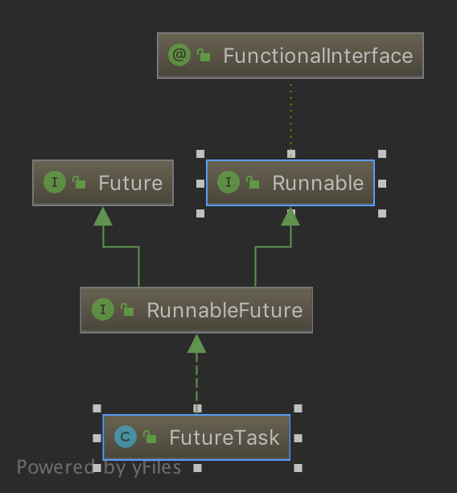
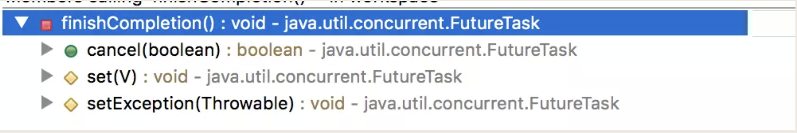
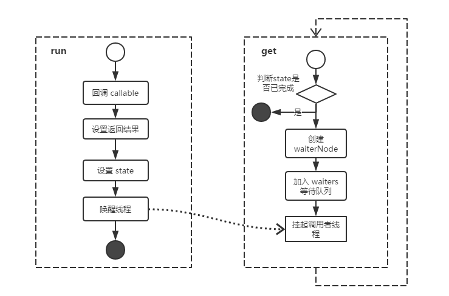
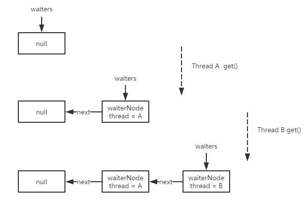

[TOC]
# Runnable
其中的run()方法没有返回值。

1. Runnable对象可以直接扔给Thread创建线程实例，并且创建的线程实例与Runnable绑定，线程实例调用start()方法时，Runnable任务就开始真正在线程中执行。

    注意：如果直接调用run()方法而不调用start()方法，那么只是相当于普通的方法调用，并不会开启新的线程，程序只是在主线程中串行执行。

2. Runnable对象也可以直接扔给线程池对象的execute方法和submit方法，让线程池为其绑定池中的线程来执行。

3. Runnable对象也可以进一步封装成FutureTask对象之后再扔给线程池的execute方法和submit方法。

Runable接口：
```java
public interface Runnable {
    public abstract void run();
}
```
Runnable可以提交给一个线程，直接启动一个线程来执行:
```java
Thread thread = new Thread(new Runnable() {
            @Override
            public void run() {
              ................
            }
        });
        thread.start();
```
或者：
```java
ExecutorService service = Executors.newFixedThreadPool(10);
service.submit(new Runnable() {
			@Override
			public void run() {
			}
		});
```
# Callable
功能相比Runnable来说少很多，不能用来创建线程，也不能直接扔给线程池的execute方法。但是其中的call方法有返回值。

Callable接口：
```java
public interface Callable<V> {
    V call() throws Exception;
}
```

Callable通常利用ExecutorService的submit方法去启动call方法自执行任务，而ExecutorService的submit又返回一个**Future**类型的结果，因此Callable通常也与Future一起使用。

```java
ExecutorService executorService = Executors.newFixedThreadPool(10);

Callable<String> stringCallable = new Callable<String>() {
            @Override
            public String call() throws Exception {
                return null;
            }
        };
    
Future<String> stringFuture = executorService.submit(stringCallable);
```

# FutureTask

FutureTask一个可取消的异步计算。FutureTask提供了对Future的基本实现，

可以调用方法去开始和取消一个计算，可以查询计算是否完成并且获取计算结果。

只有当计算完成时才能获取到计算结果，一旦计算完成，计算将不能被重启或者被取消，除非调用runAndReset方法。

是对Runnable和Callable的进一步封装，并且这种任务是有返回值的、

它的返回值存在FutureTask类的一个名叫outcome的数据成员中。

相比直接把Runnable和Callable扔给线程池，FutureTask的功能更多，它可以监视任务在池子中的状态。


## FutureTask实现的接口
1. FutureTask实现了Runnable接口，可以用来包装一个Callable或Runnable对象,可以直接用线程调用执行(futureTask.run())。

2. FutureTask实现了Future接口,一个FutureTask可以被提交给一个Executor来执行。


FutureTask实现了Future接口，Future接口有5个方法：

1. `boolean cancel(boolean mayInterruptIfRunning)`

    尝试取消当前任务的执行。

    如果任务已经取消、已经完成或者其他原因不能取消，尝试将失败。

    如果任务还没有启动就调用了cancel(true)，任务将永远不会被执行。

    如果任务已经启动，参数mayInterruptIfRunning将决定任务是否应该中断执行该任务的线程，以尝试中断该任务。

    如果任务不能被取消，通常是因为它已经正常完成，此时返回false，否则返回true
2. `boolean isCancelled()`
    
    如果任务在正常结束之前被被取消返回true
    
3. `boolean isDone()`

    正常结束、异常或者被取消导致任务完成，将返回true
4. `V get()`

    等待任务结束，然后获取结果。
    
    如果任务**在等待过程中**被终止，将抛出InterruptedException，
    
    如果任务**被取消**将抛出CancellationException，
    
    如果任务**执行过程中发生异常**将抛出ExecutionException。
5. `V get(long timeout, TimeUnit unit)`
    
    任务最多在给定时间内完成并返回结果，
    
    如果没有在给定时间内完成任务将抛出TimeoutException。

## 用Runnable和Callable创建FutureTask的方法稍有不同。

### 使用Callable来创建
使用Callable来创建，由于call方法本身有返回值，这个返回值也就是Callable对象的返回值，

于是可以把这个返回值当做FutureTask的返回值，也就是拿call方法的返回值去初始化outcome字段（是Object的引用，可以理解成引用的Future对象），

这个真正初始化过程要在submit方法把任务扔给池子之后，并且该任务在池子中分配到了线程，在线程中执行完了产生了结果之后。

但是在这一系列动作之前会有一个伪初始化，submit方法一旦提交任务到线程池马上会得到一个返回值（Future对象，用来指代刚才提交的任务的结果，相当于付钱买了商品但是没货了，暂时拿了一个票据，到了货再真的的取货，这个Future对象就相当于票据），

submit方法不会真正等到上面的那一系列动作执行完才返回，所以需要使用这个任务执行结果的那些线程就可以拿着这个返回值（Future对象）去该怎么用就怎么用了。

之所以叫伪初始化，因为call方法也许还没有开始执行，任务还在线程池的任务队列中排队呢。

所以在创建FutureTask的时候只用给FutureTask的构造方法传一个Callable对象既可。源码中方法签名如下：
```java
/**
     * Creates a {@code FutureTask} that will, upon running, execute the
     * given {@code Callable}.
     *
     * @param  callable the callable task
     * @throws NullPointerException if the callable is null
     */
    public FutureTask(Callable<V> callable) {
        if (callable == null)
            throw new NullPointerException();
        this.callable = callable;
        this.state = NEW;       // ensure visibility of callable
    }
```

###  使用Runnable来创建（我们通常不这么干），

正如上面所疑惑的那样，run方法没有返回值，也就是Runnable任务没有返回值，那么为什么用它封装的FutureTask却有了返回值了呢。

原因在于这种方法创建的FutureTask对象并不是把run的返回值当成自己的返回值，而是在创建FutureTask对象时就已经手动指定了这个FutureTask对象的返回值了。

若不希望FutureTask对象有真正意义上的返回值，我们可以在调用用FutureTask的构造方法时指定第二个参数为null，对应构造方法使用FutureTask<Void>。源码中方法签名如下：
```java
 /**
     * Creates a {@code FutureTask} that will, upon running, execute the
     * given {@code Runnable}, and arrange that {@code get} will return the
     * given result on successful completion.
     *
     * @param runnable the runnable task
     * @param result the result to return on successful completion. If
     * you don't need a particular result, consider using
     * constructions of the form:
     * {@code Future<?> f = new FutureTask<Void>(runnable, null)}
     * @throws NullPointerException if the runnable is null
     */
    public FutureTask(Runnable runnable, V result) {
        this.callable = Executors.callable(runnable, result);
        this.state = NEW;       // ensure visibility of callable
    }
```

## 示例

```java
 1 package com.cjs.example;
 2 
 3 import java.util.concurrent.*;
 4 
 5 /**
 6  * @author ChengJianSheng
 7  * @date 2019-05-22
 8  */
 9 public class App {
10 
11     public static void main(String[] args) throws Exception {
12 
13         long t1 = System.currentTimeMillis();
14 
15         ExecutorService executorService = Executors.newFixedThreadPool(3);
16 
17         FutureTask<String> heatUpWaterFuture = new FutureTask<String>(new Callable<String>() {
18             @Override
19             public String call() throws Exception {
20                 System.out.println("烧开水...");
21                 Thread.sleep(3000);
22                 return "ok";
23             }
24         });
25 
26 
27         FutureTask<String> cookMealsFuture = new FutureTask<String>(new Callable<String>() {
28             @Override
29             public String call() throws Exception {
30                 System.out.println("煮饭...");
31                 Thread.sleep(5000);
32                 return "ok";
33             }
34         });
35 
36         executorService.submit(heatUpWaterFuture);
37         executorService.submit(cookMealsFuture);
38 
39         System.out.println("炒菜...");
40 
41         Thread.sleep(2000);
42 
43         System.out.println("菜炒好了了");
44 
45         if (heatUpWaterFuture.get(5000, TimeUnit.SECONDS) == "ok"
46                 && cookMealsFuture.get(5000, TimeUnit.SECONDS) == "ok") {
47             System.out.println("开饭了...");
48         }
49 
50         long t2 = System.currentTimeMillis();
51         System.out.println("做饭用时:" + (t2-t1) + "ms");
52 
53     }
54 } 
```
输出:
```log
1 烧开水...
2 煮饭...
3 炒菜...
4 菜炒好了了
5 开饭了...
6 做饭用时:5014ms 
```
在实际开发过程中，将那些耗时较长，且可以并行的操作都封装成一个FutureTask（比如：有的数据通过调用dubbo服务获取，有的数据需要从缓存中读取，有的数据需要复杂的计算）

## FutureTask 源码分析
> 基于 JDK 1.7
> 与1.6版本不同，1.7的FutureTask不再基于AQS来构建，而是在内部采用简单的Treiber Stack来保存等待线程。

### 成员变量

```java
    private volatile int state;
    private static final int NEW          = 0;
    private static final int COMPLETING   = 1;
    private static final int NORMAL       = 2;
    private static final int EXCEPTIONAL  = 3;
    private static final int CANCELLED    = 4;
    private static final int INTERRUPTING = 5;
    private static final int INTERRUPTED  = 6;

    /** The underlying callable; nulled out after running */
    private Callable<V> callable;
    /** The result to return or exception to throw from get() */
    private Object outcome; // non-volatile, protected by state reads/writes
    /** The thread running the callable; CASed during run() */
    private volatile Thread runner;
    /** Treiber stack of waiting threads */
    private volatile WaitNode waiters;

```

state：表示当前任务的运行状态，FutureTask的所有方法都是围绕state开展的，state声明为volatile，保证了state的可见性，当对state进行修改时所有的线程都会看到。其取值范围如下：


* NEW：表示一个新的任务，初始状态
* COMPLETING：已经执行完毕，当任务被设置结果时，处于COMPLETING状态，这是一个中间状态。
* NORMAL：表示任务正常结束。
* EXCEPTIONAL：表示任务因异常而结束
* CANCELLED：任务还未执行之前就调用了cancel(true)方法，任务处于CANCELLED
* INTERRUPTING：打断中，当任务调用cancel(true)中断程序时，任务处于INTERRUPTING状态，这是一个中间状态。
* INTERRUPTED：打断结束，任务调用cancel(true)中断程序时会调用interrupt()方法中断线程运行成功后，任务状态由INTERRUPTING转变为INTERRUPTED


### 可能的状态过渡：
 1. NEW -> COMPLETING -> NORMAL：正常结束
 
 2. NEW -> COMPLETING -> EXCEPTIONAL：异常结束
 
 3. NEW -> CANCELLED：任务被取消
 
 4. NEW -> INTERRUPTING -> INTERRUPTED：任务出现中断

变量 callable 存储的是可执行的任务，

变量 outcome 存储任务的返回值，

变量 runner 指向当前执行该任务的线程，

变量 waiters 执行等待链表的头节点。

### 初始化
```java
public FutureTask(Callable<V> callable) {
        if (callable == null)
            throw new NullPointerException();

        this.callable = callable;
        this.state = NEW;
    }
```
FutureTask 在构造时会设置 state 为初始状态 NEW 。

### 任务的执行 - run()

我们是通过executorService.submit(future1) 来提交线程的，进一步看看里面具体的逻辑。
`AbstractExecutorService` 中submit()源码:
```java
   /**
     * @throws RejectedExecutionException {@inheritDoc}
     * @throws NullPointerException       {@inheritDoc}
     */
    public Future<?> submit(Runnable task) {
        if (task == null) throw new NullPointerException();
        RunnableFuture<Void> ftask = newTaskFor(task, null);
        execute(ftask);
        return ftask;
    }
```

构造完FutureTask，就可以用FutureTask构造Thread，并启动线程。启动线程会调用**FutureTask的run()方法**

```java
    public void run() {
	// 只有状态 state 为 NEW， 如果不是NEW说明执行完毕，直接return掉。
        if (state != NEW ||
    // 后面使用CAS操作，判断这个任务是否已经执行，这里FutureTask有个全局的volatile runner字段，这里通过cas将当前线程指定给runner。这里可以防止callable被执行多次。
            !UNSAFE.compareAndSwapObject(this, runnerOffset,
                                         null, Thread.currentThread()))
            return;
        try {
            Callable<V> c = callable;
            if (c != null && state == NEW) {
                V result;
                //标记是否执行完毕
                boolean ran;
                try {
                	// 执行 callable
                    result = c.call();//回调我们重写Callable中call方法的实现
                    ran = true;
                } catch (Throwable ex) {
                    result = null;
                    ran = false;
                    setException(ex);
                }
                if (ran)
                	// 成功执行后，设置全局定义的outcome，在set中看具体实现。
                    set(result);
            }
        } finally {        
            runner = null;
            int s = state;
            if (s >= INTERRUPTING)
             // 处理可能发生的取消中断(cancel(true))。 
                handlePossibleCancellationInterrupt(s);
        }
    }

```
查看set方法具体实现：
```java
    protected void set(V v) {
		// 设置 state 为 COMPLETING
        if (UNSAFE.compareAndSwapInt(this, stateOffset, NEW, COMPLETING)) {
        	// 设置返回结果outcome，是全局定义的object类型。
            outcome = v;
            // 设置 state 为 NORMAL
            UNSAFE.putOrderedInt(this, stateOffset, NORMAL); // final state
            // 任务完成唤醒挂起的线程
            finishCompletion();
        }
    }

```
set过程中，首先尝试将当前任务状态state从NEW改为COMPLETING。如果成功的话，再设置执行结果到outcome。然后将state再次设置为NORMAL，注意这次使用的是putOrderedInt，其实就是原子量的LazySet内部使用的方法。为什么使用这个方法？首先LazySet相对于Volatile-Write来说更廉价，因为它没有昂贵的Store/Load屏障，只有Store/Store屏障(x86下Store/Store屏障是一个空操作)，其次，后续线程不会及时的看到state从COMPLETING变为NORMAL，但这没什么关系，而且NORMAL是state的最终状态之一，以后不会在变化了。

再看下run过程中如果发生异常，调用的setException方法：
```java
/**
 * 发生异常，状态从 NEW 变为 COMPLETING
 * 设置返回结果为t(异常结果)
 * 改变状态从 COMPLETING 到 EXCEPTIONAL
 * 调用finishCompletion完成收尾工作
 */
protected void setException(Throwable t) {
    if (UNSAFE.compareAndSwapInt(this, stateOffset, NEW, COMPLETING)) {
        outcome = t;
        UNSAFE.putOrderedInt(this, stateOffset, EXCEPTIONAL); // final state
        finishCompletion();
    }
}
```

FutureTask中有一个WaiteNode单链表，finishCompletion使用Unsafe.unpark()进行唤醒操作。
finishCompletion()会在一下三处被调用：


```java
    private void finishCompletion() {
        // assert state > COMPLETING;
        for (WaitNode q; (q = waiters) != null;) {
        	// 将 waiters 重置为空
            if (UNSAFE.compareAndSwapObject(this, waitersOffset, q, null)) {
            	// 采用死循环的方式唤醒挂起的线程
                for (;;) {
                // 获取等待节点关联的线程
                    Thread t = q.thread;
                    if (t != null) {
                        q.thread = null;
                        // 唤醒线程
                        LockSupport.unpark(t);
                    }
                    // 获取等待链表的下一个节点继续唤醒
                    WaitNode next = q.next;
                    if (next == null)
                    	// 节点为空的时候 跳出循环
                        break;
                    q.next = null; // unlink to help gc
                    q = next;
                }
                break;
            }
        }
        done();
        callable = null;        // to reduce footprint
    }

```

从上述源码中可以看出 callable 只会被执行一次，执行过程如下：

* 设置 runner 为当前线程
* 回调 callable
* 设置状态 state 为 COMPLETING
* 设置返回结果 outcome
* 设置状态 state 为 NORMAL
* 唤醒等待链表 waiters 里的线程

最后看下run过程中最后调用的handlePossibleCancellationInterrupt方法：
```java
/**
 * 确保cancel(true)产生的中断发生在run或runAndReset方法过程中。 
 */
private void handlePossibleCancellationInterrupt(int s) {
    // 如果当前正在中断过程中，自旋等待一下，等中断完成。 
    if (s == INTERRUPTING)
        while (state == INTERRUPTING)
            Thread.yield(); // wait out pending interrupt
    // 这里的state状态一定是INTERRUPTED;  
    // 这里不能清除中断标记，因为没办法区分来自cancel(true)的中断。  
    // Thread.interrupted();  
}
```

### runAndReset()
```java
protected boolean runAndReset() {
    if (state != NEW ||
            !UNSAFE.compareAndSwapObject(this, runnerOffset,
                    null, Thread.currentThread()))
        return false;
    boolean ran = false;
    int s = state;
    try {
        Callable<V> c = callable;
        if (c != null && s == NEW) {
            try {
                c.call(); // don't set result
                ran = true;
            } catch (Throwable ex) {
                setException(ex);
            }
        }
    } finally {
        // runner must be non-null until state is settled to
        // prevent concurrent calls to run()
        runner = null;
        // state must be re-read after nulling runner to prevent
        // leaked interrupts
        s = state;
        if (s >= INTERRUPTING)
            handlePossibleCancellationInterrupt(s);
    }
    return ran && s == NEW;
}
```
该方法和run方法的区别是，run方法只能被运行一次任务，而该方法可以多次运行任务。而runAndReset这个方法不会设置任务的执行结果值,如果该任务成功执行完成后，不修改state的状态，还是可运行（NEW）状态，如果取消任务或出现异常，则不会再次执行。

### 获取任务结果 - get()

* 当FutureTask处于**未启动或者已启动的状态**时，调用FutureTask对象的get方法会将导致调用线程阻塞。
    
* 当FutureTask处于**已完成的状态**时，调用FutureTask的get方法会立即放回调用结果或者抛出异常。
    
```java
    public V get() throws InterruptedException, ExecutionException {
        int s = state;
        if (s <= COMPLETING)
            s = awaitDone(false, 0L);
        return report(s);
    }
```
线程status为NEW和COMPLETING的时候，会进入awaitDone方法，表示要等待完成。awaitDone方法如下：
```java
    private int awaitDone(boolean timed, long nanos)
        throws InterruptedException {
        // 等待时长
        final long deadline = timed ? System.nanoTime() + nanos : 0L;
        WaitNode q = null;
        boolean queued = false;
        // 采用死循环的方式
        for (;;) {
            if (Thread.interrupted()) {
                // 如果当前线程被中断，移除等待节点q，然后抛出中断异常。
                removeWaiter(q);
                throw new InterruptedException();
            }

            int s = state;
            if (s > COMPLETING) {
            	// 此时任务已完成，可退出循环
                if (q != null)
                    q.thread = null;
                return s;
            }
            else if (s == COMPLETING) 
           //因为state一次切换大几率要变了，所以使用yield更好，比挂起响应要快。
          //正在处理返回值，这里时间很短，所以调用Thread.yield()方法，短时间的线程让步。
                Thread.yield();
            else if (q == null)
            	// 创建等待节点
                q = new WaitNode();
            else if (!queued)
                //CAS把该线程加入等待队列
            	//若未加入等待链表时，将 q 的 next 指向 waiters , 然后将 waiters 移动到 q
                queued = UNSAFE.compareAndSwapObject(this, waitersOffset,
                                                     q.next = waiters, q);
            else if (timed) {//超时等待
                nanos = deadline - System.nanoTime();
                if (nanos <= 0L) {
                // 超过等待时长 将等待节点移除
                    removeWaiter(q);
                    return state;
                }
                //阻塞一段时间
                LockSupport.parkNanos(this, nanos);
            }
            else
            	//线程阻塞，等待被唤醒
            	// 当任务执行完 执行 finishCompletion 会被唤醒
                LockSupport.park(this);
        }
    }
```
```java
    private V report(int s) throws ExecutionException {
        Object x = outcome;
        if (s == NORMAL)
            return (V)x;
        if (s >= CANCELLED)
            throw new CancellationException();
        throw new ExecutionException((Throwable)x);
    }
```
从 get() 操作源码可以看出，当调用者线程执行 futureTask.get() 时首先判断当前 state 是否大于 COMPLETING; 若小于等于 COMPLETING 则调用 awaitDone 方法； 在 awaitDone 方法中采用轮询的方式执行以下逻辑：

1. 创建 WaitNode。
2. CAS把该线程加入等待队列，将调用者线程 WaitNode 的 next 指向 waiters， 然后将 waiters 指向调用者线程 WaitNode。
3. 若需要超时等待，则将调用者线程按指定时间挂起，反之将调用者线程挂起等待任务完成唤醒。
4. state > COMPLETING 任务完成退出循环。

结合上述分析可得 FutureTask 执行活动图如下：


同时也可以看出，在 FutureTask 中内部维护了一个单向链表 waiters , 在执行 get 的时候会向其中添加节点:


### 任务取消 - cancel()
FutereTask处于刚创建或已启动的状态时，state均为NEW。

当FutureTask处于**未启动状态**时，调用FutureTask对象的**cancel方法将导致线程永远不会被执行**；

当FutureTask处于**已启动状态**时，调用FutureTask对象 **cancel(true)方法** 将以中断执行此任务的线程的方式来试图停止此任务;

当FutureTask处于**已启动状态**时，调用FutureTask对象 **cancel(false)方法** 将不会对正在进行的任务产生任何影响；

当FutureTask处于**已完成状态**时，调用FutureTask对象 **cancel方法** 将返回false；
    
```java
	/**
	 * mayInterruptIfRunning 是否允许中断正在执行的线程
         * 只是一个标志位，是否要中断线程，要看线程内部是否根据这个标志位进行操作
	 */
	public boolean cancel(boolean mayInterruptIfRunning) {
        if (!(state == NEW &&
              UNSAFE.compareAndSwapInt(this, stateOffset, NEW,
                  mayInterruptIfRunning ? INTERRUPTING : CANCELLED)))
        	// 只有 FutureTask 为初始状态的时候 允许取消
            return false;
        try {    // in case call to interrupt throws exception
            if (mayInterruptIfRunning) {
                try {
                    Thread t = runner;
                    if (t != null)
                    	// 中断执行线程,调用interrupt，来打断等待任务，我们最好在代码里面判断interrupt，一旦出现interrupt，说明外部线程调用cancel了，我们需要快速返回。
                        t.interrupt();
                } finally { // final state
                	// 设置状态为 INTERRUPTED
                    UNSAFE.putOrderedInt(this, stateOffset, INTERRUPTED);
                }
            }
        } finally {
        	// 唤醒挂起的线程
            finishCompletion();
        }
        return true;
    }
```

在实际开发过程中，将那些耗时较长，且可以并行的操作都封装成一个FutureTask。

（比如：有的数据通过调用dubbo服务获取，有的数据需要从缓存中读取，有的数据需要复杂的计算） 

### 为什么jdk1.7版本及以后放弃了使用了AQS
从Java1.7开始Doug Lea对FutureTask进行了重写，不使用AQS去维护WaitNode，

而改用上文提到的Treiber Stack，

即通过CAS来维护内部的竞争状态，当然也包括了waiters（队头）的状态。 这么做主要是为了在需要竞争时保留中断状态。

使用AQS的方式，可能会在取消发生竞争过程中诡异的保留了中断状态。这里之所以没有采用这种方式，是为了避免这种情况的发生。

具体什么情况下会发生呢？

```java
ThreadPoolExecutor executor = ...;  
executor.submit(task1).cancel(true);  
executor.submit(task2);
```
看上面的代码，虽然中断的是task1，但可能task2得到中断信号。

原因是什么呢？看下JDK1.6的FutureTask的`innerCancel`代码：
```java
boolean innerCancel(boolean mayInterruptIfRunning) {  
 for (;;) {  
  int s = getState();  
  if (ranOrCancelled(s))  
      return false;  
  if (compareAndSetState(s, CANCELLED))  
      break;  
 }  
    if (mayInterruptIfRunning) {  
        Thread r = runner;  
        if (r != null)  //第1行  
            r.interrupt(); //第2行  
    }  
    releaseShared(0);  
    done();  
    return true;  
}
```
结合上面代码例子看一下，如果主线程执行到第1行的时候，线程池可能会认为task1已经执行结束(被取消)，然后让之前执行task1工作线程去执行task2，工作线程开始执行task2之后，然后主线程执行第2行(我们会发现并没有任何同步机制来阻止这种情况的发生)，这样就会导致task2被中断了。


所以现在就能更好的理解JDK1.7 FutureTask的handlePossibleCancellationInterrupt中为什么要将cancel(true)中的中断保留在当前run方法运行范围内了吧!